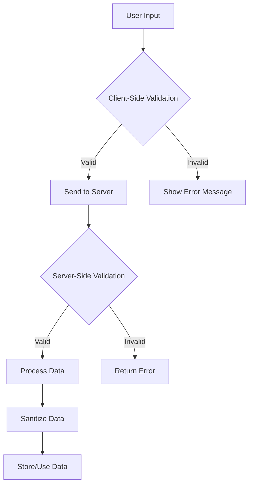

## 14.6 Input Validation and Sanitization

In the world of web development, ensuring the security and integrity of your application is paramount. One of the most critical aspects of this is input validation and sanitization. By properly validating and sanitizing user input, we can prevent a wide range of security vulnerabilities, including injection attacks, and ensure that our applications handle data safely and reliably.

### Understanding the Risks of Unvalidated Input

Unvalidated input is a significant security risk. Attackers can exploit this to inject malicious code, manipulate data, or even gain unauthorized access to systems. Common vulnerabilities that arise from unvalidated input include:

- **SQL Injection**: Attackers can manipulate SQL queries by injecting malicious SQL code.
- **LDAP Injection**: Similar to SQL injection, but targets LDAP queries.
- **Command Injection**: Attackers can execute arbitrary commands on the server.
- **Cross-Site Scripting (XSS)**: Malicious scripts are injected into web pages viewed by other users.

These vulnerabilities can lead to data breaches, loss of sensitive information, and damage to your application's reputation.

### Types of Validation

To mitigate these risks, we must implement robust validation mechanisms. Let's explore the different types of validation:

#### Client-Side vs. Server-Side Validation

- **Client-Side Validation**: Performed in the user's browser before data is sent to the server. It provides immediate feedback to users and reduces server load. However, it should never be relied upon as the sole validation mechanism, as it can be bypassed by attackers.

- **Server-Side Validation**: Conducted on the server after data is received. It is essential for ensuring data integrity and security, as it cannot be bypassed by client-side manipulations.

**Example of Client-Side Validation:**

```html
<form id="myForm">
  <input type="text" id="username" required minlength="3" maxlength="15">
  <input type="submit" value="Submit">
</form>

<script>
document.getElementById('myForm').addEventListener('submit', function(event) {
  const username = document.getElementById('username').value;
  if (!/^[a-zA-Z0-9]+$/.test(username)) {
    alert('Username must be alphanumeric.');
    event.preventDefault();
  }
});
</script>
```

**Example of Server-Side Validation:**

```javascript
const express = require('express');
const app = express();

app.use(express.json());

app.post('/submit', (req, res) => {
  const username = req.body.username;
  if (!/^[a-zA-Z0-9]+$/.test(username)) {
    return res.status(400).send('Invalid username.');
  }
  res.send('Username is valid.');
});

app.listen(3000, () => console.log('Server running on port 3000'));
```

#### Whitelisting vs. Blacklisting Input

- **Whitelisting**: Only allows specific, predefined input values. This is the preferred method as it is more secure and reduces the risk of unexpected input.

- **Blacklisting**: Blocks known malicious input patterns. This method is less secure as it requires constant updates to the list of blocked patterns.

**Example of Whitelisting:**

```javascript
function validateInput(input) {
  const allowedValues = ['value1', 'value2', 'value3'];
  if (!allowedValues.includes(input)) {
    throw new Error('Invalid input');
  }
}
```

**Example of Blacklisting:**

```javascript
function validateInput(input) {
  const forbiddenPatterns = [/script/i, /<.*>/];
  forbiddenPatterns.forEach(pattern => {
    if (pattern.test(input)) {
      throw new Error('Malicious input detected');
    }
  });
}
```

### Sanitization Methods

Sanitization involves cleaning or encoding input to remove or neutralize harmful characters. This is crucial for preventing injection attacks and ensuring data integrity.

#### Encoding Harmful Characters

Encoding converts potentially dangerous characters into a safe format that can be safely stored or displayed.

**Example of Encoding:**

```javascript
function sanitizeInput(input) {
  return input.replace(/&/g, '&amp;')
              .replace(/</g, '&lt;')
              .replace(/>/g, '&gt;')
              .replace(/"/g, '&quot;')
              .replace(/'/g, '&#x27;')
              .replace(/\//g, '&#x2F;');
}
```

#### Using Libraries and Frameworks

Several libraries and frameworks can assist with input validation and sanitization, making it easier to implement secure practices.

- **Validator.js**: A library for validating and sanitizing strings.
- **DOMPurify**: A library for sanitizing HTML and preventing XSS attacks.
- **Express Validator**: Middleware for validating and sanitizing input in Express applications.

**Example using Validator.js:**

```javascript
const validator = require('validator');

const input = '<script>alert("XSS")</script>';
const sanitizedInput = validator.escape(input);
console.log(sanitizedInput); // &lt;script&gt;alert(&quot;XSS&quot;)&lt;/script&gt;
```

### Common Vulnerabilities and Prevention

#### SQL Injection

SQL injection occurs when an attacker is able to manipulate a SQL query by injecting malicious SQL code. To prevent this, always use parameterized queries or prepared statements.

**Example of Preventing SQL Injection:**

```javascript
const mysql = require('mysql');
const connection = mysql.createConnection({ /* connection details */ });

const username = 'user';
const password = 'pass';

const query = 'SELECT * FROM users WHERE username = ? AND password = ?';
connection.query(query, [username, password], (error, results) => {
  if (error) throw error;
  console.log(results);
});
```

#### LDAP Injection

LDAP injection is similar to SQL injection but targets LDAP queries. To prevent this, use parameterized queries and escape special characters.

#### Command Injection

Command injection allows attackers to execute arbitrary commands on the server. To prevent this, avoid using user input in shell commands and use libraries that provide safe alternatives.

**Example of Preventing Command Injection:**

```javascript
const { execFile } = require('child_process');

const userInput = 'safeInput';
execFile('ls', ['-lh', userInput], (error, stdout, stderr) => {
  if (error) {
    console.error(`exec error: ${error}`);
    return;
  }
  console.log(`stdout: ${stdout}`);
});
```

### Visualizing Input Validation and Sanitization Process

To better understand the process of input validation and sanitization, let's visualize it using a flowchart.



**Description**: This flowchart illustrates the process of input validation and sanitization. User input is first validated on the client-side. If valid, it is sent to the server for further validation. If the server-side validation is successful, the data is sanitized before being stored or used.

### Knowledge Check

- **What is the difference between client-side and server-side validation?**
- **Why is whitelisting preferred over blacklisting?**
- **How does encoding help in sanitization?**
- **What are some common vulnerabilities that arise from unvalidated input?**

### Try It Yourself

Experiment with the code examples provided. Try modifying the validation rules or adding new sanitization techniques. Observe how these changes affect the security and functionality of the application.

### Key Takeaways

- Input validation and sanitization are critical for preventing security vulnerabilities.
- Always perform server-side validation, even if client-side validation is implemented.
- Prefer whitelisting over blacklisting for more secure input validation.
- Use libraries and frameworks to assist with validation and sanitization.

### Embrace the Journey

Remember, mastering input validation and sanitization is an ongoing process. As you continue to develop your skills, you'll build more secure and reliable applications. Keep experimenting, stay curious, and enjoy the journey!

### References and Links

- [MDN Web Docs: Input Validation](https://developer.mozilla.org/en-US/docs/Learn/Forms/Form_validation)
- [OWASP: Input Validation](https://owasp.org/www-community/controls/Input_Validation)
- [Validator.js GitHub Repository](https://github.com/validatorjs/validator.js)
- [DOMPurify GitHub Repository](https://github.com/cure53/DOMPurify)

## Mastering Input Validation and Sanitization in JavaScript



### What is the primary goal of input validation?

- [x] To ensure data integrity and prevent security vulnerabilities
- [ ] To enhance user experience
- [ ] To improve application performance
- [ ] To reduce server load

> **Explanation:** Input validation ensures data integrity and prevents security vulnerabilities by verifying that input data is correct and safe.

### Which type of validation should never be relied upon as the sole mechanism?

- [ ] Server-side validation
- [x] Client-side validation
- [ ] Database validation
- [ ] Network validation

> **Explanation:** Client-side validation can be bypassed by attackers, so it should not be the sole validation mechanism.

### What is the preferred method for input validation?

- [x] Whitelisting
- [ ] Blacklisting
- [ ] Encoding
- [ ] Decoding

> **Explanation:** Whitelisting is preferred because it only allows specific, predefined input values, reducing the risk of unexpected input.

### What is a common vulnerability that arises from unvalidated input?

- [x] SQL Injection
- [ ] Cross-Origin Resource Sharing
- [ ] Rate Limiting
- [ ] Load Balancing

> **Explanation:** SQL Injection is a common vulnerability that arises from unvalidated input, allowing attackers to manipulate SQL queries.

### Which library is used for sanitizing HTML and preventing XSS attacks?

- [ ] Validator.js
- [x] DOMPurify
- [ ] Express Validator
- [ ] Lodash

> **Explanation:** DOMPurify is a library used for sanitizing HTML and preventing XSS attacks.

### What is the purpose of encoding in sanitization?

- [x] To convert potentially dangerous characters into a safe format
- [ ] To compress data for storage
- [ ] To encrypt sensitive information
- [ ] To improve data readability

> **Explanation:** Encoding converts potentially dangerous characters into a safe format that can be safely stored or displayed.

### Which of the following is a method to prevent SQL injection?

- [x] Using parameterized queries
- [ ] Using client-side validation only
- [ ] Disabling JavaScript in the browser
- [ ] Encrypting all input data

> **Explanation:** Using parameterized queries prevents SQL injection by ensuring that input data is treated as data, not executable code.

### What is the role of server-side validation?

- [x] To ensure data integrity and security on the server
- [ ] To provide immediate feedback to users
- [ ] To reduce network traffic
- [ ] To enhance user interface design

> **Explanation:** Server-side validation ensures data integrity and security on the server, as it cannot be bypassed by client-side manipulations.

### What is a potential risk of using blacklisting for input validation?

- [x] It requires constant updates to the list of blocked patterns
- [ ] It allows only specific, predefined input values
- [ ] It improves application performance
- [ ] It enhances user experience

> **Explanation:** Blacklisting requires constant updates to the list of blocked patterns, making it less secure than whitelisting.

### True or False: Sanitization is only necessary for server-side validation.

- [ ] True
- [x] False

> **Explanation:** Sanitization is necessary for both client-side and server-side validation to ensure that input data is safe and free from harmful characters.


