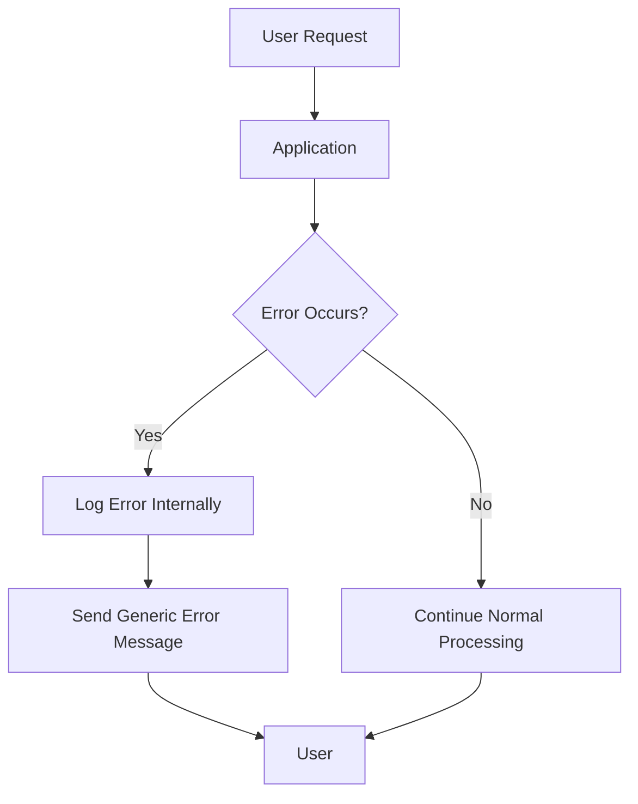

## 14.7 Error Handling and Avoiding Information Leakage

In the world of web development, error handling is a critical aspect that can significantly impact the security and reliability of an application. Improper error handling can inadvertently expose sensitive information, leading to potential security vulnerabilities. In this section, we will explore how detailed error messages can lead to information leakage, and provide guidelines for secure error handling in JavaScript applications.

### Understanding Information Leakage through Error Messages

Error messages are essential for debugging and maintaining applications. However, when these messages are too detailed, they can reveal sensitive information about the application's internal workings, such as:

- **File paths**: Revealing the directory structure of the server.
- **Database queries**: Exposing SQL statements or database schema details.
- **Stack traces**: Providing insights into the code logic and potential vulnerabilities.
- **Configuration details**: Disclosing server configurations or environment variables.

Such information can be exploited by malicious actors to craft targeted attacks against the application. Therefore, it is crucial to handle errors in a way that minimizes the risk of information leakage.

### Guidelines for Secure Error Handling

To ensure secure error handling, consider the following best practices:

#### 1. Logging Errors Appropriately

- **Log Errors Internally**: Ensure that detailed error logs are stored securely on the server, accessible only to authorized personnel. Use logging libraries like `winston` or `bunyan` to manage log levels and outputs effectively.
  
- **Avoid Logging Sensitive Data**: Be cautious about logging sensitive information such as passwords, credit card numbers, or personal identification details. Use data masking or redaction techniques to obfuscate sensitive data in logs.

- **Use Log Rotation**: Implement log rotation to manage log file sizes and prevent disk space exhaustion. Tools like `logrotate` can automate this process.

#### 2. Showing Generic Error Messages to Users

- **User-Friendly Messages**: Display generic error messages to users that do not reveal internal details. For example, instead of showing a database error, display a message like "An unexpected error occurred. Please try again later."

- **Custom Error Pages**: Design custom error pages for common HTTP error codes (e.g., 404, 500) to provide a consistent user experience and avoid exposing server-generated error messages.

#### 3. Avoiding Stack Traces in Production Environments

- **Disable Stack Traces**: Configure your application to disable stack traces in production environments. This can often be done through environment variables or configuration settings.

- **Environment-Specific Configuration**: Use environment-specific configurations to control the level of error detail shown. For instance, in Node.js, you can use the `NODE_ENV` environment variable to differentiate between development and production settings.

### Configuring Application Frameworks for Secure Error Responses

Most modern JavaScript frameworks and libraries provide mechanisms to handle errors securely. Here are some considerations for popular frameworks:

#### Node.js and Express

- **Error Handling Middleware**: Use Express's error-handling middleware to catch and process errors centrally. Customize the middleware to log errors and send generic responses to the client.

```javascript
// Error handling middleware in Express
app.use((err, req, res, next) => {
  console.error(err.stack); // Log the error stack
  res.status(500).send('Something went wrong!'); // Send a generic message
});
```

- **Environment Configuration**: Use environment variables to control error verbosity. For example, set `app.set('env', 'production')` to ensure Express does not expose stack traces.

#### React

- **Error Boundaries**: Implement error boundaries in React components to catch JavaScript errors in the component tree and display fallback UI.

```javascript
class ErrorBoundary extends React.Component {
  constructor(props) {
    super(props);
    this.state = { hasError: false };
  }

  static getDerivedStateFromError(error) {
    return { hasError: true };
  }

  componentDidCatch(error, errorInfo) {
    // Log error to an error reporting service
    logErrorToService(error, errorInfo);
  }

  render() {
    if (this.state.hasError) {
      return <h1>Something went wrong.</h1>;
    }

    return this.props.children; 
  }
}
```

#### Angular

- **Global Error Handling**: Use Angular's `ErrorHandler` class to create a global error handler that logs errors and displays user-friendly messages.

```typescript
import { ErrorHandler, Injectable } from '@angular/core';

@Injectable()
export class GlobalErrorHandler implements ErrorHandler {
  handleError(error: any): void {
    // Log error to a service
    console.error('An error occurred:', error);
    // Display a generic message
    alert('An unexpected error occurred.');
  }
}
```

### Considerations for Logging Sensitive Data

When logging errors, it is essential to consider the sensitivity of the data being logged. Here are some guidelines:

- **Data Masking**: Use data masking techniques to hide sensitive information in logs. For example, replace parts of a credit card number with asterisks.

- **Access Control**: Restrict access to log files to authorized personnel only. Use role-based access control (RBAC) to manage permissions.

- **Encryption**: Consider encrypting log files to protect sensitive data from unauthorized access.

### Visualizing Secure Error Handling

To better understand the flow of secure error handling, consider the following diagram:



**Figure 1: Secure Error Handling Flow**

This diagram illustrates the process of handling errors securely by logging them internally and sending generic messages to users.

### Knowledge Check

To reinforce your understanding of secure error handling, consider the following questions:

- What are the risks of exposing detailed error messages to users?
- How can you configure your application to disable stack traces in production?
- What are some techniques for logging errors without exposing sensitive data?

### Conclusion

Secure error handling is a vital aspect of web application security. By following best practices such as logging errors appropriately, showing generic messages to users, and avoiding stack traces in production, you can minimize the risk of information leakage and protect sensitive data. Remember, this is just the beginning. As you progress, you'll build more secure and robust applications. Keep experimenting, stay curious, and enjoy the journey!

## Quiz: Secure Error Handling in JavaScript



### What is a primary risk of exposing detailed error messages to users?

- [x] Information leakage
- [ ] Improved user experience
- [ ] Faster debugging
- [ ] Increased application performance

> **Explanation:** Detailed error messages can reveal sensitive information about the application's internal workings, leading to potential security vulnerabilities.

### Which of the following is a best practice for logging errors?

- [x] Log errors internally and securely
- [ ] Display error logs to users
- [ ] Include sensitive data in logs
- [ ] Disable logging in production

> **Explanation:** Logging errors internally and securely ensures that sensitive information is not exposed to unauthorized users.

### How can you prevent stack traces from being exposed in production environments?

- [x] Disable stack traces in production configurations
- [ ] Enable stack traces for all environments
- [ ] Use stack traces to improve user experience
- [ ] Log stack traces in user-facing messages

> **Explanation:** Disabling stack traces in production configurations prevents sensitive information from being exposed to users.

### What is the purpose of using custom error pages?

- [x] To provide a consistent user experience
- [ ] To expose detailed error information
- [ ] To improve application performance
- [ ] To log errors more effectively

> **Explanation:** Custom error pages provide a consistent user experience and prevent the exposure of server-generated error messages.

### Which of the following is a technique for logging sensitive data securely?

- [x] Data masking
- [ ] Logging passwords in plain text
- [ ] Storing logs in public directories
- [ ] Sharing logs with all users

> **Explanation:** Data masking hides sensitive information in logs, ensuring that it is not exposed to unauthorized users.

### What is a benefit of using error boundaries in React?

- [x] Catching JavaScript errors in the component tree
- [ ] Improving application performance
- [ ] Exposing detailed error messages to users
- [ ] Disabling error logging

> **Explanation:** Error boundaries catch JavaScript errors in the component tree and allow developers to display fallback UI without exposing sensitive information.

### How can you restrict access to log files?

- [x] Use role-based access control (RBAC)
- [ ] Store logs in public directories
- [ ] Share logs with all users
- [ ] Disable logging

> **Explanation:** Role-based access control (RBAC) manages permissions and restricts access to log files to authorized personnel only.

### What is the role of environment variables in error handling?

- [x] Controlling error verbosity
- [ ] Exposing sensitive information
- [ ] Disabling error logging
- [ ] Improving application performance

> **Explanation:** Environment variables can be used to control error verbosity, ensuring that detailed error information is not exposed in production environments.

### Why is it important to avoid logging sensitive data?

- [x] To prevent unauthorized access to sensitive information
- [ ] To improve application performance
- [ ] To enhance user experience
- [ ] To disable error logging

> **Explanation:** Avoiding logging of sensitive data prevents unauthorized access to sensitive information and protects user privacy.

### True or False: It is safe to display stack traces to users in production environments.

- [ ] True
- [x] False

> **Explanation:** Displaying stack traces to users in production environments can expose sensitive information and lead to security vulnerabilities.


