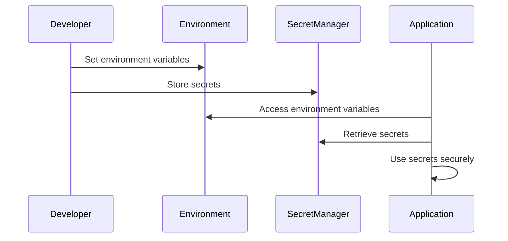

## 14.8 Secure Configuration Management

In the realm of modern web development, secure configuration management is a critical aspect that ensures the safety and integrity of applications. This section delves into the best practices for managing configuration settings and secrets securely, preventing unauthorized access and potential data breaches.

### Understanding the Risks

Before we dive into the strategies for secure configuration management, it's essential to understand the risks associated with improper handling of configuration settings and secrets.

#### Hardcoding Secrets

Hardcoding secrets such as API keys, passwords, and certificates directly into the source code is a common mistake that can lead to severe security vulnerabilities. When secrets are embedded in the code, they become accessible to anyone who has access to the codebase, including unauthorized users if the code is leaked or shared.

#### Committing Secrets to Version Control

Another prevalent risk is committing secrets to version control systems like Git. Once secrets are committed, they become part of the repository's history, making it challenging to remove them completely. This exposes sensitive information to anyone with access to the repository, including contributors and external collaborators.

### Strategies for Managing Secrets

To mitigate the risks associated with handling secrets, developers can adopt several strategies that enhance the security of configuration management.

#### Environment Variables

Environment variables are a widely used method for managing configuration settings and secrets. By storing sensitive information in environment variables, developers can keep secrets out of the source code and version control. This approach allows for easy configuration changes without modifying the codebase.

```javascript
// Accessing environment variables in Node.js
const apiKey = process.env.API_KEY;
console.log(`Your API key is: ${apiKey}`);
```

**Best Practices:**

- Use a `.env` file to store environment variables locally and add it to `.gitignore` to prevent it from being committed to version control.
- Use environment-specific files (e.g., `.env.development`, `.env.production`) to manage different configurations for various environments.

#### Configuration Files Outside of Source Control

Storing configuration files outside of the source control system is another effective strategy for managing secrets. This approach involves maintaining configuration files in a secure location, separate from the codebase, and using deployment scripts to inject these configurations into the application at runtime.

**Best Practices:**

- Ensure configuration files are encrypted and access is restricted to authorized personnel only.
- Use tools like Ansible or Chef to automate the deployment and management of configuration files.

#### Secret Management Services

Secret management services provide a centralized and secure way to manage secrets. These services offer features like encryption, access control, and auditing, making them an excellent choice for handling sensitive information.

##### HashiCorp Vault

[HashiCorp Vault](https://www.vaultproject.io/) is a popular open-source tool for managing secrets. It provides a secure interface for storing and accessing secrets, with robust access control mechanisms.

```bash
# Storing a secret in HashiCorp Vault
vault kv put secret/myapp/api_key value=mysecretapikey

# Retrieving a secret from HashiCorp Vault
vault kv get secret/myapp/api_key
```

##### AWS Secrets Manager

[AWS Secrets Manager](https://aws.amazon.com/secrets-manager/) is a managed service that helps you protect access to your applications, services, and IT resources without the upfront investment and on-going maintenance costs of operating your own infrastructure.

```javascript
// Accessing secrets from AWS Secrets Manager using AWS SDK
const AWS = require('aws-sdk');
const secretsManager = new AWS.SecretsManager();

secretsManager.getSecretValue({ SecretId: 'mySecretId' }, (err, data) => {
  if (err) {
    console.error(err);
  } else {
    const secret = JSON.parse(data.SecretString);
    console.log(`Your secret is: ${secret.apiKey}`);
  }
});
```

**Best Practices:**

- Regularly rotate secrets to minimize the risk of exposure.
- Implement fine-grained access control to ensure only authorized users and applications can access secrets.
- Enable logging and monitoring to detect unauthorized access attempts.

### Handling API Keys, Passwords, and Certificates

Managing API keys, passwords, and certificates securely is crucial for protecting sensitive information and ensuring the integrity of your application.

#### API Keys

- Use unique API keys for different environments (development, testing, production) to prevent accidental exposure.
- Limit the scope and permissions of API keys to the minimum necessary for the application to function.
- Regularly audit and rotate API keys to prevent unauthorized access.

#### Passwords

- Store passwords using strong hashing algorithms like bcrypt or Argon2.
- Implement multi-factor authentication (MFA) to add an extra layer of security.
- Enforce strong password policies to ensure users create secure passwords.

#### Certificates

- Use SSL/TLS certificates to encrypt data in transit and ensure secure communication between clients and servers.
- Regularly update and renew certificates to prevent expiration and potential security vulnerabilities.
- Use certificate pinning to prevent man-in-the-middle attacks.

### Secure Default Configurations

Ensuring secure default configurations is a fundamental aspect of secure configuration management. By setting secure defaults, you can minimize the risk of misconfiguration and potential security vulnerabilities.

**Best Practices:**

- Disable unnecessary features and services to reduce the attack surface.
- Use secure protocols and encryption algorithms by default.
- Implement strict access controls and permissions to prevent unauthorized access.

### Visualizing Secure Configuration Management

To better understand the flow of secure configuration management, let's visualize the process using a sequence diagram.



**Diagram Description:** This sequence diagram illustrates the process of secure configuration management, where a developer sets environment variables and stores secrets in a secret management service. The application then accesses these environment variables and retrieves secrets securely for use.

### Knowledge Check

- Why is it risky to hardcode secrets in the source code?
- What are the benefits of using environment variables for managing secrets?
- How can secret management services enhance the security of your application?
- What are some best practices for handling API keys and passwords securely?

### Summary

Secure configuration management is a critical component of modern web development that helps protect sensitive information and prevent security vulnerabilities. By adopting best practices such as using environment variables, storing configuration files outside of source control, and leveraging secret management services, developers can enhance the security of their applications and safeguard against unauthorized access.

### Embrace the Journey

Remember, secure configuration management is an ongoing process that requires continuous monitoring and improvement. As you progress in your development journey, keep experimenting with different strategies, stay curious, and enjoy the process of building secure and robust applications.

## Quiz: Secure Configuration Management Best Practices



### What is a common risk associated with hardcoding secrets in the source code?

- [x] Exposure of sensitive information
- [ ] Improved performance
- [ ] Easier debugging
- [ ] Reduced code complexity

> **Explanation:** Hardcoding secrets in the source code can lead to exposure of sensitive information if the code is leaked or shared.

### Which of the following is a benefit of using environment variables for managing secrets?

- [x] Secrets are kept out of the source code
- [ ] Secrets are automatically encrypted
- [ ] Secrets are accessible to all users
- [ ] Secrets are stored in the database

> **Explanation:** Using environment variables keeps secrets out of the source code, reducing the risk of exposure.

### What is the primary function of secret management services like HashiCorp Vault?

- [x] Securely store and manage secrets
- [ ] Improve application performance
- [ ] Simplify code deployment
- [ ] Enhance user interface design

> **Explanation:** Secret management services provide a secure interface for storing and managing secrets, with features like encryption and access control.

### How can you prevent secrets from being committed to version control?

- [x] Add them to `.gitignore`
- [ ] Store them in the database
- [ ] Hardcode them in the source code
- [ ] Share them via email

> **Explanation:** Adding secrets to `.gitignore` prevents them from being committed to version control.

### Which of the following is a best practice for handling API keys?

- [x] Regularly rotate API keys
- [ ] Share API keys with all team members
- [x] Limit the scope of API keys
- [ ] Store API keys in the source code

> **Explanation:** Regularly rotating API keys and limiting their scope are best practices for enhancing security.

### What is the purpose of using SSL/TLS certificates?

- [x] Encrypt data in transit
- [ ] Store secrets securely
- [ ] Improve application performance
- [ ] Simplify code deployment

> **Explanation:** SSL/TLS certificates encrypt data in transit, ensuring secure communication between clients and servers.

### How can you ensure secure default configurations?

- [x] Disable unnecessary features
- [ ] Enable all features by default
- [x] Use secure protocols by default
- [ ] Allow unrestricted access

> **Explanation:** Disabling unnecessary features and using secure protocols by default help ensure secure configurations.

### What is a benefit of using secret management services?

- [x] Centralized management of secrets
- [ ] Improved user interface design
- [ ] Faster code execution
- [ ] Simplified code syntax

> **Explanation:** Secret management services provide centralized management of secrets, enhancing security and control.

### Why is it important to regularly rotate secrets?

- [x] To minimize the risk of exposure
- [ ] To improve application performance
- [ ] To simplify code deployment
- [ ] To enhance user interface design

> **Explanation:** Regularly rotating secrets minimizes the risk of exposure and unauthorized access.

### True or False: Storing configuration files outside of source control is a secure practice.

- [x] True
- [ ] False

> **Explanation:** Storing configuration files outside of source control helps keep sensitive information secure and separate from the codebase.


