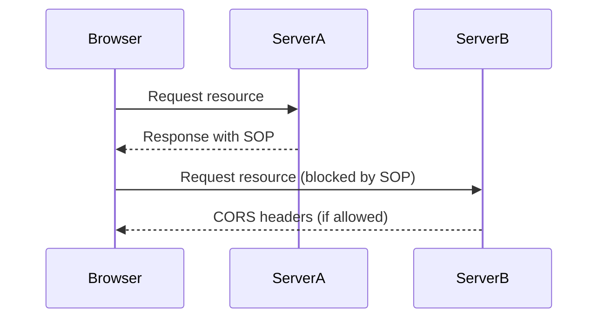

## 14.9 Understanding the Same-Origin Policy

The Same-Origin Policy (SOP) is a fundamental security concept implemented in web browsers to protect users from malicious attacks. It restricts how documents or scripts loaded from one origin can interact with resources from another origin. Understanding SOP is crucial for web developers to ensure the security and integrity of web applications.

### What is the Same-Origin Policy?

The Same-Origin Policy is a security measure that prevents a script loaded from one origin from interacting with resources from a different origin. An "origin" is defined by the combination of the protocol, host, and port of a URL. This policy is essential in maintaining the security of web applications by preventing malicious scripts from accessing sensitive data from other sites.

#### Defining an Origin

An origin is defined by three components:

- **Protocol**: The scheme used to access the resource (e.g., `http`, `https`).
- **Host**: The domain name or IP address of the server.
- **Port**: The port number used to access the resource.

Two URLs have the same origin if they have the same protocol, host, and port. For example:

- `http://example.com:80/page1` and `http://example.com:80/page2` have the same origin.
- `http://example.com:80/page1` and `https://example.com:443/page1` have different origins due to different protocols.
- `http://example.com:80/page1` and `http://example.com:8080/page1` have different origins due to different ports.

### Role of SOP in Web Security

The Same-Origin Policy plays a crucial role in web security by preventing certain types of attacks, such as Cross-Site Scripting (XSS) and Cross-Site Request Forgery (CSRF). By restricting how resources from different origins can interact, SOP helps protect sensitive data and user information.

#### Preventing Cross-Site Scripting (XSS)

XSS attacks occur when an attacker injects malicious scripts into a web page viewed by other users. SOP mitigates this risk by preventing scripts from accessing data from different origins, thus limiting the potential damage of an XSS attack.

#### Preventing Cross-Site Request Forgery (CSRF)

CSRF attacks involve tricking a user into executing unwanted actions on a different website where they are authenticated. SOP helps prevent CSRF by ensuring that requests made from one origin cannot access resources from another origin without proper authorization.

### Examples of SOP in Action

Let's explore some examples to illustrate how the Same-Origin Policy works in practice.

#### Example 1: Accessing Cookies

```javascript
// Attempt to access cookies from a different origin
document.cookie = "username=JohnDoe";

// This script will be blocked by SOP if it tries to access cookies from another origin
console.log(document.cookie);
```

In this example, a script from `http://example.com` cannot access cookies set by `http://anotherdomain.com` due to SOP restrictions.

#### Example 2: AJAX Requests

```javascript
// Making an AJAX request to a different origin
fetch('http://anotherdomain.com/api/data')
  .then(response => response.json())
  .then(data => console.log(data))
  .catch(error => console.error('Error:', error));
```

In this scenario, the browser will block the AJAX request if it is made to a different origin, unless the server explicitly allows it through mechanisms like CORS.

### Cross-Origin Communication

While the Same-Origin Policy is essential for security, there are legitimate scenarios where cross-origin communication is necessary. For instance, a web application might need to fetch resources from a different domain or interact with third-party APIs.

#### Introducing Cross-Origin Resource Sharing (CORS)

Cross-Origin Resource Sharing (CORS) is a mechanism that allows servers to specify who can access their resources and which methods are permitted. CORS headers are used to relax the SOP restrictions and enable cross-origin requests.

##### How CORS Works

CORS is implemented through HTTP headers that specify which origins are allowed to access the resources. The key headers involved in CORS are:

- **Access-Control-Allow-Origin**: Specifies which origins are allowed to access the resource.
- **Access-Control-Allow-Methods**: Lists the HTTP methods that are permitted.
- **Access-Control-Allow-Headers**: Lists the headers that can be used in the request.

Here's an example of a CORS-enabled server response:

```
HTTP/1.1 200 OK
Access-Control-Allow-Origin: http://example.com
Access-Control-Allow-Methods: GET, POST
Access-Control-Allow-Headers: Content-Type
```

This response indicates that the server allows requests from `http://example.com` using the GET and POST methods, and the `Content-Type` header.

### Implementing CORS in JavaScript

Let's see how CORS can be implemented in a JavaScript application to enable cross-origin requests.

#### Example: Fetching Data with CORS

```javascript
// Fetching data from a CORS-enabled server
fetch('http://api.example.com/data', {
  method: 'GET',
  headers: {
    'Content-Type': 'application/json'
  }
})
  .then(response => response.json())
  .then(data => console.log(data))
  .catch(error => console.error('Error:', error));
```

In this example, the server at `http://api.example.com` must include the appropriate CORS headers to allow the request from the client's origin.

### Visualizing the Same-Origin Policy

To better understand the Same-Origin Policy and its implications, let's visualize how it works using a sequence diagram.



**Figure 1**: This diagram illustrates how a browser interacts with two different servers, with SOP blocking requests to ServerB unless CORS headers are provided.

### Scenarios Requiring Cross-Origin Communication

There are several scenarios where cross-origin communication is necessary, such as:

- **Third-Party APIs**: Accessing APIs provided by external services.
- **Content Delivery Networks (CDNs)**: Fetching resources like scripts and stylesheets from CDNs.
- **Microservices Architecture**: Communicating between different services in a distributed system.

In these cases, CORS is essential to enable the required interactions while maintaining security.

### Best Practices for Managing SOP and CORS

To effectively manage the Same-Origin Policy and CORS in your web applications, consider the following best practices:

- **Minimize Cross-Origin Requests**: Limit cross-origin requests to only those that are necessary for your application.
- **Use HTTPS**: Ensure that all communications are encrypted using HTTPS to prevent man-in-the-middle attacks.
- **Validate CORS Headers**: Carefully configure CORS headers on the server to allow only trusted origins and methods.
- **Implement Security Measures**: Use additional security measures like Content Security Policy (CSP) to further protect your application.

### Conclusion

The Same-Origin Policy is a critical component of web security, preventing unauthorized access to resources across different origins. By understanding SOP and implementing CORS where necessary, developers can build secure and robust web applications. Remember, this is just the beginning. As you progress, you'll build more complex and interactive web pages. Keep experimenting, stay curious, and enjoy the journey!

### Knowledge Check

To reinforce your understanding of the Same-Origin Policy, try answering the following questions:

## Quiz: Mastering the Same-Origin Policy and CORS



### What is the Same-Origin Policy?

- [x] A security measure that restricts how documents or scripts from one origin can interact with resources from another origin.
- [ ] A policy that allows unrestricted access to resources from any origin.
- [ ] A method for encrypting data between different origins.
- [ ] A protocol for sharing resources between different servers.

> **Explanation:** The Same-Origin Policy is a security measure that restricts interactions between different origins to prevent unauthorized access.

### Which components define an origin?

- [x] Protocol, host, port
- [ ] Protocol, path, query string
- [ ] Host, path, fragment
- [ ] Port, query string, fragment

> **Explanation:** An origin is defined by the combination of protocol, host, and port.

### How does SOP help prevent XSS attacks?

- [x] By restricting scripts from accessing data from different origins.
- [ ] By encrypting all data exchanged between origins.
- [ ] By allowing unrestricted access to all resources.
- [ ] By blocking all scripts from executing.

> **Explanation:** SOP restricts scripts from accessing data from different origins, thus mitigating XSS attacks.

### What is CORS?

- [x] A mechanism that allows servers to specify who can access their resources and which methods are permitted.
- [ ] A protocol for encrypting data between different origins.
- [ ] A policy that blocks all cross-origin requests.
- [ ] A method for sharing cookies between different domains.

> **Explanation:** CORS is a mechanism that allows controlled access to resources from different origins.

### Which header is used to specify allowed origins in CORS?

- [x] Access-Control-Allow-Origin
- [ ] Content-Type
- [ ] Authorization
- [ ] Accept-Language

> **Explanation:** The `Access-Control-Allow-Origin` header specifies which origins are allowed to access the resource.

### What is a common use case for cross-origin communication?

- [x] Accessing third-party APIs
- [ ] Encrypting data between origins
- [ ] Blocking all external requests
- [ ] Sharing cookies between domains

> **Explanation:** Accessing third-party APIs is a common scenario where cross-origin communication is necessary.

### How can CORS be implemented in JavaScript?

- [x] By making requests to a server that includes the appropriate CORS headers.
- [ ] By encrypting all data exchanged between origins.
- [ ] By blocking all cross-origin requests.
- [ ] By sharing cookies between different domains.

> **Explanation:** CORS is implemented by making requests to a server that includes the appropriate CORS headers.

### What is a best practice for managing SOP and CORS?

- [x] Minimize cross-origin requests and validate CORS headers.
- [ ] Allow unrestricted access to all resources.
- [ ] Block all cross-origin requests.
- [ ] Share cookies between different domains.

> **Explanation:** Minimizing cross-origin requests and validating CORS headers are best practices for managing SOP and CORS.

### True or False: SOP allows scripts from one origin to access resources from any other origin by default.

- [ ] True
- [x] False

> **Explanation:** False. SOP restricts scripts from accessing resources from different origins by default.

### True or False: CORS can be used to relax SOP restrictions.

- [x] True
- [ ] False

> **Explanation:** True. CORS is a mechanism that allows controlled relaxation of SOP restrictions.


