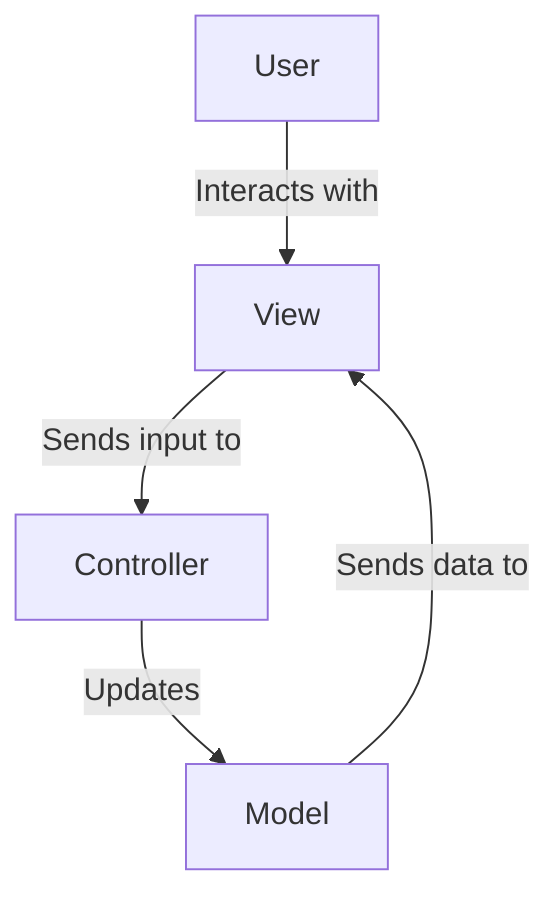
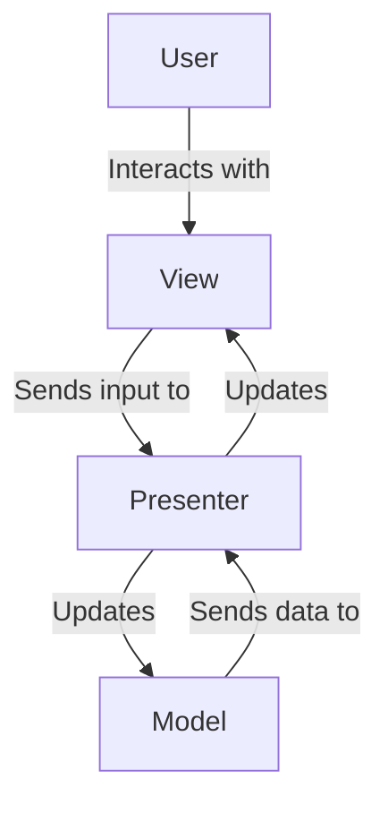
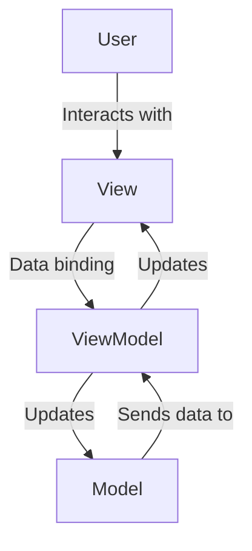

## 15.1 MVC, MVP, and MVVM Architectures

In the realm of front-end development, structuring your application effectively is crucial for maintainability, scalability, and ease of collaboration. Three popular architectural patterns that help achieve these goals are Model-View-Controller (MVC), Model-View-Presenter (MVP), and Model-View-ViewModel (MVVM). Each pattern offers a unique approach to organizing code and managing the flow of data and responsibilities within an application. In this section, we will delve into each pattern, explore their components, advantages, disadvantages, and provide examples of frameworks that implement these patterns.

### Model-View-Controller (MVC)

**Basics of MVC:**

The MVC architecture is one of the most well-known design patterns used in software development. It divides an application into three interconnected components:

- **Model:** Represents the data and the business logic of the application. It is responsible for managing the data, logic, and rules of the application.
- **View:** The user interface of the application. It displays the data from the model to the user and sends user commands to the controller.
- **Controller:** Acts as an intermediary between the Model and the View. It listens to the input from the View, processes it (often updating the Model), and returns the output display to the View.

**Diagram: MVC Architecture**



**Advantages of MVC:**

- **Separation of Concerns:** Each component has a distinct responsibility, making the codebase easier to manage and scale.
- **Reusability:** Components can be reused across different parts of the application.
- **Testability:** The separation allows for easier unit testing of individual components.

**Disadvantages of MVC:**

- **Complexity:** Can introduce complexity in smaller applications due to the need to manage three separate components.
- **Overhead:** Requires more setup and boilerplate code compared to simpler architectures.

**Framework Example: AngularJS (1.x)**

AngularJS is a popular framework that implements the MVC pattern. It allows developers to create dynamic web applications with a clear separation between the data (Model), the presentation (View), and the logic (Controller).

**Code Example:**

```javascript
// AngularJS Controller
app.controller('MainController', function($scope) {
    $scope.greeting = 'Hello, World!';
});

// AngularJS View
<div ng-controller="MainController">
    <h1>{{ greeting }}</h1>
</div>
```

### Model-View-Presenter (MVP)

**Basics of MVP:**

The MVP pattern is a derivative of MVC, designed to improve upon some of its limitations. It consists of the following components:

- **Model:** Similar to MVC, it represents the data and business logic.
- **View:** Displays data and sends user actions to the Presenter.
- **Presenter:** Acts as a mediator between the View and the Model. It retrieves data from the Model, formats it for display in the View, and handles user input.

**Diagram: MVP Architecture**



**Advantages of MVP:**

- **Decoupling:** The Presenter is decoupled from the View, allowing for more flexibility in changing the UI without affecting the logic.
- **Testability:** The Presenter can be tested independently of the View.

**Disadvantages of MVP:**

- **Complexity:** Can become complex with a large number of Views and Presenters.
- **Overhead:** Requires more code and setup compared to simpler patterns.

**Custom Implementation Example:**

While MVP is not directly implemented in many JavaScript frameworks, it can be custom-built for applications that require a clear separation between the UI and business logic.

**Code Example:**

```javascript
// Model
class UserModel {
    constructor() {
        this.name = 'John Doe';
    }
}

// View
class UserView {
    constructor() {
        this.displayName = document.getElementById('displayName');
    }

    render(name) {
        this.displayName.innerText = name;
    }
}

// Presenter
class UserPresenter {
    constructor(view, model) {
        this.view = view;
        this.model = model;
    }

    initialize() {
        this.view.render(this.model.name);
    }
}

// Usage
const model = new UserModel();
const view = new UserView();
const presenter = new UserPresenter(view, model);
presenter.initialize();
```

### Model-View-ViewModel (MVVM)

**Basics of MVVM:**

MVVM is an architectural pattern that facilitates a separation of the development of the graphical user interface from the business logic or back-end logic (the data model). It consists of:

- **Model:** Represents the data and business logic.
- **View:** The user interface that displays data and sends user commands.
- **ViewModel:** An abstraction of the View that exposes public properties and commands. It acts as a binder that synchronizes the View with the Model.

**Diagram: MVVM Architecture**



**Advantages of MVVM:**

- **Data Binding:** Automatic synchronization between the View and the ViewModel, reducing boilerplate code.
- **Separation of Concerns:** Clear separation between the UI and business logic.
- **Testability:** The ViewModel can be tested independently of the View.

**Disadvantages of MVVM:**

- **Complexity:** Can introduce complexity in managing data bindings and ViewModels.
- **Performance:** Excessive data binding can lead to performance issues.

**Framework Examples: Angular, Vue.js, Knockout.js**

These frameworks implement the MVVM pattern, providing robust data binding and component-based architecture.

**Code Example: Vue.js**

```html
<!-- Vue.js Template -->
<div id="app">
    <h1>{{ message }}</h1>
    <input v-model="message" />
</div>

<script>
// Vue.js ViewModel
new Vue({
    el: '#app',
    data: {
        message: 'Hello, Vue.js!'
    }
});
</script>
```

### Choosing the Right Pattern

When deciding which architectural pattern to use, consider the following factors:

- **Project Size and Complexity:** MVC and MVVM are well-suited for larger applications with complex user interfaces, while MVP can be beneficial for applications requiring a clear separation between UI and logic.
- **Team Expertise:** Choose a pattern that aligns with your team's expertise and familiarity.
- **Framework Support:** Consider the frameworks you plan to use and their support for specific patterns.
- **Maintainability and Scalability:** Ensure the chosen pattern supports the long-term maintainability and scalability of the application.

### Conclusion

Understanding and implementing the right architectural pattern is crucial for building robust, maintainable, and scalable front-end applications. MVC, MVP, and MVVM each offer unique benefits and challenges, and the choice of pattern should be guided by the specific needs and constraints of your project. As you continue to explore and experiment with these patterns, you'll gain a deeper understanding of how they can enhance your development process and improve the quality of your applications.

Remember, this is just the beginning. As you progress, you'll build more complex and interactive web pages. Keep experimenting, stay curious, and enjoy the journey!

## Quiz: Understanding MVC, MVP, and MVVM Architectures



### Which component in MVC architecture is responsible for handling user input?

- [ ] Model
- [ ] View
- [x] Controller
- [ ] ViewModel

> **Explanation:** In MVC architecture, the Controller is responsible for handling user input and updating the Model accordingly.

### What is a key advantage of using the MVP pattern?

- [x] Decoupling of the View and Presenter
- [ ] Automatic data binding
- [ ] Reduced complexity
- [ ] Direct interaction between View and Model

> **Explanation:** MVP decouples the View and Presenter, allowing for more flexibility in changing the UI without affecting the logic.

### Which pattern is known for its automatic data binding feature?

- [ ] MVC
- [ ] MVP
- [x] MVVM
- [ ] All of the above

> **Explanation:** MVVM is known for its automatic data binding between the View and the ViewModel.

### Which framework is an example of implementing the MVC pattern?

- [x] AngularJS (1.x)
- [ ] Vue.js
- [ ] Knockout.js
- [ ] React

> **Explanation:** AngularJS (1.x) is an example of a framework that implements the MVC pattern.

### What is the role of the ViewModel in MVVM architecture?

- [ ] Handles user input
- [x] Acts as an abstraction of the View
- [ ] Manages business logic
- [ ] Directly updates the Model

> **Explanation:** In MVVM, the ViewModel acts as an abstraction of the View, exposing public properties and commands for data binding.

### Which pattern is best suited for applications with complex user interfaces?

- [x] MVC
- [ ] MVP
- [x] MVVM
- [ ] None of the above

> **Explanation:** Both MVC and MVVM are well-suited for applications with complex user interfaces due to their separation of concerns.

### What is a disadvantage of using the MVVM pattern?

- [ ] Lack of testability
- [x] Complexity in managing data bindings
- [ ] Tight coupling between components
- [ ] Limited framework support

> **Explanation:** MVVM can introduce complexity in managing data bindings and ViewModels.

### Which component in MVP architecture acts as a mediator between the View and the Model?

- [ ] Model
- [x] Presenter
- [ ] View
- [ ] ViewModel

> **Explanation:** In MVP architecture, the Presenter acts as a mediator between the View and the Model.

### What is a common disadvantage of both MVC and MVP patterns?

- [x] Complexity in smaller applications
- [ ] Lack of testability
- [ ] Tight coupling between components
- [ ] Limited framework support

> **Explanation:** Both MVC and MVP can introduce complexity in smaller applications due to the need to manage multiple components.

### True or False: MVVM architecture is known for its direct interaction between the View and the Model.

- [ ] True
- [x] False

> **Explanation:** In MVVM architecture, the View interacts with the ViewModel, not directly with the Model.


