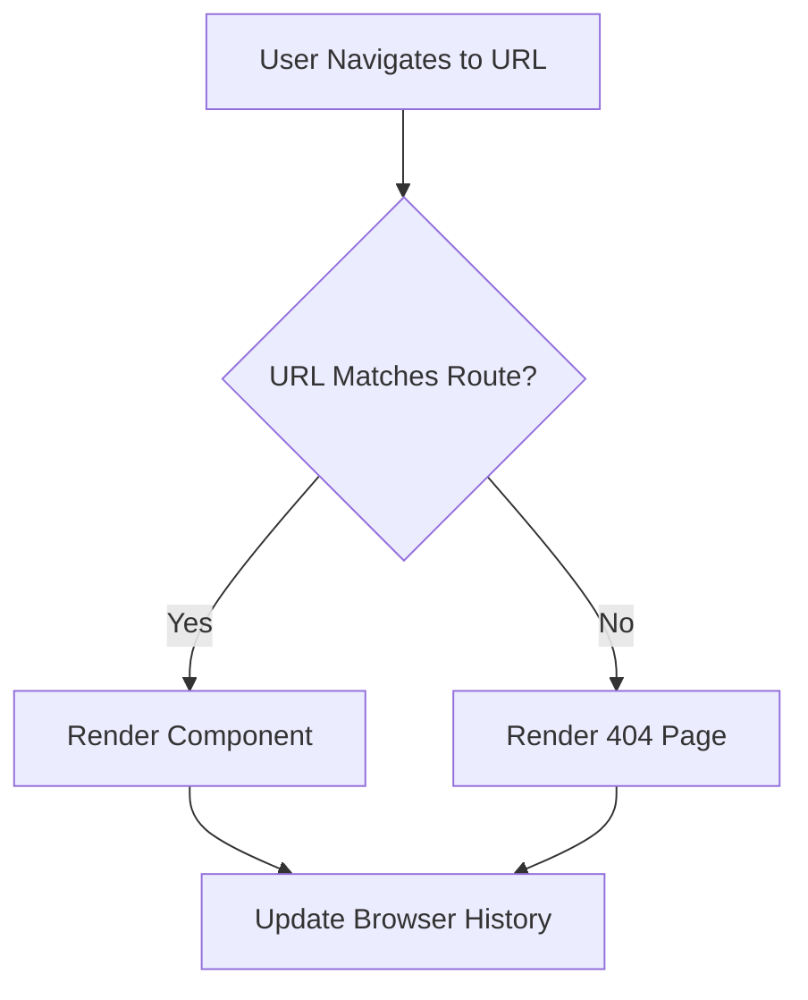

## 15.10 Routing and Navigation Patterns

In modern web development, single-page applications (SPAs) have become a popular architecture due to their seamless user experience and efficient resource usage. A critical aspect of SPAs is routing and navigation, which allows users to move between different views or pages without triggering a full page reload. This section explores how client-side routing works, introduces popular routing libraries, and provides practical examples of setting up routes and navigating between views.

### Understanding Client-Side Routing

Client-side routing is the process of handling URL changes directly in the browser without making a request to the server. This is achieved by manipulating the browser's history API and dynamically rendering components based on the current URL. The primary goal is to provide a seamless user experience by updating only the necessary parts of the page.

#### How Client-Side Routing Works

1. **URL Management**: The browser's address bar reflects the current state of the application. When a user navigates to a new route, the URL changes, but the page does not reload.
2. **History API**: JavaScript's `history.pushState()` and `history.replaceState()` methods allow developers to change the URL and manage the browser's history stack without triggering a page reload.
3. **Route Matching**: The routing library listens for URL changes and matches the current URL against a set of predefined routes. When a match is found, the corresponding component is rendered.
4. **Component Rendering**: Based on the matched route, the application dynamically renders the appropriate component, updating the view without a full page reload.

### Popular Routing Libraries

Several libraries facilitate routing in SPAs, each tailored to specific frameworks. Let's explore the most popular ones:

#### React Router

[React Router](https://reactrouter.com/) is a powerful routing library for React applications. It provides a declarative approach to routing, allowing developers to define routes as components.

- **Installation**: Install React Router using npm or yarn.
  ```bash
  npm install react-router-dom
  ```

- **Basic Setup**: Define routes using the `BrowserRouter`, `Route`, and `Switch` components.
  ```jsx
  import React from 'react';
  import { BrowserRouter as Router, Route, Switch } from 'react-router-dom';
  import Home from './Home';
  import About from './About';

  function App() {
    return (
      <Router>
        <Switch>
          <Route path="/" exact component={Home} />
          <Route path="/about" component={About} />
        </Switch>
      </Router>
    );
  }

  export default App;
  ```

- **Dynamic Routing**: Use route parameters to create dynamic routes.
  ```jsx
  <Route path="/user/:id" component={UserProfile} />
  ```

- **Nested Routes**: Define routes within components to create nested routing structures.
  ```jsx
  function Dashboard() {
    return (
      <div>
        <h2>Dashboard</h2>
        <Route path="/dashboard/settings" component={Settings} />
      </div>
    );
  }
  ```

#### Vue Router

[Vue Router](https://router.vuejs.org/) is the official router for Vue.js, providing a flexible and easy-to-use API for managing routes in Vue applications.

- **Installation**: Install Vue Router via npm.
  ```bash
  npm install vue-router
  ```

- **Basic Setup**: Define routes using the `VueRouter` instance.
  ```javascript
  import Vue from 'vue';
  import VueRouter from 'vue-router';
  import Home from './components/Home.vue';
  import About from './components/About.vue';

  Vue.use(VueRouter);

  const routes = [
    { path: '/', component: Home },
    { path: '/about', component: About }
  ];

  const router = new VueRouter({
    routes
  });

  new Vue({
    router,
    render: h => h(App)
  }).$mount('#app');
  ```

- **Dynamic Routing**: Use route parameters to handle dynamic segments.
  ```javascript
  { path: '/user/:id', component: UserProfile }
  ```

- **Nested Routes**: Define child routes within a parent route.
  ```javascript
  const routes = [
    {
      path: '/dashboard',
      component: Dashboard,
      children: [
        { path: 'settings', component: Settings }
      ]
    }
  ];
  ```

#### Angular Router

[Angular Router](https://angular.io/guide/router) is a robust routing solution for Angular applications, offering a comprehensive set of features for managing navigation.

- **Basic Setup**: Define routes in the `AppRoutingModule`.
  ```typescript
  import { NgModule } from '@angular/core';
  import { RouterModule, Routes } from '@angular/router';
  import { HomeComponent } from './home/home.component';
  import { AboutComponent } from './about/about.component';

  const routes: Routes = [
    { path: '', component: HomeComponent },
    { path: 'about', component: AboutComponent }
  ];

  @NgModule({
    imports: [RouterModule.forRoot(routes)],
    exports: [RouterModule]
  })
  export class AppRoutingModule { }
  ```

- **Dynamic Routing**: Use route parameters to capture dynamic values.
  ```typescript
  { path: 'user/:id', component: UserProfileComponent }
  ```

- **Nested Routes**: Define child routes within a parent route.
  ```typescript
  const routes: Routes = [
    {
      path: 'dashboard',
      component: DashboardComponent,
      children: [
        { path: 'settings', component: SettingsComponent }
      ]
    }
  ];
  ```

### Advanced Routing Concepts

#### Dynamic Routing and Route Parameters

Dynamic routing allows applications to handle routes with variable segments, such as user IDs or product names. Route parameters are placeholders in the route path that capture dynamic values from the URL.

- **Example**: A route path `/user/:id` can match URLs like `/user/1` or `/user/42`, where `:id` is a dynamic segment.

#### Nested Routes

Nested routes enable the creation of complex routing structures by defining routes within other routes. This is useful for applications with hierarchical views, such as dashboards with multiple sections.

- **Example**: A dashboard route with nested settings and profile routes.

#### Authentication and Protected Routes

In many applications, certain routes should only be accessible to authenticated users. Protected routes require users to be logged in before they can access the route.

- **Implementation**: Use route guards or higher-order components to check authentication status before rendering the route.

#### Handling 404 Pages and Fallback Routes

When a user navigates to a non-existent route, the application should display a 404 page. Fallback routes catch unmatched URLs and render a default component.

- **Example**: Define a catch-all route at the end of your route definitions to handle 404 errors.

### Considerations for Routing in SPAs

1. **SEO**: SPAs can pose challenges for search engine optimization (SEO) because content is dynamically loaded. Consider using server-side rendering (SSR) or pre-rendering to improve SEO.
2. **Performance**: Minimize the number of components loaded on initial render to improve performance. Use lazy loading to load components only when needed.
3. **Accessibility**: Ensure that your routing implementation is accessible by providing meaningful page titles and using ARIA landmarks.

### Try It Yourself

Experiment with the code examples provided in this section. Try adding new routes, implementing dynamic routing, and creating nested routes. Consider adding authentication checks to protect certain routes and handling 404 pages.

### Visualizing Routing and Navigation

Below is a diagram illustrating the flow of routing in a single-page application using React Router:



**Diagram Description**: This flowchart represents the process of handling a URL change in a React application using React Router. When a user navigates to a URL, the router checks if the URL matches a predefined route. If a match is found, the corresponding component is rendered; otherwise, a 404 page is displayed. The browser history is updated accordingly.

### References and Further Reading

- [React Router Documentation](https://reactrouter.com/)
- [Vue Router Documentation](https://router.vuejs.org/)
- [Angular Router Guide](https://angular.io/guide/router)
- [MDN Web Docs: Using the History API](https://developer.mozilla.org/en-US/docs/Web/API/History_API)

### Knowledge Check

## Mastering Routing and Navigation Patterns in JavaScript SPAs



### What is the primary goal of client-side routing in SPAs?

- [x] To provide a seamless user experience by updating only the necessary parts of the page
- [ ] To reload the entire page on every navigation
- [ ] To manage server-side rendering
- [ ] To handle database interactions

> **Explanation:** Client-side routing aims to update only the necessary parts of the page, providing a seamless user experience without full page reloads.

### Which method is used in JavaScript to change the URL without reloading the page?

- [x] history.pushState()
- [ ] window.location.reload()
- [ ] document.write()
- [ ] console.log()

> **Explanation:** The `history.pushState()` method is used to change the URL and manage the browser's history stack without reloading the page.

### Which library is used for routing in React applications?

- [x] React Router
- [ ] Vue Router
- [ ] Angular Router
- [ ] Backbone.js

> **Explanation:** React Router is the library used for routing in React applications.

### How can you define a dynamic route in Vue Router?

- [x] { path: '/user/:id', component: UserProfile }
- [ ] { path: '/user', component: UserProfile }
- [ ] { path: '/user/*', component: UserProfile }
- [ ] { path: '/user', component: UserProfile, dynamic: true }

> **Explanation:** In Vue Router, dynamic routes are defined using a colon `:` followed by the parameter name, such as `:id`.

### What is a common use case for nested routes?

- [x] Creating hierarchical views, such as dashboards with multiple sections
- [ ] Handling 404 pages
- [ ] Managing server-side rendering
- [ ] Implementing authentication

> **Explanation:** Nested routes are commonly used to create hierarchical views, such as dashboards with multiple sections.

### What is the purpose of a fallback route?

- [x] To catch unmatched URLs and render a default component
- [ ] To handle dynamic routing
- [ ] To manage authentication
- [ ] To improve SEO

> **Explanation:** A fallback route is used to catch unmatched URLs and render a default component, such as a 404 page.

### Which Angular feature is used to protect routes for authenticated users?

- [x] Route guards
- [ ] Services
- [ ] Directives
- [ ] Pipes

> **Explanation:** Route guards in Angular are used to protect routes and ensure that only authenticated users can access them.

### How can you improve SEO in SPAs?

- [x] Use server-side rendering (SSR) or pre-rendering
- [ ] Use more JavaScript libraries
- [ ] Avoid using dynamic routes
- [ ] Disable client-side routing

> **Explanation:** Using server-side rendering (SSR) or pre-rendering can improve SEO in SPAs by providing static content for search engines to index.

### What is the role of the `Switch` component in React Router?

- [x] To render only the first matching route
- [ ] To handle dynamic routing
- [ ] To manage authentication
- [ ] To update the browser history

> **Explanation:** The `Switch` component in React Router renders only the first matching route, ensuring that only one route is rendered at a time.

### True or False: Client-side routing requires a server request for every navigation.

- [ ] True
- [x] False

> **Explanation:** False. Client-side routing handles navigation without making a server request, updating the view dynamically.



Remember, mastering routing and navigation patterns is crucial for building efficient and user-friendly SPAs. Keep experimenting, stay curious, and enjoy the journey!
