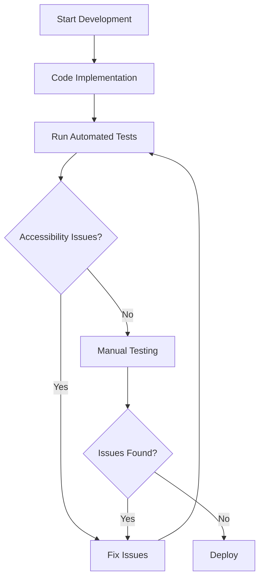

## 15.12.1 Accessibility Testing Tools (axe, Lighthouse)

### Introduction to Web Accessibility

Web accessibility ensures that websites and applications are usable by everyone, including people with disabilities. It is a crucial aspect of modern web development, as it promotes inclusivity and equal access to information and services. Accessibility is not just a legal requirement in many jurisdictions but also a moral obligation for developers to create a web that is accessible to all.

### Why Web Accessibility Matters

1. **Inclusivity**: Accessibility ensures that people with disabilities can access and interact with web content effectively.
2. **Legal Compliance**: Many countries have laws mandating web accessibility, such as the Americans with Disabilities Act (ADA) in the United States and the European Accessibility Act in the EU.
3. **Improved User Experience**: Accessible websites often provide a better user experience for everyone, including those without disabilities.
4. **SEO Benefits**: Search engines favor accessible websites, as they are easier to crawl and understand.

### Understanding WCAG 2.1 Guidelines

The Web Content Accessibility Guidelines (WCAG) 2.1 are a set of recommendations for making web content more accessible. They are organized around four principles:

1. **Perceivable**: Information and user interface components must be presentable to users in ways they can perceive.
2. **Operable**: User interface components and navigation must be operable.
3. **Understandable**: Information and the operation of the user interface must be understandable.
4. **Robust**: Content must be robust enough to be interpreted reliably by a wide variety of user agents, including assistive technologies.

### Introducing Accessibility Testing Tools

To ensure compliance with accessibility standards, developers can use various tools to test and improve their web applications. Two of the most popular tools are **axe** and **Lighthouse**.

#### axe

[axe](https://www.deque.com/axe/) is a powerful accessibility testing tool developed by Deque Systems. It is available as a browser extension for Chrome and Firefox, as well as a command-line tool and a library that can be integrated into automated testing frameworks.

- **Features**:
  - Comprehensive accessibility checks based on WCAG guidelines.
  - Easy-to-use interface with detailed issue reports.
  - Integration with popular testing frameworks like Selenium and Cypress.

- **Using axe**:
  - Install the axe browser extension from the Chrome Web Store or Firefox Add-ons.
  - Navigate to the web page you want to test.
  - Open the browser's developer tools and navigate to the axe tab.
  - Run the analysis to identify accessibility issues.

```javascript
// Example of using axe-core in a testing script
const { AxePuppeteer } = require('axe-puppeteer');
const puppeteer = require('puppeteer');

(async () => {
  const browser = await puppeteer.launch();
  const page = await browser.newPage();
  await page.goto('https://example.com');

  const results = await new AxePuppeteer(page).analyze();
  console.log(results.violations);

  await browser.close();
})();
```

#### Lighthouse

[Lighthouse](https://developers.google.com/web/tools/lighthouse) is an open-source, automated tool for improving the quality of web pages. It provides audits for performance, accessibility, progressive web apps, SEO, and more.

- **Features**:
  - Comprehensive audits with actionable insights.
  - Integration with Chrome DevTools, CI systems, and as a Node module.
  - Detailed reports with scores and recommendations.

- **Using Lighthouse**:
  - Open Chrome DevTools and navigate to the Lighthouse tab.
  - Select the categories you want to audit, including accessibility.
  - Run the audit to generate a report with scores and recommendations.

```javascript
// Example of using Lighthouse programmatically
const lighthouse = require('lighthouse');
const chromeLauncher = require('chrome-launcher');

(async () => {
  const chrome = await chromeLauncher.launch({ chromeFlags: ['--headless'] });
  const options = { logLevel: 'info', output: 'html', onlyCategories: ['accessibility'], port: chrome.port };
  const runnerResult = await lighthouse('https://example.com', options);

  // `.report` is the HTML report as a string
  const reportHtml = runnerResult.report;
  console.log(reportHtml);

  await chrome.kill();
})();
```

### Common Accessibility Problems and Solutions

1. **Missing Alt Text**: Images without alternative text cannot be interpreted by screen readers.
   - **Solution**: Always provide descriptive alt text for images.

2. **Poor Color Contrast**: Text with insufficient contrast against its background can be difficult to read.
   - **Solution**: Use tools like the Contrast Checker to ensure adequate contrast ratios.

3. **Keyboard Navigation Issues**: Users who rely on keyboards for navigation may encounter inaccessible elements.
   - **Solution**: Ensure all interactive elements are focusable and operable via keyboard.

4. **Missing Form Labels**: Forms without labels can be confusing for users with screen readers.
   - **Solution**: Use `<label>` elements to associate labels with form controls.

### Integrating Accessibility Testing into Development Workflows

1. **Automated Testing**: Integrate tools like axe and Lighthouse into your CI/CD pipelines to catch accessibility issues early.
2. **Manual Testing**: Regularly test your web applications manually using screen readers and keyboard navigation.
3. **Continuous Learning**: Stay updated with the latest accessibility standards and best practices.

### Visualizing Accessibility Testing Workflow



### References and Further Reading

- [Web Content Accessibility Guidelines (WCAG) 2.1](https://www.w3.org/TR/WCAG21/)
- [Deque Systems axe](https://www.deque.com/axe/)
- [Google Lighthouse](https://developers.google.com/web/tools/lighthouse)
- [Contrast Checker](https://webaim.org/resources/contrastchecker/)

### Knowledge Check

- What are the four principles of WCAG 2.1?
- How can axe be integrated into automated testing frameworks?
- What are some common accessibility issues and their solutions?
- How does Lighthouse help in improving web accessibility?

### Embrace the Journey

Remember, accessibility is an ongoing journey, not a one-time task. By integrating accessibility testing into your development workflow, you ensure that your web applications are inclusive and accessible to all users. Keep experimenting, stay curious, and enjoy the journey of creating a more accessible web!

## Mastering Accessibility Testing with axe and Lighthouse



### What is the primary purpose of web accessibility?

- [x] To ensure websites are usable by everyone, including people with disabilities
- [ ] To improve website performance
- [ ] To enhance website aesthetics
- [ ] To increase website traffic

> **Explanation:** Web accessibility ensures that websites are usable by everyone, including people with disabilities, promoting inclusivity and equal access.

### Which of the following is NOT a principle of WCAG 2.1?

- [ ] Perceivable
- [ ] Operable
- [ ] Understandable
- [x] Scalable

> **Explanation:** The four principles of WCAG 2.1 are Perceivable, Operable, Understandable, and Robust.

### How can axe be used in a development workflow?

- [x] As a browser extension and integrated into automated testing frameworks
- [ ] Only as a standalone application
- [ ] Only for manual testing
- [ ] Only for performance testing

> **Explanation:** axe can be used as a browser extension and integrated into automated testing frameworks for accessibility testing.

### What is a common accessibility issue related to images?

- [x] Missing alt text
- [ ] Incorrect file format
- [ ] Large file size
- [ ] Low resolution

> **Explanation:** Missing alt text is a common accessibility issue, as it prevents screen readers from interpreting images.

### What tool can be used to check color contrast?

- [x] Contrast Checker
- [ ] Image Resizer
- [ ] Color Picker
- [ ] Font Styler

> **Explanation:** The Contrast Checker tool can be used to ensure adequate contrast ratios for text and background colors.

### Which tool provides audits for performance, accessibility, and more?

- [x] Lighthouse
- [ ] axe
- [ ] Selenium
- [ ] Mocha

> **Explanation:** Lighthouse provides audits for performance, accessibility, progressive web apps, SEO, and more.

### How can Lighthouse be integrated into a development workflow?

- [x] As a Chrome DevTools extension and a Node module
- [ ] Only as a standalone application
- [ ] Only for manual testing
- [ ] Only for SEO analysis

> **Explanation:** Lighthouse can be integrated as a Chrome DevTools extension and a Node module for automated testing.

### What is a solution for keyboard navigation issues?

- [x] Ensure all interactive elements are focusable and operable via keyboard
- [ ] Increase font size
- [ ] Use more images
- [ ] Add more animations

> **Explanation:** Ensuring all interactive elements are focusable and operable via keyboard addresses keyboard navigation issues.

### What is the benefit of integrating accessibility testing into CI/CD pipelines?

- [x] To catch accessibility issues early in the development process
- [ ] To improve website aesthetics
- [ ] To increase website traffic
- [ ] To enhance website performance

> **Explanation:** Integrating accessibility testing into CI/CD pipelines helps catch accessibility issues early in the development process.

### True or False: Accessibility is a one-time task.

- [ ] True
- [x] False

> **Explanation:** Accessibility is an ongoing journey, not a one-time task, requiring continuous testing and improvement.


