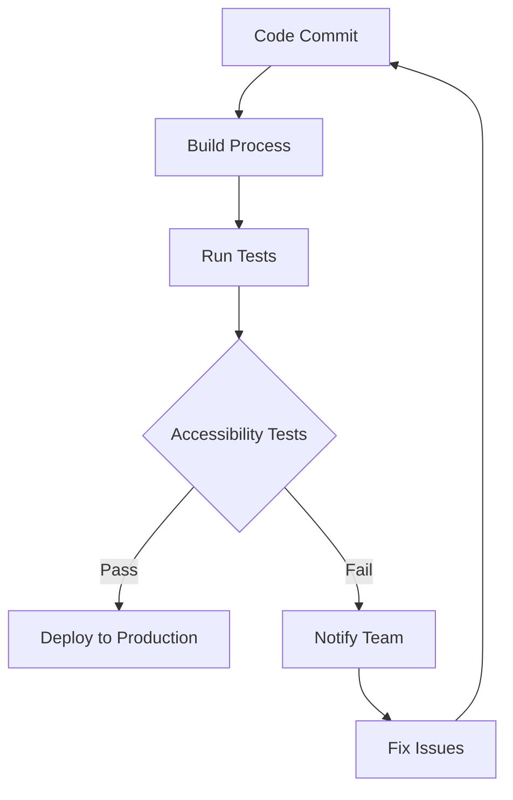

## 15.12.2 Automated Accessibility Testing in CI/CD

In the fast-paced world of web development, ensuring that your applications are accessible to all users is not just a legal requirement but a moral imperative. Automated accessibility testing integrated into Continuous Integration and Continuous Deployment (CI/CD) pipelines can help maintain compliance and improve the overall quality of your web applications. In this section, we'll explore the benefits of automated accessibility testing, demonstrate how to set up tests using tools like [pa11y](https://pa11y.org/) and [axe CLI](https://github.com/dequelabs/axe-core-npm), and discuss best practices for maintaining accessibility standards over time.

### Benefits of Automated Accessibility Testing

Automated accessibility testing offers several advantages:

1. **Consistency**: Automated tests ensure that accessibility checks are performed consistently across all builds, reducing the risk of human error.
2. **Efficiency**: Running tests automatically saves time and resources compared to manual testing, allowing developers to focus on other tasks.
3. **Early Detection**: Integrating tests into CI/CD pipelines allows for early detection of accessibility issues, preventing them from reaching production.
4. **Scalability**: Automated tests can be easily scaled to cover large codebases and multiple projects.
5. **Compliance**: Regular testing helps ensure compliance with accessibility standards such as WCAG 2.1, reducing legal risks.

### Setting Up Automated Accessibility Tests

Let's dive into setting up automated accessibility tests using popular tools like pa11y and axe CLI.

#### Using Pa11y

Pa11y is a powerful tool for automated accessibility testing. It can be easily integrated into CI/CD pipelines to run accessibility checks on web pages.

**Installation**

First, install Pa11y using npm:

```bash
npm install -g pa11y
```

**Basic Usage**

To run a basic accessibility test on a webpage, use the following command:

```bash
pa11y https://example.com
```

This command will output a list of accessibility issues found on the specified webpage.

**Integrating Pa11y into CI/CD**

To integrate Pa11y into a CI/CD pipeline, you can use a configuration file to specify the tests you want to run. Here's an example of a Pa11y configuration file:

```json
{
  "defaults": {
    "timeout": 30000,
    "wait": 1000
  },
  "urls": [
    "https://example.com",
    "https://example.com/about",
    "https://example.com/contact"
  ]
}
```

You can then run Pa11y with the configuration file:

```bash
pa11y-ci --config pa11y.json
```

**Failing Builds on Accessibility Violations**

To ensure that accessibility issues are addressed promptly, configure your CI/CD pipeline to fail builds when violations are detected. This can be done by setting an exit code for Pa11y when issues are found:

```bash
pa11y-ci --config pa11y.json --threshold 0
```

Setting the threshold to 0 will cause the build to fail if any accessibility issues are detected.

#### Using Axe CLI

Axe CLI is another popular tool for automated accessibility testing. It provides a command-line interface for running accessibility checks using the axe-core library.

**Installation**

Install Axe CLI using npm:

```bash
npm install -g axe-cli
```

**Basic Usage**

To run an accessibility test on a webpage, use the following command:

```bash
axe https://example.com
```

This command will output a list of accessibility issues found on the specified webpage.

**Integrating Axe CLI into CI/CD**

Similar to Pa11y, Axe CLI can be integrated into CI/CD pipelines. You can create a script to run Axe CLI tests on multiple pages:

```bash
#!/bin/bash

urls=("https://example.com" "https://example.com/about" "https://example.com/contact")

for url in "${urls[@]}"
do
  axe $url --exit 1
done
```

The `--exit 1` option will cause the script to exit with a non-zero status if any accessibility issues are found, failing the build.

### Best Practices for Maintaining Accessibility Standards

Maintaining accessibility standards over time requires a proactive approach. Here are some best practices to consider:

1. **Regular Testing**: Schedule regular accessibility tests as part of your CI/CD pipeline to catch issues early.
2. **Training and Awareness**: Educate your team about accessibility best practices and the importance of maintaining standards.
3. **Continuous Monitoring**: Use monitoring tools to track accessibility metrics and trends over time.
4. **Collaboration**: Involve designers, developers, and testers in accessibility efforts to ensure a holistic approach.
5. **Documentation**: Maintain clear documentation of accessibility standards and guidelines for your team to follow.

### Reporting and Monitoring Accessibility Metrics

Effective reporting and monitoring are crucial for maintaining accessibility standards. Consider the following strategies:

- **Automated Reports**: Generate automated reports from your accessibility tests to provide insights into issues and trends.
- **Dashboards**: Use dashboards to visualize accessibility metrics and track progress over time.
- **Alerts**: Set up alerts to notify your team of critical accessibility issues that require immediate attention.

### Visualizing the CI/CD Pipeline with Accessibility Testing

To better understand how accessibility testing fits into a CI/CD pipeline, let's visualize the process using a Mermaid.js diagram.



**Diagram Description**: This diagram illustrates a typical CI/CD pipeline with integrated accessibility testing. After a code commit, the build process is initiated, followed by running tests. If accessibility tests pass, the code is deployed to production. If they fail, the team is notified to fix the issues before retrying the process.

### Try It Yourself

To get hands-on experience with automated accessibility testing, try setting up a simple CI/CD pipeline using a tool like GitHub Actions or Jenkins. Integrate Pa11y or Axe CLI into the pipeline and experiment with different configurations and thresholds. Modify the code to test various web pages and observe how the pipeline responds to accessibility issues.

### Knowledge Check

Before we wrap up, let's reinforce what we've learned with a few questions:

1. What are the benefits of integrating automated accessibility testing into CI/CD pipelines?
2. How can Pa11y be configured to fail a build on accessibility violations?
3. What are some best practices for maintaining accessibility standards over time?
4. How can accessibility metrics be monitored and reported effectively?

### Summary

Automated accessibility testing in CI/CD pipelines is a powerful strategy for ensuring that your web applications remain accessible and compliant with standards. By integrating tools like Pa11y and Axe CLI, you can catch accessibility issues early, maintain consistency, and improve the overall quality of your applications. Remember, accessibility is an ongoing commitment, and by following best practices and continuously monitoring metrics, you can create a more inclusive web experience for all users.

### Embrace the Journey

As you continue to explore automated accessibility testing, remember that this is just the beginning. The landscape of web development is constantly evolving, and staying informed about the latest tools and techniques will help you build more accessible and user-friendly applications. Keep experimenting, stay curious, and enjoy the journey!

## Quiz: Mastering Automated Accessibility Testing in CI/CD



### What is one of the main benefits of automated accessibility testing in CI/CD?

- [x] Consistency in testing
- [ ] Manual intervention
- [ ] Increased development time
- [ ] Reduced code quality

> **Explanation:** Automated accessibility testing ensures consistent checks across all builds, reducing the risk of human error.

### Which tool can be used for automated accessibility testing in CI/CD pipelines?

- [x] Pa11y
- [ ] Selenium
- [ ] JUnit
- [ ] Mocha

> **Explanation:** Pa11y is a tool specifically designed for automated accessibility testing.

### How can Pa11y be configured to fail a build on accessibility violations?

- [x] By setting a threshold to 0
- [ ] By using a custom script
- [ ] By ignoring errors
- [ ] By running tests manually

> **Explanation:** Setting the threshold to 0 will cause the build to fail if any accessibility issues are detected.

### What is a best practice for maintaining accessibility standards over time?

- [x] Regular testing
- [ ] Ignoring minor issues
- [ ] Manual testing only
- [ ] Delaying fixes

> **Explanation:** Regular testing helps catch accessibility issues early and maintain standards.

### What is the purpose of generating automated reports from accessibility tests?

- [x] To provide insights into issues and trends
- [ ] To increase workload
- [ ] To replace manual testing
- [ ] To ignore accessibility standards

> **Explanation:** Automated reports provide valuable insights into accessibility issues and trends.

### Which command installs Pa11y globally using npm?

- [x] `npm install -g pa11y`
- [ ] `npm install pa11y`
- [ ] `npm install -g axe-cli`
- [ ] `npm install axe-cli`

> **Explanation:** The command `npm install -g pa11y` installs Pa11y globally.

### What is a key advantage of using Axe CLI for accessibility testing?

- [x] Command-line interface for running checks
- [ ] Requires manual intervention
- [ ] Limited to small projects
- [ ] Only works with specific browsers

> **Explanation:** Axe CLI provides a command-line interface for running accessibility checks.

### What does the `--exit 1` option do in Axe CLI?

- [x] Causes the script to exit with a non-zero status if issues are found
- [ ] Ignores all errors
- [ ] Runs tests in verbose mode
- [ ] Limits the number of tests

> **Explanation:** The `--exit 1` option causes the script to exit with a non-zero status if any accessibility issues are found.

### What is the role of dashboards in accessibility testing?

- [x] Visualize accessibility metrics
- [ ] Increase testing time
- [ ] Replace automated tests
- [ ] Ignore minor issues

> **Explanation:** Dashboards help visualize accessibility metrics and track progress over time.

### True or False: Automated accessibility testing can help reduce legal risks.

- [x] True
- [ ] False

> **Explanation:** Regular automated testing helps ensure compliance with accessibility standards, reducing legal risks.


