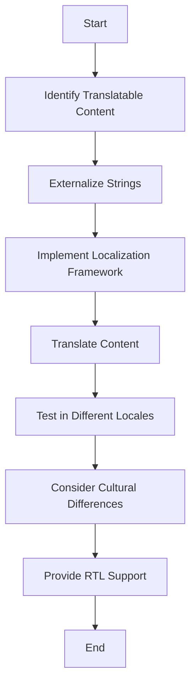

## 15.13 Internationalization and Localization in Front-End Development

In today's globalized world, creating applications that cater to a diverse audience is crucial. Internationalization (i18n) and localization (l10n) are key processes in adapting your application to different languages and regions. This section delves into the strategies and best practices for internationalizing and localizing front-end applications, ensuring they are accessible and user-friendly across various cultures and languages.

### Understanding Internationalization (i18n) and Localization (l10n)

**Internationalization (i18n)** is the process of designing your application in a way that makes it easy to adapt to various languages and regions without requiring changes to the source code. It involves preparing your codebase to support multiple languages, date formats, currencies, and other locale-specific elements.

**Localization (l10n)**, on the other hand, is the process of adapting your application to a specific locale or market. This includes translating text, adjusting date and time formats, and considering cultural nuances to ensure the application feels native to users in different regions.

### Preparing Code for Localization

To effectively localize your application, you must first prepare your codebase. This involves several key steps:

#### Externalizing Strings

One of the first steps in internationalization is externalizing strings from your code. This means separating user-facing text from your codebase and storing it in external files. This allows translators to easily access and modify the text without altering the code.

```javascript
// Example of externalizing strings in a JavaScript application

// en.json
{
  "greeting": "Hello, World!"
}

// es.json
{
  "greeting": "¡Hola, Mundo!"
}

// JavaScript code
import en from './locales/en.json';
import es from './locales/es.json';

const messages = {
  en,
  es,
};

function getMessage(locale, key) {
  return messages[locale][key];
}

console.log(getMessage('en', 'greeting')); // Output: Hello, World!
console.log(getMessage('es', 'greeting')); // Output: ¡Hola, Mundo!
```

#### Handling Date, Time, and Number Formats

Different locales have different conventions for displaying dates, times, and numbers. JavaScript provides the `Intl` object, which offers a set of tools for formatting these elements according to locale-specific rules.

```javascript
// Formatting dates using the Intl.DateTimeFormat API
const date = new Date();

const usFormatter = new Intl.DateTimeFormat('en-US');
const deFormatter = new Intl.DateTimeFormat('de-DE');

console.log(usFormatter.format(date)); // Output: 12/25/2024 (MM/DD/YYYY)
console.log(deFormatter.format(date)); // Output: 25.12.2024 (DD.MM.YYYY)

// Formatting numbers using the Intl.NumberFormat API
const number = 1234567.89;

const usNumberFormatter = new Intl.NumberFormat('en-US');
const deNumberFormatter = new Intl.NumberFormat('de-DE');

console.log(usNumberFormatter.format(number)); // Output: 1,234,567.89
console.log(deNumberFormatter.format(number)); // Output: 1.234.567,89
```

### Libraries and Frameworks for Internationalization

Several libraries and frameworks can simplify the process of internationalizing and localizing your front-end applications. Here are some popular options:

#### React Intl

[React Intl](https://formatjs.io/docs/react-intl/) is a library that provides React components and an API to format dates, numbers, and strings, including pluralization and handling translations.

```javascript
// Example of using React Intl in a React component

import React from 'react';
import { IntlProvider, FormattedMessage } from 'react-intl';

const messages = {
  en: { welcome: 'Welcome to our application!' },
  es: { welcome: '¡Bienvenido a nuestra aplicación!' },
};

function App({ locale }) {
  return (
    <IntlProvider locale={locale} messages={messages[locale]}>
      <div>
        <FormattedMessage id="welcome" />
      </div>
    </IntlProvider>
  );
}

export default App;
```

#### Vue I18n

[Vue I18n](https://kazupon.github.io/vue-i18n/) is an internationalization plugin for Vue.js that provides a simple API for managing translations and formatting dates and numbers.

```javascript
// Example of using Vue I18n in a Vue component

import Vue from 'vue';
import VueI18n from 'vue-i18n';

Vue.use(VueI18n);

const messages = {
  en: { welcome: 'Welcome to our application!' },
  es: { welcome: '¡Bienvenido a nuestra aplicación!' },
};

const i18n = new VueI18n({
  locale: 'en',
  messages,
});

new Vue({
  i18n,
  render: h => h(App),
}).$mount('#app');
```

#### Angular i18n

[Angular i18n](https://angular.io/guide/i18n) is a built-in internationalization framework that provides tools for managing translations and formatting dates and numbers in Angular applications.

```html
<!-- Example of using Angular i18n in a template -->

<p i18n="@@welcome">Welcome to our application!</p>
```

### Implementing Localization

Implementing localization involves translating text and adapting your application to different locales. Here are some steps to follow:

1. **Identify Translatable Content**: Determine which parts of your application need to be translated, such as text, images, and multimedia content.

2. **Use Translation Files**: Store translations in separate files for each locale. This makes it easy to manage and update translations.

3. **Implement a Fallback Mechanism**: Provide a default language in case a translation is missing for a specific locale.

4. **Test Your Application**: Test your application in different locales to ensure that translations are displayed correctly and that the application behaves as expected.

### Best Practices for Managing Translations

Managing translations can be challenging, especially for large applications. Here are some best practices to consider:

- **Use a Translation Management System**: Consider using a translation management system (TMS) to streamline the translation process and collaborate with translators.

- **Keep Translations Up-to-Date**: Regularly update translations to reflect changes in your application.

- **Avoid Hardcoding Strings**: Avoid hardcoding strings in your codebase. Instead, use placeholders and externalize strings to make them easier to translate.

- **Consider Context**: Provide context for translators to ensure accurate translations. This can include comments or notes explaining the purpose of a string.

### Cultural Considerations and Right-to-Left (RTL) Support

When localizing your application, it's important to consider cultural differences and provide support for right-to-left (RTL) languages such as Arabic and Hebrew.

#### Cultural Considerations

- **Colors and Symbols**: Be aware of cultural differences in the interpretation of colors and symbols. What is considered positive in one culture may have a negative connotation in another.

- **Images and Icons**: Use culturally appropriate images and icons. Avoid using images that may be offensive or irrelevant to certain cultures.

- **Tone and Style**: Adapt the tone and style of your content to suit the cultural norms of your target audience.

#### Right-to-Left (RTL) Support

Supporting RTL languages requires additional considerations, such as:

- **Text Direction**: Ensure that text is displayed in the correct direction for RTL languages. This may involve using CSS properties such as `direction` and `text-align`.

- **Layout Adjustments**: Adjust the layout of your application to accommodate RTL languages. This may involve mirroring the layout or repositioning elements.

- **Testing**: Test your application thoroughly in RTL languages to ensure that it displays correctly and functions as expected.

### Visualizing Internationalization and Localization

To better understand the process of internationalization and localization, let's visualize the workflow using a flowchart:



**Figure 1**: Workflow for Internationalization and Localization

### References and Links

- [MDN Web Docs: Intl](https://developer.mozilla.org/en-US/docs/Web/JavaScript/Reference/Global_Objects/Intl)
- [React Intl Documentation](https://formatjs.io/docs/react-intl/)
- [Vue I18n Documentation](https://kazupon.github.io/vue-i18n/)
- [Angular i18n Guide](https://angular.io/guide/i18n)

### Knowledge Check

- What is the difference between internationalization and localization?
- How can you externalize strings in a JavaScript application?
- What are some best practices for managing translations?
- How can you support RTL languages in your application?

### Embrace the Journey

Remember, internationalization and localization are ongoing processes. As your application evolves, so too will the needs of your global audience. Keep experimenting, stay curious, and enjoy the journey of making your application accessible to users around the world!

### Quiz: Mastering Internationalization and Localization in Front-End Development



### What is the primary goal of internationalization (i18n)?

- [x] To design an application that can be easily adapted to various languages and regions.
- [ ] To translate the application into multiple languages.
- [ ] To ensure the application is culturally relevant.
- [ ] To optimize the application for performance.

> **Explanation:** Internationalization (i18n) is about designing an application to be easily adaptable to different languages and regions without requiring changes to the source code.

### Which JavaScript object provides tools for formatting dates, times, and numbers according to locale-specific rules?

- [x] Intl
- [ ] Date
- [ ] Number
- [ ] Math

> **Explanation:** The `Intl` object in JavaScript provides tools for formatting dates, times, and numbers according to locale-specific rules.

### What is a key step in preparing code for localization?

- [x] Externalizing strings
- [ ] Hardcoding strings
- [ ] Using inline styles
- [ ] Minimizing code

> **Explanation:** Externalizing strings is a key step in preparing code for localization, as it separates user-facing text from the codebase.

### Which library is commonly used for internationalization in React applications?

- [x] React Intl
- [ ] Vue I18n
- [ ] Angular i18n
- [ ] jQuery

> **Explanation:** React Intl is a library commonly used for internationalization in React applications.

### What should you consider when localizing an application for different cultures?

- [x] Colors and symbols
- [x] Images and icons
- [ ] Code optimization
- [ ] Server configuration

> **Explanation:** When localizing an application, consider cultural differences in colors, symbols, images, and icons to ensure the application is culturally relevant.

### How can you support right-to-left (RTL) languages in your application?

- [x] Use CSS properties like `direction` and `text-align`.
- [ ] Use JavaScript to reverse text.
- [ ] Use inline styles.
- [ ] Use server-side rendering.

> **Explanation:** Supporting RTL languages involves using CSS properties like `direction` and `text-align` to ensure text is displayed correctly.

### What is a best practice for managing translations in a large application?

- [x] Use a translation management system (TMS).
- [ ] Hardcode translations in the codebase.
- [ ] Use inline translations.
- [ ] Avoid using placeholders.

> **Explanation:** Using a translation management system (TMS) is a best practice for managing translations in a large application.

### Which of the following is a benefit of using external translation files?

- [x] Easier collaboration with translators
- [ ] Faster application performance
- [ ] Reduced code size
- [ ] Improved security

> **Explanation:** External translation files make it easier to collaborate with translators and manage translations without altering the codebase.

### What is the purpose of a fallback mechanism in localization?

- [x] To provide a default language if a translation is missing
- [ ] To optimize application performance
- [ ] To enhance security
- [ ] To reduce code complexity

> **Explanation:** A fallback mechanism provides a default language if a translation is missing, ensuring the application remains functional.

### True or False: Localization only involves translating text in an application.

- [ ] True
- [x] False

> **Explanation:** Localization involves more than just translating text; it also includes adapting the application to different locales, considering cultural nuances, and supporting various formats for dates, times, and numbers.


