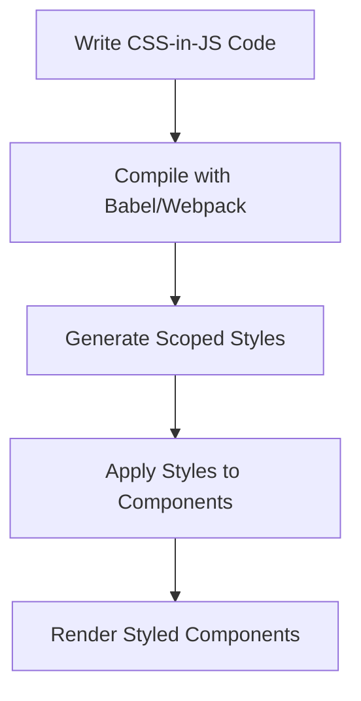

## 15.15 Advanced CSS Patterns with JavaScript

In the ever-evolving landscape of web development, the integration of CSS and JavaScript has led to innovative approaches for styling web applications. This section delves into advanced CSS patterns facilitated by JavaScript, focusing on CSS-in-JS, dynamic styling, and responsive design enhancements. We will explore popular libraries such as Styled Components, Emotion, and JSS, and provide insights into best practices for maintaining performance and scalability.

### Understanding CSS-in-JS

CSS-in-JS is a modern styling approach where CSS is written within JavaScript files. This technique allows developers to leverage the full power of JavaScript to create dynamic and maintainable styles. By embedding CSS directly into JavaScript, developers can take advantage of features like scoped styles, theming, and dynamic styling based on component state.

#### Advantages of CSS-in-JS

1. **Scoped Styles**: CSS-in-JS ensures that styles are scoped to specific components, reducing the risk of style conflicts and making it easier to maintain large codebases.
2. **Dynamic Styling**: With CSS-in-JS, styles can be dynamically generated based on component props or state, allowing for more flexible and interactive designs.
3. **Theming Support**: CSS-in-JS libraries often provide built-in support for theming, enabling developers to easily switch themes or customize styles globally.
4. **Improved Developer Experience**: By co-locating styles with components, developers can work more efficiently, as they don't need to switch between multiple files.

### Introducing CSS-in-JS Libraries

Several libraries have emerged to facilitate CSS-in-JS, each offering unique features and benefits. Let's explore three popular options: Styled Components, Emotion, and JSS.

#### Styled Components

[Styled Components](https://styled-components.com/) is a popular CSS-in-JS library that allows developers to write CSS directly within JavaScript files using tagged template literals. It provides a seamless way to create styled components with scoped styles.

```javascript
import styled from 'styled-components';

const Button = styled.button`
  background-color: ${props => props.primary ? 'blue' : 'gray'};
  color: white;
  padding: 10px 20px;
  border: none;
  border-radius: 5px;
  cursor: pointer;

  &:hover {
    background-color: ${props => props.primary ? 'darkblue' : 'darkgray'};
  }
`;

// Usage
<Button primary>Primary Button</Button>
<Button>Secondary Button</Button>
```

In this example, the `Button` component's styles are dynamically adjusted based on the `primary` prop, showcasing the power of dynamic styling with Styled Components.

#### Emotion

[Emotion](https://emotion.sh/) is another powerful CSS-in-JS library that offers high performance and flexibility. It provides both a styled API similar to Styled Components and a css prop for applying styles directly to components.

```javascript
/** @jsxImportSource @emotion/react */
import { css } from '@emotion/react';

const buttonStyle = css`
  background-color: blue;
  color: white;
  padding: 10px 20px;
  border: none;
  border-radius: 5px;
  cursor: pointer;

  &:hover {
    background-color: darkblue;
  }
`;

// Usage
<button css={buttonStyle}>Emotion Button</button>
```

Emotion's `css` prop allows for concise and expressive styling, making it a great choice for developers who prefer a more functional approach to styling.

#### JSS

[JSS](https://cssinjs.org/) is a library for writing CSS in JavaScript with a focus on performance and extensibility. It provides a powerful API for creating stylesheets and managing styles dynamically.

```javascript
import { createUseStyles } from 'react-jss';

const useStyles = createUseStyles({
  button: {
    backgroundColor: 'blue',
    color: 'white',
    padding: '10px 20px',
    border: 'none',
    borderRadius: '5px',
    cursor: 'pointer',
    '&:hover': {
      backgroundColor: 'darkblue',
    },
  },
});

function JSSButton() {
  const classes = useStyles();
  return <button className={classes.button}>JSS Button</button>;
}
```

JSS offers a structured approach to styling, making it ideal for large applications where performance and maintainability are critical.

### Dynamic Styling Based on Component State

One of the key benefits of CSS-in-JS is the ability to create dynamic styles based on component state. This allows developers to build interactive and responsive user interfaces that adapt to user interactions.

#### Example: Dynamic Button Styles

Let's create a button component that changes its appearance based on its state:

```javascript
import React, { useState } from 'react';
import styled from 'styled-components';

const DynamicButton = styled.button`
  background-color: ${props => (props.active ? 'green' : 'red')};
  color: white;
  padding: 10px 20px;
  border: none;
  border-radius: 5px;
  cursor: pointer;

  &:hover {
    background-color: ${props => (props.active ? 'darkgreen' : 'darkred')};
  }
`;

function App() {
  const [isActive, setIsActive] = useState(false);

  return (
    <DynamicButton active={isActive} onClick={() => setIsActive(!isActive)}>
      {isActive ? 'Active' : 'Inactive'}
    </DynamicButton>
  );
}
```

In this example, the `DynamicButton` component changes its background color based on the `active` state, providing visual feedback to users.

### Theme Management and Theming Patterns

Theming is an essential aspect of modern web applications, allowing for consistent styling across components and easy customization. CSS-in-JS libraries often provide robust theming support, enabling developers to define and manage themes efficiently.

#### Example: Theming with Styled Components

Styled Components offers a `ThemeProvider` component that allows developers to define and apply themes globally.

```javascript
import React from 'react';
import styled, { ThemeProvider } from 'styled-components';

const theme = {
  primaryColor: 'blue',
  secondaryColor: 'gray',
};

const ThemedButton = styled.button`
  background-color: ${props => props.theme.primaryColor};
  color: white;
  padding: 10px 20px;
  border: none;
  border-radius: 5px;
  cursor: pointer;

  &:hover {
    background-color: darkblue;
  }
`;

function App() {
  return (
    <ThemeProvider theme={theme}>
      <ThemedButton>Themed Button</ThemedButton>
    </ThemeProvider>
  );
}
```

In this example, the `ThemedButton` component uses the `primaryColor` from the theme, allowing for easy theme customization.

### Best Practices for Performance and Scalability

While CSS-in-JS offers numerous benefits, it's essential to follow best practices to maintain performance and scalability:

1. **Minimize Re-renders**: Ensure that styles are only recalculated when necessary to avoid unnecessary re-renders.
2. **Use Theming Wisely**: Define themes at a high level and avoid excessive theme switching to maintain performance.
3. **Optimize for Production**: Use tools like Babel and Webpack to optimize CSS-in-JS for production, reducing bundle size and improving load times.
4. **Leverage Server-Side Rendering (SSR)**: For better performance, consider using SSR to pre-render styles on the server, reducing the initial load time.

### Trade-offs Compared to Traditional CSS

While CSS-in-JS offers many advantages, it's important to consider the trade-offs compared to traditional CSS:

- **Learning Curve**: Developers may need to learn new libraries and patterns, which can increase the initial development time.
- **Tooling and Ecosystem**: CSS-in-JS relies on specific libraries, which may not be as mature or widely supported as traditional CSS tools.
- **Performance Overhead**: In some cases, CSS-in-JS can introduce performance overhead due to runtime style generation.

### Visualizing CSS-in-JS Workflow

To better understand the CSS-in-JS workflow, let's visualize the process using a Mermaid.js diagram:



**Diagram Description**: This flowchart illustrates the CSS-in-JS workflow, from writing code to rendering styled components. The process involves compiling the code, generating scoped styles, and applying them to components.

### Try It Yourself

Now that we've explored advanced CSS patterns with JavaScript, it's time to experiment with the concepts. Try modifying the code examples to create your own styled components, dynamic styles, and themes. Consider how you can apply these techniques to your projects to enhance the user experience.

### Knowledge Check

To reinforce your understanding of advanced CSS patterns with JavaScript, try answering the following questions:

## Advanced CSS Patterns with JavaScript Quiz



### What is CSS-in-JS?

- [x] A technique where CSS is written within JavaScript files
- [ ] A method for compiling CSS into JavaScript
- [ ] A library for converting CSS to JSON
- [ ] A framework for building JavaScript applications

> **Explanation:** CSS-in-JS is a technique where CSS is written within JavaScript files, allowing for dynamic and scoped styles.

### Which library uses tagged template literals for styling?

- [x] Styled Components
- [ ] Emotion
- [ ] JSS
- [ ] Bootstrap

> **Explanation:** Styled Components uses tagged template literals to define styles within JavaScript.

### What is a key benefit of CSS-in-JS?

- [x] Scoped styles
- [ ] Larger bundle sizes
- [ ] Increased complexity
- [ ] Reduced flexibility

> **Explanation:** CSS-in-JS provides scoped styles, reducing the risk of style conflicts.

### How can you apply a theme in Styled Components?

- [x] Using the ThemeProvider component
- [ ] By importing a CSS file
- [ ] Using inline styles
- [ ] By modifying the global stylesheet

> **Explanation:** The ThemeProvider component in Styled Components allows for applying themes globally.

### Which CSS-in-JS library offers a css prop for styling?

- [x] Emotion
- [ ] Styled Components
- [ ] JSS
- [ ] Tailwind CSS

> **Explanation:** Emotion provides a css prop for applying styles directly to components.

### What is a trade-off of using CSS-in-JS?

- [x] Performance overhead
- [ ] Reduced styling capabilities
- [ ] Lack of theming support
- [ ] Limited browser compatibility

> **Explanation:** CSS-in-JS can introduce performance overhead due to runtime style generation.

### How can you optimize CSS-in-JS for production?

- [x] Use Babel and Webpack for optimization
- [ ] Avoid using themes
- [ ] Write styles in separate CSS files
- [ ] Disable server-side rendering

> **Explanation:** Using Babel and Webpack helps optimize CSS-in-JS for production by reducing bundle size and improving load times.

### What is the purpose of server-side rendering in CSS-in-JS?

- [x] To pre-render styles on the server for better performance
- [ ] To increase the complexity of the application
- [ ] To disable client-side rendering
- [ ] To reduce the need for JavaScript

> **Explanation:** Server-side rendering pre-renders styles on the server, reducing the initial load time and improving performance.

### Which library focuses on performance and extensibility?

- [x] JSS
- [ ] Styled Components
- [ ] Emotion
- [ ] Bootstrap

> **Explanation:** JSS focuses on performance and extensibility, making it suitable for large applications.

### True or False: CSS-in-JS eliminates the need for traditional CSS.

- [ ] True
- [x] False

> **Explanation:** CSS-in-JS complements traditional CSS but does not eliminate the need for it, as both have their use cases and benefits.



### Embrace the Journey

Remember, this is just the beginning. As you progress, you'll build more complex and interactive web pages. Keep experimenting, stay curious, and enjoy the journey! By mastering advanced CSS patterns with JavaScript, you'll be well-equipped to create modern, responsive, and dynamic web applications.
