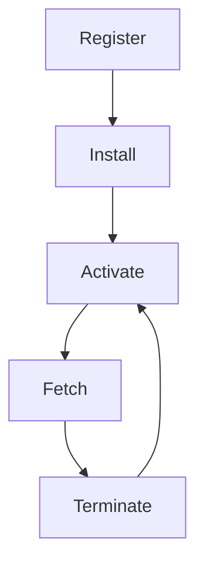

## 15.16.1 Understanding Service Workers

Service workers are a cornerstone technology in the development of Progressive Web Apps (PWAs). They enable web applications to function offline, perform background synchronization, and send push notifications, thereby bridging the gap between web and native applications. In this section, we will delve into the intricacies of service workers, their lifecycle, and how they can be leveraged to enhance web applications.

### What Are Service Workers?

Service workers are scripts that run in the background of a web application, separate from the main browser thread. They act as a proxy between the web application and the network, allowing developers to intercept network requests, cache resources, and manage push notifications. This capability makes them essential for creating PWAs that can function offline or in low-network conditions.

#### Key Features of Service Workers

- **Offline Support**: By caching resources, service workers enable applications to load even when the network is unavailable.
- **Background Sync**: They can synchronize data in the background, ensuring that the application is up-to-date.
- **Push Notifications**: Service workers can receive push messages from a server and display notifications to the user.
- **Network Interception**: They can intercept and modify network requests, allowing for fine-grained control over resource fetching.

### The Lifecycle of a Service Worker

Understanding the lifecycle of a service worker is crucial for effectively managing its behavior and updates. The lifecycle consists of several stages: registration, installation, activation, and termination.

#### 1. Registration

The first step in using a service worker is to register it with the browser. This is typically done in the main JavaScript file of the web application.

```javascript
if ('serviceWorker' in navigator) {
  window.addEventListener('load', () => {
    navigator.serviceWorker.register('/service-worker.js')
      .then(registration => {
        console.log('Service Worker registered with scope:', registration.scope);
      })
      .catch(error => {
        console.error('Service Worker registration failed:', error);
      });
  });
}
```

In this example, we check if the browser supports service workers and then register the service worker script (`service-worker.js`) when the page loads.

#### 2. Installation

Once registered, the service worker enters the installation phase. During this phase, the service worker can cache static assets required for offline functionality.

```javascript
self.addEventListener('install', event => {
  event.waitUntil(
    caches.open('v1').then(cache => {
      return cache.addAll([
        '/index.html',
        '/styles.css',
        '/script.js',
        '/image.png'
      ]);
    })
  );
});
```

In this code snippet, we open a cache named `v1` and add several resources to it. The `event.waitUntil()` method ensures that the installation phase does not complete until the caching is finished.

#### 3. Activation

After installation, the service worker moves to the activation phase. This is where old caches can be cleaned up, and the service worker takes control of the pages.

```javascript
self.addEventListener('activate', event => {
  const cacheWhitelist = ['v1'];
  event.waitUntil(
    caches.keys().then(cacheNames => {
      return Promise.all(
        cacheNames.map(cacheName => {
          if (!cacheWhitelist.includes(cacheName)) {
            return caches.delete(cacheName);
          }
        })
      );
    })
  );
});
```

Here, we define a whitelist of caches to keep and delete any others. This ensures that outdated caches do not consume unnecessary space.

#### 4. Fetching

Once activated, the service worker can intercept network requests and serve cached resources.

```javascript
self.addEventListener('fetch', event => {
  event.respondWith(
    caches.match(event.request)
      .then(response => {
        return response || fetch(event.request);
      })
  );
});
```

In this example, the service worker attempts to match the request with a cached response. If no match is found, it fetches the resource from the network.

#### 5. Termination

Service workers are terminated when not in use to save memory. They are restarted when needed, such as when a fetch event occurs.

### Security Considerations

Service workers require HTTPS due to their powerful capabilities. This ensures that the communication between the client and server is secure, preventing man-in-the-middle attacks.

### Caching Strategies

Service workers offer various caching strategies to optimize performance and offline capabilities:

- **Cache First**: Serve resources from the cache first, falling back to the network if not available.
- **Network First**: Attempt to fetch resources from the network first, using the cache as a fallback.
- **Cache Only**: Serve resources only from the cache.
- **Network Only**: Always fetch resources from the network.

### Example: Implementing a Cache-First Strategy

```javascript
self.addEventListener('fetch', event => {
  event.respondWith(
    caches.match(event.request).then(cachedResponse => {
      if (cachedResponse) {
        return cachedResponse;
      }
      return caches.open('dynamic-cache').then(cache => {
        return fetch(event.request).then(response => {
          cache.put(event.request, response.clone());
          return response;
        });
      });
    })
  );
});
```

In this example, we first attempt to serve the request from the cache. If not found, we fetch it from the network, cache it, and then return the response.

### Visualizing the Service Worker Lifecycle

To better understand the service worker lifecycle, let's visualize it using a Mermaid.js diagram:



This diagram illustrates the flow from registration to termination, highlighting the cyclical nature of service worker activation and fetching.

### Try It Yourself

Experiment with the code examples provided by modifying the caching strategies or adding new resources to the cache. Observe how these changes affect the application's offline capabilities.

### Further Reading

For more information on service workers, consider exploring the following resources:

- [MDN Web Docs: Service Workers](https://developer.mozilla.org/en-US/docs/Web/API/Service_Worker_API)
- [Google Developers: Service Workers: an Introduction](https://developers.google.com/web/fundamentals/primers/service-workers)

### Knowledge Check

- What are the main capabilities of service workers?
- How does the service worker lifecycle progress from registration to termination?
- Why is HTTPS required for service workers?
- What are some common caching strategies used with service workers?

### Summary

Service workers are a powerful tool for enhancing web applications with offline capabilities, background synchronization, and push notifications. By understanding their lifecycle and leveraging caching strategies, developers can create robust and responsive PWAs. Remember, this is just the beginning. As you progress, you'll build more complex and interactive web pages. Keep experimenting, stay curious, and enjoy the journey!

## Mastering Service Workers in Progressive Web Apps



### What is the primary role of service workers in web applications?

- [x] To enable offline capabilities and background tasks
- [ ] To enhance CSS styling
- [ ] To manage user authentication
- [ ] To optimize database queries

> **Explanation:** Service workers are primarily used to enable offline capabilities, manage background tasks, and handle push notifications in web applications.

### Which phase of the service worker lifecycle involves caching resources?

- [ ] Registration
- [x] Installation
- [ ] Activation
- [ ] Fetching

> **Explanation:** During the installation phase, service workers cache resources needed for offline functionality.

### Why is HTTPS required for service workers?

- [x] To ensure secure communication and prevent attacks
- [ ] To improve performance
- [ ] To enable faster loading times
- [ ] To support older browsers

> **Explanation:** HTTPS is required to ensure secure communication between the client and server, preventing man-in-the-middle attacks.

### What happens during the activation phase of a service worker?

- [ ] Resources are cached
- [x] Old caches are cleaned up
- [ ] Network requests are intercepted
- [ ] The service worker is registered

> **Explanation:** During the activation phase, old caches are cleaned up, and the service worker takes control of the pages.

### Which caching strategy serves resources from the cache first?

- [x] Cache First
- [ ] Network First
- [ ] Cache Only
- [ ] Network Only

> **Explanation:** The Cache First strategy serves resources from the cache first, falling back to the network if not available.

### What is the purpose of the `event.waitUntil()` method in service workers?

- [x] To delay the completion of an event until a promise is resolved
- [ ] To immediately terminate the service worker
- [ ] To register a new service worker
- [ ] To fetch resources from the network

> **Explanation:** The `event.waitUntil()` method delays the completion of an event until a promise is resolved, ensuring that tasks like caching are completed.

### Which of the following is NOT a feature of service workers?

- [ ] Offline Support
- [ ] Background Sync
- [ ] Push Notifications
- [x] Direct DOM Manipulation

> **Explanation:** Service workers do not have direct access to the DOM; they operate in a separate thread.

### How can service workers enhance performance in web applications?

- [x] By caching resources and reducing network requests
- [ ] By increasing the number of HTTP requests
- [ ] By modifying HTML structure
- [ ] By directly accessing the database

> **Explanation:** Service workers enhance performance by caching resources, which reduces the need for network requests.

### What is the main advantage of using a Network First caching strategy?

- [ ] Faster initial load times
- [x] Always fetching the latest data
- [ ] Reduced server load
- [ ] Improved security

> **Explanation:** The Network First strategy ensures that the application always fetches the latest data from the network, using the cache as a fallback.

### True or False: Service workers can operate without an internet connection.

- [x] True
- [ ] False

> **Explanation:** Service workers can operate offline by serving cached resources, allowing web applications to function without an internet connection.


