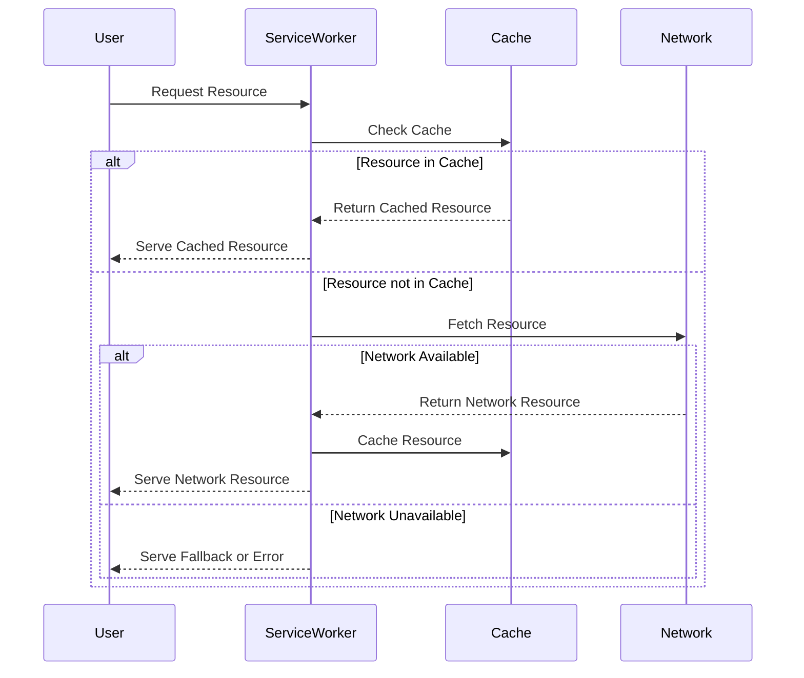

## 15.16.2 Caching Strategies with Service Workers

In the realm of Progressive Web Apps (PWAs), service workers play a pivotal role in enhancing performance and providing offline capabilities. By intercepting network requests, service workers can cache resources, ensuring that users have a seamless experience even when offline. In this section, we'll delve into various caching strategies that can be implemented using service workers, discuss best practices, and explore tools like Workbox to simplify the process.

### Understanding Service Workers

Service workers are scripts that run in the background, separate from the main browser thread. They enable features such as push notifications and background sync, but one of their most powerful capabilities is intercepting network requests to manage caching. This allows developers to control how resources are fetched and cached, providing a more responsive and reliable user experience.

### Key Caching Strategies

Let's explore the primary caching strategies that can be employed using service workers:

#### 1. Cache First

**Intent:** Serve resources from the cache if available; otherwise, fetch from the network.

The Cache First strategy is ideal for assets that don't change frequently, such as images, fonts, or static HTML files. By serving these resources from the cache, we reduce network latency and improve load times.

**Implementation Example:**

```javascript
self.addEventListener('fetch', (event) => {
  event.respondWith(
    caches.match(event.request).then((cachedResponse) => {
      return cachedResponse || fetch(event.request);
    })
  );
});
```

**Use Case:** Static assets like logos, CSS files, and JavaScript libraries.

#### 2. Network First

**Intent:** Attempt to fetch resources from the network first; fall back to the cache if the network is unavailable.

The Network First strategy is suitable for dynamic content that changes frequently, such as API responses or user-specific data. This ensures that users receive the most up-to-date information.

**Implementation Example:**

```javascript
self.addEventListener('fetch', (event) => {
  event.respondWith(
    fetch(event.request).then((networkResponse) => {
      return networkResponse || caches.match(event.request);
    }).catch(() => caches.match(event.request))
  );
});
```

**Use Case:** News articles, user profiles, or any content that updates regularly.

#### 3. Stale-While-Revalidate

**Intent:** Serve resources from the cache while simultaneously fetching an update from the network.

The Stale-While-Revalidate strategy provides a balance between performance and freshness. Users get a fast response from the cache, while the service worker fetches an updated version in the background.

**Implementation Example:**

```javascript
self.addEventListener('fetch', (event) => {
  event.respondWith(
    caches.open('dynamic-cache').then((cache) => {
      return cache.match(event.request).then((cachedResponse) => {
        const networkFetch = fetch(event.request).then((networkResponse) => {
          cache.put(event.request, networkResponse.clone());
          return networkResponse;
        });
        return cachedResponse || networkFetch;
      });
    })
  );
});
```

**Use Case:** Content that benefits from being quickly available but also needs regular updates, like social media feeds.

#### 4. Cache Only

**Intent:** Serve resources exclusively from the cache.

The Cache Only strategy is rarely used on its own but can be useful for resources that are guaranteed to be available offline and never change.

**Implementation Example:**

```javascript
self.addEventListener('fetch', (event) => {
  event.respondWith(caches.match(event.request));
});
```

**Use Case:** Offline-first applications where certain resources are pre-cached during the installation phase.

### Using Workbox for Caching Strategies

[Workbox](https://developers.google.com/web/tools/workbox) is a set of libraries and tools that simplify the process of managing service workers and caching strategies. It abstracts many complexities, allowing developers to implement robust caching strategies with minimal code.

**Example with Workbox:**

```javascript
import { registerRoute } from 'workbox-routing';
import { CacheFirst, NetworkFirst, StaleWhileRevalidate } from 'workbox-strategies';

// Cache First for images
registerRoute(
  ({ request }) => request.destination === 'image',
  new CacheFirst({
    cacheName: 'images-cache',
    plugins: [
      // Additional plugins can be added here
    ],
  })
);

// Network First for API calls
registerRoute(
  ({ url }) => url.pathname.startsWith('/api/'),
  new NetworkFirst({
    cacheName: 'api-cache',
    plugins: [
      // Additional plugins can be added here
    ],
  })
);

// Stale-While-Revalidate for CSS and JS
registerRoute(
  ({ request }) => request.destination === 'style' || request.destination === 'script',
  new StaleWhileRevalidate({
    cacheName: 'static-resources',
    plugins: [
      // Additional plugins can be added here
    ],
  })
);
```

### Best Practices for Selecting Caching Strategies

When selecting a caching strategy, consider the following best practices:

- **Understand Your Content:** Analyze how often your content changes and choose a strategy that balances performance with freshness.
- **Prioritize Critical Resources:** Ensure that critical resources, such as the main HTML file, are always available, even offline.
- **Use Workbox Plugins:** Leverage Workbox plugins for additional features like cache expiration and request routing.
- **Test Offline Scenarios:** Regularly test your application in offline scenarios to ensure that caching strategies are working as expected.

### Cache Invalidation and Updates

Cache invalidation is a crucial aspect of caching strategies. Without proper invalidation, users might see outdated content. Here are some considerations:

- **Versioning:** Use versioning for cache names to force updates when deploying new versions of your application.
- **Cache Expiration:** Implement cache expiration policies to automatically remove old entries.
- **Manual Invalidation:** Provide mechanisms to manually invalidate caches when necessary, such as a "Clear Cache" button in your application settings.

### Visualizing Caching Strategies

To better understand how these caching strategies work, let's visualize the flow of requests and responses using a sequence diagram.



**Diagram Explanation:** This sequence diagram illustrates the decision-making process of a service worker when handling a resource request. It checks the cache first, then the network, and finally serves the resource to the user.

### Knowledge Check

- What are the four main caching strategies used with service workers?
- How does the Stale-While-Revalidate strategy balance performance and freshness?
- Why is cache invalidation important, and what are some methods to achieve it?
- How can Workbox simplify the implementation of caching strategies?

### Try It Yourself

Experiment with the provided code examples by modifying the caching strategies. For instance, try switching a Cache First strategy to Network First and observe the changes in behavior. Consider using Workbox to implement these strategies in a real-world project.

### Conclusion

Caching strategies with service workers are essential for building performant and reliable Progressive Web Apps. By understanding and implementing these strategies, we can ensure that our applications provide a seamless user experience, even in challenging network conditions. Remember, this is just the beginning. As you progress, you'll build more complex and interactive web pages. Keep experimenting, stay curious, and enjoy the journey!

## Mastering Caching Strategies with Service Workers



### What is the primary benefit of the Cache First strategy?

- [x] It reduces network latency by serving resources from the cache.
- [ ] It always provides the most up-to-date content.
- [ ] It is suitable for dynamic content.
- [ ] It requires no cache management.

> **Explanation:** The Cache First strategy serves resources from the cache if available, reducing network latency and improving load times.

### Which caching strategy is best for frequently changing content?

- [ ] Cache First
- [x] Network First
- [ ] Cache Only
- [ ] Stale-While-Revalidate

> **Explanation:** The Network First strategy is suitable for dynamic content that changes frequently, ensuring users receive the most up-to-date information.

### How does the Stale-While-Revalidate strategy work?

- [x] It serves resources from the cache while fetching an update from the network.
- [ ] It only serves resources from the network.
- [ ] It never updates cached resources.
- [ ] It serves resources exclusively from the cache.

> **Explanation:** The Stale-While-Revalidate strategy provides a fast response from the cache while fetching an updated version in the background.

### What tool can simplify the implementation of caching strategies?

- [ ] Babel
- [ ] Webpack
- [x] Workbox
- [ ] ESLint

> **Explanation:** Workbox is a set of libraries and tools that simplify the process of managing service workers and caching strategies.

### What is a key consideration when implementing caching strategies?

- [x] Cache invalidation
- [ ] Using only one strategy
- [ ] Avoiding the use of service workers
- [ ] Disabling offline access

> **Explanation:** Cache invalidation is crucial to ensure users do not see outdated content and involves strategies like versioning and expiration.

### Which strategy serves resources exclusively from the cache?

- [x] Cache Only
- [ ] Network First
- [ ] Stale-While-Revalidate
- [ ] Cache First

> **Explanation:** The Cache Only strategy serves resources exclusively from the cache, suitable for resources that are guaranteed to be available offline.

### What is a benefit of using Workbox?

- [x] It abstracts complexities in managing service workers.
- [ ] It increases network latency.
- [ ] It requires manual cache management.
- [ ] It only supports Cache First strategy.

> **Explanation:** Workbox abstracts many complexities, allowing developers to implement robust caching strategies with minimal code.

### Why is cache expiration important?

- [x] It automatically removes old entries from the cache.
- [ ] It prevents any caching from occurring.
- [ ] It ensures resources are never updated.
- [ ] It disables offline capabilities.

> **Explanation:** Cache expiration policies help automatically remove old entries, ensuring that the cache does not become stale.

### What is a common use case for the Cache First strategy?

- [x] Static assets like logos and CSS files
- [ ] Dynamic content like news articles
- [ ] User-specific data
- [ ] API responses

> **Explanation:** The Cache First strategy is ideal for assets that don't change frequently, such as images, fonts, or static HTML files.

### True or False: Service workers can intercept network requests to manage caching.

- [x] True
- [ ] False

> **Explanation:** Service workers can intercept network requests, allowing developers to control how resources are fetched and cached.


