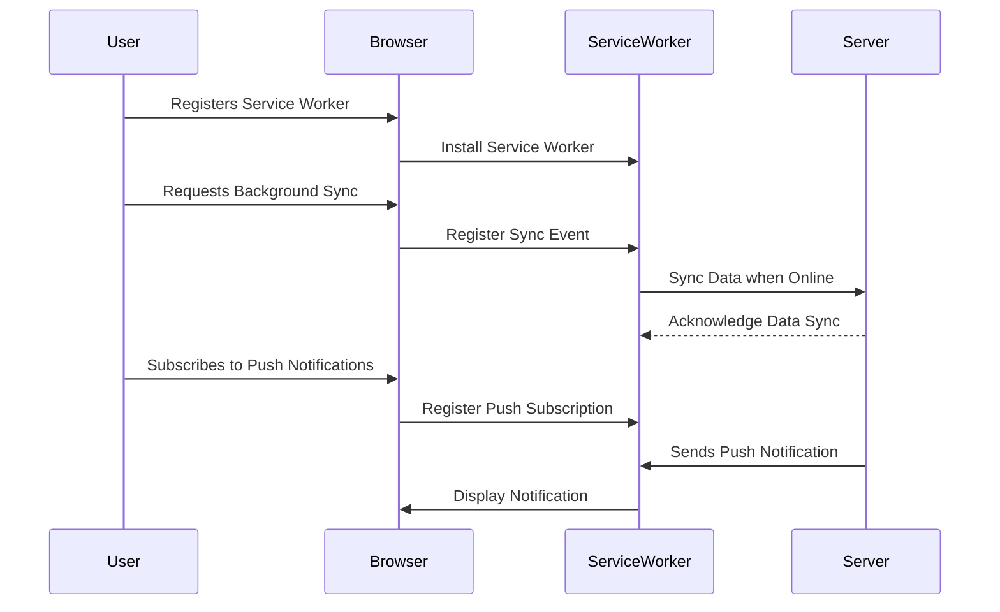

## 15.16.3 Background Sync and Push Notifications

In the realm of Progressive Web Apps (PWAs), background sync and push notifications play pivotal roles in enhancing user experience by ensuring timely updates and interactions. These features allow applications to function seamlessly even when the user is offline or not actively using the app. Let's delve into how these technologies work, their implementation, and best practices for maximizing their potential.

### Understanding Background Sync

Background sync is a powerful feature that allows web applications to defer actions until the user has a stable internet connection. This is particularly useful for tasks that require network connectivity, such as sending messages, uploading photos, or syncing data.

#### How Background Sync Works

The concept of background sync revolves around the idea of reliability. When a user performs an action that requires network access, the application can register a sync event. The service worker, a script that runs in the background, listens for this event and attempts to complete the action when the network is available.

**Key Benefits:**
- **Improved Reliability:** Ensures that actions are completed even if the user loses connectivity.
- **Enhanced User Experience:** Users can interact with the app without worrying about network issues.
- **Resource Efficiency:** Reduces the need for constant polling, saving battery and bandwidth.

#### Implementing Background Sync

To implement background sync, you need to register a sync event in your service worker. Here's a step-by-step guide with code examples:

1. **Register the Service Worker:**

   First, ensure that your service worker is registered in your main JavaScript file.

   ```javascript
   if ('serviceWorker' in navigator) {
     navigator.serviceWorker.register('/service-worker.js')
       .then(registration => {
         console.log('Service Worker registered with scope:', registration.scope);
       })
       .catch(error => {
         console.error('Service Worker registration failed:', error);
       });
   }
   ```

2. **Request Background Sync Permission:**

   Before using background sync, you need to request permission from the user.

   ```javascript
   navigator.serviceWorker.ready.then(registration => {
     return registration.sync.register('mySyncTag');
   }).then(() => {
     console.log('Background Sync registered');
   }).catch(err => {
     console.error('Background Sync registration failed:', err);
   });
   ```

3. **Handle the Sync Event in the Service Worker:**

   In your service worker file, listen for the sync event and perform the necessary actions.

   ```javascript
   self.addEventListener('sync', event => {
     if (event.tag === 'mySyncTag') {
       event.waitUntil(syncData());
     }
   });

   function syncData() {
     // Perform data synchronization tasks here
     return fetch('/sync-endpoint', {
       method: 'POST',
       body: JSON.stringify({ data: 'yourData' }),
       headers: {
         'Content-Type': 'application/json'
       }
     }).then(response => {
       if (!response.ok) {
         throw new Error('Network response was not ok');
       }
       return response.json();
     }).then(data => {
       console.log('Data synced successfully:', data);
     }).catch(error => {
       console.error('Data sync failed:', error);
     });
   }
   ```

**Try It Yourself:**

Experiment with the code by modifying the `syncData` function to handle different types of data or endpoints. Test how the application behaves when offline and then reconnects.

### Exploring Push Notifications

Push notifications are messages sent from a server to a client application, even when the app is not actively running. They are a crucial tool for re-engaging users and delivering timely information.

#### The Push API

The Push API allows web applications to receive messages pushed from a server, even when the application is not open. This is achieved through a combination of service workers and the Push API.

**Key Benefits:**
- **User Engagement:** Keeps users informed and engaged with timely updates.
- **Increased Retention:** Encourages users to return to the app.
- **Customizable:** Allows for personalized messages based on user preferences.

#### Implementing Push Notifications

Implementing push notifications involves several steps, including setting up a push service, subscribing users, and handling push events.

1. **Subscribe to Push Notifications:**

   Request permission from the user and subscribe to push notifications.

   ```javascript
   function subscribeUserToPush() {
     return navigator.serviceWorker.register('/service-worker.js')
       .then(registration => {
         const subscribeOptions = {
           userVisibleOnly: true,
           applicationServerKey: urlB64ToUint8Array(
             'YOUR_PUBLIC_VAPID_KEY'
           )
         };

         return registration.pushManager.subscribe(subscribeOptions);
       })
       .then(pushSubscription => {
         console.log('Received PushSubscription:', JSON.stringify(pushSubscription));
         return pushSubscription;
       });
   }
   ```

2. **Handle Push Events in the Service Worker:**

   Listen for push events and display notifications.

   ```javascript
   self.addEventListener('push', event => {
     const data = event.data.json();
     const options = {
       body: data.body,
       icon: 'images/icon.png',
       badge: 'images/badge.png'
     };

     event.waitUntil(
       self.registration.showNotification(data.title, options)
     );
   });
   ```

3. **Send Push Notifications from the Server:**

   Use a server-side script to send push notifications to subscribed users.

   ```javascript
   const webPush = require('web-push');

   const pushSubscription = {
     endpoint: 'https://fcm.googleapis.com/fcm/send/...',
     keys: {
       auth: '...',
       p256dh: '...'
     }
   };

   const payload = JSON.stringify({
     title: 'Hello!',
     body: 'You have a new message.'
   });

   webPush.sendNotification(pushSubscription, payload)
     .then(response => {
       console.log('Push notification sent:', response);
     })
     .catch(error => {
       console.error('Error sending push notification:', error);
     });
   ```

**Try It Yourself:**

Modify the server-side script to send different types of notifications. Experiment with different payloads and observe how they appear on the client side.

### Best Practices for User Engagement and Privacy

When implementing background sync and push notifications, it's crucial to follow best practices to ensure a positive user experience and respect user privacy.

#### User Engagement Strategies

- **Personalization:** Tailor notifications to individual user preferences and behaviors.
- **Timing:** Send notifications at appropriate times to avoid disturbing users.
- **Relevance:** Ensure that notifications provide value and are relevant to the user.

#### Privacy Considerations

- **Permission Requests:** Clearly explain why permissions are needed and how they will be used.
- **User Opt-In:** Allow users to opt-in to notifications and background sync, and provide easy options to opt-out.
- **Data Security:** Securely handle any data transmitted during sync or notifications.

### Permissions and User Opt-In

Obtaining user permission is a critical aspect of implementing background sync and push notifications. Users should have control over what information they receive and when.

#### Requesting Permissions

- **Transparency:** Be transparent about what permissions are being requested and why.
- **Contextual Prompts:** Request permissions in context, such as when a user performs an action that would benefit from notifications.

#### Managing User Preferences

- **Settings Page:** Provide a settings page where users can manage their notification preferences.
- **Feedback Mechanism:** Allow users to provide feedback on notifications to improve relevance and timing.

### Visualizing Background Sync and Push Notification Workflow

To better understand how background sync and push notifications work, let's visualize the workflow using a sequence diagram.



**Diagram Description:**

- **Service Worker Registration:** The user registers a service worker, which is installed by the browser.
- **Background Sync:** The user requests background sync, and the service worker registers a sync event to be triggered when the device is online.
- **Push Notifications:** The user subscribes to push notifications, and the server sends notifications to the service worker, which displays them to the user.

### Knowledge Check

To reinforce your understanding of background sync and push notifications, consider the following questions:

- What are the key benefits of using background sync in PWAs?
- How does the Push API enhance user engagement?
- What are some best practices for requesting user permissions for notifications?

### Summary

Background sync and push notifications are essential features for modern Progressive Web Apps, providing reliability and engagement. By implementing these features thoughtfully, you can enhance user experience while respecting privacy and preferences. Remember to keep experimenting and refining your approach to maximize the potential of these powerful tools.

## Mastering Background Sync and Push Notifications in PWAs



### What is the primary benefit of background sync in PWAs?

- [x] Ensures actions are completed when the network is available
- [ ] Reduces application size
- [ ] Increases battery consumption
- [ ] Enhances graphics performance

> **Explanation:** Background sync ensures that actions requiring network access are completed when the network is available, improving reliability.

### Which API is used for implementing push notifications in web applications?

- [x] Push API
- [ ] Fetch API
- [ ] Geolocation API
- [ ] WebRTC API

> **Explanation:** The Push API is used to implement push notifications in web applications.

### What should be considered when requesting user permissions for notifications?

- [x] Transparency and context
- [ ] Only the application size
- [ ] Graphics performance
- [ ] Battery life

> **Explanation:** Transparency and context are important when requesting user permissions to ensure users understand why permissions are needed.

### How can push notifications increase user engagement?

- [x] By delivering timely and relevant information
- [ ] By reducing application size
- [ ] By enhancing graphics performance
- [ ] By increasing battery consumption

> **Explanation:** Push notifications increase user engagement by delivering timely and relevant information to users.

### What is a best practice for managing user preferences for notifications?

- [x] Provide a settings page for managing preferences
- [ ] Automatically enable all notifications
- [ ] Ignore user feedback
- [ ] Request permissions without explanation

> **Explanation:** Providing a settings page allows users to manage their notification preferences, enhancing user control and satisfaction.

### What is the role of a service worker in background sync?

- [x] Listens for sync events and performs actions when online
- [ ] Enhances graphics performance
- [ ] Reduces application size
- [ ] Increases battery consumption

> **Explanation:** The service worker listens for sync events and performs actions when the device is online, ensuring reliability.

### Which of the following is a key benefit of push notifications?

- [x] Increased user retention
- [ ] Reduced application size
- [ ] Enhanced graphics performance
- [ ] Increased battery consumption

> **Explanation:** Push notifications increase user retention by encouraging users to return to the app with timely updates.

### What should be included in a push notification payload?

- [x] Title and body
- [ ] Only graphics data
- [ ] Application size
- [ ] Battery consumption

> **Explanation:** A push notification payload typically includes a title and body to convey the message to the user.

### How does background sync improve resource efficiency?

- [x] By reducing the need for constant polling
- [ ] By increasing application size
- [ ] By enhancing graphics performance
- [ ] By increasing battery consumption

> **Explanation:** Background sync reduces the need for constant polling, saving battery and bandwidth.

### True or False: Push notifications can be sent even when the application is not open.

- [x] True
- [ ] False

> **Explanation:** Push notifications can be sent to the client application even when it is not open, allowing for timely updates.



Remember, this is just the beginning. As you progress, you'll build more complex and interactive web pages. Keep experimenting, stay curious, and enjoy the journey!
