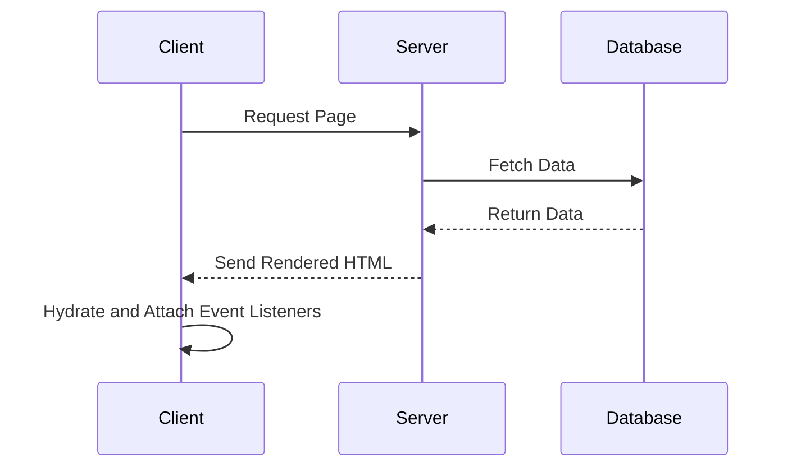

## 15.17 Server-Side Rendering (SSR) and Isomorphic JavaScript

In the ever-evolving landscape of web development, achieving optimal performance and search engine optimization (SEO) is crucial. Server-Side Rendering (SSR) and Isomorphic JavaScript play pivotal roles in enhancing these aspects. This section will delve into the concepts of SSR and Isomorphic JavaScript, explore their benefits, and provide practical examples using popular frameworks like Next.js, Nuxt.js, and Angular Universal.

### Understanding Server-Side Rendering (SSR)

**Server-Side Rendering (SSR)** is a technique where the HTML content of a web page is generated on the server and sent to the client. This contrasts with Client-Side Rendering (CSR), where the browser constructs the HTML using JavaScript after receiving a minimal HTML shell. SSR offers several benefits:

- **Improved SEO**: Search engines can easily index server-rendered content, enhancing visibility.
- **Faster Initial Load**: Users receive a fully rendered page, reducing the time to first meaningful paint.
- **Better Performance on Low-Powered Devices**: Offloading rendering to the server reduces the computational load on the client.

### Isomorphic/Universal JavaScript

**Isomorphic JavaScript**, also known as **Universal JavaScript**, refers to JavaScript applications that can run both on the server and the client. This dual capability allows developers to share code between the server and client, streamlining development and maintenance.

#### Benefits of Isomorphic JavaScript

- **Code Reusability**: Write once, run anywhere—on both server and client.
- **Consistent User Experience**: Seamless transitions between server-rendered and client-rendered content.
- **Enhanced Performance**: Initial rendering on the server, followed by client-side updates.

### Frameworks for SSR and Isomorphic JavaScript

Let's explore how popular frameworks implement SSR and Isomorphic JavaScript.

#### Next.js for React

[Next.js](https://nextjs.org/) is a React framework that enables SSR and static site generation (SSG). It simplifies the process of building isomorphic applications with React.

**Key Features of Next.js:**

- **Automatic Code Splitting**: Only the necessary code is loaded for each page.
- **Built-in Routing**: File-based routing system.
- **API Routes**: Create API endpoints alongside your pages.

**Example: Basic Next.js SSR Setup**

```javascript
// pages/index.js
import React from 'react';

const Home = ({ data }) => (
  <div>
    <h1>Welcome to Next.js SSR</h1>
    <p>Data fetched from server: {data}</p>
  </div>
);

export async function getServerSideProps() {
  // Fetch data from an API or database
  const res = await fetch('https://api.example.com/data');
  const data = await res.json();

  return { props: { data } };
}

export default Home;
```

In this example, `getServerSideProps` is a Next.js function that fetches data on the server before rendering the page.

#### Nuxt.js for Vue.js

[Nuxt.js](https://nuxtjs.org/) is a framework for Vue.js that provides SSR capabilities, making it easy to build isomorphic applications.

**Key Features of Nuxt.js:**

- **Automatic Code Splitting**: Optimizes loading times.
- **Powerful Routing System**: Based on file structure.
- **Static Site Generation**: Pre-render pages at build time.

**Example: Basic Nuxt.js SSR Setup**

```javascript
// pages/index.vue
<template>
  <div>
    <h1>Welcome to Nuxt.js SSR</h1>
    <p>Data fetched from server: {{ data }}</p>
  </div>
</template>

<script>
export default {
  async asyncData({ $axios }) {
    const data = await $axios.$get('https://api.example.com/data');
    return { data };
  }
}
</script>
```

In this example, `asyncData` is a Nuxt.js method that fetches data on the server before rendering the page.

#### Angular Universal

[Angular Universal](https://angular.io/guide/universal) extends Angular's capabilities to support SSR, enabling the creation of isomorphic applications.

**Key Features of Angular Universal:**

- **Pre-rendering**: Generate static HTML at build time.
- **Improved SEO**: Server-rendered pages are easily indexed.
- **Faster Initial Load**: Serve pre-rendered HTML to users.

**Example: Basic Angular Universal Setup**

```typescript
// server.ts
import 'zone.js/dist/zone-node';
import { ngExpressEngine } from '@nguniversal/express-engine';
import { AppServerModule } from './src/main.server';
import * as express from 'express';

const app = express();

app.engine('html', ngExpressEngine({
  bootstrap: AppServerModule,
}));

app.set('view engine', 'html');
app.set('views', 'dist/browser');

app.get('*', (req, res) => {
  res.render('index', { req });
});

app.listen(4000, () => {
  console.log('Angular Universal server listening on http://localhost:4000');
});
```

This example sets up an Express server to handle SSR with Angular Universal.

### Challenges in SSR and Isomorphic JavaScript

While SSR and Isomorphic JavaScript offer numerous benefits, they also present challenges:

- **Data Fetching**: Coordinating data fetching on both server and client can be complex.
- **State Hydration**: Ensuring the client-side application picks up where the server left off.
- **Performance Overhead**: Server-side rendering can increase server load.

### Performance Implications and Best Practices

To maximize the benefits of SSR and Isomorphic JavaScript, consider the following best practices:

- **Optimize Data Fetching**: Use caching strategies to reduce server load.
- **Minimize JavaScript Payloads**: Use code splitting and lazy loading.
- **Monitor Server Performance**: Use tools like New Relic or Datadog to track server performance.
- **Implement Caching**: Cache rendered pages to reduce server rendering time.

### Visualizing SSR and Isomorphic JavaScript

Below is a diagram illustrating the flow of data and rendering in an SSR application.



**Diagram Description**: This sequence diagram shows the process of SSR, where the client requests a page, the server fetches data from a database, renders the HTML, and sends it back to the client. The client then hydrates the page and attaches event listeners.

### Conclusion

Server-Side Rendering and Isomorphic JavaScript are powerful techniques for enhancing web application performance and SEO. By leveraging frameworks like Next.js, Nuxt.js, and Angular Universal, developers can create fast, SEO-friendly, and maintainable applications. While challenges exist, adopting best practices can mitigate these issues and lead to successful implementations.

### Knowledge Check

To reinforce your understanding, try answering the following questions:

## Mastering SSR and Isomorphic JavaScript: Quiz



### What is the primary benefit of Server-Side Rendering (SSR)?

- [x] Improved SEO and faster initial load
- [ ] Reduced server load
- [ ] Easier client-side development
- [ ] Increased client-side interactivity

> **Explanation:** SSR improves SEO by rendering content on the server, making it easier for search engines to index, and provides a faster initial load by sending fully rendered HTML to the client.

### Which framework is used for SSR in React applications?

- [x] Next.js
- [ ] Nuxt.js
- [ ] Angular Universal
- [ ] Express.js

> **Explanation:** Next.js is a popular framework for implementing SSR in React applications.

### What is Isomorphic JavaScript?

- [x] JavaScript that runs on both the server and client
- [ ] JavaScript that only runs on the server
- [ ] JavaScript that only runs on the client
- [ ] JavaScript that is compiled to another language

> **Explanation:** Isomorphic JavaScript refers to JavaScript applications that can run on both the server and the client, allowing for code reusability and consistent user experiences.

### What is a common challenge when implementing SSR?

- [x] Data fetching and state hydration
- [ ] Increased client-side interactivity
- [ ] Simplified server architecture
- [ ] Reduced server load

> **Explanation:** Coordinating data fetching and ensuring proper state hydration between server and client are common challenges in SSR implementations.

### Which method is used in Next.js to fetch data on the server?

- [x] getServerSideProps
- [ ] asyncData
- [ ] ngExpressEngine
- [ ] fetchData

> **Explanation:** `getServerSideProps` is a Next.js method used to fetch data on the server before rendering a page.

### What does Angular Universal provide for Angular applications?

- [x] Server-Side Rendering capabilities
- [ ] Client-Side Rendering capabilities
- [ ] Static Site Generation
- [ ] Improved client-side interactivity

> **Explanation:** Angular Universal extends Angular's capabilities to support Server-Side Rendering, enabling isomorphic applications.

### Which of the following is a benefit of Isomorphic JavaScript?

- [x] Code reusability between server and client
- [ ] Increased server load
- [ ] Reduced SEO performance
- [ ] Simplified client-side development

> **Explanation:** Isomorphic JavaScript allows for code reusability between the server and client, streamlining development and maintenance.

### What is the role of the `asyncData` method in Nuxt.js?

- [x] Fetch data on the server before rendering
- [ ] Fetch data on the client after rendering
- [ ] Handle client-side routing
- [ ] Manage application state

> **Explanation:** The `asyncData` method in Nuxt.js is used to fetch data on the server before rendering a page.

### What is a best practice for optimizing SSR performance?

- [x] Implement caching strategies
- [ ] Increase JavaScript payloads
- [ ] Avoid code splitting
- [ ] Reduce server monitoring

> **Explanation:** Implementing caching strategies is a best practice for optimizing SSR performance, as it reduces server rendering time.

### True or False: SSR can improve the initial load time of a web application.

- [x] True
- [ ] False

> **Explanation:** True. SSR can improve the initial load time by sending fully rendered HTML to the client, reducing the time to first meaningful paint.



Remember, this is just the beginning. As you progress, you'll build more complex and interactive web pages. Keep experimenting, stay curious, and enjoy the journey!
