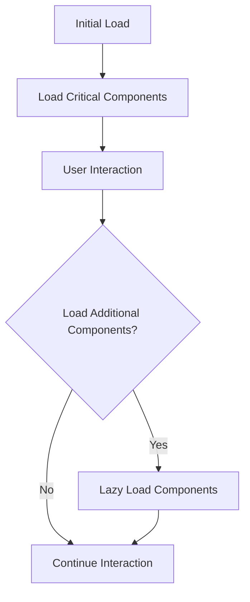

## 15.18 Code Splitting and Lazy Loading in SPAs

Single-page applications (SPAs) have become a cornerstone of modern web development, offering seamless user experiences by loading content dynamically without refreshing the entire page. However, as SPAs grow in complexity, they can become bloated with JavaScript, leading to longer load times and decreased performance. This is where code splitting and lazy loading come into play, providing strategies to optimize load times and enhance user experience.

### Understanding Code Splitting

**Code splitting** is a technique that allows you to break down your application's code into smaller chunks, which can be loaded on demand. This means that instead of loading the entire application at once, you only load the parts that are necessary for the current view. This approach not only reduces the initial load time but also improves the overall performance of the application.

#### Benefits of Code Splitting

1. **Improved Load Times**: By loading only the necessary code, the initial load time of the application is significantly reduced.
2. **Enhanced User Experience**: Users experience faster interactions as they navigate through the application.
3. **Efficient Resource Utilization**: Reduces bandwidth usage by loading only what is needed.
4. **Scalability**: Makes it easier to manage and scale large applications by organizing code into manageable chunks.

### Implementing Code Splitting in React

React provides built-in support for code splitting through dynamic imports and the `React.lazy` and `Suspense` components. Let's explore how to implement these techniques.

#### Dynamic Imports with React.lazy

The `React.lazy` function allows you to render a dynamic import as a regular component. This is particularly useful for loading components only when they are needed.

```javascript
import React, { Suspense } from 'react';

// Lazy load the component
const LazyComponent = React.lazy(() => import('./LazyComponent'));

function App() {
  return (
    <div>
      <h1>Welcome to My SPA</h1>
      <Suspense fallback={<div>Loading...</div>}>
        <LazyComponent />
      </Suspense>
    </div>
  );
}

export default App;
```

**Explanation**:
- **React.lazy**: This function takes a function that returns a dynamic import and returns a React component.
- **Suspense**: This component is used to wrap the lazy-loaded component and provides a fallback UI (e.g., a loading spinner) while the component is being loaded.

#### Try It Yourself

Experiment with the above code by creating a new React component and lazy loading it. Change the fallback UI to see how it affects the user experience.

### Lazy Loading Routes in Vue.js

Vue.js offers a straightforward way to implement lazy loading for routes using dynamic imports. This is particularly useful for SPAs where different views are loaded as the user navigates.

#### Example: Lazy Loading Routes in Vue.js

```javascript
import Vue from 'vue';
import Router from 'vue-router';

Vue.use(Router);

const Home = () => import('./views/Home.vue');
const About = () => import('./views/About.vue');

const router = new Router({
  routes: [
    { path: '/', component: Home },
    { path: '/about', component: About }
  ]
});

export default router;
```

**Explanation**:
- **Dynamic Imports**: The `import()` function is used to dynamically load components when the route is accessed.
- **Vue Router**: This setup ensures that only the necessary components are loaded, improving performance.

#### Try It Yourself

Modify the routes to include additional views and observe how the application behaves when navigating between routes.

### Lazy Loading in Angular

Angular provides a robust mechanism for lazy loading modules, which is essential for large applications with multiple features.

#### Example: Lazy Loading Modules in Angular

```typescript
import { NgModule } from '@angular/core';
import { RouterModule, Routes } from '@angular/router';

const routes: Routes = [
  { path: '', loadChildren: () => import('./home/home.module').then(m => m.HomeModule) },
  { path: 'about', loadChildren: () => import('./about/about.module').then(m => m.AboutModule) }
];

@NgModule({
  imports: [RouterModule.forRoot(routes)],
  exports: [RouterModule]
})
export class AppRoutingModule { }
```

**Explanation**:
- **loadChildren**: This property is used to specify the module to be lazy-loaded. It uses dynamic imports to load the module only when the route is accessed.
- **Angular Modules**: Organizing features into modules allows for efficient lazy loading.

#### Try It Yourself

Create additional modules and configure lazy loading for them. Monitor the network requests to see how modules are loaded on demand.

### Best Practices for Code Splitting and Lazy Loading

1. **Identify Critical Paths**: Determine which parts of your application are critical for initial load and which can be deferred.
2. **Optimize Dependencies**: Ensure that dependencies are not duplicated across chunks to avoid unnecessary bloat.
3. **Monitor Performance**: Use tools like Lighthouse and Webpack Bundle Analyzer to monitor and optimize the performance of your application.
4. **Test Thoroughly**: Ensure that lazy-loaded components and routes are tested for both functionality and performance.
5. **Keep User Experience in Mind**: Provide meaningful fallback UIs to keep users engaged while content is loading.

### Visualizing Code Splitting and Lazy Loading

Below is a diagram illustrating how code splitting and lazy loading work in a typical SPA:



**Diagram Explanation**:
- **Initial Load**: Only critical components are loaded initially.
- **User Interaction**: As users interact with the application, additional components are loaded on demand.
- **Lazy Load Components**: Non-critical components are loaded lazily, improving performance and user experience.

### Conclusion

Code splitting and lazy loading are powerful techniques for optimizing SPAs, ensuring that applications remain performant and responsive as they scale. By strategically loading only the necessary code, developers can significantly enhance the user experience while reducing load times.

### Further Reading

- [MDN Web Docs on Dynamic Imports](https://developer.mozilla.org/en-US/docs/Web/JavaScript/Reference/Statements/import)
- [React Documentation on Code Splitting](https://reactjs.org/docs/code-splitting.html)
- [Vue.js Guide on Lazy Loading](https://router.vuejs.org/guide/advanced/lazy-loading.html)
- [Angular Documentation on Lazy Loading](https://angular.io/guide/lazy-loading-ngmodules)

### Knowledge Check

## Code Splitting and Lazy Loading Quiz



### What is the primary benefit of code splitting in SPAs?

- [x] Improved load times
- [ ] Increased code complexity
- [ ] Larger bundle sizes
- [ ] Reduced code readability

> **Explanation:** Code splitting improves load times by loading only the necessary code for the current view.

### Which React component is used to handle lazy-loaded components?

- [ ] React.Fragment
- [x] Suspense
- [ ] Context.Provider
- [ ] StrictMode

> **Explanation:** The `Suspense` component is used to handle lazy-loaded components in React.

### How does Vue.js implement lazy loading for routes?

- [ ] Using `Vuex`
- [x] Using dynamic imports in the router
- [ ] Using `v-if` directives
- [ ] Using `Vue.component`

> **Explanation:** Vue.js uses dynamic imports in the router to implement lazy loading for routes.

### What Angular property is used for lazy loading modules?

- [ ] `loadComponent`
- [ ] `loadService`
- [x] `loadChildren`
- [ ] `loadDirective`

> **Explanation:** The `loadChildren` property is used in Angular for lazy loading modules.

### What is a best practice for managing dependencies in code splitting?

- [x] Avoid code duplication
- [ ] Load all dependencies upfront
- [ ] Use global variables
- [ ] Minimize the use of modules

> **Explanation:** Avoiding code duplication is a best practice for managing dependencies in code splitting.

### Which tool can be used to analyze bundle sizes in a JavaScript application?

- [ ] ESLint
- [x] Webpack Bundle Analyzer
- [ ] Prettier
- [ ] Babel

> **Explanation:** Webpack Bundle Analyzer is used to analyze bundle sizes in a JavaScript application.

### What should be provided to users while components are being lazy-loaded?

- [ ] A blank screen
- [x] A meaningful fallback UI
- [ ] An error message
- [ ] A console log

> **Explanation:** Providing a meaningful fallback UI keeps users engaged while components are being lazy-loaded.

### Which of the following is NOT a benefit of lazy loading?

- [ ] Reduced initial load time
- [ ] Improved user experience
- [x] Increased memory usage
- [ ] Efficient resource utilization

> **Explanation:** Lazy loading reduces memory usage by loading components only when needed.

### What is the role of `React.lazy` in code splitting?

- [ ] It synchronously loads components
- [x] It dynamically imports components
- [ ] It provides state management
- [ ] It handles error boundaries

> **Explanation:** `React.lazy` is used for dynamically importing components in React.

### True or False: Lazy loading can help improve the scalability of an application.

- [x] True
- [ ] False

> **Explanation:** Lazy loading improves scalability by allowing applications to load only necessary components, making it easier to manage and scale.



Remember, this is just the beginning. As you progress, you'll build more complex and interactive web pages. Keep experimenting, stay curious, and enjoy the journey!
