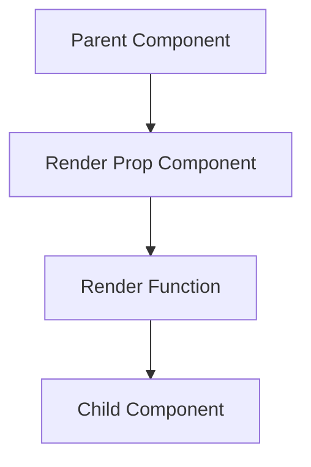
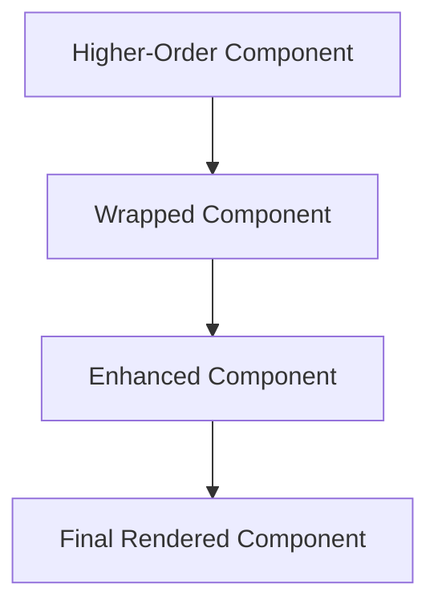

## 15.19 Advanced Patterns in React (Render Props, Higher-Order Components)

In the ever-evolving landscape of web development, React has emerged as a powerful library for building user interfaces. As applications grow in complexity, developers seek advanced patterns to manage and reuse component logic efficiently. Two such patterns are **Render Props** and **Higher-Order Components (HOCs)**. This section delves into these advanced patterns, providing insights, examples, and best practices to enhance your React development skills.

### Understanding Render Props

**Render Props** is a pattern in React that involves passing a function as a prop to a component. This function is used to determine what to render. The pattern allows for greater flexibility and reusability of components by decoupling the logic from the UI.

#### Key Concepts of Render Props

- **Function as a Child**: The core idea is to use a function that returns a React element as the child of a component.
- **Decoupling Logic**: By using render props, you can separate the logic from the presentation, making components more reusable.
- **Flexibility**: Render props provide a flexible way to share logic across components without using inheritance.

#### Example of Render Props

Let's consider a simple example of a component that tracks mouse position:

```jsx
import React from 'react';

class MouseTracker extends React.Component {
  state = { x: 0, y: 0 };

  handleMouseMove = (event) => {
    this.setState({
      x: event.clientX,
      y: event.clientY
    });
  };

  render() {
    return (
      <div style={{ height: '100vh' }} onMouseMove={this.handleMouseMove}>
        {this.props.render(this.state)}
      </div>
    );
  }
}

function App() {
  return (
    <MouseTracker render={({ x, y }) => (
      <h1>The mouse position is ({x}, {y})</h1>
    )} />
  );
}

export default App;
```

In this example, `MouseTracker` is a component that uses a render prop to pass the mouse position to its children. The `App` component uses this render prop to display the mouse position.

#### Advantages of Render Props

- **Reusability**: Logic can be reused across different components.
- **Separation of Concerns**: UI and logic are separated, making the code cleaner and more maintainable.
- **Dynamic Rendering**: Allows for dynamic rendering based on the state or props.

#### Potential Pitfalls of Render Props

- **Prop Drilling**: Passing props through multiple layers can lead to prop drilling, which can make the code harder to manage.
- **Complexity**: Overusing render props can lead to complex and hard-to-read code.

### Higher-Order Components (HOCs)

**Higher-Order Components** are functions that take a component and return a new component. They are used to add additional functionality to existing components.

#### Key Concepts of HOCs

- **Component as an Argument**: HOCs take a component as an argument and return a new component.
- **Enhancement**: They are used to enhance or modify the behavior of a component.
- **Reusability**: HOCs allow for the reuse of component logic across multiple components.

#### Example of Higher-Order Components

Consider an example where we want to add a logging functionality to a component:

```jsx
import React from 'react';

// Higher-Order Component
function withLogging(WrappedComponent) {
  return class extends React.Component {
    componentDidMount() {
      console.log(`Component ${WrappedComponent.name} mounted`);
    }

    render() {
      return <WrappedComponent {...this.props} />;
    }
  };
}

// Regular Component
class Button extends React.Component {
  render() {
    return <button>{this.props.label}</button>;
  }
}

// Enhanced Component
const ButtonWithLogging = withLogging(Button);

function App() {
  return <ButtonWithLogging label="Click Me" />;
}

export default App;
```

In this example, `withLogging` is an HOC that adds logging functionality to the `Button` component.

#### Advantages of HOCs

- **Code Reusability**: Logic can be reused across different components.
- **Separation of Concerns**: Enhancements are separated from the component logic.
- **Composability**: HOCs can be composed to add multiple functionalities.

#### Potential Pitfalls of HOCs

- **Wrapper Hell**: Nesting multiple HOCs can lead to a complex and hard-to-debug component tree.
- **Props Collision**: Care must be taken to avoid prop name collisions between the HOC and the wrapped component.

### Render Props vs. Higher-Order Components

Both Render Props and HOCs are used to share logic across components, but they have different use cases and trade-offs.

#### Differences

- **Implementation**: Render Props use a function prop to render components, while HOCs wrap components to enhance them.
- **Flexibility**: Render Props offer more flexibility in terms of rendering logic, while HOCs are more suited for adding static behavior.
- **Complexity**: Render Props can lead to prop drilling, while HOCs can lead to wrapper hell.

#### Use Cases

- **Render Props**: Use when you need dynamic rendering based on state or props.
- **HOCs**: Use when you need to add static behavior or logic to a component.

### Refactoring Code Using Render Props and HOCs

Refactoring code using these patterns can lead to more maintainable and reusable components. Let's look at an example of refactoring a component using both patterns.

#### Initial Component

```jsx
import React from 'react';

class DataFetcher extends React.Component {
  state = { data: null };

  componentDidMount() {
    fetch(this.props.url)
      .then(response => response.json())
      .then(data => this.setState({ data }));
  }

  render() {
    if (!this.state.data) {
      return <div>Loading...</div>;
    }

    return <div>{this.state.data}</div>;
  }
}

export default DataFetcher;
```

#### Refactoring with Render Props

```jsx
import React from 'react';

class DataFetcher extends React.Component {
  state = { data: null };

  componentDidMount() {
    fetch(this.props.url)
      .then(response => response.json())
      .then(data => this.setState({ data }));
  }

  render() {
    return this.props.render(this.state.data);
  }
}

function App() {
  return (
    <DataFetcher url="/api/data" render={(data) => (
      data ? <div>{data}</div> : <div>Loading...</div>
    )} />
  );
}

export default App;
```

#### Refactoring with HOCs

```jsx
import React from 'react';

function withDataFetching(WrappedComponent, url) {
  return class extends React.Component {
    state = { data: null };

    componentDidMount() {
      fetch(url)
        .then(response => response.json())
        .then(data => this.setState({ data }));
    }

    render() {
      return <WrappedComponent data={this.state.data} {...this.props} />;
    }
  };
}

function DisplayData({ data }) {
  return data ? <div>{data}</div> : <div>Loading...</div>;
}

const DisplayDataWithFetching = withDataFetching(DisplayData, '/api/data');

function App() {
  return <DisplayDataWithFetching />;
}

export default App;
```

### Potential Pitfalls and Best Practices

When using Render Props and HOCs, it's important to be aware of potential pitfalls and follow best practices to avoid them.

#### Prop Drilling

Prop drilling occurs when props are passed through multiple layers of components. This can make the code harder to manage and understand. To mitigate this, consider using context or state management libraries like Redux.

#### Component Complexity

Both patterns can lead to complex component structures if overused. It's important to strike a balance between reusability and simplicity.

#### Naming Conventions

Use clear and consistent naming conventions for render props and HOCs to improve code readability.

### Visualizing Component Logic with Diagrams

To better understand how Render Props and HOCs work, let's visualize their component logic using Mermaid.js diagrams.

#### Render Props Diagram



*Caption: This diagram illustrates how a parent component uses a render prop component to pass a render function to a child component.*

#### Higher-Order Components Diagram



*Caption: This diagram shows how a higher-order component wraps a component to create an enhanced component, which is then rendered.*

### Try It Yourself

Experiment with the examples provided by modifying the render logic or adding additional functionality to the HOCs. Try creating your own render prop components and HOCs to see how they can be used to enhance component logic.

### References and Further Reading

- [React Documentation on Render Props](https://reactjs.org/docs/render-props.html)
- [React Documentation on Higher-Order Components](https://reactjs.org/docs/higher-order-components.html)
- [MDN Web Docs on JavaScript Functions](https://developer.mozilla.org/en-US/docs/Web/JavaScript/Guide/Functions)

### Knowledge Check

To reinforce your understanding of Render Props and Higher-Order Components, try answering the following questions.

## Quiz: Mastering Advanced React Patterns



### What is a render prop in React?

- [x] A function prop that a component uses to know what to render
- [ ] A component that renders another component
- [ ] A method for managing state in React
- [ ] A way to handle events in React

> **Explanation:** A render prop is a function prop that a component uses to determine what to render, allowing for dynamic rendering logic.

### What is a Higher-Order Component (HOC)?

- [x] A function that takes a component and returns a new component
- [ ] A component that renders another component
- [ ] A method for managing state in React
- [ ] A way to handle events in React

> **Explanation:** A Higher-Order Component is a function that takes a component and returns a new component, enhancing its functionality.

### Which pattern is more suitable for dynamic rendering based on state or props?

- [x] Render Props
- [ ] Higher-Order Components
- [ ] Context API
- [ ] Redux

> **Explanation:** Render Props are more suitable for dynamic rendering based on state or props, as they allow for flexible rendering logic.

### What is a potential pitfall of using Higher-Order Components?

- [x] Wrapper Hell
- [ ] Prop Drilling
- [ ] State Management
- [ ] Event Handling

> **Explanation:** Wrapper Hell is a potential pitfall of using Higher-Order Components, where nesting multiple HOCs can lead to a complex component tree.

### What is a potential pitfall of using Render Props?

- [x] Prop Drilling
- [ ] Wrapper Hell
- [ ] State Management
- [ ] Event Handling

> **Explanation:** Prop Drilling is a potential pitfall of using Render Props, where props are passed through multiple layers of components.

### Which pattern is more suitable for adding static behavior to a component?

- [x] Higher-Order Components
- [ ] Render Props
- [ ] Context API
- [ ] Redux

> **Explanation:** Higher-Order Components are more suitable for adding static behavior to a component, as they enhance the component's functionality.

### What is the main advantage of using Render Props?

- [x] Reusability of logic across components
- [ ] Simplified state management
- [ ] Improved performance
- [ ] Easier event handling

> **Explanation:** The main advantage of using Render Props is the reusability of logic across components, allowing for more maintainable code.

### What is the main advantage of using Higher-Order Components?

- [x] Reusability of logic across components
- [ ] Simplified state management
- [ ] Improved performance
- [ ] Easier event handling

> **Explanation:** The main advantage of using Higher-Order Components is the reusability of logic across components, allowing for more maintainable code.

### True or False: Render Props and Higher-Order Components can be used together in a single application.

- [x] True
- [ ] False

> **Explanation:** True. Render Props and Higher-Order Components can be used together in a single application to enhance component logic and functionality.

### True or False: Render Props are more suitable for static behavior enhancement.

- [ ] True
- [x] False

> **Explanation:** False. Render Props are more suitable for dynamic rendering based on state or props, while Higher-Order Components are more suitable for static behavior enhancement.



Remember, mastering these advanced patterns in React is just the beginning. As you progress, you'll build more complex and interactive applications. Keep experimenting, stay curious, and enjoy the journey!
