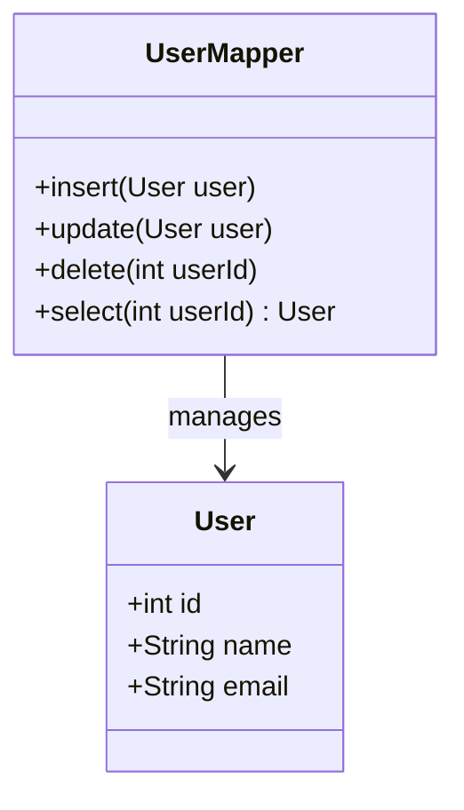

## 15.2 Data Mapper Pattern

### Introduction

The Data Mapper Pattern is a structural design pattern that provides a clean separation between the in-memory objects and their database representations. It acts as an intermediary that transfers data between objects and a database while keeping them independent of each other. This pattern is particularly useful in applications where complex domain logic should not be tightly coupled with persistence logic.

### Detailed Explanation

#### Understanding the Concept

- **Separation of Concerns:** The Data Mapper Pattern ensures that the domain model is not aware of the database operations. This separation allows for a more flexible and maintainable codebase.
- **Independence:** By decoupling the domain model from the database, you can easily switch between different storage mechanisms without altering the business logic.

#### Implementation Steps

1. **Define Domain Models:**
   - Create classes that represent your business entities. These classes should not contain any persistence code, focusing solely on business logic.

   ```typescript
   class User {
       constructor(public id: number, public name: string, public email: string) {}
   }
   ```

2. **Create Mappers:**
   - Implement Data Mappers that handle the persistence logic for each entity. These mappers will contain methods to `insert`, `update`, `delete`, and `select` data from the database.

   ```typescript
   class UserMapper {
       async insert(user: User): Promise<void> {
           // Logic to insert user into the database
       }

       async update(user: User): Promise<void> {
           // Logic to update user in the database
       }

       async delete(userId: number): Promise<void> {
           // Logic to delete user from the database
       }

       async select(userId: number): Promise<User | null> {
           // Logic to select user from the database
           return new User(userId, 'John Doe', 'john@example.com'); // Example return
       }
   }
   ```

3. **Implement Mapping Logic:**
   - Write code to map object properties to database fields and vice versa. Handle differences in data representation between the object model and the database schema.

4. **Use a Unit of Work (optional):**
   - Coordinate data mapping operations within a transactional boundary to ensure data consistency.

#### Visual Representation



### Code Examples

Let's build a `UserMapper` class that handles CRUD operations for the `User` domain model using TypeScript and a mock database interface.

```typescript
interface Database {
    query(sql: string, params: any[]): Promise<any>;
}

class MockDatabase implements Database {
    async query(sql: string, params: any[]): Promise<any> {
        console.log(`Executing SQL: ${sql} with params: ${params}`);
        return []; // Mock response
    }
}

class UserMapper {
    constructor(private db: Database) {}

    async insert(user: User): Promise<void> {
        const sql = 'INSERT INTO users (id, name, email) VALUES (?, ?, ?)';
        await this.db.query(sql, [user.id, user.name, user.email]);
    }

    async update(user: User): Promise<void> {
        const sql = 'UPDATE users SET name = ?, email = ? WHERE id = ?';
        await this.db.query(sql, [user.name, user.email, user.id]);
    }

    async delete(userId: number): Promise<void> {
        const sql = 'DELETE FROM users WHERE id = ?';
        await this.db.query(sql, [userId]);
    }

    async select(userId: number): Promise<User | null> {
        const sql = 'SELECT * FROM users WHERE id = ?';
        const result = await this.db.query(sql, [userId]);
        if (result.length > 0) {
            const { id, name, email } = result[0];
            return new User(id, name, email);
        }
        return null;
    }
}

// Usage
const db = new MockDatabase();
const userMapper = new UserMapper(db);

(async () => {
    const user = new User(1, 'Alice', 'alice@example.com');
    await userMapper.insert(user);
    const fetchedUser = await userMapper.select(1);
    console.log(fetchedUser);
})();
```

### Use Cases

- **Complex Domain Logic:** When you have complex domain logic that should not be coupled with persistence code, the Data Mapper Pattern is ideal.
- **Multiple Data Storage Mechanisms:** If you need to support multiple data storage mechanisms without changing the domain model, this pattern provides the necessary abstraction.

### Advantages and Disadvantages

#### Advantages

- **Separation of Concerns:** Keeps domain logic separate from persistence logic.
- **Flexibility:** Allows for easy changes in the storage mechanism without affecting business logic.
- **Testability:** Simplifies unit testing by isolating domain logic from database operations.

#### Disadvantages

- **Complexity:** Can introduce additional complexity, especially in simple applications.
- **Overhead:** May require more boilerplate code compared to Active Record patterns.

### Best Practices

- **Use ORM Tools:** Consider using ORM tools like TypeORM or Sequelize that implement the Data Mapper pattern, reducing the need for manual mapper implementation.
- **Transaction Management:** Implement transaction management to ensure data consistency, especially when using a Unit of Work.

### Comparisons

- **Data Mapper vs. Active Record:**
  - **Data Mapper:** Separates domain logic from persistence logic, suitable for complex domains.
  - **Active Record:** Combines domain and persistence logic, simpler but less flexible for complex domains.

### Conclusion

The Data Mapper Pattern is a powerful tool for managing data access and persistence in applications with complex domain logic. By separating the domain model from the database, it provides flexibility, maintainability, and testability. However, it is important to weigh the complexity it introduces against the needs of your project.

## Quiz Time!



### What is the primary purpose of the Data Mapper Pattern?

- [x] To separate in-memory objects from database representations
- [ ] To combine domain logic with persistence logic
- [ ] To simplify database queries
- [ ] To enhance UI performance

> **Explanation:** The Data Mapper Pattern separates in-memory objects from their database representations, ensuring a clean separation of concerns.

### Which of the following is a key benefit of using the Data Mapper Pattern?

- [x] Flexibility in changing storage mechanisms
- [ ] Reduced code complexity
- [ ] Direct database access from domain models
- [ ] Enhanced UI rendering speed

> **Explanation:** The Data Mapper Pattern allows for flexibility in changing storage mechanisms without affecting the domain model.

### In the Data Mapper Pattern, where is the persistence logic typically located?

- [x] In the Mapper classes
- [ ] In the Domain Model classes
- [ ] In the Controller classes
- [ ] In the View classes

> **Explanation:** Persistence logic is located in the Mapper classes, which handle database operations.

### What is a potential disadvantage of the Data Mapper Pattern?

- [x] Increased complexity
- [ ] Tight coupling of domain and persistence logic
- [ ] Difficulty in changing storage mechanisms
- [ ] Reduced testability

> **Explanation:** The Data Mapper Pattern can introduce additional complexity, especially in simple applications.

### Which pattern combines domain logic with persistence logic?

- [ ] Data Mapper
- [x] Active Record
- [ ] Singleton
- [ ] Observer

> **Explanation:** The Active Record pattern combines domain logic with persistence logic, unlike the Data Mapper Pattern.

### What is a common use case for the Data Mapper Pattern?

- [x] Applications with complex domain logic
- [ ] Simple CRUD applications
- [ ] Applications with no database interactions
- [ ] UI-only applications

> **Explanation:** The Data Mapper Pattern is ideal for applications with complex domain logic that should not be coupled with persistence code.

### How does the Data Mapper Pattern affect testability?

- [x] It enhances testability by isolating domain logic from database operations.
- [ ] It reduces testability by combining logic layers.
- [ ] It has no impact on testability.
- [ ] It complicates testability by introducing more classes.

> **Explanation:** The Data Mapper Pattern enhances testability by isolating domain logic from database operations.

### Which tool is an example of an ORM that implements the Data Mapper Pattern?

- [x] TypeORM
- [ ] jQuery
- [ ] React
- [ ] Angular

> **Explanation:** TypeORM is an example of an ORM that implements the Data Mapper Pattern.

### What optional component can be used with the Data Mapper Pattern to ensure data consistency?

- [x] Unit of Work
- [ ] Singleton
- [ ] Observer
- [ ] Factory

> **Explanation:** A Unit of Work can be used with the Data Mapper Pattern to coordinate data mapping operations within a transactional boundary.

### True or False: The Data Mapper Pattern is suitable for applications with simple domain logic.

- [ ] True
- [x] False

> **Explanation:** The Data Mapper Pattern is generally more suitable for applications with complex domain logic, as it introduces additional complexity.


