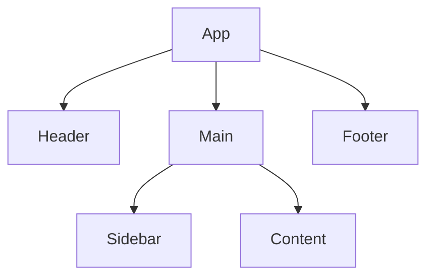

## 15.2 Component-Based Architecture

Component-based architecture is a cornerstone of modern front-end development, enabling developers to build scalable, maintainable, and efficient web applications. This approach promotes reusability and modularity, allowing developers to create applications by assembling independent, self-contained components. In this section, we will explore what components are, the benefits of component-based architecture, and how popular frameworks like React, Vue.js, and Angular implement these concepts.

### What Are Components?

In the context of front-end development, a component is a reusable piece of UI that encapsulates its structure, styling, and behavior. Components can be as simple as a button or as complex as an entire form. They are the building blocks of a component-based architecture, allowing developers to break down a user interface into manageable, reusable parts.

#### Key Characteristics of Components

- **Encapsulation**: Components encapsulate their structure (HTML), styling (CSS), and behavior (JavaScript) into a single unit. This encapsulation ensures that changes to one component do not affect others.
- **Reusability**: Components can be reused across different parts of an application or even in different projects, reducing redundancy and improving consistency.
- **Modularity**: By breaking down an application into smaller components, developers can focus on individual parts, making the application easier to understand and maintain.
- **Isolation**: Components operate independently, which means they can be developed and tested in isolation before being integrated into the larger application.

### Benefits of Component-Based Architecture

Component-based architecture offers several advantages that make it a preferred choice for modern web development:

1. **Improved Maintainability**: By organizing code into discrete components, developers can easily locate and fix bugs or make updates without affecting the entire application.

2. **Enhanced Reusability**: Components can be reused across different projects, saving development time and ensuring a consistent user experience.

3. **Scalability**: As applications grow, component-based architecture allows for easy scaling by adding new components without disrupting existing ones.

4. **Better Collaboration**: Teams can work on different components simultaneously, improving productivity and reducing development time.

5. **Consistent UI/UX**: Reusing components ensures a consistent look and feel across the application, enhancing the user experience.

### Component-Centric Frameworks

Several popular frameworks have embraced component-based architecture, each offering unique features and benefits. Let's explore three of the most widely used frameworks: React, Vue.js, and Angular.

#### React

[React](https://reactjs.org/) is a JavaScript library developed by Facebook for building user interfaces. It is known for its simplicity and flexibility, making it a popular choice for both small and large-scale applications.

- **JSX Syntax**: React uses JSX, a syntax extension that allows developers to write HTML-like code within JavaScript. This makes it easy to create and manage components.
- **Virtual DOM**: React uses a virtual DOM to optimize rendering performance. It updates only the parts of the DOM that have changed, reducing the number of costly DOM operations.
- **Component Lifecycle**: React provides lifecycle methods that allow developers to hook into different stages of a component's life, such as mounting, updating, and unmounting.

```jsx
// Example of a simple React component
import React from 'react';

function Greeting(props) {
  return <h1>Hello, {props.name}!</h1>;
}

export default Greeting;
```

#### Vue.js

[Vue.js](https://vuejs.org/) is a progressive JavaScript framework that is designed to be incrementally adoptable. It is known for its simplicity and ease of integration with other projects.

- **Template Syntax**: Vue uses an HTML-based template syntax that allows developers to declaratively bind the rendered DOM to the underlying Vue instance's data.
- **Reactivity System**: Vue's reactivity system automatically tracks dependencies and updates the DOM when data changes.
- **Single-File Components**: Vue supports single-file components, which encapsulate HTML, CSS, and JavaScript in a single file.

```vue
<!-- Example of a simple Vue.js component -->
<template>
  <h1>Hello, {{ name }}!</h1>
</template>

<script>
export default {
  data() {
    return {
      name: 'World'
    };
  }
};
</script>

<style scoped>
h1 {
  color: blue;
}
</style>
```

#### Angular

[Angular](https://angular.io/) is a platform and framework for building single-page client applications using HTML and TypeScript. Developed by Google, Angular is known for its robust features and comprehensive toolset.

- **TypeScript**: Angular is built with TypeScript, providing static typing and advanced features like decorators and interfaces.
- **Dependency Injection**: Angular's dependency injection system makes it easy to manage dependencies and promote code reusability.
- **Two-Way Data Binding**: Angular supports two-way data binding, allowing automatic synchronization between the model and the view.

```typescript
// Example of a simple Angular component
import { Component } from '@angular/core';

@Component({
  selector: 'app-greeting',
  template: '<h1>Hello, {{ name }}!</h1>',
  styles: ['h1 { color: red; }']
})
export class GreetingComponent {
  name: string = 'World';
}
```

### Encapsulation of Structure, Styling, and Behavior

Components encapsulate their structure, styling, and behavior, allowing developers to manage each aspect independently. This encapsulation is achieved through:

- **HTML Templates**: Define the structure of the component.
- **CSS Styles**: Apply styles specific to the component, often scoped to avoid conflicts with other components.
- **JavaScript Logic**: Implement the behavior and functionality of the component.

This separation of concerns ensures that each component is self-contained and can be developed, tested, and maintained independently.

### Best Practices for Designing Reusable Components

Designing reusable components requires careful consideration of several factors:

1. **Single Responsibility Principle**: Each component should have a single responsibility, making it easier to understand and reuse.

2. **Clear Interfaces**: Define clear inputs (props or attributes) and outputs (events or callbacks) for each component to facilitate communication with other components.

3. **Avoid Side Effects**: Components should avoid side effects and rely on inputs to determine their output, ensuring predictable behavior.

4. **Use Composition Over Inheritance**: Favor composition (combining components) over inheritance to promote flexibility and reuse.

5. **Document Components**: Provide clear documentation for each component, including its purpose, inputs, outputs, and usage examples.

### State Management Within and Across Components

State management is a critical aspect of component-based architecture, as it determines how data flows through the application and how components interact with each other.

#### Local State

Local state refers to the state managed within a single component. It is typically used for data that is only relevant to that component, such as form inputs or UI toggles.

- **React**: Use the `useState` hook to manage local state in functional components.
- **Vue.js**: Use the `data` function to define local state within a component.
- **Angular**: Use component properties to manage local state.

#### Global State

Global state refers to the state shared across multiple components. It is used for data that needs to be accessed or modified by different parts of the application.

- **React**: Use context or state management libraries like Redux or MobX to manage global state.
- **Vue.js**: Use Vuex, a state management library specifically designed for Vue.js applications.
- **Angular**: Use services to manage global state and share data between components.

#### State Management Libraries

State management libraries provide a structured way to manage global state, offering features like time-travel debugging, middleware, and more.

- **Redux**: A predictable state container for JavaScript apps, often used with React.
- **MobX**: A simple, scalable state management solution that makes state management easy and scalable by transparently applying functional reactive programming (TFRP).
- **Vuex**: A state management pattern + library for Vue.js applications.

### Visualizing Component-Based Architecture

To better understand how components interact within an application, let's visualize a simple component hierarchy using a Mermaid.js diagram.



**Diagram Description**: This diagram represents a simple component hierarchy in a web application. The `App` component is the root component, containing `Header`, `Main`, and `Footer` components. The `Main` component further contains `Sidebar` and `Content` components.

### Try It Yourself

To solidify your understanding of component-based architecture, try experimenting with the following:

- **Modify the Code Examples**: Change the greeting message or styles in the provided examples to see how components can be customized.
- **Create a New Component**: Build a new component, such as a button or card, and integrate it into an existing application.
- **Implement State Management**: Use a state management library to manage global state in a small application.

### Knowledge Check

- **What are the key characteristics of components in front-end development?**
- **How do React, Vue.js, and Angular differ in their approach to component-based architecture?**
- **What are the benefits of using a component-based architecture?**
- **How can you manage state within and across components?**

### Summary

Component-based architecture is a powerful approach to building modern web applications, offering benefits like reusability, modularity, and scalability. By understanding the principles of component-based architecture and leveraging frameworks like React, Vue.js, and Angular, developers can create efficient, maintainable, and scalable applications. Remember, this is just the beginning. As you progress, you'll build more complex and interactive web pages. Keep experimenting, stay curious, and enjoy the journey!

## Quiz: Mastering Component-Based Architecture in JavaScript



### What is a key characteristic of components in front-end development?

- [x] Encapsulation
- [ ] Global State Management
- [ ] Server-Side Rendering
- [ ] Asynchronous Processing

> **Explanation:** Components encapsulate structure, styling, and behavior, making them self-contained and reusable.

### Which framework uses JSX syntax for component creation?

- [x] React
- [ ] Vue.js
- [ ] Angular
- [ ] Svelte

> **Explanation:** React uses JSX, a syntax extension that allows HTML-like code within JavaScript.

### What is a benefit of component-based architecture?

- [x] Improved Maintainability
- [ ] Increased Complexity
- [ ] Reduced Modularity
- [ ] Decreased Reusability

> **Explanation:** Component-based architecture improves maintainability by organizing code into discrete, manageable parts.

### How does Vue.js handle component styling?

- [x] Scoped Styles
- [ ] Inline Styles
- [ ] Global Styles
- [ ] External Stylesheets

> **Explanation:** Vue.js supports scoped styles, which apply only to the component in which they are defined.

### What is the purpose of state management libraries like Redux?

- [x] Manage Global State
- [ ] Handle Local State
- [ ] Perform DOM Manipulation
- [ ] Manage CSS Styles

> **Explanation:** State management libraries like Redux are used to manage global state across an application.

### Which Angular feature aids in managing dependencies?

- [x] Dependency Injection
- [ ] Virtual DOM
- [ ] JSX Syntax
- [ ] Two-Way Data Binding

> **Explanation:** Angular's dependency injection system helps manage dependencies and promotes code reusability.

### What is a best practice for designing reusable components?

- [x] Single Responsibility Principle
- [ ] Use Inheritance
- [ ] Avoid Documentation
- [ ] Implement Side Effects

> **Explanation:** The single responsibility principle ensures that each component has a single, clear purpose, making it easier to understand and reuse.

### How does React optimize rendering performance?

- [x] Virtual DOM
- [ ] Two-Way Data Binding
- [ ] Scoped Styles
- [ ] Dependency Injection

> **Explanation:** React uses a virtual DOM to optimize rendering performance by updating only the parts of the DOM that have changed.

### What is a common method for managing local state in React?

- [x] useState Hook
- [ ] Vuex
- [ ] Redux
- [ ] Angular Services

> **Explanation:** The `useState` hook is used in React functional components to manage local state.

### True or False: Component-based architecture is only suitable for small applications.

- [ ] True
- [x] False

> **Explanation:** Component-based architecture is suitable for both small and large applications due to its scalability and modularity.


