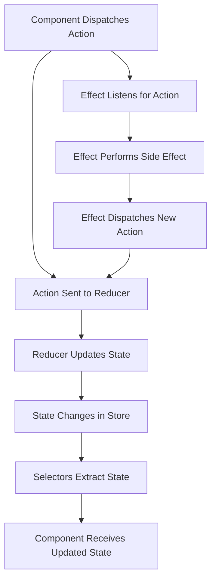

## 15.20 State Management in Angular with NgRx

State management is a crucial aspect of modern web applications, especially as they grow in complexity. Angular, a popular framework for building dynamic web applications, offers several ways to manage state. However, as applications scale, managing state can become challenging. This is where NgRx comes into play. NgRx is a powerful library for managing state in Angular applications, inspired by the Redux pattern. In this section, we'll explore the need for state management, introduce NgRx and its core concepts, and provide practical examples and best practices for using NgRx in your Angular projects.

### The Need for State Management in Angular Applications

As Angular applications grow, they often require a robust way to manage state. State refers to the data that your application needs to function, such as user information, UI settings, and application configurations. Managing state effectively is crucial for several reasons:

- **Consistency**: Ensures that the application behaves predictably.
- **Scalability**: Facilitates the addition of new features without introducing bugs.
- **Maintainability**: Makes it easier to understand and modify the application code.
- **Performance**: Optimizes data flow and reduces unnecessary re-renders.

Without a proper state management strategy, applications can become difficult to maintain and prone to bugs. NgRx addresses these challenges by providing a structured way to manage state using reactive programming principles.

### Introducing NgRx

NgRx is a set of reactive libraries for Angular, built around the Redux pattern. It provides a way to manage global state across your application in a predictable manner. NgRx leverages RxJS, a library for reactive programming using Observables, to handle asynchronous operations and state changes.

#### Core Concepts of NgRx

NgRx is built on several core concepts that work together to manage state effectively:

- **Actions**: Represent events that describe something that happened in the application.
- **Reducers**: Pure functions that take the current state and an action, and return a new state.
- **Selectors**: Functions that select a piece of state from the store.
- **Effects**: Handle side effects, such as API calls, and return new actions to the store.

Let's delve into each of these concepts in detail.

#### Actions

Actions are plain JavaScript objects that represent an event in your application. They have a `type` property that describes the event and an optional `payload` that contains additional data. Actions are dispatched to the store to trigger state changes.

```javascript
// Define an action
export const loadUsers = createAction('[User API] Load Users');
```

#### Reducers

Reducers are pure functions that take the current state and an action, and return a new state. They specify how the application's state changes in response to actions.

```javascript
import { createReducer, on } from '@ngrx/store';
import { loadUsers } from './user.actions';

export const initialState = [];

const _userReducer = createReducer(
  initialState,
  on(loadUsers, (state) => [...state])
);

export function userReducer(state, action) {
  return _userReducer(state, action);
}
```

#### Selectors

Selectors are functions that extract specific pieces of state from the store. They help in optimizing performance by allowing components to subscribe only to the parts of the state they need.

```javascript
import { createSelector } from '@ngrx/store';

export const selectUsers = (state) => state.users;

export const selectUserCount = createSelector(
  selectUsers,
  (users) => users.length
);
```

#### Effects

Effects handle side effects, such as fetching data from an API. They listen for specific actions and dispatch new actions based on the outcome of the side effect.

```javascript
import { Injectable } from '@angular/core';
import { Actions, createEffect, ofType } from '@ngrx/effects';
import { loadUsers } from './user.actions';
import { UserService } from './user.service';
import { map, mergeMap } from 'rxjs/operators';

@Injectable()
export class UserEffects {
  loadUsers$ = createEffect(() =>
    this.actions$.pipe(
      ofType(loadUsers),
      mergeMap(() =>
        this.userService.getAll().pipe(
          map(users => ({ type: '[User API] Users Loaded Success', payload: users }))
        )
      )
    )
  );

  constructor(
    private actions$: Actions,
    private userService: UserService
  ) {}
}
```

### Setting Up NgRx in an Angular Project

To use NgRx in your Angular project, you need to install the necessary packages and configure your application to use the NgRx store.

#### Step 1: Install NgRx Packages

First, install the NgRx packages using npm:

```bash
npm install @ngrx/store @ngrx/effects @ngrx/entity @ngrx/store-devtools
```

#### Step 2: Configure the Store

Next, configure the store in your Angular module. Import the `StoreModule` and `EffectsModule` and add them to the `imports` array.

```javascript
import { NgModule } from '@angular/core';
import { BrowserModule } from '@angular/platform-browser';
import { StoreModule } from '@ngrx/store';
import { EffectsModule } from '@ngrx/effects';
import { StoreDevtoolsModule } from '@ngrx/store-devtools';
import { environment } from '../environments/environment';
import { userReducer } from './user.reducer';
import { UserEffects } from './user.effects';

@NgModule({
  declarations: [],
  imports: [
    BrowserModule,
    StoreModule.forRoot({ users: userReducer }),
    EffectsModule.forRoot([UserEffects]),
    StoreDevtoolsModule.instrument({ maxAge: 25, logOnly: environment.production })
  ],
  providers: [],
  bootstrap: []
})
export class AppModule {}
```

#### Step 3: Create Actions, Reducers, and Effects

Create actions, reducers, and effects as shown in the examples above. Organize them in separate files for better maintainability.

### Best Practices for Organizing State and Handling Side Effects

When using NgRx, it's important to follow best practices to ensure your application remains scalable and maintainable.

- **Organize State by Feature**: Group related actions, reducers, and effects by feature. This makes it easier to manage and scale your application.
- **Use Strong Typing**: Leverage TypeScript's type system to define actions, state, and selectors. This helps catch errors early and improves code readability.
- **Handle Side Effects with Effects**: Use effects to handle side effects, such as API calls. This keeps your reducers pure and focused on state changes.
- **Leverage Selectors**: Use selectors to extract specific pieces of state. This improves performance and makes your components more efficient.
- **Integrate with Angular's Dependency Injection**: Use Angular's dependency injection system to inject services into your effects and components. This promotes reusability and testability.

### Integration with Angular's Dependency Injection System

NgRx integrates seamlessly with Angular's dependency injection system. You can inject services into your effects and components to access shared functionality, such as API services or utility functions.

```javascript
@Injectable()
export class UserEffects {
  constructor(
    private actions$: Actions,
    private userService: UserService
  ) {}
}
```

### Visualizing NgRx Architecture

To better understand how NgRx works, let's visualize its architecture using a flowchart.



**Diagram Description**: This flowchart illustrates the flow of data in an NgRx application. Components dispatch actions, which are processed by reducers to update the state. Effects listen for specific actions to perform side effects, such as API calls, and dispatch new actions based on the outcome.

### Try It Yourself

To solidify your understanding of NgRx, try modifying the code examples provided. Experiment with creating new actions, reducers, and effects. Consider adding a new feature to your application and managing its state using NgRx.

### Knowledge Check

- What are the core concepts of NgRx?
- How do actions and reducers work together in NgRx?
- What is the role of selectors in an NgRx application?
- How do effects handle side effects in NgRx?
- What are some best practices for organizing state in an NgRx application?

### Summary

NgRx is a powerful library for managing state in Angular applications. By leveraging reactive programming principles, NgRx provides a structured way to handle state changes and side effects. Understanding the core concepts of NgRx, such as actions, reducers, selectors, and effects, is crucial for building scalable and maintainable Angular applications. Remember, mastering NgRx is a journey. Keep experimenting, stay curious, and enjoy the process of building robust web applications.

## Quiz: Mastering State Management with NgRx



### What is the primary purpose of NgRx in Angular applications?

- [x] To manage application state using reactive patterns
- [ ] To handle routing in Angular applications
- [ ] To style Angular components
- [ ] To manage Angular modules

> **Explanation:** NgRx is primarily used for managing application state using reactive patterns inspired by Redux.

### Which of the following is NOT a core concept of NgRx?

- [ ] Actions
- [ ] Reducers
- [ ] Selectors
- [x] Directives

> **Explanation:** Directives are not a core concept of NgRx. NgRx focuses on actions, reducers, selectors, and effects.

### How do reducers function in NgRx?

- [x] They take the current state and an action to return a new state
- [ ] They perform side effects like API calls
- [ ] They dispatch actions to the store
- [ ] They extract specific pieces of state

> **Explanation:** Reducers are pure functions that take the current state and an action, and return a new state.

### What role do effects play in NgRx?

- [x] They handle side effects and dispatch new actions
- [ ] They update the state directly
- [ ] They define the initial state of the application
- [ ] They create actions

> **Explanation:** Effects handle side effects, such as API calls, and dispatch new actions based on the outcome.

### Which package is NOT required to set up NgRx in an Angular project?

- [ ] @ngrx/store
- [ ] @ngrx/effects
- [ ] @ngrx/entity
- [x] @angular/router

> **Explanation:** @angular/router is not required for setting up NgRx. It is used for routing in Angular applications.

### What is the purpose of selectors in NgRx?

- [x] To extract specific pieces of state from the store
- [ ] To dispatch actions to the store
- [ ] To perform side effects
- [ ] To define the initial state

> **Explanation:** Selectors are used to extract specific pieces of state from the store, optimizing performance.

### How can you handle side effects in an NgRx application?

- [x] By using effects
- [ ] By using reducers
- [ ] By using actions
- [ ] By using selectors

> **Explanation:** Effects are used to handle side effects, such as API calls, in an NgRx application.

### What is a best practice for organizing state in an NgRx application?

- [x] Organize state by feature
- [ ] Use global variables for state
- [ ] Avoid using selectors
- [ ] Handle side effects in reducers

> **Explanation:** Organizing state by feature helps in managing and scaling the application effectively.

### Which of the following is a benefit of using NgRx?

- [x] It provides a structured way to manage state
- [ ] It simplifies Angular routing
- [ ] It enhances CSS styling
- [ ] It reduces the need for TypeScript

> **Explanation:** NgRx provides a structured way to manage state, making applications more scalable and maintainable.

### True or False: NgRx integrates seamlessly with Angular's dependency injection system.

- [x] True
- [ ] False

> **Explanation:** NgRx integrates seamlessly with Angular's dependency injection system, allowing services to be injected into effects and components.



Remember, mastering state management with NgRx is a journey. Keep experimenting, stay curious, and enjoy the process of building robust web applications.
