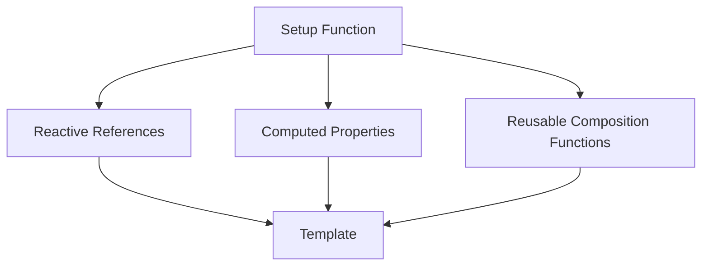

## 15.21 Vue.js Composition API and Patterns

### Introduction to the Vue.js Composition API

The Vue.js Composition API is a powerful feature introduced in Vue 3 that allows developers to organize component logic by feature rather than by lifecycle hook. This approach enhances flexibility and reusability, making it easier to manage complex components and share logic across different parts of an application. In this section, we will explore the Composition API, its purpose, and how it addresses the limitations of the Options API.

### Limitations of the Options API

Before diving into the Composition API, it's important to understand the limitations of the Options API, which was the primary way to define components in Vue 2. The Options API organizes component logic by options such as `data`, `methods`, `computed`, and `watch`. While this approach works well for simple components, it can become cumbersome as components grow in complexity. Here are some key limitations:

- **Scattered Logic**: Logic related to a single feature is often spread across multiple options, making it difficult to understand and maintain.
- **Reusability Challenges**: Sharing logic between components requires mixins or higher-order components, which can lead to name collisions and increased complexity.
- **Limited TypeScript Support**: The Options API has limited support for TypeScript, making it challenging to leverage TypeScript's type-checking capabilities.

### The Composition API: A New Approach

The Composition API addresses these limitations by allowing developers to organize logic by feature. This approach is inspired by React Hooks and provides a more flexible and scalable way to manage component logic. Key features of the Composition API include:

- **Setup Function**: The `setup` function is the entry point for using the Composition API. It is called before the component is created and allows you to define reactive state, computed properties, and methods.
- **Reactive References**: The `ref` and `reactive` functions are used to create reactive state. `ref` is used for primitive values, while `reactive` is used for objects.
- **Computed Properties**: The `computed` function is used to define computed properties, which are derived from reactive state and automatically update when dependencies change.
- **Reusable Composition Functions**: Logic can be extracted into reusable functions, known as composition functions, which can be shared across components.

### Refactoring Components with the Composition API

Let's explore how to refactor a component using the Composition API. Consider a simple counter component implemented using the Options API:

```javascript
<template>
  <div>
    <p>Count: {{ count }}</p>
    <button @click="increment">Increment</button>
  </div>
</template>

<script>
export default {
  data() {
    return {
      count: 0
    };
  },
  methods: {
    increment() {
      this.count++;
    }
  }
};
</script>
```

Now, let's refactor this component using the Composition API:

```javascript
<template>
  <div>
    <p>Count: {{ count }}</p>
    <button @click="increment">Increment</button>
  </div>
</template>

<script>
import { ref } from 'vue';

export default {
  setup() {
    const count = ref(0);

    function increment() {
      count.value++;
    }

    return {
      count,
      increment
    };
  }
};
</script>
```

In this refactored version, we use the `setup` function to define the `count` state and the `increment` method. The `ref` function creates a reactive reference for the `count` variable, and we return the state and methods from the `setup` function to make them available in the template.

### Reactive References and Computed Properties

Reactive references and computed properties are fundamental concepts in the Composition API. Let's explore them in more detail.

#### Reactive References

Reactive references are created using the `ref` function for primitive values and the `reactive` function for objects. Here's an example:

```javascript
import { ref, reactive } from 'vue';

export default {
  setup() {
    const count = ref(0);
    const user = reactive({
      name: 'John Doe',
      age: 30
    });

    return {
      count,
      user
    };
  }
};
```

In this example, `count` is a reactive reference, and `user` is a reactive object. Changes to these variables will automatically trigger updates in the component.

#### Computed Properties

Computed properties are defined using the `computed` function. They are derived from reactive state and automatically update when dependencies change. Here's an example:

```javascript
import { ref, computed } from 'vue';

export default {
  setup() {
    const count = ref(0);
    const doubleCount = computed(() => count.value * 2);

    return {
      count,
      doubleCount
    };
  }
};
```

In this example, `doubleCount` is a computed property that doubles the value of `count`. It automatically updates whenever `count` changes.

### Best Practices for Creating Reusable Composition Functions

Reusable composition functions are a powerful feature of the Composition API. They allow you to encapsulate logic and share it across components. Here are some best practices for creating reusable composition functions:

- **Encapsulate Logic**: Group related logic into a single composition function. This makes it easier to understand and reuse.
- **Return Reactive State**: Return reactive state and methods from the composition function to make them available in the component.
- **Use Descriptive Names**: Use descriptive names for composition functions to make their purpose clear.
- **Avoid Side Effects**: Avoid side effects in composition functions to ensure they are reusable and predictable.

Here's an example of a reusable composition function:

```javascript
import { ref } from 'vue';

export function useCounter() {
  const count = ref(0);

  function increment() {
    count.value++;
  }

  return {
    count,
    increment
  };
}
```

You can use this composition function in a component as follows:

```javascript
<template>
  <div>
    <p>Count: {{ count }}</p>
    <button @click="increment">Increment</button>
  </div>
</template>

<script>
import { useCounter } from './useCounter';

export default {
  setup() {
    const { count, increment } = useCounter();

    return {
      count,
      increment
    };
  }
};
</script>
```

### Compatibility and Migration Considerations

When adopting the Composition API, it's important to consider compatibility and migration. Here are some key points to keep in mind:

- **Backward Compatibility**: The Composition API is fully compatible with the Options API. You can use both APIs in the same component, allowing for gradual migration.
- **TypeScript Support**: The Composition API has excellent support for TypeScript, making it easier to leverage type-checking and improve code quality.
- **Migration Tools**: Vue provides migration tools and guides to help you transition from Vue 2 to Vue 3 and adopt the Composition API.

### Visualizing the Composition API

To better understand the Composition API, let's visualize the flow of data and logic in a component using a Mermaid.js diagram:



**Diagram Description**: This diagram illustrates the flow of data and logic in a component using the Composition API. The `setup` function defines reactive references, computed properties, and reusable composition functions, which are then used in the template.

### Knowledge Check

Before we conclude, let's reinforce your understanding with a few questions:

1. What are the main limitations of the Options API that the Composition API addresses?
2. How do you create a reactive reference for a primitive value using the Composition API?
3. What is the purpose of computed properties in the Composition API?
4. How can you create a reusable composition function?
5. What are some best practices for creating reusable composition functions?

### Conclusion

The Vue.js Composition API is a powerful tool for organizing component logic by feature, enhancing flexibility and reusability. By understanding reactive references, computed properties, and reusable composition functions, you can create more maintainable and scalable applications. Remember, this is just the beginning. As you progress, you'll build more complex and interactive web pages. Keep experimenting, stay curious, and enjoy the journey!

### Mastering Vue.js Composition API and Patterns



### What is the primary purpose of the Vue.js Composition API?

- [x] To organize component logic by feature rather than by lifecycle hook
- [ ] To replace the Options API entirely
- [ ] To make Vue.js compatible with React
- [ ] To simplify the Vue.js installation process

> **Explanation:** The Composition API allows developers to organize component logic by feature, enhancing flexibility and reusability.

### Which function is used to create reactive references for primitive values in the Composition API?

- [x] `ref`
- [ ] `reactive`
- [ ] `computed`
- [ ] `setup`

> **Explanation:** The `ref` function is used to create reactive references for primitive values in the Composition API.

### What is a key benefit of using computed properties in the Composition API?

- [x] They automatically update when dependencies change
- [ ] They replace the need for methods
- [ ] They simplify the template syntax
- [ ] They eliminate the need for reactive references

> **Explanation:** Computed properties automatically update when their dependencies change, providing a way to derive state from other reactive data.

### How can you make logic reusable across different components using the Composition API?

- [x] By creating reusable composition functions
- [ ] By using mixins
- [ ] By defining global methods
- [ ] By using higher-order components

> **Explanation:** Reusable composition functions encapsulate logic that can be shared across different components.

### What is a best practice for creating reusable composition functions?

- [x] Encapsulate related logic into a single function
- [ ] Use global variables for state
- [ ] Avoid returning reactive state
- [ ] Include side effects in the function

> **Explanation:** Encapsulating related logic into a single function makes it easier to understand and reuse.

### What is the role of the `setup` function in the Composition API?

- [x] It is the entry point for using the Composition API
- [ ] It replaces the `data` option
- [ ] It is used to define lifecycle hooks
- [ ] It is used to define template syntax

> **Explanation:** The `setup` function is the entry point for using the Composition API, where you define reactive state, computed properties, and methods.

### How does the Composition API improve TypeScript support in Vue.js?

- [x] By providing better type-checking capabilities
- [ ] By eliminating the need for type annotations
- [ ] By making Vue.js compatible with TypeScript
- [ ] By simplifying the TypeScript installation process

> **Explanation:** The Composition API provides better type-checking capabilities, making it easier to leverage TypeScript in Vue.js applications.

### What is a key consideration when migrating from the Options API to the Composition API?

- [x] The Composition API is fully compatible with the Options API
- [ ] The Options API must be completely removed
- [ ] The Composition API requires a new Vue.js installation
- [ ] The Options API is deprecated in Vue 3

> **Explanation:** The Composition API is fully compatible with the Options API, allowing for gradual migration.

### Which function is used to define computed properties in the Composition API?

- [x] `computed`
- [ ] `ref`
- [ ] `reactive`
- [ ] `setup`

> **Explanation:** The `computed` function is used to define computed properties in the Composition API.

### True or False: The Composition API allows for organizing logic by lifecycle hook.

- [ ] True
- [x] False

> **Explanation:** The Composition API allows for organizing logic by feature, not by lifecycle hook.




