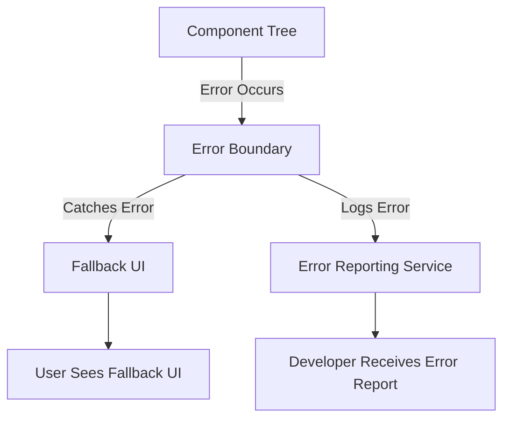

## 15.22 Error Boundaries and Error Handling in Front-End Frameworks

In modern web development, ensuring that applications handle errors gracefully is crucial for maintaining a seamless user experience. This section delves into error boundaries and error handling strategies in popular front-end frameworks like React, Vue.js, and Angular. We will explore how to catch, display, and report errors, while also discussing best practices for debugging and improving user experience.

### Introduction to Error Handling in Front-End Frameworks

Error handling in front-end applications is essential for creating robust and user-friendly interfaces. Errors can occur due to various reasons, such as network failures, invalid user inputs, or unexpected application states. Proper error handling ensures that these issues are managed gracefully, preventing application crashes and providing meaningful feedback to users.

### Error Boundaries in React

#### What Are Error Boundaries?

Error boundaries are a React-specific feature that allows developers to catch JavaScript errors anywhere in their component tree, log those errors, and display a fallback UI instead of crashing the entire application. Error boundaries are implemented using React components that implement the `componentDidCatch` lifecycle method or the static `getDerivedStateFromError` method.

#### Implementing Error Boundaries

To create an error boundary in React, you need to define a class component that implements the error handling lifecycle methods. Here's a simple example:

```javascript
import React, { Component } from 'react';

class ErrorBoundary extends Component {
  constructor(props) {
    super(props);
    this.state = { hasError: false };
  }

  static getDerivedStateFromError(error) {
    // Update state so the next render will show the fallback UI
    return { hasError: true };
  }

  componentDidCatch(error, errorInfo) {
    // You can also log the error to an error reporting service
    console.error("Error caught by ErrorBoundary:", error, errorInfo);
  }

  render() {
    if (this.state.hasError) {
      // You can render any custom fallback UI
      return <h1>Something went wrong.</h1>;
    }

    return this.props.children; 
  }
}

export default ErrorBoundary;
```

In this example, the `ErrorBoundary` component catches errors in its child components and displays a fallback UI when an error occurs. The `componentDidCatch` method is used to log error details, which can be sent to an error reporting service.

#### Using Error Boundaries

To use an error boundary, wrap it around any component that might throw an error:

```javascript
import React from 'react';
import ErrorBoundary from './ErrorBoundary';
import MyComponent from './MyComponent';

function App() {
  return (
    <ErrorBoundary>
      <MyComponent />
    </ErrorBoundary>
  );
}

export default App;
```

By wrapping `MyComponent` with `ErrorBoundary`, any errors thrown by `MyComponent` or its descendants will be caught, and the fallback UI will be displayed.

#### Limitations of Error Boundaries

It's important to note that error boundaries do not catch errors for:

- Event handlers
- Asynchronous code (e.g., `setTimeout` or `requestAnimationFrame` callbacks)
- Server-side rendering
- Errors thrown in the error boundary itself (rather than its children)

### Error Handling in Vue.js

Vue.js provides a global error handling mechanism through the `errorHandler` option. This option allows developers to define a function that will be called whenever an error is captured from a component.

#### Using the `errorHandler` Option

Here's how you can set up a global error handler in Vue.js:

```javascript
Vue.config.errorHandler = function (err, vm, info) {
  // Handle the error
  console.error('Error:', err);
  console.error('Component:', vm);
  console.error('Info:', info);

  // Optionally, report the error to a service
};
```

The `errorHandler` function receives three arguments:

- `err`: The error object
- `vm`: The Vue instance where the error was captured
- `info`: A string containing additional information about the error

#### Local Error Handling

In addition to the global error handler, Vue components can also handle errors locally using the `errorCaptured` lifecycle hook:

```javascript
export default {
  data() {
    return {
      // component data
    };
  },
  errorCaptured(err, vm, info) {
    // Handle the error locally
    console.error('Local error:', err);
    return false; // Returning false prevents the error from propagating further
  }
};
```

The `errorCaptured` hook works similarly to the global `errorHandler`, but it allows for more granular control over error handling within specific components.

### Error Handling in Angular

Angular provides a built-in `ErrorHandler` class that can be extended to create custom error handling logic. This class is used to handle errors globally across the application.

#### Creating a Custom ErrorHandler

To create a custom error handler in Angular, extend the `ErrorHandler` class and override the `handleError` method:

```typescript
import { ErrorHandler, Injectable } from '@angular/core';

@Injectable()
export class GlobalErrorHandler implements ErrorHandler {
  handleError(error: any): void {
    // Handle the error
    console.error('An error occurred:', error);

    // Optionally, report the error to a service
  }
}
```

#### Providing the Custom ErrorHandler

To use the custom error handler, provide it in the Angular module:

```typescript
import { NgModule } from '@angular/core';
import { BrowserModule } from '@angular/platform-browser';
import { AppComponent } from './app.component';
import { GlobalErrorHandler } from './global-error-handler';

@NgModule({
  declarations: [AppComponent],
  imports: [BrowserModule],
  providers: [{ provide: ErrorHandler, useClass: GlobalErrorHandler }],
  bootstrap: [AppComponent]
})
export class AppModule {}
```

By providing the `GlobalErrorHandler`, Angular will use it to handle all uncaught errors in the application.

### Best Practices for Error Handling

#### User Experience

- **Display User-Friendly Messages**: Avoid showing technical error messages to users. Instead, provide clear and concise messages that explain what went wrong and how users can proceed.
- **Fallback UI**: Implement fallback UIs to ensure that the application remains functional even when errors occur.
- **Graceful Degradation**: Design your application to degrade gracefully in case of errors, allowing users to continue using unaffected parts of the application.

#### Debugging and Logging

- **Log Errors**: Use logging services to capture error details and stack traces. This information is invaluable for debugging and improving application stability.
- **Monitor Error Trends**: Regularly review error logs to identify recurring issues and prioritize fixes.
- **Use Source Maps**: Enable source maps in production to get readable stack traces, making it easier to trace errors back to the original source code.

#### Reporting Errors

- **Use Error Tracking Services**: Integrate with error tracking services like Sentry or Rollbar to automatically capture and report errors.
- **Notify Developers**: Set up notifications for critical errors to ensure that developers are alerted promptly.

### Logging and Reporting Errors

Logging and reporting errors are crucial for maintaining application health and improving user experience. By capturing error details and sending them to a centralized service, developers can quickly identify and resolve issues.

#### Integrating with Error Tracking Services

Here's an example of integrating Sentry with a React application:

```javascript
import * as Sentry from '@sentry/react';
import { Integrations } from '@sentry/tracing';

Sentry.init({
  dsn: 'YOUR_SENTRY_DSN',
  integrations: [new Integrations.BrowserTracing()],
  tracesSampleRate: 1.0,
});
```

In this example, Sentry is initialized with a Data Source Name (DSN) and configured to capture browser tracing information. This setup allows Sentry to automatically capture and report errors.

### Try It Yourself

Experiment with the error handling examples provided in this section. Try modifying the error boundary in React to display different fallback UIs based on the error type. In Vue.js, create a component that uses the `errorCaptured` hook to handle errors locally. In Angular, extend the `GlobalErrorHandler` to log errors to a custom service.

### Visualizing Error Handling Flow

Below is a diagram illustrating the flow of error handling in a React application using error boundaries:



**Diagram Description**: This diagram shows how an error boundary catches an error in the component tree, displays a fallback UI, logs the error, and reports it to a service, allowing developers to receive error reports.

### Knowledge Check

- What are error boundaries in React, and how do they enhance error handling?
- How can you implement a global error handler in Vue.js?
- Describe the process of creating a custom error handler in Angular.
- What are some best practices for improving user experience when errors occur?
- How can logging and reporting errors help in maintaining application stability?

### Summary

In this section, we've explored error boundaries and error handling strategies in front-end frameworks like React, Vue.js, and Angular. By implementing these techniques, developers can create more robust applications that handle errors gracefully, providing a better user experience and facilitating easier debugging.

Remember, this is just the beginning. As you progress, you'll build more complex and interactive web applications. Keep experimenting, stay curious, and enjoy the journey!

## Mastering Error Handling in Front-End Frameworks



### What is the primary purpose of error boundaries in React?

- [x] To catch JavaScript errors in the component tree and display a fallback UI
- [ ] To handle asynchronous errors in event handlers
- [ ] To manage server-side rendering errors
- [ ] To optimize component rendering performance

> **Explanation:** Error boundaries in React are designed to catch JavaScript errors in the component tree and display a fallback UI, preventing the entire application from crashing.

### How can you implement a global error handler in Vue.js?

- [x] By setting the `Vue.config.errorHandler` option
- [ ] By using the `errorCaptured` lifecycle hook
- [ ] By extending the `ErrorHandler` class
- [ ] By wrapping components in a try-catch block

> **Explanation:** In Vue.js, a global error handler can be implemented by setting the `Vue.config.errorHandler` option, which captures errors from all components.

### What method should be overridden to create a custom error handler in Angular?

- [x] `handleError`
- [ ] `componentDidCatch`
- [ ] `errorCaptured`
- [ ] `getDerivedStateFromError`

> **Explanation:** In Angular, the `handleError` method of the `ErrorHandler` class should be overridden to create a custom error handler.

### Which of the following is NOT a limitation of React error boundaries?

- [ ] They do not catch errors in event handlers
- [ ] They do not catch errors in asynchronous code
- [ ] They do not catch errors during server-side rendering
- [x] They do not catch errors in child components

> **Explanation:** React error boundaries are specifically designed to catch errors in child components, which is not a limitation.

### What is a best practice for displaying error messages to users?

- [x] Display user-friendly messages that explain what went wrong
- [ ] Show technical error details and stack traces
- [ ] Hide all error messages to avoid confusion
- [ ] Use generic error messages for all errors

> **Explanation:** Displaying user-friendly messages that explain what went wrong is a best practice for improving user experience.

### How can logging errors help in maintaining application stability?

- [x] By capturing error details and stack traces for debugging
- [ ] By preventing errors from occurring
- [ ] By automatically fixing errors
- [ ] By optimizing application performance

> **Explanation:** Logging errors helps maintain application stability by capturing error details and stack traces, which are invaluable for debugging and resolving issues.

### Which service can be used for error tracking in front-end applications?

- [x] Sentry
- [ ] Babel
- [ ] Webpack
- [ ] ESLint

> **Explanation:** Sentry is a popular service used for error tracking in front-end applications, allowing developers to capture and report errors.

### What is the role of the `errorCaptured` hook in Vue.js?

- [x] To handle errors locally within a component
- [ ] To implement a global error handler
- [ ] To log errors to a service
- [ ] To catch errors in asynchronous code

> **Explanation:** The `errorCaptured` hook in Vue.js is used to handle errors locally within a component, providing more granular control over error handling.

### How can you integrate Sentry with a React application?

- [x] By initializing Sentry with a DSN and configuring integrations
- [ ] By using the `errorCaptured` hook
- [ ] By extending the `ErrorHandler` class
- [ ] By setting the `Vue.config.errorHandler` option

> **Explanation:** Sentry can be integrated with a React application by initializing it with a DSN and configuring necessary integrations for error tracking.

### True or False: Error boundaries in React can catch errors in asynchronous code.

- [ ] True
- [x] False

> **Explanation:** Error boundaries in React cannot catch errors in asynchronous code, such as those in `setTimeout` or `requestAnimationFrame` callbacks.


