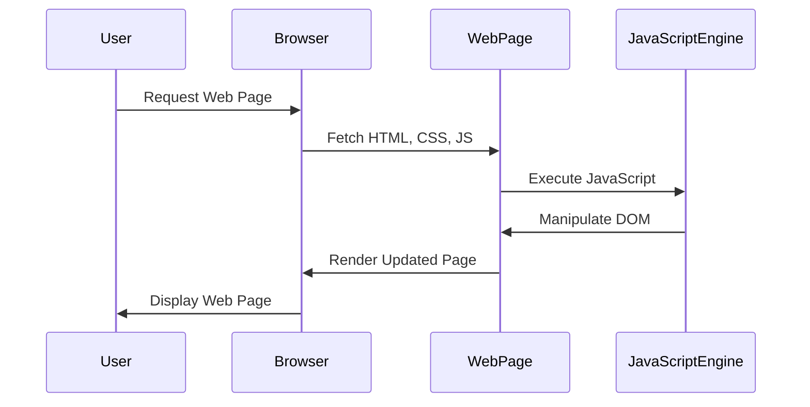

## 15.23 Cross-Browser Compatibility Strategies

Ensuring that your web application functions seamlessly across different browsers and environments is a crucial aspect of modern web development. With a plethora of browsers available, each with its own rendering engine and JavaScript interpreter, achieving cross-browser compatibility can be challenging. In this section, we will explore common compatibility issues, strategies for testing across browsers, and best practices for writing compatible code.

### Understanding Cross-Browser Compatibility

Cross-browser compatibility refers to the ability of a web application to function correctly across different web browsers. This involves ensuring that the user interface, functionality, and performance are consistent, regardless of the browser being used.

#### Common Compatibility Issues

1. **CSS Rendering Differences**: Different browsers may interpret CSS styles differently, leading to inconsistencies in layout and design.
2. **JavaScript API Support**: Not all browsers support the latest JavaScript APIs, which can lead to functionality issues.
3. **HTML5 Features**: Some HTML5 features may not be supported in older browsers.
4. **Vendor Prefixes**: Certain CSS properties require vendor prefixes to work across different browsers.
5. **DOM Manipulation**: Variations in how browsers handle DOM manipulation can lead to unexpected behavior.

### Strategies for Testing Across Browsers

Testing your web application across multiple browsers is essential to ensure compatibility. Here are some strategies to consider:

#### Using BrowserStack

[BrowserStack](https://www.browserstack.com/) is a popular tool for cross-browser testing. It allows you to test your web application on a wide range of browsers and devices without the need for physical hardware.

- **Advantages**: Access to a vast array of browsers and devices, real-time testing, and automated testing capabilities.
- **How to Use**: Sign up for an account, select the browsers and devices you want to test on, and start testing your application.

#### Setting Up Local Testing Environments

For developers who prefer a local setup, creating a testing environment on your machine can be beneficial.

- **Virtual Machines**: Use virtual machines to run different operating systems and browsers.
- **Docker Containers**: Set up Docker containers with different browser configurations for testing.
- **Local Browser Installations**: Install multiple browsers on your machine for quick testing.

#### Feature Detection Over User-Agent Sniffing

Feature detection is a technique used to determine whether a browser supports a particular feature, rather than relying on the browser's user-agent string.

- **Why Feature Detection?**: User-agent strings can be spoofed, leading to inaccurate results. Feature detection ensures that your code adapts to the capabilities of the browser.
- **How to Implement**: Use libraries like Modernizr to detect features and provide fallbacks for unsupported features.

### Using "Can I Use" for Checking Feature Support

[Can I Use](https://caniuse.com/) is an invaluable resource for checking the support status of web technologies across different browsers.

- **How to Use**: Search for a specific feature to see its support status across various browsers. This helps you make informed decisions about which features to use and when to provide fallbacks.

### Best Practices for Writing Compatible Code

Writing code that works across different browsers requires adherence to certain best practices:

1. **Use Web Standards**: Stick to web standards to ensure maximum compatibility.
2. **Avoid Browser-Specific Code**: Refrain from using browser-specific features unless absolutely necessary.
3. **Polyfills and Transpilers**: Use polyfills to add support for features not natively supported in some browsers. Transpilers like Babel can convert modern JavaScript into a version compatible with older browsers.
4. **Responsive Design**: Ensure your application is responsive to different screen sizes and resolutions.
5. **Testing and Debugging**: Regularly test your application in different browsers and use debugging tools to identify and fix issues.

### Code Example: Feature Detection with Modernizr

Let's look at a simple example of using Modernizr for feature detection:

```html
<!DOCTYPE html>
<html lang="en">
<head>
    <meta charset="UTF-8">
    <meta name="viewport" content="width=device-width, initial-scale=1.0">
    <title>Feature Detection Example</title>
    <script src="https://cdnjs.cloudflare.com/ajax/libs/modernizr/3.11.7/modernizr.min.js"></script>
</head>
<body>
    <script>
        // Check if the browser supports the 'flexbox' feature
        if (Modernizr.flexbox) {
            console.log("Flexbox is supported!");
            // Use flexbox layout
        } else {
            console.log("Flexbox is not supported. Using fallback.");
            // Provide a fallback layout
        }
    </script>
</body>
</html>
```

### Visualizing JavaScript's Interaction with Web Browsers and Web Pages

To better understand how JavaScript interacts with web browsers and web pages, let's visualize the process using a sequence diagram:



**Diagram Description**: This sequence diagram illustrates the interaction between the user, browser, web page, and JavaScript engine. The user requests a web page, which the browser fetches. The JavaScript engine executes the JavaScript code, manipulating the DOM as needed, and the browser renders the updated page for the user.

### Knowledge Check

1. **What is cross-browser compatibility, and why is it important?**
2. **List three common compatibility issues developers face.**
3. **Explain the difference between feature detection and user-agent sniffing.**
4. **How can BrowserStack assist in cross-browser testing?**
5. **Why is it important to use web standards when writing code?**

### Exercises

1. **Set up a local testing environment using Docker containers and test a simple web application across different browsers.**
2. **Use Modernizr to detect support for a new HTML5 feature and provide a fallback for unsupported browsers.**
3. **Explore the "Can I Use" website to check the support status of the CSS Grid feature across different browsers.**

### Summary

Cross-browser compatibility is a vital aspect of web development, ensuring that your application functions correctly across different browsers and environments. By understanding common compatibility issues, utilizing tools like BrowserStack, and adhering to best practices, you can create a seamless user experience for all users. Remember, this is just the beginning. As you progress, you'll build more complex and interactive web pages. Keep experimenting, stay curious, and enjoy the journey!

## Test Your Knowledge on Cross-Browser Compatibility Strategies



### What is cross-browser compatibility?

- [x] The ability of a web application to function correctly across different web browsers.
- [ ] The ability of a web application to function correctly on different operating systems.
- [ ] The ability of a web application to function correctly on different devices.
- [ ] The ability of a web application to function correctly with different programming languages.

> **Explanation:** Cross-browser compatibility refers to the ability of a web application to function correctly across different web browsers.

### Which tool is commonly used for cross-browser testing?

- [x] BrowserStack
- [ ] Docker
- [ ] Babel
- [ ] Node.js

> **Explanation:** BrowserStack is a popular tool for cross-browser testing, allowing developers to test their applications on a wide range of browsers and devices.

### What is feature detection?

- [x] A technique used to determine whether a browser supports a particular feature.
- [ ] A method for identifying the user-agent string of a browser.
- [ ] A process for optimizing web application performance.
- [ ] A strategy for managing browser-specific code.

> **Explanation:** Feature detection is a technique used to determine whether a browser supports a particular feature, ensuring that code adapts to the capabilities of the browser.

### Why is it important to use web standards?

- [x] To ensure maximum compatibility across different browsers.
- [ ] To improve the performance of web applications.
- [ ] To reduce the size of web applications.
- [ ] To enhance the security of web applications.

> **Explanation:** Using web standards ensures maximum compatibility across different browsers, making it easier to maintain and support web applications.

### What is the purpose of using polyfills?

- [x] To add support for features not natively supported in some browsers.
- [ ] To improve the performance of JavaScript code.
- [ ] To reduce the size of CSS files.
- [ ] To enhance the security of web applications.

> **Explanation:** Polyfills are used to add support for features not natively supported in some browsers, ensuring compatibility.

### What is the advantage of using feature detection over user-agent sniffing?

- [x] Feature detection ensures code adapts to the capabilities of the browser.
- [ ] Feature detection is faster than user-agent sniffing.
- [ ] Feature detection is easier to implement than user-agent sniffing.
- [ ] Feature detection is more secure than user-agent sniffing.

> **Explanation:** Feature detection ensures that code adapts to the capabilities of the browser, providing more accurate results than user-agent sniffing.

### What is the role of Modernizr in cross-browser compatibility?

- [x] It helps detect features and provide fallbacks for unsupported features.
- [ ] It optimizes the performance of web applications.
- [ ] It manages browser-specific code.
- [ ] It enhances the security of web applications.

> **Explanation:** Modernizr helps detect features and provide fallbacks for unsupported features, aiding in cross-browser compatibility.

### What is the purpose of using Docker containers for testing?

- [x] To set up different browser configurations for testing.
- [ ] To improve the performance of web applications.
- [ ] To reduce the size of web applications.
- [ ] To enhance the security of web applications.

> **Explanation:** Docker containers can be used to set up different browser configurations for testing, providing a local testing environment.

### What is the significance of the "Can I Use" website?

- [x] It provides information on the support status of web technologies across different browsers.
- [ ] It offers tools for optimizing web application performance.
- [ ] It provides resources for learning web development.
- [ ] It offers security guidelines for web applications.

> **Explanation:** The "Can I Use" website provides information on the support status of web technologies across different browsers, helping developers make informed decisions.

### True or False: User-agent strings can be spoofed, leading to inaccurate results.

- [x] True
- [ ] False

> **Explanation:** User-agent strings can be spoofed, leading to inaccurate results, which is why feature detection is preferred.



---
