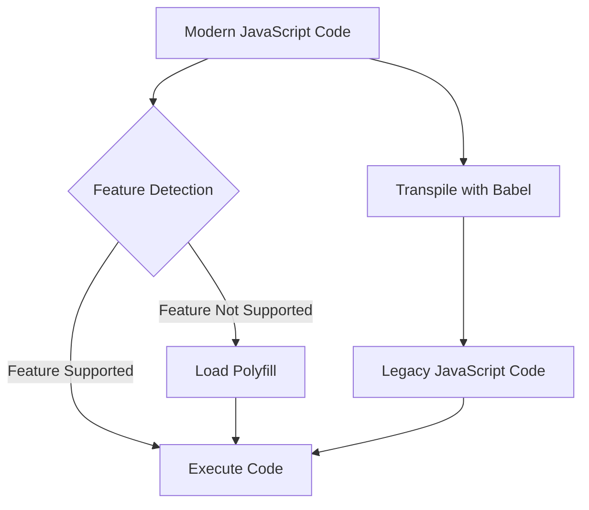

## 15.24 Using Polyfills and Transpilers for Legacy Support

In the ever-evolving world of web development, staying up-to-date with the latest JavaScript features is crucial for creating efficient and modern applications. However, the challenge lies in ensuring these applications remain accessible to users on older browsers that may not support the latest standards. This is where polyfills and transpilers come into play. In this section, we'll explore how these tools can help bridge the gap between modern JavaScript and legacy browser support.

### Understanding Polyfills

**Polyfills** are JavaScript code snippets that replicate the functionality of modern features in older environments where they are not natively supported. They act as a compatibility layer, allowing developers to use new JavaScript features without worrying about breaking functionality in older browsers.

#### How Polyfills Work

Polyfills work by checking if a particular feature is available in the user's browser. If the feature is missing, the polyfill provides an equivalent implementation. This ensures that your code can run seamlessly across different environments.

```javascript
// Example of a simple polyfill for Array.prototype.includes
if (!Array.prototype.includes) {
  Array.prototype.includes = function(searchElement, fromIndex) {
    return this.indexOf(searchElement, fromIndex) !== -1;
  };
}
```

In this example, the polyfill checks if `Array.prototype.includes` is available. If not, it defines the method using `indexOf`, which is widely supported in older browsers.

### Common Polyfill Libraries

Several libraries provide a comprehensive set of polyfills for various JavaScript features. Let's explore two popular options:

#### [core-js](https://github.com/zloirock/core-js)

`core-js` is a modular standard library that provides polyfills for ECMAScript features, including those from ES5, ES6, and beyond. It allows developers to import only the polyfills they need, reducing the overall bundle size.

```javascript
// Importing specific polyfills from core-js
import 'core-js/es/array/includes';
import 'core-js/es/promise';
```

#### [polyfill.io](https://polyfill.io/)

`polyfill.io` is a service that automatically detects the user's browser and serves only the necessary polyfills. This approach minimizes the amount of code sent to the client, optimizing performance.

```html
<!-- Using polyfill.io to load necessary polyfills -->
<script src="https://polyfill.io/v3/polyfill.min.js"></script>
```

### Introducing Transpilers

**Transpilers** are tools that convert modern JavaScript code into a version that is compatible with older environments. They allow developers to write code using the latest features without worrying about browser compatibility.

#### Babel: A Popular Transpiler

[Babel](https://babeljs.io/) is one of the most widely used JavaScript transpilers. It transforms ECMAScript 2015+ code into a backward-compatible version, enabling developers to use modern syntax and features.

##### Configuring Babel

To use Babel, you need to set up a configuration file, typically named `.babelrc` or `babel.config.js`. This file specifies the presets and plugins Babel should use to transform your code.

```json
// Example .babelrc configuration
{
  "presets": [
    ["@babel/preset-env", {
      "targets": {
        "browsers": ["last 2 versions", "ie >= 11"]
      }
    }]
  ]
}
```

In this configuration, `@babel/preset-env` is used to determine which transformations and polyfills are necessary based on the specified browser targets.

### Balancing Modern Features and Compatibility

When using polyfills and transpilers, it's essential to strike a balance between leveraging modern JavaScript features and maintaining compatibility with older browsers. Here are some best practices to consider:

#### Best Practices

1. **Target Specific Browsers**: Use tools like [Browserslist](https://github.com/browserslist/browserslist) to define the browsers you want to support. This helps Babel and polyfill services optimize the code for your target audience.

2. **Minimize Bundle Size**: Only include the polyfills and transformations you need. Tools like `core-js` allow you to import specific features, reducing the overall bundle size.

3. **Monitor Performance**: Polyfills and transpiled code can impact performance. Regularly test your application's performance across different browsers to ensure it remains responsive.

4. **Stay Informed**: Keep up-to-date with the latest developments in JavaScript and browser support. This allows you to phase out polyfills and transpilers as older browsers become obsolete.

### Performance Considerations

While polyfills and transpilers are invaluable for maintaining compatibility, they can introduce performance overhead. Here are some strategies to mitigate this:

- **Lazy Loading**: Load polyfills only when necessary. For example, use feature detection to conditionally load polyfills for specific features.

- **Code Splitting**: Break your application into smaller chunks and load them on demand. This reduces the initial load time and improves performance.

- **Optimize Transpilation**: Use Babel's `@babel/preset-env` to target specific browsers and avoid unnecessary transformations.

### Try It Yourself

To get hands-on experience with polyfills and transpilers, try modifying the following example:

1. Set up a simple HTML page with a script that uses modern JavaScript features, such as `Promise` and `Array.prototype.includes`.
2. Use `core-js` to polyfill these features for older browsers.
3. Configure Babel to transpile the code for Internet Explorer 11.
4. Test the page in different browsers to see the polyfills and transpiled code in action.

### Visualizing the Process

To better understand how polyfills and transpilers work together, let's visualize the process using a flowchart:



**Caption**: This flowchart illustrates how polyfills and transpilers enable modern JavaScript features in legacy environments.

### References and Links

- [MDN Web Docs: Polyfill](https://developer.mozilla.org/en-US/docs/Glossary/Polyfill)
- [Babel Documentation](https://babeljs.io/docs/en/)
- [Browserslist Documentation](https://github.com/browserslist/browserslist)

### Knowledge Check

To reinforce your understanding of polyfills and transpilers, try answering the following questions:

## Understanding Polyfills and Transpilers for JavaScript Legacy Support



### What is the primary purpose of a polyfill?

- [x] To provide functionality for unsupported features in older browsers
- [ ] To minify JavaScript code
- [ ] To convert JavaScript into machine code
- [ ] To optimize JavaScript performance

> **Explanation:** Polyfills are used to provide functionality for features that are not natively supported in older browsers.

### Which library allows you to import specific polyfills for ECMAScript features?

- [x] core-js
- [ ] jQuery
- [ ] Lodash
- [ ] D3.js

> **Explanation:** `core-js` is a library that provides polyfills for ECMAScript features, allowing developers to import only what they need.

### What is the role of a transpiler in JavaScript development?

- [x] To convert modern JavaScript code into a version compatible with older environments
- [ ] To compress JavaScript files
- [ ] To execute JavaScript code on the server
- [ ] To provide real-time debugging

> **Explanation:** Transpilers convert modern JavaScript code into a version that can run in older environments, ensuring compatibility.

### Which tool is commonly used as a JavaScript transpiler?

- [x] Babel
- [ ] Webpack
- [ ] ESLint
- [ ] TypeScript

> **Explanation:** Babel is a popular JavaScript transpiler that converts ECMAScript 2015+ code into a backward-compatible version.

### How can you minimize the performance impact of polyfills?

- [x] By loading polyfills only when necessary
- [ ] By using more polyfills
- [ ] By avoiding feature detection
- [ ] By disabling JavaScript

> **Explanation:** Loading polyfills only when necessary helps minimize the performance impact on your application.

### What is the purpose of the `@babel/preset-env` preset?

- [x] To determine which transformations and polyfills are necessary based on target browsers
- [ ] To minify JavaScript code
- [ ] To provide real-time debugging
- [ ] To execute JavaScript on the server

> **Explanation:** `@babel/preset-env` helps Babel determine which transformations and polyfills are needed based on the specified target browsers.

### Which service automatically detects the user's browser and serves only the necessary polyfills?

- [x] polyfill.io
- [ ] core-js
- [ ] Babel
- [ ] Webpack

> **Explanation:** `polyfill.io` is a service that detects the user's browser and serves only the necessary polyfills, optimizing performance.

### What is a best practice for balancing modern features and compatibility?

- [x] Target specific browsers using tools like Browserslist
- [ ] Use as many polyfills as possible
- [ ] Avoid using modern JavaScript features
- [ ] Disable JavaScript in older browsers

> **Explanation:** Targeting specific browsers helps optimize the use of polyfills and transpilers, balancing modern features and compatibility.

### Which tool can help define the browsers you want to support?

- [x] Browserslist
- [ ] Babel
- [ ] ESLint
- [ ] Webpack

> **Explanation:** Browserslist is a tool that helps define the browsers you want to support, guiding Babel and polyfill services.

### True or False: Transpilers can convert JavaScript code into machine code.

- [ ] True
- [x] False

> **Explanation:** Transpilers convert modern JavaScript code into a version compatible with older environments, not into machine code.



### Embrace the Journey

Remember, mastering the use of polyfills and transpilers is just the beginning. As you continue to develop your skills, you'll be able to create more robust and accessible web applications. Keep experimenting, stay curious, and enjoy the journey!
