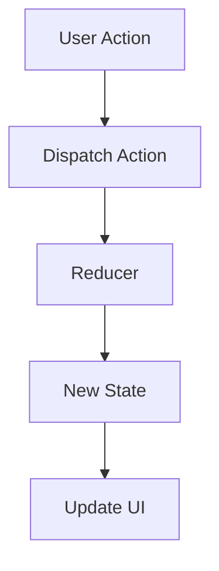

## 15.3 State Management Patterns

In modern front-end development, managing application state effectively is crucial for building robust and scalable applications. As applications grow in complexity, so does the challenge of maintaining a consistent and predictable state. In this section, we will explore various state management patterns and strategies, focusing on local component state versus global application state, and introduce popular state management libraries such as Redux, MobX, Vuex, and NgRx.

### Understanding State Management Challenges

State management in front-end applications involves keeping track of data that changes over time and ensuring that the UI reflects these changes accurately. As applications become more complex, managing state can become challenging due to:

- **Increased Complexity**: As the number of components and interactions grows, so does the complexity of managing state.
- **Data Consistency**: Ensuring that all parts of the application reflect the current state accurately.
- **Predictability**: Making sure that state changes are predictable and easy to debug.
- **Performance**: Minimizing unnecessary re-renders and optimizing state updates.

### Local Component State vs. Global Application State

Before diving into state management libraries, it's important to understand the distinction between local component state and global application state.

#### Local Component State

Local component state refers to state that is managed within a single component. This state is typically used for UI-specific data that does not need to be shared across components. For example, form inputs, toggle states, and component-specific flags are often managed as local state.

```javascript
import React, { useState } from 'react';

function Counter() {
  const [count, setCount] = useState(0);

  return (
    <div>
      <p>Count: {count}</p>
      <button onClick={() => setCount(count + 1)}>Increment</button>
    </div>
  );
}
```

#### Global Application State

Global application state, on the other hand, is state that needs to be shared across multiple components. This state is often managed using a state management library to ensure consistency and predictability. Examples include user authentication status, application settings, and data fetched from APIs.

### State Management Libraries

To manage global application state effectively, several libraries have been developed. Let's explore some of the most popular ones:

#### Redux

[Redux](https://redux.js.org/) is a predictable state container for JavaScript applications. It is based on the principles of a single source of truth, state immutability, and pure functions for state updates.

- **Single Source of Truth**: The entire application state is stored in a single object tree within a Redux store.
- **State Immutability**: State updates are performed using pure functions called reducers, which return a new state object.
- **Predictability**: By using pure functions and a single state tree, Redux ensures that state changes are predictable and easy to debug.

```javascript
import { createStore } from 'redux';

// Reducer function
function counterReducer(state = { count: 0 }, action) {
  switch (action.type) {
    case 'INCREMENT':
      return { count: state.count + 1 };
    default:
      return state;
  }
}

// Create Redux store
const store = createStore(counterReducer);

// Dispatch an action
store.dispatch({ type: 'INCREMENT' });

console.log(store.getState()); // { count: 1 }
```

#### MobX

[MobX](https://mobx.js.org/) is a state management library that emphasizes simplicity and reactivity. It uses observable state and reactions to automatically update the UI when state changes.

- **Reactivity**: MobX automatically tracks dependencies and updates the UI when state changes.
- **Simplicity**: MobX allows for a more straightforward approach to state management, with less boilerplate code compared to Redux.

```javascript
import { observable, action } from 'mobx';

class CounterStore {
  @observable count = 0;

  @action increment() {
    this.count += 1;
  }
}

const counterStore = new CounterStore();

counterStore.increment();
console.log(counterStore.count); // 1
```

#### Vuex

[Vuex](https://vuex.vuejs.org/) is the state management library for Vue.js applications. It is inspired by Redux and provides a centralized store for all components in an application.

- **Centralized Store**: Vuex provides a single source of truth for the application state.
- **Vue Integration**: Vuex is tightly integrated with Vue.js, making it easy to use with Vue components.

```javascript
import Vue from 'vue';
import Vuex from 'vuex';

Vue.use(Vuex);

const store = new Vuex.Store({
  state: {
    count: 0
  },
  mutations: {
    increment(state) {
      state.count++;
    }
  }
});

store.commit('increment');
console.log(store.state.count); // 1
```

#### NgRx

[NgRx](https://ngrx.io/) is a state management library for Angular applications, built on the principles of Redux. It provides a reactive state management solution using RxJS.

- **Reactive State Management**: NgRx leverages RxJS to provide a reactive approach to state management.
- **Angular Integration**: NgRx is designed specifically for Angular, providing seamless integration with Angular's architecture.

```typescript
import { createAction, createReducer, on, props } from '@ngrx/store';

// Define actions
export const increment = createAction('[Counter] Increment');

// Define initial state
export interface State {
  count: number;
}

export const initialState: State = {
  count: 0
};

// Create reducer
export const counterReducer = createReducer(
  initialState,
  on(increment, state => ({ count: state.count + 1 }))
);
```

### Implementing State Management Patterns

When implementing state management patterns, consider the following best practices:

- **Organize State**: Structure your state in a way that reflects the application's data model. Use nested objects or arrays to represent complex data structures.
- **Avoid Anti-Patterns**: Avoid common pitfalls such as overusing global state, which can lead to unnecessary re-renders and performance issues.
- **Use Immutability**: Ensure that state updates are performed immutably to maintain predictability and prevent unintended side effects.
- **Leverage Middleware**: Use middleware to handle side effects, such as asynchronous actions or logging.

### Best Practices for Organizing State

Organizing state effectively is crucial for maintaining a scalable and maintainable application. Here are some best practices to consider:

- **Normalize State**: Normalize your state to avoid duplication and make it easier to update specific pieces of data.
- **Use Selectors**: Use selectors to encapsulate state access logic and improve code readability.
- **Modularize State**: Divide your state into modules or slices to keep it organized and manageable.

### Importance of Immutability and Predictability

Immutability and predictability are key principles in state management. By ensuring that state updates are performed immutably, you can prevent unintended side effects and make state changes easier to track and debug.

- **Immutability**: Use libraries like Immutable.js or Immer to enforce immutability in your state updates.
- **Predictability**: Use pure functions for state updates to ensure that state changes are predictable and easy to reason about.

### Visualizing State Management Patterns

To better understand state management patterns, let's visualize the flow of data in a Redux application using a Mermaid.js diagram:



**Diagram Description**: This diagram illustrates the flow of data in a Redux application. A user action triggers a dispatch, which is processed by a reducer to produce a new state. The new state is then used to update the UI.

### Try It Yourself

To reinforce your understanding of state management patterns, try modifying the code examples provided. Experiment with adding new actions, updating state immutably, and integrating middleware for side effects.

### Knowledge Check

To test your understanding of state management patterns, consider the following questions:

- What are the key differences between local component state and global application state?
- How does Redux ensure predictability in state changes?
- What are the benefits of using MobX for state management?
- How does Vuex integrate with Vue.js applications?
- What role does RxJS play in NgRx state management?

### Summary

In this section, we've explored the challenges of state management in front-end applications and introduced popular state management libraries such as Redux, MobX, Vuex, and NgRx. We've discussed best practices for organizing state, avoiding anti-patterns, and ensuring immutability and predictability in state changes. By understanding and implementing these state management patterns, you can build more robust and scalable front-end applications.

Remember, mastering state management is an ongoing journey. As you continue to build and refine your applications, keep experimenting with different patterns and strategies to find what works best for your specific use case.

## Test Your Knowledge on State Management Patterns



### What is a key challenge of state management in front-end applications?

- [x] Ensuring data consistency across components
- [ ] Managing server-side state
- [ ] Handling static data
- [ ] Avoiding code duplication

> **Explanation:** Ensuring data consistency across components is a key challenge in state management, especially as applications grow in complexity.

### What is the primary purpose of Redux in state management?

- [x] To provide a predictable state container
- [ ] To handle server-side rendering
- [ ] To manage CSS styles
- [ ] To optimize network requests

> **Explanation:** Redux is designed to provide a predictable state container for JavaScript applications, ensuring that state changes are consistent and easy to debug.

### How does MobX differ from Redux in managing state?

- [x] MobX uses observable state and reactions
- [ ] MobX requires more boilerplate code
- [ ] MobX is only for Angular applications
- [ ] MobX does not support reactivity

> **Explanation:** MobX uses observable state and reactions to automatically update the UI when state changes, offering a more reactive approach compared to Redux.

### What is a benefit of using Vuex in Vue.js applications?

- [x] Centralized store for all components
- [ ] Automatic server-side rendering
- [ ] Built-in CSS management
- [ ] No need for state management

> **Explanation:** Vuex provides a centralized store for all components in a Vue.js application, making it easier to manage global state.

### What is the role of RxJS in NgRx state management?

- [x] Provides a reactive approach to state management
- [ ] Handles CSS animations
- [ ] Manages server-side state
- [ ] Optimizes network requests

> **Explanation:** RxJS provides a reactive approach to state management in NgRx, leveraging observables to manage state changes.

### Why is immutability important in state management?

- [x] Prevents unintended side effects
- [ ] Increases code duplication
- [ ] Reduces application performance
- [ ] Complicates state updates

> **Explanation:** Immutability prevents unintended side effects by ensuring that state updates do not modify existing state objects, making changes easier to track and debug.

### What is a common anti-pattern in state management?

- [x] Overusing global state
- [ ] Using local component state
- [ ] Normalizing state
- [ ] Using selectors

> **Explanation:** Overusing global state can lead to unnecessary re-renders and performance issues, making it a common anti-pattern in state management.

### How can middleware be used in state management?

- [x] To handle side effects like asynchronous actions
- [ ] To manage CSS styles
- [ ] To optimize network requests
- [ ] To handle server-side rendering

> **Explanation:** Middleware can be used to handle side effects such as asynchronous actions or logging, providing a way to extend state management functionality.

### What is a best practice for organizing state?

- [x] Normalizing state to avoid duplication
- [ ] Using global variables for all state
- [ ] Avoiding the use of selectors
- [ ] Storing state in local storage

> **Explanation:** Normalizing state helps avoid duplication and makes it easier to update specific pieces of data, improving state organization.

### True or False: Immutability and predictability are key principles in state management.

- [x] True
- [ ] False

> **Explanation:** Immutability and predictability are indeed key principles in state management, ensuring that state changes are consistent and easy to reason about.


