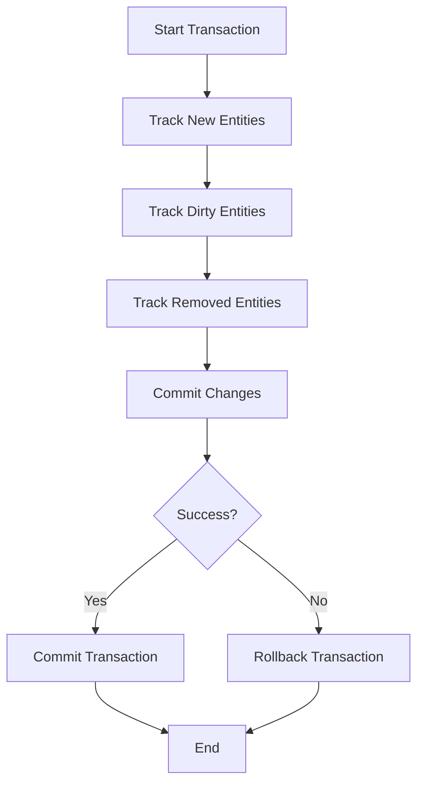

---

linkTitle: "15.4 Unit of Work"
title: "Unit of Work Pattern in JavaScript and TypeScript: Ensuring Data Integrity and Transaction Management"
description: "Explore the Unit of Work design pattern in JavaScript and TypeScript, focusing on maintaining data integrity and efficient transaction management."
categories:
- Design Patterns
- JavaScript
- TypeScript
tags:
- Unit of Work
- Data Management
- Transaction Management
- JavaScript Patterns
- TypeScript Patterns
date: 2024-10-25
type: docs
nav_weight: 1540000
canonical: "https://softwarepatternslexicon.com/patterns-js/15/4"
license: "© 2024 Tokenizer Inc. CC BY-NC-SA 4.0"
---

## 15.4 Unit of Work

In the realm of software design, especially when dealing with data access and management, maintaining data integrity and consistency is paramount. The Unit of Work pattern is a powerful tool that helps achieve these goals by coordinating changes to data as a single transaction. This article delves into the Unit of Work pattern, its implementation in JavaScript and TypeScript, and its practical applications.

### Understand the Concept

The Unit of Work pattern is designed to maintain a list of objects affected by a business transaction and coordinate the writing out of changes. This ensures that all changes are committed as a single transaction, maintaining data integrity. It acts as a bridge between the application and the data source, managing the complexities of transaction handling.

#### Key Benefits:
- **Data Integrity:** Ensures that all changes are committed together, preventing partial updates.
- **Performance Optimization:** Reduces the number of database calls by batching operations.
- **Consistency:** Provides a consistent view of data throughout the transaction.

### Implementation Steps

Implementing the Unit of Work pattern involves several key steps:

#### 1. Implement a Unit of Work Class
Create a class that keeps track of new, modified, and removed entities. This class will manage the state of these entities and coordinate their persistence.

```typescript
class UnitOfWork {
    private newEntities: any[] = [];
    private dirtyEntities: any[] = [];
    private removedEntities: any[] = [];

    registerNew(entity: any) {
        this.newEntities.push(entity);
    }

    registerDirty(entity: any) {
        this.dirtyEntities.push(entity);
    }

    registerRemoved(entity: any) {
        this.removedEntities.push(entity);
    }

    commit() {
        // Begin transaction
        try {
            this.newEntities.forEach(entity => this.insert(entity));
            this.dirtyEntities.forEach(entity => this.update(entity));
            this.removedEntities.forEach(entity => this.delete(entity));
            // Commit transaction
        } catch (error) {
            // Rollback transaction
            throw error;
        } finally {
            this.clear();
        }
    }

    private insert(entity: any) {
        // Logic to insert entity into the database
    }

    private update(entity: any) {
        // Logic to update entity in the database
    }

    private delete(entity: any) {
        // Logic to delete entity from the database
    }

    private clear() {
        this.newEntities = [];
        this.dirtyEntities = [];
        this.removedEntities = [];
    }
}
```

#### 2. Track Entity States
When entities are created, modified, or deleted, register them with the Unit of Work. This allows the Unit of Work to manage their states and ensure they are persisted correctly.

#### 3. Commit Changes
Provide a `commit` method that persists all tracked changes to the database in a transaction. This method should handle transaction management, including rollback in case of errors.

#### 4. Coordinate with Repositories
Repositories can interact with the Unit of Work to register changes. This separation of concerns allows repositories to focus on data retrieval while the Unit of Work manages data persistence.

### Code Examples

Below is a practical example of how the Unit of Work pattern can be implemented in conjunction with a repository:

```typescript
class UserRepository {
    constructor(private unitOfWork: UnitOfWork) {}

    addUser(user: any) {
        this.unitOfWork.registerNew(user);
    }

    updateUser(user: any) {
        this.unitOfWork.registerDirty(user);
    }

    removeUser(user: any) {
        this.unitOfWork.registerRemoved(user);
    }
}

// Usage
const unitOfWork = new UnitOfWork();
const userRepository = new UserRepository(unitOfWork);

const newUser = { id: 1, name: "John Doe" };
userRepository.addUser(newUser);

const existingUser = { id: 2, name: "Jane Doe" };
userRepository.updateUser(existingUser);

unitOfWork.commit();
```

### Use Cases

- **Complex Transactions:** When you need to ensure consistency during complex transactions involving multiple entities.
- **Performance Optimization:** To improve performance by batching database operations, reducing the overhead of multiple database calls.

### Practice

Implement the Unit of Work in conjunction with the Repository and Data Mapper patterns to achieve a robust data access layer. This combination allows for clean separation of concerns and enhances maintainability.

### Considerations

- **Complexity:** The Unit of Work pattern introduces additional complexity. Assess if the benefits outweigh the overhead in your specific use case.
- **Concurrency:** Be cautious with concurrent updates and ensure thread safety if applicable. This is particularly important in multi-threaded environments.

### Visual Representation

To better understand the flow of the Unit of Work pattern, consider the following diagram:



### Advantages and Disadvantages

#### Advantages:
- Ensures data consistency and integrity.
- Optimizes performance by reducing database calls.
- Provides a clear separation of concerns.

#### Disadvantages:
- Adds complexity to the codebase.
- Requires careful handling of concurrency issues.

### Best Practices

- **Use with Repositories:** Leverage the Unit of Work pattern alongside repositories to manage data access effectively.
- **Transaction Management:** Ensure robust transaction management, including error handling and rollback mechanisms.
- **Scalability:** Design the Unit of Work to handle scalability requirements, especially in high-load applications.

### Comparisons

The Unit of Work pattern is often compared with the Repository pattern. While the Repository pattern focuses on data retrieval, the Unit of Work pattern manages data persistence and transaction handling. Together, they provide a comprehensive data access strategy.

### Conclusion

The Unit of Work pattern is a powerful tool for managing data integrity and transaction consistency in JavaScript and TypeScript applications. By coordinating changes as a single transaction, it ensures that your application maintains a consistent state. While it introduces some complexity, the benefits in terms of data integrity and performance optimization often outweigh the overhead.

## Quiz Time!



### What is the primary purpose of the Unit of Work pattern?

- [x] To maintain a list of objects affected by a business transaction and coordinate the writing out of changes.
- [ ] To provide a mechanism for logging application errors.
- [ ] To manage user authentication and authorization.
- [ ] To handle network communication between services.

> **Explanation:** The Unit of Work pattern is designed to maintain a list of objects affected by a business transaction and coordinate the writing out of changes, ensuring data integrity.

### Which method in the UnitOfWork class is responsible for persisting all tracked changes?

- [x] commit
- [ ] registerNew
- [ ] registerDirty
- [ ] registerRemoved

> **Explanation:** The `commit` method is responsible for persisting all tracked changes to the database in a transaction.

### What are the key benefits of using the Unit of Work pattern?

- [x] Data integrity and performance optimization
- [ ] Simplified user interface design
- [ ] Enhanced graphical rendering
- [ ] Improved network latency

> **Explanation:** The Unit of Work pattern ensures data integrity by committing all changes as a single transaction and optimizes performance by reducing the number of database calls.

### In the Unit of Work pattern, what is the role of repositories?

- [x] To interact with the Unit of Work to register changes
- [ ] To manage user sessions
- [ ] To handle file storage
- [ ] To provide network security

> **Explanation:** Repositories interact with the Unit of Work to register changes, allowing them to focus on data retrieval while the Unit of Work manages data persistence.

### What should be considered when implementing the Unit of Work pattern?

- [x] Complexity and concurrency
- [ ] User interface design
- [ ] Network bandwidth
- [ ] Color schemes

> **Explanation:** When implementing the Unit of Work pattern, consider the added complexity and ensure thread safety to handle concurrency issues.

### Which of the following is NOT a method typically found in a UnitOfWork class?

- [ ] registerNew
- [ ] registerDirty
- [ ] registerRemoved
- [x] authenticateUser

> **Explanation:** Methods like `registerNew`, `registerDirty`, and `registerRemoved` are typical in a UnitOfWork class, while `authenticateUser` is unrelated to the pattern.

### How does the Unit of Work pattern improve performance?

- [x] By batching database operations
- [ ] By enhancing graphical rendering
- [ ] By reducing code complexity
- [ ] By increasing network speed

> **Explanation:** The Unit of Work pattern improves performance by batching database operations, reducing the overhead of multiple database calls.

### What is a potential disadvantage of using the Unit of Work pattern?

- [x] It adds complexity to the codebase.
- [ ] It decreases data integrity.
- [ ] It simplifies transaction management.
- [ ] It reduces the need for repositories.

> **Explanation:** A potential disadvantage of the Unit of Work pattern is that it adds complexity to the codebase.

### Which design pattern is often used in conjunction with the Unit of Work pattern?

- [x] Repository
- [ ] Singleton
- [ ] Observer
- [ ] Factory

> **Explanation:** The Repository pattern is often used in conjunction with the Unit of Work pattern to manage data access effectively.

### True or False: The Unit of Work pattern is primarily used for managing user interfaces.

- [ ] True
- [x] False

> **Explanation:** False. The Unit of Work pattern is primarily used for managing data integrity and transaction consistency, not user interfaces.


