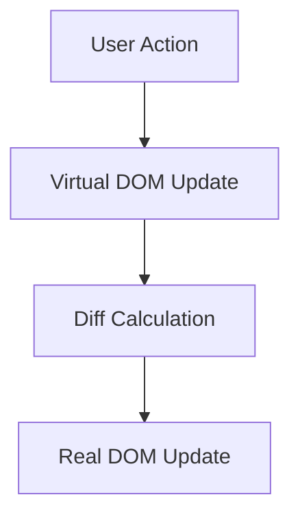
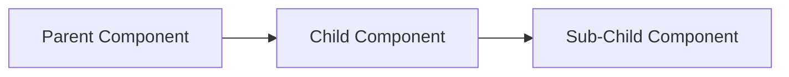
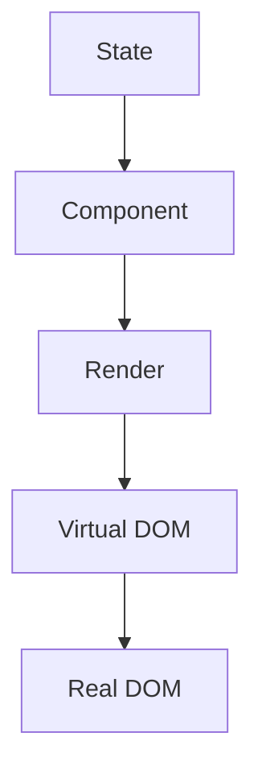

## 15.4 Reactive Programming with React

### Introduction to React

React is a popular JavaScript library for building user interfaces, particularly single-page applications where data changes over time. Developed by Facebook, React allows developers to create large web applications that can update and render efficiently in response to data changes. At its core, React embraces the principles of reactive programming, which focus on building systems that react to changes in data.

### Core Concepts of React

#### Components

React applications are built using components, which are reusable pieces of UI. Components can be either class-based or functional, with the latter being more prevalent in modern React development due to the introduction of Hooks.

```javascript
// Example of a functional component
function Greeting(props) {
  return <h1>Hello, {props.name}!</h1>;
}
```

#### JSX

JSX is a syntax extension for JavaScript that allows developers to write HTML-like code within JavaScript. It makes the code more readable and easier to write.

```javascript
// Example of JSX
const element = <h1>Hello, world!</h1>;
```

#### Virtual DOM

The virtual DOM is a lightweight copy of the actual DOM. React uses it to optimize updates by calculating the difference between the current and previous states and applying only the necessary changes to the real DOM. This process is known as reconciliation.



### State Management in React

State is a built-in object that stores property values that belong to a component. When the state object changes, the component re-renders. React provides several ways to manage state, including the `useState` Hook for functional components.

```javascript
import React, { useState } from 'react';

function Counter() {
  const [count, setCount] = useState(0);

  return (
    <div>
      <p>You clicked {count} times</p>
      <button onClick={() => setCount(count + 1)}>Click me</button>
    </div>
  );
}
```

### Declarative UI and One-Way Data Binding

React's declarative nature means that developers describe what the UI should look like for a given state, and React takes care of updating the DOM to match that state. This approach contrasts with imperative programming, where developers must explicitly define the steps to achieve a desired UI state.

One-way data binding ensures that data flows in a single direction, from parent to child components. This makes the data flow predictable and easier to debug.



### Creating Components and Managing State

#### Class Components

Class components were the primary way to create components before Hooks were introduced. They use a `render` method to return JSX and can manage state using `this.state`.

```javascript
class Welcome extends React.Component {
  constructor(props) {
    super(props);
    this.state = { name: 'World' };
  }

  render() {
    return <h1>Hello, {this.state.name}!</h1>;
  }
}
```

#### Functional Components with Hooks

Hooks allow functional components to use state and other React features. The `useState` Hook is used to add state to a functional component.

```javascript
import React, { useState } from 'react';

function Welcome() {
  const [name, setName] = useState('World');

  return <h1>Hello, {name}!</h1>;
}
```

### Benefits of React's Approach to Building UIs

1. **Efficiency**: The virtual DOM minimizes direct manipulation of the real DOM, leading to faster updates and rendering.
2. **Reusability**: Components can be reused across different parts of an application, reducing code duplication.
3. **Maintainability**: The declarative nature of React makes it easier to understand and maintain code.
4. **Community and Ecosystem**: React has a large community and a rich ecosystem of tools and libraries.

### Enhancing Responsiveness and User Experience with Reactive Programming

Reactive programming in React enhances user experience by ensuring that the UI is always in sync with the underlying data. This leads to more responsive applications that can handle real-time updates efficiently.

#### Example: Real-Time Search

Consider a search component that updates results as the user types. Using React's state management and event handling, we can create a responsive search experience.

```javascript
import React, { useState } from 'react';

function Search() {
  const [query, setQuery] = useState('');
  const [results, setResults] = useState([]);

  const handleSearch = (event) => {
    const newQuery = event.target.value;
    setQuery(newQuery);
    // Simulate an API call
    setResults(fakeApiCall(newQuery));
  };

  return (
    <div>
      <input type="text" value={query} onChange={handleSearch} />
      <ul>
        {results.map((result, index) => (
          <li key={index}>{result}</li>
        ))}
      </ul>
    </div>
  );
}

function fakeApiCall(query) {
  // Simulate filtering results based on the query
  const allResults = ['apple', 'banana', 'cherry', 'date', 'elderberry'];
  return allResults.filter(item => item.includes(query));
}
```

### Try It Yourself

Experiment with the code examples provided. Try modifying the `Counter` component to decrement the count or add a reset button. For the `Search` component, try implementing a debounce function to limit the number of API calls.

### Visualizing React's Data Flow



### Further Reading

- [React Documentation](https://reactjs.org/docs/getting-started.html)
- [MDN Web Docs on React](https://developer.mozilla.org/en-US/docs/Web/JavaScript/Guide/Using_promises)
- [Understanding React's Virtual DOM](https://reactjs.org/docs/faq-internals.html)

### Knowledge Check

1. What is the primary purpose of the virtual DOM in React?
2. How does one-way data binding benefit React applications?
3. Describe the difference between class components and functional components in React.
4. What is the role of the `useState` Hook in functional components?
5. How does React's declarative approach improve code maintainability?

### Summary

In this section, we've explored how React leverages reactive programming principles to build dynamic user interfaces. By understanding React's core concepts, such as components, state management, and the virtual DOM, developers can create efficient and responsive applications. Remember, this is just the beginning. As you progress, you'll build more complex and interactive web pages. Keep experimenting, stay curious, and enjoy the journey!

## Quiz: Mastering Reactive Programming with React



### What is the primary purpose of the virtual DOM in React?

- [x] To optimize updates by minimizing direct manipulation of the real DOM
- [ ] To store all component states
- [ ] To handle user events
- [ ] To manage component lifecycle

> **Explanation:** The virtual DOM is used to optimize updates by calculating the difference between the current and previous states and applying only the necessary changes to the real DOM.

### How does one-way data binding benefit React applications?

- [x] It makes data flow predictable and easier to debug
- [ ] It allows data to flow in multiple directions
- [ ] It automatically updates the database
- [ ] It requires less code

> **Explanation:** One-way data binding ensures that data flows in a single direction, making the data flow predictable and easier to debug.

### What is the role of the `useState` Hook in functional components?

- [x] To add state to a functional component
- [ ] To manage component lifecycle
- [ ] To handle user events
- [ ] To render JSX

> **Explanation:** The `useState` Hook is used to add state to a functional component, allowing it to manage and update its state.

### Describe the difference between class components and functional components in React.

- [x] Class components use `this.state`, while functional components use Hooks
- [ ] Class components cannot manage state
- [ ] Functional components are always faster
- [ ] Class components do not support JSX

> **Explanation:** Class components use `this.state` to manage state, while functional components use Hooks like `useState`.

### How does React's declarative approach improve code maintainability?

- [x] By allowing developers to describe what the UI should look like for a given state
- [ ] By requiring more code
- [ ] By making the code more complex
- [ ] By using more resources

> **Explanation:** React's declarative approach allows developers to describe what the UI should look like for a given state, making the code easier to understand and maintain.

### What is JSX in React?

- [x] A syntax extension for JavaScript that allows writing HTML-like code
- [ ] A type of component
- [ ] A state management tool
- [ ] A lifecycle method

> **Explanation:** JSX is a syntax extension for JavaScript that allows developers to write HTML-like code within JavaScript, making the code more readable.

### What is the benefit of using components in React?

- [x] They allow for reusable pieces of UI
- [ ] They make the application slower
- [ ] They require more code
- [ ] They are only used for styling

> **Explanation:** Components in React allow for reusable pieces of UI, reducing code duplication and improving maintainability.

### What does the `render` method do in class components?

- [x] It returns JSX to be rendered in the DOM
- [ ] It updates the component state
- [ ] It handles user events
- [ ] It manages component lifecycle

> **Explanation:** The `render` method in class components returns JSX, which is then rendered in the DOM.

### What is the purpose of the `setState` function in React?

- [x] To update the component's state and trigger a re-render
- [ ] To handle user events
- [ ] To render JSX
- [ ] To manage component lifecycle

> **Explanation:** The `setState` function is used to update the component's state and trigger a re-render.

### True or False: React's virtual DOM is a direct copy of the real DOM.

- [ ] True
- [x] False

> **Explanation:** False. The virtual DOM is a lightweight copy of the real DOM, used to optimize updates by minimizing direct manipulation of the real DOM.




