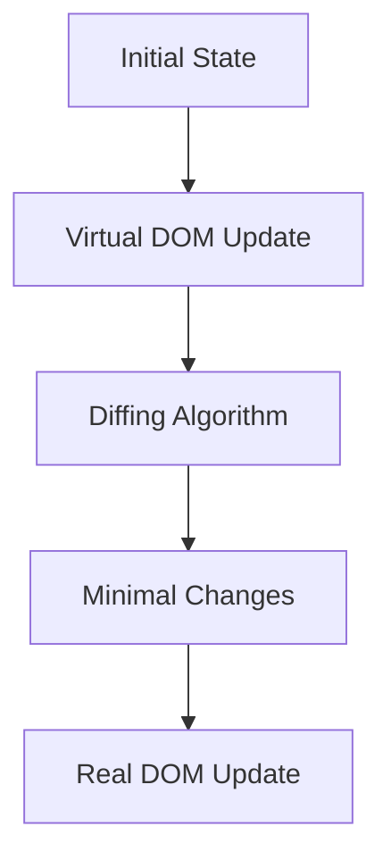

## 15.5 Virtual DOM and Diff Algorithms

### Introduction

In modern web development, creating dynamic and responsive user interfaces is crucial. However, manipulating the Document Object Model (DOM) directly can be inefficient and slow, especially when dealing with complex applications. This is where the concept of the Virtual DOM comes into play. In this section, we will explore what the Virtual DOM is, how it differs from the real DOM, and how it optimizes performance in UI rendering. We will also delve into the diff algorithms used to efficiently update the DOM and provide examples of how popular frameworks like React and Vue.js implement these concepts.

### What is the Virtual DOM?

The Virtual DOM is an abstraction of the real DOM. It is a lightweight, in-memory representation of the actual DOM elements. The primary purpose of the Virtual DOM is to provide a more efficient way to update the UI by minimizing direct manipulations of the real DOM.

#### Real DOM vs. Virtual DOM

- **Real DOM**: The real DOM is the actual representation of the HTML elements in the browser. It is a tree-like structure where each node represents a part of the document. Manipulating the real DOM is costly in terms of performance because each change requires the browser to re-render the entire document or parts of it.

- **Virtual DOM**: The Virtual DOM, on the other hand, is a JavaScript object that mirrors the structure of the real DOM. It allows developers to make changes to the UI without directly interacting with the real DOM. Once changes are made to the Virtual DOM, a diffing algorithm determines the minimal set of changes needed to update the real DOM.

### Performance Benefits of the Virtual DOM

The Virtual DOM offers several performance benefits:

1. **Batch Updates**: Changes to the Virtual DOM can be batched together, reducing the number of direct manipulations to the real DOM.

2. **Efficient Reconciliation**: By using diffing algorithms, the Virtual DOM can efficiently determine the differences between the current and previous states, applying only the necessary updates.

3. **Reduced Repaints and Reflows**: Since the Virtual DOM minimizes direct DOM manipulations, it reduces the number of repaints and reflows, which are costly operations in terms of performance.

4. **Improved Developer Experience**: Developers can write declarative code, focusing on what the UI should look like rather than how to update it.

### How Diffing Algorithms Work

Diffing algorithms are at the heart of the Virtual DOM's efficiency. They are responsible for comparing the current state of the Virtual DOM with its previous state and determining the minimal set of changes needed to update the real DOM.

#### Key Concepts in Diffing Algorithms

- **Tree Comparison**: The Virtual DOM is structured as a tree, similar to the real DOM. Diffing algorithms compare these trees to identify changes.

- **Node Identification**: Each node in the Virtual DOM tree is identified by a unique key, which helps the algorithm track changes and efficiently update the real DOM.

- **Minimal Updates**: The goal of the diffing algorithm is to minimize the number of updates to the real DOM by applying only the necessary changes.

#### Example: React's Diffing Algorithm

React, a popular JavaScript library for building user interfaces, uses a diffing algorithm known as the "reconciliation" process. Here's a simplified explanation of how it works:

1. **Virtual DOM Update**: When the state of a component changes, React creates a new Virtual DOM tree.

2. **Diffing**: React compares the new Virtual DOM tree with the previous one to identify changes.

3. **Reconciliation**: React calculates the minimal set of changes needed and updates the real DOM accordingly.

4. **Batching**: React batches updates to optimize performance, applying changes in a single operation.

```javascript
// Example of a simple React component using Virtual DOM
class MyComponent extends React.Component {
  constructor(props) {
    super(props);
    this.state = { count: 0 };
  }

  increment = () => {
    this.setState({ count: this.state.count + 1 });
  };

  render() {
    return (
      <div>
        <p>Count: {this.state.count}</p>
        <button onClick={this.increment}>Increment</button>
      </div>
    );
  }
}
```

In this example, when the `increment` method is called, React updates the Virtual DOM, performs a diff, and reconciles the changes with the real DOM.

#### Example: Vue.js and the Virtual DOM

Vue.js, another popular JavaScript framework, also uses a Virtual DOM to optimize UI updates. Vue's reactivity system automatically tracks changes to data and updates the Virtual DOM accordingly.

```javascript
// Example of a simple Vue component using Virtual DOM
Vue.component('my-component', {
  data: function() {
    return { count: 0 };
  },
  template: `
    <div>
      <p>Count: {{ count }}</p>
      <button @click="increment">Increment</button>
    </div>
  `,
  methods: {
    increment: function() {
      this.count++;
    }
  }
});
```

In Vue.js, when the `increment` method is called, the Virtual DOM is updated, and Vue's diffing algorithm efficiently updates the real DOM.

### Potential Limitations and Optimizations

While the Virtual DOM provides significant performance benefits, there are potential limitations and ways to optimize rendering:

- **Overhead**: Maintaining a Virtual DOM can introduce some overhead, especially in applications with a large number of components.

- **Complexity**: Understanding how the Virtual DOM and diffing algorithms work can be complex, requiring developers to have a good grasp of the underlying concepts.

- **Optimizations**: Developers can optimize rendering by using techniques such as memoization, shouldComponentUpdate in React, and computed properties in Vue.js to minimize unnecessary updates.

### Understanding the Virtual DOM for Performance

Understanding the Virtual DOM and diffing algorithms is crucial for writing performant components. By leveraging these concepts, developers can create applications that are both responsive and efficient.

### Visualizing the Virtual DOM and Diffing Process

To better understand the Virtual DOM and diffing process, let's visualize how these concepts work together:



**Diagram Explanation**: This diagram illustrates the process of updating the UI using the Virtual DOM. The initial state is updated in the Virtual DOM, which is then compared using a diffing algorithm. The minimal changes are calculated and applied to the real DOM.

### Try It Yourself

To deepen your understanding of the Virtual DOM and diffing algorithms, try modifying the code examples provided. Experiment with different state changes and observe how the Virtual DOM updates the real DOM efficiently.

### References and Further Reading

- [MDN Web Docs: Document Object Model (DOM)](https://developer.mozilla.org/en-US/docs/Web/API/Document_Object_Model)
- [React Documentation: Reconciliation](https://reactjs.org/docs/reconciliation.html)
- [Vue.js Documentation: Virtual DOM](https://vuejs.org/v2/guide/render-function.html#The-Virtual-DOM)

### Knowledge Check

- What is the primary purpose of the Virtual DOM?
- How does the Virtual DOM differ from the real DOM?
- What are the performance benefits of using a Virtual DOM?
- How do diffing algorithms work in the context of the Virtual DOM?
- Provide an example of how React implements the Virtual DOM.

### Embrace the Journey

Remember, mastering the Virtual DOM and diffing algorithms is just the beginning. As you continue to explore these concepts, you'll gain a deeper understanding of how to build efficient and responsive web applications. Keep experimenting, stay curious, and enjoy the journey!

## Quiz: Mastering Virtual DOM and Diff Algorithms



### What is the primary purpose of the Virtual DOM?

- [x] To provide a more efficient way to update the UI
- [ ] To replace the real DOM entirely
- [ ] To store data in the browser
- [ ] To manage server-side rendering

> **Explanation:** The Virtual DOM is used to optimize UI updates by minimizing direct manipulations of the real DOM.

### How does the Virtual DOM differ from the real DOM?

- [x] The Virtual DOM is an in-memory representation of the real DOM
- [ ] The Virtual DOM is stored on the server
- [ ] The Virtual DOM is a physical copy of the real DOM
- [ ] The Virtual DOM is used only for styling

> **Explanation:** The Virtual DOM is a lightweight representation of the real DOM, allowing for efficient updates.

### What is the main benefit of using a diffing algorithm with the Virtual DOM?

- [x] It minimizes the number of updates to the real DOM
- [ ] It increases the size of the application
- [ ] It slows down the rendering process
- [ ] It requires more memory

> **Explanation:** Diffing algorithms help identify the minimal set of changes needed, reducing the number of updates to the real DOM.

### Which JavaScript library is known for using the Virtual DOM and diffing algorithms?

- [x] React
- [ ] jQuery
- [ ] AngularJS
- [ ] Backbone.js

> **Explanation:** React is a popular library that uses the Virtual DOM and diffing algorithms for efficient UI updates.

### What is the process of comparing the current and previous Virtual DOM called?

- [x] Diffing
- [ ] Rendering
- [ ] Compiling
- [ ] Parsing

> **Explanation:** Diffing is the process of comparing the current and previous Virtual DOM to identify changes.

### How can developers optimize rendering in applications using the Virtual DOM?

- [x] By using memoization and minimizing unnecessary updates
- [ ] By increasing the number of components
- [ ] By avoiding the use of keys in lists
- [ ] By directly manipulating the real DOM

> **Explanation:** Developers can optimize rendering by using techniques like memoization and minimizing unnecessary updates.

### What is a potential limitation of using the Virtual DOM?

- [x] It can introduce overhead in applications with many components
- [ ] It requires server-side rendering
- [ ] It cannot be used with JavaScript frameworks
- [ ] It is only compatible with Internet Explorer

> **Explanation:** The Virtual DOM can introduce some overhead, especially in applications with a large number of components.

### In Vue.js, what system automatically tracks changes to data and updates the Virtual DOM?

- [x] Reactivity system
- [ ] Event system
- [ ] State management system
- [ ] Routing system

> **Explanation:** Vue.js uses a reactivity system to automatically track changes to data and update the Virtual DOM.

### True or False: The Virtual DOM is a physical copy of the real DOM.

- [ ] True
- [x] False

> **Explanation:** The Virtual DOM is not a physical copy; it is an in-memory representation of the real DOM.

### What is the goal of the reconciliation process in React?

- [x] To calculate the minimal set of changes needed for the real DOM
- [ ] To increase the number of components
- [ ] To replace the Virtual DOM with the real DOM
- [ ] To manage server-side rendering

> **Explanation:** The reconciliation process in React aims to calculate the minimal set of changes needed to update the real DOM efficiently.


