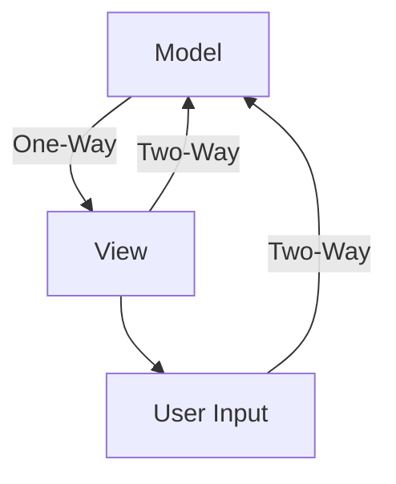

## 15.6 Data Binding Techniques

Data binding is a core concept in modern front-end development, enabling seamless synchronization between the data model and the user interface. This section explores various data binding techniques, focusing on one-way and two-way data binding, and provides examples from popular frameworks such as React, Angular, and Vue.js. We will also discuss the benefits and drawbacks of each approach, how data binding affects component design and state management, and best practices for managing bound data.

### Understanding Data Binding

Data binding refers to the process of connecting the data model of an application to its user interface (UI). This connection ensures that changes in the data model are automatically reflected in the UI and vice versa. There are two primary types of data binding:

- **One-Way Data Binding**: Data flows in a single direction, typically from the model to the view. This approach is common in frameworks like React.
- **Two-Way Data Binding**: Data flows in both directions, allowing changes in the view to update the model and vice versa. This is prevalent in frameworks like Angular and Vue.js.

### One-Way Data Binding in React

React is a JavaScript library for building user interfaces, primarily using one-way data binding. In React, data flows from parent components to child components through props, ensuring a unidirectional data flow.

#### Example of One-Way Data Binding in React

```javascript
import React, { useState } from 'react';

function App() {
  const [message, setMessage] = useState('Hello, World!');

  return (
    <div>
      <h1>{message}</h1>
      <MessageInput setMessage={setMessage} />
    </div>
  );
}

function MessageInput({ setMessage }) {
  const handleChange = (event) => {
    setMessage(event.target.value);
  };

  return <input type="text" onChange={handleChange} />;
}

export default App;
```

In this example, the `App` component maintains the state `message`, which is passed down to the `MessageInput` component. The `MessageInput` component updates the state using the `setMessage` function, demonstrating one-way data flow from the parent to the child.

#### Benefits of One-Way Data Binding

- **Predictability**: One-way data binding makes it easier to track data flow and debug applications.
- **Performance**: React's virtual DOM efficiently updates only the parts of the UI that have changed.
- **Component Reusability**: Components are more reusable as they rely on props for data.

#### Drawbacks of One-Way Data Binding

- **Boilerplate Code**: Managing state and passing props can lead to verbose code.
- **Complex State Management**: As applications grow, managing state across multiple components can become complex.

### Two-Way Data Binding in Angular

Angular is a platform for building web applications, offering two-way data binding as a core feature. This allows for automatic synchronization between the model and the view.

#### Example of Two-Way Data Binding in Angular

```typescript
import { Component } from '@angular/core';

@Component({
  selector: 'app-root',
  template: `
    <div>
      <h1>{{ message }}</h1>
      <input [(ngModel)]="message" />
    </div>
  `,
})
export class AppComponent {
  message: string = 'Hello, Angular!';
}
```

In this Angular example, the `ngModel` directive binds the `message` property to the input field, enabling two-way data binding. Changes in the input field automatically update the `message` property and vice versa.

### Two-Way Data Binding in Vue.js

Vue.js is a progressive JavaScript framework that also supports two-way data binding through its `v-model` directive.

#### Example of Two-Way Data Binding in Vue.js

```html
<template>
  <div>
    <h1>{{ message }}</h1>
    <input v-model="message" />
  </div>
</template>

<script>
export default {
  data() {
    return {
      message: 'Hello, Vue.js!',
    };
  },
};
</script>
```

In this Vue.js example, the `v-model` directive binds the `message` data property to the input field, facilitating two-way data binding.

#### Benefits of Two-Way Data Binding

- **Ease of Use**: Simplifies the process of keeping the model and view in sync.
- **Reduced Boilerplate**: Less code is required to manage data synchronization.

#### Drawbacks of Two-Way Data Binding

- **Complexity**: Can lead to less predictable data flow, making debugging more challenging.
- **Performance Overhead**: Automatic synchronization can introduce performance overhead in large applications.

### Impact on Component Design and State Management

Data binding techniques significantly influence component design and state management strategies:

- **Component Design**: One-way data binding encourages a clear separation of concerns, with components focusing on either data presentation or data logic. Two-way data binding can lead to more tightly coupled components.
- **State Management**: In one-way data binding, state management is often handled using libraries like Redux or Context API in React. In two-way data binding, frameworks like Angular and Vue.js provide built-in mechanisms for state management.

### Best Practices for Managing Bound Data

- **Keep State Localized**: Minimize the number of components that manage state to reduce complexity.
- **Use Immutable Data Structures**: In one-way data binding, use immutable data structures to prevent unintended side effects.
- **Optimize Performance**: In two-way data binding, be mindful of performance implications and optimize data updates.
- **Leverage Framework Tools**: Use framework-specific tools and libraries to manage state and data binding efficiently.

### Conclusion

Data binding is a powerful technique that enhances the interactivity and responsiveness of web applications. Understanding the differences between one-way and two-way data binding, and their implications on component design and state management, is crucial for building efficient and maintainable applications. By following best practices and leveraging the strengths of each framework, developers can create robust and scalable front-end applications.

### Visualizing Data Binding Techniques

Below is a diagram illustrating the flow of data in one-way and two-way data binding:



**Figure 1**: Data flow in one-way and two-way data binding.

### Further Reading

- [React Documentation](https://reactjs.org/docs/getting-started.html)
- [Angular Documentation](https://angular.io/docs)
- [Vue.js Documentation](https://vuejs.org/v2/guide/)

### Knowledge Check

To reinforce your understanding of data binding techniques, consider the following questions and exercises.

## Quiz: Mastering Data Binding Techniques in JavaScript Frameworks



### What is one-way data binding?

- [x] Data flows from the model to the view.
- [ ] Data flows from the view to the model.
- [ ] Data flows in both directions.
- [ ] Data does not flow at all.

> **Explanation:** One-way data binding involves data flowing from the model to the view, ensuring a unidirectional data flow.

### Which framework primarily uses one-way data binding?

- [x] React
- [ ] Angular
- [ ] Vue.js
- [ ] Ember.js

> **Explanation:** React primarily uses one-way data binding, where data flows from parent components to child components through props.

### What directive is used in Angular for two-way data binding?

- [x] ngModel
- [ ] v-model
- [ ] data-bind
- [ ] bind-attr

> **Explanation:** The `ngModel` directive in Angular is used for two-way data binding, allowing automatic synchronization between the model and the view.

### Which directive is used in Vue.js for two-way data binding?

- [x] v-model
- [ ] ngModel
- [ ] data-bind
- [ ] bind-attr

> **Explanation:** Vue.js uses the `v-model` directive for two-way data binding, enabling seamless synchronization between the model and the view.

### What is a benefit of one-way data binding?

- [x] Predictability
- [ ] Complexity
- [ ] Performance overhead
- [ ] Less code

> **Explanation:** One-way data binding offers predictability, making it easier to track data flow and debug applications.

### What is a drawback of two-way data binding?

- [x] Complexity
- [ ] Predictability
- [ ] Performance
- [ ] Reusability

> **Explanation:** Two-way data binding can lead to less predictable data flow, making debugging more challenging.

### How does data binding affect component design?

- [x] Influences separation of concerns
- [ ] Has no impact
- [ ] Reduces code complexity
- [ ] Eliminates the need for state management

> **Explanation:** Data binding techniques influence component design by affecting the separation of concerns and how components manage data.

### What is a best practice for managing bound data?

- [x] Keep state localized
- [ ] Use global state for all components
- [ ] Avoid using framework tools
- [ ] Ignore performance implications

> **Explanation:** Keeping state localized minimizes complexity and helps manage bound data efficiently.

### Which of the following is a two-way data binding framework?

- [x] Angular
- [ ] React
- [ ] Ember.js
- [ ] Backbone.js

> **Explanation:** Angular is a framework that supports two-way data binding, allowing automatic synchronization between the model and the view.

### True or False: Two-way data binding can introduce performance overhead.

- [x] True
- [ ] False

> **Explanation:** Two-way data binding can introduce performance overhead due to automatic synchronization between the model and the view.



Remember, mastering data binding techniques is crucial for building responsive and interactive web applications. Keep experimenting with different frameworks, stay curious, and enjoy the journey of front-end development!

---
