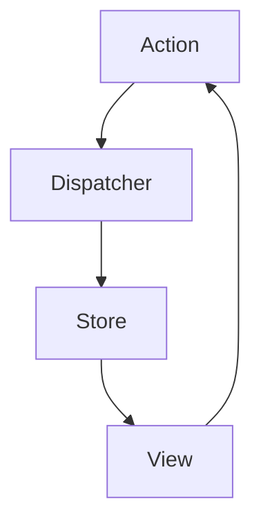
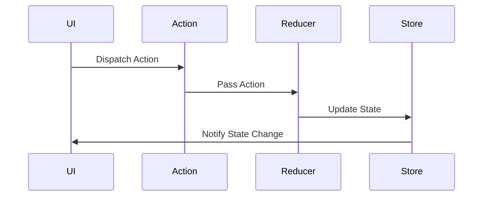

## 15.7 Flux, Redux, and Unidirectional Data Flow

In modern web development, managing the state of an application efficiently is crucial for maintaining performance and ensuring a seamless user experience. This section delves into the principles of Flux architecture and its popular implementation, Redux, to manage application state through unidirectional data flow.

### Understanding Flux Architecture

Flux is an architectural pattern introduced by Facebook for building client-side web applications. It emphasizes a unidirectional data flow, which simplifies the process of managing state changes in complex applications.

#### Principles of Flux

1. **Unidirectional Data Flow**: In Flux, data flows in a single direction, making the application more predictable and easier to debug. This flow is typically from actions to dispatcher, then to stores, and finally to views.

2. **Components of Flux**:
   - **Actions**: These are payloads of information that send data from the application to the dispatcher.
   - **Dispatcher**: A central hub that manages all data flow in the application. It receives actions and broadcasts payloads to registered callbacks.
   - **Stores**: Containers for application state and logic. Each store registers a callback with the dispatcher and updates itself based on the action received.
   - **Views**: React components that listen to changes in stores and re-render themselves accordingly.

#### Flux Data Flow Diagram



*Caption: The unidirectional data flow in Flux architecture.*

### Introducing Redux

Redux is a predictable state container for JavaScript applications, inspired by Flux. It provides a more streamlined approach to managing application state with a few key differences and enhancements.

#### Core Concepts of Redux

1. **Actions**: Similar to Flux, actions in Redux are plain JavaScript objects that describe what happened. They must have a `type` property that indicates the type of action being performed.

2. **Reducers**: Pure functions that take the current state and an action as arguments and return a new state. They specify how the application's state changes in response to actions.

3. **Store**: The single source of truth in a Redux application. It holds the entire state tree of the application and provides methods to access the state, dispatch actions, and register listeners.

#### Setting Up Redux in a React Application

Let's walk through the process of setting up Redux in a React application with a simple counter example.

**Step 1: Install Redux and React-Redux**

```bash
npm install redux react-redux
```

**Step 2: Define Actions**

```javascript
// actions.js
export const increment = () => ({
  type: 'INCREMENT'
});

export const decrement = () => ({
  type: 'DECREMENT'
});
```

**Step 3: Create Reducers**

```javascript
// reducers.js
const initialState = { count: 0 };

const counterReducer = (state = initialState, action) => {
  switch (action.type) {
    case 'INCREMENT':
      return { count: state.count + 1 };
    case 'DECREMENT':
      return { count: state.count - 1 };
    default:
      return state;
  }
};

export default counterReducer;
```

**Step 4: Set Up the Store**

```javascript
// store.js
import { createStore } from 'redux';
import counterReducer from './reducers';

const store = createStore(counterReducer);

export default store;
```

**Step 5: Connect React Components**

```javascript
// App.js
import React from 'react';
import { useSelector, useDispatch } from 'react-redux';
import { increment, decrement } from './actions';

const App = () => {
  const count = useSelector(state => state.count);
  const dispatch = useDispatch();

  return (
    <div>
      <h1>Count: {count}</h1>
      <button onClick={() => dispatch(increment())}>Increment</button>
      <button onClick={() => dispatch(decrement())}>Decrement</button>
    </div>
  );
};

export default App;
```

**Step 6: Provide the Store to the Application**

```javascript
// index.js
import React from 'react';
import ReactDOM from 'react-dom';
import { Provider } from 'react-redux';
import store from './store';
import App from './App';

ReactDOM.render(
  <Provider store={store}>
    <App />
  </Provider>,
  document.getElementById('root')
);
```

### Benefits of Unidirectional Data Flow

1. **Predictability**: With a single source of truth, the state of the application is predictable. This makes it easier to understand how data flows through the application.

2. **Debugging**: Redux DevTools provide time-travel debugging, allowing developers to inspect every state change and action dispatched.

3. **Maintainability**: The clear separation of concerns in Redux makes it easier to maintain and scale applications.

### Potential Complexities and Solutions

While Redux provides a robust solution for state management, it can introduce complexities, especially in large applications.

1. **Boilerplate Code**: Redux requires a significant amount of boilerplate code. To mitigate this, consider using Redux Toolkit, which simplifies the setup process.

2. **State Normalization**: As applications grow, managing deeply nested state can become cumbersome. Normalize state to keep it flat and manageable.

3. **Middleware**: Use middleware like Redux Thunk or Redux Saga to handle asynchronous actions and side effects.

### Visualizing Redux Data Flow



*Caption: The data flow in a Redux application.*

### Try It Yourself

Experiment with the counter example by adding new actions, such as resetting the count or incrementing by a specific value. This hands-on approach will deepen your understanding of Redux.

### References and Links

- [Redux Official Documentation](https://redux.js.org/)
- [MDN Web Docs on JavaScript](https://developer.mozilla.org/en-US/docs/Web/JavaScript)

### Knowledge Check

- What are the core components of Flux architecture?
- How does Redux differ from Flux?
- What are the benefits of unidirectional data flow?
- How can Redux DevTools aid in debugging?

### Embrace the Journey

Remember, mastering state management with Flux and Redux is a journey. As you progress, you'll build more complex and interactive applications. Keep experimenting, stay curious, and enjoy the journey!

## Quiz: Mastering Flux, Redux, and Unidirectional Data Flow



### What is the primary benefit of unidirectional data flow in Flux architecture?

- [x] Predictability and easier debugging
- [ ] Faster data processing
- [ ] Reduced code complexity
- [ ] Increased application size

> **Explanation:** Unidirectional data flow makes the application more predictable and easier to debug by ensuring a single source of truth.

### In Redux, what is the role of a reducer?

- [x] To specify how the application's state changes in response to actions
- [ ] To dispatch actions to the store
- [ ] To manage side effects
- [ ] To render the UI components

> **Explanation:** Reducers are pure functions that take the current state and an action as arguments and return a new state.

### Which of the following is NOT a core concept of Redux?

- [ ] Actions
- [ ] Reducers
- [ ] Store
- [x] Dispatcher

> **Explanation:** Unlike Flux, Redux does not have a dispatcher. The store handles the dispatching of actions.

### How does Redux improve debugging capabilities?

- [x] By providing time-travel debugging through Redux DevTools
- [ ] By reducing the number of bugs in the code
- [ ] By automatically fixing errors
- [ ] By simplifying the codebase

> **Explanation:** Redux DevTools allow developers to inspect every state change and action dispatched, enabling time-travel debugging.

### What is a common challenge when using Redux in large applications?

- [x] Boilerplate code
- [ ] Lack of documentation
- [ ] Poor performance
- [ ] Limited scalability

> **Explanation:** Redux can introduce a significant amount of boilerplate code, especially in large applications.

### Which middleware can be used to handle asynchronous actions in Redux?

- [x] Redux Thunk
- [ ] Redux Logger
- [ ] Redux DevTools
- [ ] Redux Persist

> **Explanation:** Redux Thunk is a middleware that allows you to write action creators that return a function instead of an action, enabling asynchronous logic.

### What is the purpose of the `Provider` component in a React-Redux application?

- [x] To make the Redux store available to all components in the application
- [ ] To dispatch actions to the store
- [ ] To render the UI components
- [ ] To manage side effects

> **Explanation:** The `Provider` component makes the Redux store available to any nested components that need to access the Redux state.

### What is the recommended way to manage deeply nested state in Redux?

- [x] State normalization
- [ ] Using more reducers
- [ ] Increasing the store size
- [ ] Avoiding actions

> **Explanation:** State normalization involves keeping the state flat and manageable, which is recommended for handling deeply nested state.

### True or False: Redux requires a dispatcher like Flux.

- [ ] True
- [x] False

> **Explanation:** Redux does not require a dispatcher. The store itself handles the dispatching of actions.

### Which tool can simplify the setup process of Redux by reducing boilerplate code?

- [x] Redux Toolkit
- [ ] Redux Logger
- [ ] Redux DevTools
- [ ] Redux Persist

> **Explanation:** Redux Toolkit is a set of tools and best practices that simplify the setup process of Redux by reducing boilerplate code.


