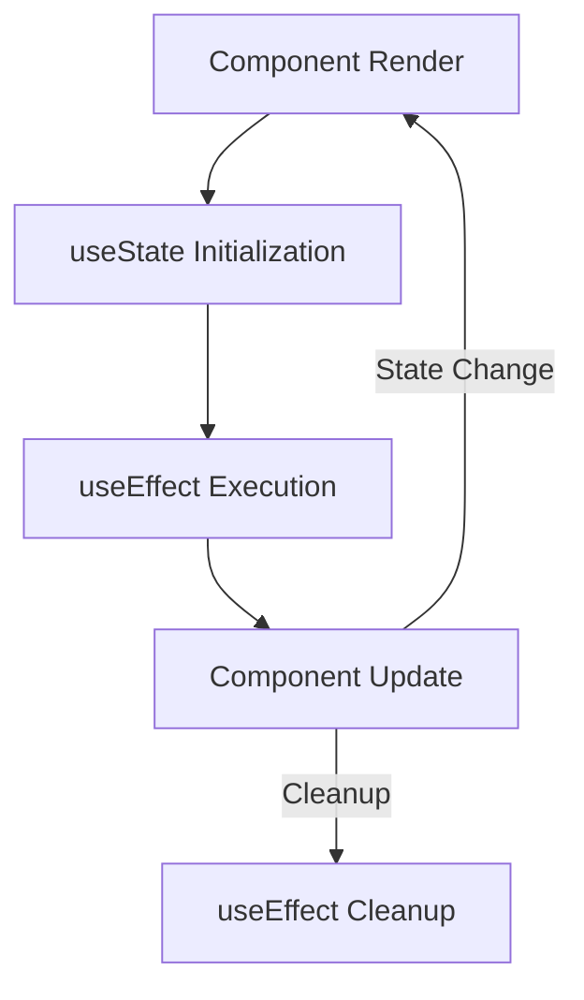

## 15.8 Using Hooks in Functional Components

React Hooks have revolutionized the way we manage state and side effects in functional components. Introduced in React 16.8, Hooks allow us to use state and other React features without writing a class. This section will delve into the world of Hooks, exploring their purpose, functionality, and best practices for usage.

### Introduction to React Hooks

React Hooks are functions that let you "hook into" React state and lifecycle features from functional components. They provide a more direct API to the React concepts you already know, such as state, lifecycle, context, refs, and more.

#### Why Use Hooks?

Hooks solve a variety of problems that developers face when using class components:

- **Complexity in Class Components**: Managing state and lifecycle methods in class components can lead to complex and hard-to-maintain code.
- **Code Reusability**: Hooks allow for better code reuse by enabling the creation of custom hooks.
- **Cleaner Code**: Functional components with hooks are often more concise and easier to read.

### Basic Hooks: `useState`, `useEffect`, and `useContext`

Let's explore some of the most commonly used hooks: `useState`, `useEffect`, and `useContext`.

#### `useState`

The `useState` hook allows you to add state to your functional components. It returns an array containing the current state and a function to update it.

```javascript
import React, { useState } from 'react';

function Counter() {
  // Declare a new state variable, which we'll call "count"
  const [count, setCount] = useState(0);

  return (
    <div>
      <p>You clicked {count} times</p>
      <button onClick={() => setCount(count + 1)}>
        Click me
      </button>
    </div>
  );
}
```

**Explanation**: In the example above, `useState(0)` initializes the state variable `count` with a value of `0`. The `setCount` function is used to update the state.

#### `useEffect`

The `useEffect` hook lets you perform side effects in your functional components. It serves the same purpose as `componentDidMount`, `componentDidUpdate`, and `componentWillUnmount` in class components.

```javascript
import React, { useState, useEffect } from 'react';

function Example() {
  const [count, setCount] = useState(0);

  // Similar to componentDidMount and componentDidUpdate:
  useEffect(() => {
    // Update the document title using the browser API
    document.title = `You clicked ${count} times`;
  });

  return (
    <div>
      <p>You clicked {count} times</p>
      <button onClick={() => setCount(count + 1)}>
        Click me
      </button>
    </div>
  );
}
```

**Explanation**: The `useEffect` hook runs after the first render and after every update. You can also specify dependencies to control when the effect runs.

#### `useContext`

The `useContext` hook allows you to access the context value directly in your functional components.

```javascript
import React, { useContext } from 'react';

const ThemeContext = React.createContext('light');

function ThemedButton() {
  const theme = useContext(ThemeContext);
  return <button className={theme}>I am styled by theme context!</button>;
}
```

**Explanation**: In the example above, `useContext(ThemeContext)` accesses the current value of `ThemeContext`.

### Converting Class Components to Functional Components with Hooks

Let's convert a simple class component to a functional component using hooks.

#### Class Component Example

```javascript
import React, { Component } from 'react';

class Clock extends Component {
  constructor(props) {
    super(props);
    this.state = { date: new Date() };
  }

  componentDidMount() {
    this.timerID = setInterval(
      () => this.tick(),
      1000
    );
  }

  componentWillUnmount() {
    clearInterval(this.timerID);
  }

  tick() {
    this.setState({
      date: new Date()
    });
  }

  render() {
    return (
      <div>
        <h1>Hello, world!</h1>
        <h2>It is {this.state.date.toLocaleTimeString()}.</h2>
      </div>
    );
  }
}
```

#### Functional Component with Hooks

```javascript
import React, { useState, useEffect } from 'react';

function Clock() {
  const [date, setDate] = useState(new Date());

  useEffect(() => {
    const timerID = setInterval(() => tick(), 1000);
    return () => clearInterval(timerID);
  }, []);

  const tick = () => {
    setDate(new Date());
  };

  return (
    <div>
      <h1>Hello, world!</h1>
      <h2>It is {date.toLocaleTimeString()}.</h2>
    </div>
  );
}
```

**Explanation**: The functional component uses `useState` to manage the `date` state and `useEffect` to handle the timer setup and cleanup.

### Best Practices for Creating Custom Hooks

Custom hooks allow you to extract component logic into reusable functions. Here are some best practices:

- **Naming Convention**: Start the name of your custom hook with "use" to indicate that it follows the rules of hooks.
- **Encapsulation**: Keep the logic related to a specific concern encapsulated within the custom hook.
- **Reusability**: Ensure your custom hook is reusable across different components.

#### Example of a Custom Hook

```javascript
import { useState, useEffect } from 'react';

function useWindowWidth() {
  const [width, setWidth] = useState(window.innerWidth);

  useEffect(() => {
    const handleResize = () => setWidth(window.innerWidth);
    window.addEventListener('resize', handleResize);
    return () => window.removeEventListener('resize', handleResize);
  }, []);

  return width;
}

export default useWindowWidth;
```

**Explanation**: The `useWindowWidth` hook encapsulates the logic for tracking the window width, making it reusable across different components.

### How Hooks Promote Code Reusability and Cleaner Component Logic

Hooks promote code reusability by allowing you to extract logic into custom hooks. This leads to cleaner and more maintainable component logic. By separating concerns, hooks make it easier to manage state and side effects.

### Common Pitfalls and How to Avoid Them

- **Incorrect Dependency Arrays**: Ensure that all variables used inside `useEffect` are included in the dependency array.
- **Avoiding Infinite Loops**: Be cautious with `useEffect` dependencies to prevent infinite loops.
- **State Initialization**: Avoid initializing state with props directly; use a function to set the initial state if needed.

### Visualizing React Hooks

To better understand how hooks work, let's visualize the flow of a component using hooks.



**Diagram Explanation**: This flowchart illustrates the lifecycle of a component using hooks, showing how `useState` and `useEffect` interact during component rendering and updates.

### Try It Yourself

Experiment with the code examples provided. Try modifying the `useState` and `useEffect` hooks to see how changes affect the component behavior. Create your own custom hooks to encapsulate logic and promote reusability.

### References and Links

- [React Hooks Documentation](https://reactjs.org/docs/hooks-intro.html)
- [MDN Web Docs on JavaScript](https://developer.mozilla.org/en-US/docs/Web/JavaScript)
- [W3Schools React Tutorial](https://www.w3schools.com/react/)

### Knowledge Check

- What are the benefits of using hooks in functional components?
- How does `useState` differ from class component state management?
- What are some common pitfalls when using `useEffect`?
- How can custom hooks improve code reusability?

### Embrace the Journey

Remember, mastering hooks is just the beginning. As you progress, you'll build more complex and interactive components. Keep experimenting, stay curious, and enjoy the journey!

## Quiz: Mastering React Hooks in Functional Components



### What is the primary purpose of React Hooks?

- [x] To enable state and lifecycle features in functional components
- [ ] To replace Redux for state management
- [ ] To improve CSS styling in React
- [ ] To enhance server-side rendering

> **Explanation:** React Hooks allow functional components to use state and lifecycle features, which were previously only available in class components.

### Which hook is used to manage state in a functional component?

- [x] useState
- [ ] useEffect
- [ ] useContext
- [ ] useReducer

> **Explanation:** The `useState` hook is specifically designed to manage state in functional components.

### How can you perform side effects in a functional component?

- [ ] useState
- [x] useEffect
- [ ] useContext
- [ ] useReducer

> **Explanation:** The `useEffect` hook is used to perform side effects in functional components, similar to lifecycle methods in class components.

### What should you include in the dependency array of `useEffect`?

- [x] All variables and props used inside the effect
- [ ] Only state variables
- [ ] Only props
- [ ] Nothing, it should always be empty

> **Explanation:** The dependency array should include all variables and props used inside the effect to ensure it runs correctly.

### What is a common pitfall when using `useEffect`?

- [x] Creating infinite loops by not managing dependencies correctly
- [ ] Using it to manage state
- [ ] Forgetting to import React
- [ ] Using it in class components

> **Explanation:** A common pitfall is creating infinite loops by not correctly managing the dependencies in the `useEffect` hook.

### What is a benefit of custom hooks?

- [x] They promote code reusability
- [ ] They replace the need for Redux
- [ ] They are faster than built-in hooks
- [ ] They automatically optimize performance

> **Explanation:** Custom hooks encapsulate logic, making it reusable across different components, thus promoting code reusability.

### How do you ensure a custom hook follows the rules of hooks?

- [x] Start its name with "use"
- [ ] Use it only in class components
- [ ] Avoid using state inside it
- [ ] Only use it for styling

> **Explanation:** Custom hooks should start with "use" to indicate they follow the rules of hooks.

### What is the correct way to initialize state with props in `useState`?

- [x] Use a function to set the initial state
- [ ] Directly assign props to state
- [ ] Use `useEffect` to set state
- [ ] Initialize state in the render method

> **Explanation:** To initialize state with props, use a function to set the initial state to avoid issues with stale props.

### Which hook would you use to access context in a functional component?

- [ ] useState
- [ ] useEffect
- [x] useContext
- [ ] useReducer

> **Explanation:** The `useContext` hook is used to access context values in functional components.

### True or False: Hooks can only be used in functional components.

- [x] True
- [ ] False

> **Explanation:** Hooks are specifically designed for use in functional components, not class components.


