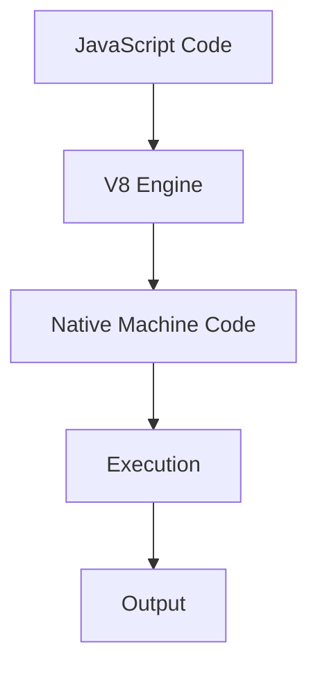
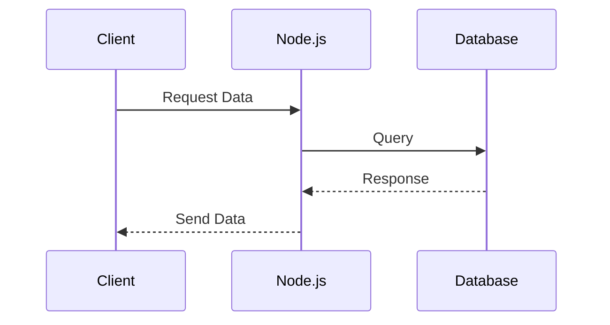

## 16.1 Introduction to Node.js

Node.js has revolutionized the way developers approach back-end development by enabling JavaScript to run on the server side. This section will guide you through the essentials of Node.js, its architecture, and its unique features that make it a compelling choice for modern web development.

### What is Node.js?

Node.js is an open-source, cross-platform runtime environment that allows developers to execute JavaScript code outside of a web browser. It was created by Ryan Dahl in 2009, and it has since become a cornerstone of modern web development. Node.js is built on the V8 JavaScript engine, which is the same engine that powers Google Chrome, ensuring high performance and efficiency.

#### Historical Context

Before Node.js, JavaScript was primarily used for client-side scripting. The introduction of Node.js allowed developers to use JavaScript for both client-side and server-side development, promoting a unified language across the entire stack. This shift has led to the rise of full-stack JavaScript development, where developers can build entire applications using a single language.

### The Architecture of Node.js

Node.js is known for its event-driven, non-blocking I/O model, which makes it lightweight and efficient. This architecture is particularly well-suited for I/O-heavy operations, such as web servers and real-time applications.

#### V8 JavaScript Engine

The V8 engine, developed by Google, compiles JavaScript directly to native machine code, providing exceptional execution speed. Node.js leverages this engine to run JavaScript on the server, allowing for fast and efficient processing.

#### libuv for Asynchronous I/O

Node.js uses libuv, a multi-platform support library, to handle asynchronous I/O operations. This library provides the event loop and thread pool that enable Node.js to perform non-blocking I/O operations, allowing it to handle multiple connections simultaneously without being blocked by slow operations.



*Figure 1: Node.js Execution Flow Using V8 Engine*

### Advantages of Using JavaScript on the Server-Side

Using JavaScript on the server-side offers several advantages:

- **Unified Language**: Developers can use the same language for both client-side and server-side development, reducing the learning curve and improving productivity.
- **Rich Ecosystem**: Node.js has a vast ecosystem of libraries and frameworks available through npm (Node Package Manager), making it easy to find and integrate third-party modules.
- **Scalability**: The non-blocking I/O model allows Node.js applications to handle a large number of simultaneous connections efficiently.
- **Community Support**: Node.js has a vibrant community that contributes to its continuous improvement and provides support through forums, tutorials, and open-source projects.

### Simple Node.js Application Example

Let's explore a simple Node.js application to understand its basic structure and functionality.

```javascript
// Import the http module
const http = require('http');

// Create an HTTP server
const server = http.createServer((req, res) => {
  // Set the response header
  res.writeHead(200, { 'Content-Type': 'text/plain' });
  // Send the response body
  res.end('Hello, World!\n');
});

// Listen on port 3000
server.listen(3000, () => {
  console.log('Server running at http://localhost:3000/');
});
```

In this example, we create a basic HTTP server using Node.js's built-in `http` module. The server listens on port 3000 and responds with "Hello, World!" to any incoming requests.

#### Try It Yourself

Experiment with the code by changing the response message or the port number. You can also explore other modules, such as `fs` for file system operations or `url` for URL parsing.

### Comparing Node.js with Other Back-End Technologies

Node.js offers unique advantages compared to traditional back-end technologies like PHP, Java, or Ruby on Rails.

- **PHP**: While PHP is widely used for server-side scripting, Node.js offers better performance for I/O-bound tasks due to its non-blocking architecture.
- **Java**: Java is known for its robustness and scalability, but Node.js provides a more lightweight and flexible environment for developing modern web applications.
- **Ruby on Rails**: Ruby on Rails is a popular framework for building web applications, but Node.js's event-driven model can handle real-time applications more efficiently.

### Event-Driven, Non-Blocking I/O Model

The event-driven, non-blocking I/O model is a core feature of Node.js that sets it apart from other server-side technologies. This model allows Node.js to handle multiple connections concurrently without blocking the execution of other operations.

#### Implications of Non-Blocking I/O

- **Efficiency**: Non-blocking I/O enables Node.js to handle thousands of concurrent connections with minimal overhead.
- **Responsiveness**: Applications built with Node.js can remain responsive even under heavy load, making it ideal for real-time applications like chat servers or online gaming.
- **Scalability**: The event-driven architecture allows Node.js applications to scale horizontally, distributing the load across multiple servers.



*Figure 2: Node.js Non-Blocking I/O Model*

### Setting Up a Local Environment for Node.js

To start developing with Node.js, you need to set up a local environment. Follow these steps to get started:

1. **Install Node.js**: Download and install Node.js from the [official website](https://nodejs.org/). The installation includes npm, the Node Package Manager.
2. **Verify Installation**: Open a terminal and run `node -v` and `npm -v` to verify the installation.
3. **Create a Project Directory**: Create a new directory for your Node.js project and navigate to it in the terminal.
4. **Initialize a Node.js Project**: Run `npm init` to create a `package.json` file, which will manage your project's dependencies.
5. **Install Dependencies**: Use `npm install <package-name>` to add third-party libraries to your project.

### Conclusion

Node.js is a powerful platform for building back-end applications with JavaScript. Its event-driven, non-blocking I/O model, combined with the V8 engine and libuv, makes it an excellent choice for developing scalable and efficient web applications. By using JavaScript on both the client and server sides, developers can create seamless and cohesive applications.

### Knowledge Check

To reinforce your understanding of Node.js, consider the following questions and exercises:

- What are the key components of Node.js's architecture?
- How does the non-blocking I/O model benefit Node.js applications?
- Compare Node.js with another back-end technology you are familiar with.
- Set up a simple Node.js server and modify it to handle different routes or responses.

Remember, this is just the beginning. As you progress, you'll build more complex and interactive applications using Node.js. Keep experimenting, stay curious, and enjoy the journey!

## Quiz: Mastering Node.js Basics



### What is Node.js primarily used for?

- [x] Running JavaScript on the server-side
- [ ] Running JavaScript on the client-side
- [ ] Compiling JavaScript to machine code
- [ ] Managing databases

> **Explanation:** Node.js is used for executing JavaScript code on the server-side, enabling back-end development with JavaScript.

### Which engine does Node.js use to execute JavaScript?

- [x] V8
- [ ] SpiderMonkey
- [ ] Chakra
- [ ] JavaScriptCore

> **Explanation:** Node.js uses the V8 JavaScript engine, which is also used by Google Chrome.

### What is the primary advantage of Node.js's non-blocking I/O model?

- [x] It allows handling multiple connections simultaneously without blocking.
- [ ] It simplifies the code structure.
- [ ] It increases the complexity of applications.
- [ ] It reduces the need for a database.

> **Explanation:** The non-blocking I/O model allows Node.js to handle multiple connections efficiently, making it suitable for I/O-heavy applications.

### Which library does Node.js use for asynchronous I/O operations?

- [x] libuv
- [ ] jQuery
- [ ] Express
- [ ] Lodash

> **Explanation:** Node.js uses libuv to handle asynchronous I/O operations, providing the event loop and thread pool.

### What is the role of npm in Node.js development?

- [x] It manages packages and dependencies.
- [ ] It compiles JavaScript code.
- [ ] It runs the Node.js server.
- [ ] It provides a graphical user interface.

> **Explanation:** npm (Node Package Manager) is used to manage packages and dependencies in Node.js projects.

### How does Node.js differ from traditional server-side technologies like PHP?

- [x] Node.js uses a non-blocking I/O model.
- [ ] Node.js is slower than PHP.
- [ ] Node.js cannot handle HTTP requests.
- [ ] Node.js is not suitable for web applications.

> **Explanation:** Node.js's non-blocking I/O model allows it to handle multiple connections efficiently, unlike traditional blocking models used by PHP.

### What is a key benefit of using JavaScript on both the client and server sides?

- [x] It provides a unified language across the stack.
- [ ] It increases the complexity of applications.
- [ ] It requires more developers.
- [ ] It limits the use of third-party libraries.

> **Explanation:** Using JavaScript on both the client and server sides allows for a unified development experience and reduces the learning curve.

### What is the purpose of the `http` module in Node.js?

- [x] To create HTTP servers and handle requests
- [ ] To manage databases
- [ ] To compile JavaScript code
- [ ] To provide a graphical user interface

> **Explanation:** The `http` module in Node.js is used to create HTTP servers and handle incoming requests and responses.

### Which command is used to initialize a Node.js project and create a `package.json` file?

- [x] npm init
- [ ] node init
- [ ] npm start
- [ ] node start

> **Explanation:** The `npm init` command initializes a Node.js project and creates a `package.json` file to manage dependencies.

### True or False: Node.js can only be used for web development.

- [ ] True
- [x] False

> **Explanation:** Node.js can be used for a variety of applications beyond web development, including real-time applications, command-line tools, and more.




