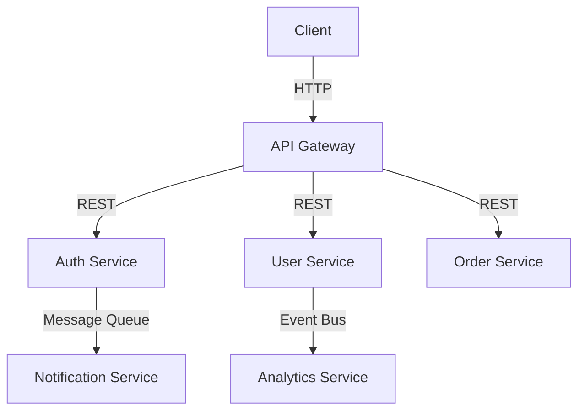

## 16.10 Microservices Architecture with Node.js

Microservices architecture has become a popular choice for building modern, scalable, and maintainable applications. In this section, we will explore what microservices are, how they differ from monolithic architectures, and how to implement them using Node.js. We will also discuss the benefits and challenges of microservices, communication strategies, and orchestration tools.

### Understanding Microservices Architecture

**Microservices** are a software architectural style that structures an application as a collection of loosely coupled services. Each service is fine-grained and performs a single function or a small set of related functions. This approach contrasts with the traditional **monolithic architecture**, where an application is built as a single, indivisible unit.

#### Monolithic vs. Microservices Architecture

- **Monolithic Architecture**: In a monolithic architecture, all components of an application are interconnected and interdependent. This means that any change in one part of the application requires the entire application to be rebuilt and redeployed. While this approach can be simpler to develop initially, it often leads to challenges in scaling, maintaining, and deploying the application as it grows.

- **Microservices Architecture**: In contrast, microservices architecture breaks down an application into smaller, independent services. Each service can be developed, deployed, and scaled independently, allowing for greater flexibility and agility.

#### Advantages of Microservices

1. **Scalability**: Microservices can be scaled independently, allowing you to allocate resources to specific services based on demand. This leads to more efficient use of resources and improved performance.

2. **Flexibility**: Each microservice can be developed using different technologies and programming languages, allowing teams to choose the best tools for the job.

3. **Independent Deployment**: Microservices can be deployed independently, reducing the risk of downtime and enabling faster updates and releases.

4. **Resilience**: The failure of one microservice does not necessarily impact the entire system, improving the overall resilience of the application.

5. **Improved Maintainability**: Smaller codebases are easier to understand, test, and maintain, leading to improved developer productivity.

### Building Microservices with Node.js

Node.js is an excellent choice for building microservices due to its non-blocking I/O model, lightweight nature, and extensive ecosystem of libraries and tools. Let's explore how to create a simple microservice using Node.js.

#### Example: Creating a Simple Microservice

We'll create a basic microservice that handles user authentication. This service will expose a RESTful API for user login and registration.

```javascript
// Import necessary modules
const express = require('express');
const bodyParser = require('body-parser');
const jwt = require('jsonwebtoken');

// Create an Express application
const app = express();
app.use(bodyParser.json());

// In-memory user data (for demonstration purposes)
const users = [];

// Secret key for JWT
const SECRET_KEY = 'your_secret_key';

// Register a new user
app.post('/register', (req, res) => {
  const { username, password } = req.body;
  if (users.find(user => user.username === username)) {
    return res.status(400).json({ message: 'User already exists' });
  }
  users.push({ username, password });
  res.status(201).json({ message: 'User registered successfully' });
});

// Login a user
app.post('/login', (req, res) => {
  const { username, password } = req.body;
  const user = users.find(user => user.username === username && user.password === password);
  if (!user) {
    return res.status(401).json({ message: 'Invalid credentials' });
  }
  const token = jwt.sign({ username }, SECRET_KEY, { expiresIn: '1h' });
  res.json({ token });
});

// Start the server
const PORT = process.env.PORT || 3000;
app.listen(PORT, () => {
  console.log(`Authentication service running on port ${PORT}`);
});
```

**Explanation**: This code creates a simple authentication service using Express.js. It provides endpoints for user registration and login, using JSON Web Tokens (JWT) for authentication.

### Communication Between Microservices

In a microservices architecture, services need to communicate with each other. There are several strategies for inter-service communication:

#### RESTful APIs

RESTful APIs are a common choice for communication between microservices. They use HTTP requests to perform CRUD (Create, Read, Update, Delete) operations. RESTful APIs are stateless, scalable, and easy to implement.

#### Message Queues

Message queues, such as [RabbitMQ](https://www.rabbitmq.com/), provide asynchronous communication between services. They allow services to send and receive messages without being directly connected, improving decoupling and scalability.

```javascript
// Example: Sending a message to a RabbitMQ queue
const amqp = require('amqplib/callback_api');

amqp.connect('amqp://localhost', (err, connection) => {
  if (err) throw err;
  connection.createChannel((err, channel) => {
    if (err) throw err;
    const queue = 'task_queue';
    const msg = 'Hello, RabbitMQ!';

    channel.assertQueue(queue, { durable: true });
    channel.sendToQueue(queue, Buffer.from(msg), { persistent: true });
    console.log(`Sent: ${msg}`);
  });
});
```

**Explanation**: This code demonstrates how to send a message to a RabbitMQ queue using the `amqplib` library.

#### Event Buses

Event buses enable event-driven communication between microservices. They allow services to publish and subscribe to events, facilitating real-time data processing and integration.

### Challenges of Microservices Architecture

While microservices offer many benefits, they also introduce new challenges:

#### Service Discovery

As the number of microservices grows, it becomes challenging to manage and locate services. Service discovery tools, such as [Consul](https://www.consul.io/) and [Eureka](https://github.com/Netflix/eureka), help automate this process.

#### Data Consistency

Maintaining data consistency across distributed services can be complex. Techniques like eventual consistency and distributed transactions can help address this challenge.

#### Monitoring and Logging

Monitoring and logging are crucial for maintaining the health and performance of microservices. Tools like [Prometheus](https://prometheus.io/) and [ELK Stack](https://www.elastic.co/what-is/elk-stack) provide insights into service performance and help identify issues.

### Orchestration Tools

Orchestration tools automate the deployment, scaling, and management of microservices. Two popular tools are:

#### Docker

[Docker](https://www.docker.com/) is a containerization platform that packages applications and their dependencies into containers. Containers are lightweight, portable, and consistent across environments.

#### Kubernetes

[Kubernetes](https://kubernetes.io/) is an open-source container orchestration platform that automates the deployment, scaling, and management of containerized applications. It provides features like load balancing, service discovery, and self-healing.

### Try It Yourself

Experiment with the provided code examples by modifying them to add new features or integrate additional services. For instance, you can extend the authentication service to include password hashing or integrate a database for persistent storage.

### Visualizing Microservices Architecture

Below is a simple diagram illustrating the interaction between microservices in a typical architecture:



**Description**: This diagram shows a client interacting with an API Gateway, which routes requests to various microservices. The services communicate with each other using REST, message queues, and event buses.

### Key Takeaways

- Microservices architecture offers scalability, flexibility, and independent deployment.
- Node.js is well-suited for building microservices due to its lightweight and non-blocking nature.
- Communication between microservices can be achieved using RESTful APIs, message queues, and event buses.
- Challenges include service discovery, data consistency, and monitoring.
- Orchestration tools like Docker and Kubernetes facilitate the management of microservices.

### Embrace the Journey

Remember, transitioning to a microservices architecture is a journey. Start small, iterate, and gradually evolve your system. Keep experimenting, stay curious, and enjoy the process of building scalable and resilient applications.

### References and Further Reading

- [Microservices](https://microservices.io/)
- [Node.js Documentation](https://nodejs.org/en/docs/)
- [Express.js](https://expressjs.com/)
- [RabbitMQ](https://www.rabbitmq.com/)
- [Docker](https://www.docker.com/)
- [Kubernetes](https://kubernetes.io/)

## Quiz: Mastering Microservices Architecture with Node.js



### What is a key advantage of microservices architecture over monolithic architecture?

- [x] Independent deployment
- [ ] Simpler initial development
- [ ] Single codebase
- [ ] Fewer services to manage

> **Explanation:** Microservices architecture allows for independent deployment of services, which is a significant advantage over monolithic architecture.

### Which tool is commonly used for container orchestration in microservices?

- [x] Kubernetes
- [ ] Jenkins
- [ ] Git
- [ ] Nginx

> **Explanation:** Kubernetes is a popular tool for container orchestration, automating deployment, scaling, and management of applications.

### What is the role of an API Gateway in a microservices architecture?

- [x] Routing client requests to appropriate services
- [ ] Storing user data
- [ ] Monitoring service performance
- [ ] Managing service discovery

> **Explanation:** An API Gateway routes client requests to the appropriate microservices, acting as a single entry point.

### Which communication method is NOT typically used between microservices?

- [ ] RESTful APIs
- [ ] Message Queues
- [ ] Event Buses
- [x] Direct Database Access

> **Explanation:** Direct database access is not typically used between microservices, as it can lead to tight coupling.

### What is a common challenge when implementing microservices architecture?

- [x] Service discovery
- [ ] Single codebase management
- [ ] Lack of scalability
- [ ] Limited technology choices

> **Explanation:** Service discovery is a common challenge in microservices architecture, as it involves managing and locating services.

### Which tool is used for monitoring and logging in microservices?

- [x] Prometheus
- [ ] Docker
- [ ] RabbitMQ
- [ ] Express.js

> **Explanation:** Prometheus is a tool used for monitoring and logging in microservices, providing insights into service performance.

### What is the purpose of using message queues in microservices?

- [x] Asynchronous communication between services
- [ ] Synchronous communication between services
- [ ] Direct database access
- [ ] Managing service discovery

> **Explanation:** Message queues enable asynchronous communication between services, improving decoupling and scalability.

### Which of the following is a benefit of using Docker in microservices?

- [x] Containerization of applications
- [ ] Direct database access
- [ ] Synchronous communication
- [ ] Single codebase management

> **Explanation:** Docker provides containerization of applications, making them portable and consistent across environments.

### What is a common strategy for maintaining data consistency in microservices?

- [x] Eventual consistency
- [ ] Direct database access
- [ ] Synchronous communication
- [ ] Single codebase management

> **Explanation:** Eventual consistency is a common strategy for maintaining data consistency in distributed microservices.

### True or False: Microservices can be developed using different programming languages.

- [x] True
- [ ] False

> **Explanation:** Microservices can be developed using different programming languages, allowing teams to choose the best tools for each service.


