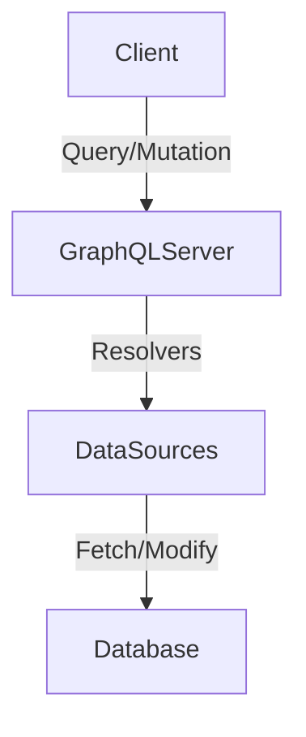

## 16.12 Implementing GraphQL Servers

GraphQL is a powerful query language for APIs and a runtime for executing those queries by using a type system you define for your data. It provides a more efficient, powerful, and flexible alternative to the traditional REST API. In this section, we will explore how to implement GraphQL servers using Node.js, focusing on key concepts, setup examples, and best practices.

### Introduction to GraphQL

GraphQL was developed by Facebook in 2012 and released as an open-source project in 2015. Unlike REST, where you have multiple endpoints for different resources, GraphQL allows you to access all the data you need in a single request. This is achieved through a single endpoint that can handle complex queries and return precisely the data requested.

#### Advantages of GraphQL Over REST

1. **Single Endpoint**: Unlike REST, which requires multiple endpoints for different resources, GraphQL uses a single endpoint to fetch all the required data.
2. **Efficient Data Fetching**: GraphQL allows clients to request only the data they need, reducing over-fetching and under-fetching issues.
3. **Strongly Typed Schema**: GraphQL uses a schema to define the types and relationships in your API, providing clear documentation and validation.
4. **Real-time Capabilities**: With subscriptions, GraphQL can handle real-time updates, making it suitable for applications that require live data.

### Key Concepts in GraphQL

Before diving into implementation, let's understand some fundamental concepts in GraphQL:

#### Schemas

A schema is the core of any GraphQL server. It defines the types, queries, and mutations available in your API. The schema acts as a contract between the client and server, specifying what data can be queried and how it can be manipulated.

#### Queries

Queries are used to fetch data from a GraphQL server. They allow clients to specify exactly what data they need, and the server responds with only that data.

#### Mutations

Mutations are similar to queries but are used to modify data on the server. They allow clients to perform operations like creating, updating, or deleting data.

#### Resolvers

Resolvers are functions that handle the logic for fetching or modifying data in response to queries and mutations. They connect the schema to the data sources, such as databases or other APIs.

### Setting Up a GraphQL Server

To set up a GraphQL server in Node.js, we can use libraries like Apollo Server or Express-GraphQL. These libraries provide tools to easily define schemas, handle requests, and integrate with various data sources.

#### Using Apollo Server

Apollo Server is a popular choice for building GraphQL servers. It is easy to set up and provides a rich ecosystem of tools for building, testing, and deploying GraphQL APIs.

**Step 1: Install Apollo Server**

First, install Apollo Server and GraphQL using npm:

```bash
npm install apollo-server graphql
```

**Step 2: Define the Schema**

Create a schema using GraphQL's schema definition language (SDL):

```javascript
const { gql } = require('apollo-server');

const typeDefs = gql`
  type Book {
    title: String
    author: String
  }

  type Query {
    books: [Book]
  }
`;
```

**Step 3: Implement Resolvers**

Define resolvers to fetch data for the schema:

```javascript
const resolvers = {
  Query: {
    books: () => [
      { title: 'The Great Gatsby', author: 'F. Scott Fitzgerald' },
      { title: '1984', author: 'George Orwell' },
    ],
  },
};
```

**Step 4: Create the Server**

Set up the Apollo Server with the schema and resolvers:

```javascript
const { ApolloServer } = require('apollo-server');

const server = new ApolloServer({ typeDefs, resolvers });

server.listen().then(({ url }) => {
  console.log(`🚀 Server ready at ${url}`);
});
```

#### Using Express-GraphQL

Express-GraphQL is another popular library for setting up GraphQL servers. It integrates seamlessly with Express, a widely used web framework for Node.js.

**Step 1: Install Express-GraphQL**

Install Express and Express-GraphQL:

```bash
npm install express express-graphql graphql
```

**Step 2: Define the Schema**

Define the schema using GraphQL's schema definition language:

```javascript
const { buildSchema } = require('graphql');

const schema = buildSchema(`
  type Book {
    title: String
    author: String
  }

  type Query {
    books: [Book]
  }
`);
```

**Step 3: Implement Resolvers**

Create resolver functions for the schema:

```javascript
const root = {
  books: () => [
    { title: 'The Great Gatsby', author: 'F. Scott Fitzgerald' },
    { title: '1984', author: 'George Orwell' },
  ],
};
```

**Step 4: Create the Server**

Set up the Express server with the GraphQL endpoint:

```javascript
const express = require('express');
const { graphqlHTTP } = require('express-graphql');

const app = express();
app.use('/graphql', graphqlHTTP({
  schema: schema,
  rootValue: root,
  graphiql: true,
}));

app.listen(4000, () => console.log('Server running on http://localhost:4000/graphql'));
```

### Integrating with Databases

GraphQL servers can integrate with various databases to fetch and manipulate data. Let's see how to connect a GraphQL server to a MongoDB database using Mongoose.

**Step 1: Install Mongoose**

Install Mongoose, a popular ODM for MongoDB:

```bash
npm install mongoose
```

**Step 2: Connect to MongoDB**

Connect to a MongoDB database:

```javascript
const mongoose = require('mongoose');

mongoose.connect('mongodb://localhost:27017/mydatabase', {
  useNewUrlParser: true,
  useUnifiedTopology: true,
});
```

**Step 3: Define a Mongoose Model**

Create a Mongoose model for the data:

```javascript
const Book = mongoose.model('Book', {
  title: String,
  author: String,
});
```

**Step 4: Update Resolvers**

Modify resolvers to fetch data from the database:

```javascript
const resolvers = {
  Query: {
    books: async () => await Book.find(),
  },
};
```

### Handling Authentication

Authentication is crucial for securing GraphQL APIs. You can use middleware to authenticate requests before they reach the resolvers.

**Step 1: Install Authentication Middleware**

Install a library like `jsonwebtoken` for handling JWT authentication:

```bash
npm install jsonwebtoken
```

**Step 2: Create Authentication Middleware**

Create middleware to verify JWT tokens:

```javascript
const jwt = require('jsonwebtoken');

const authenticate = (req, res, next) => {
  const token = req.headers.authorization;
  if (token) {
    jwt.verify(token, 'your-secret-key', (err, decoded) => {
      if (err) {
        return res.status(401).send('Unauthorized');
      }
      req.user = decoded;
      next();
    });
  } else {
    res.status(401).send('Unauthorized');
  }
};
```

**Step 3: Apply Middleware**

Apply the middleware to the GraphQL endpoint:

```javascript
app.use('/graphql', authenticate, graphqlHTTP({
  schema: schema,
  rootValue: root,
  graphiql: true,
}));
```

### Best Practices for Designing GraphQL Schemas

1. **Keep Schemas Simple**: Start with a simple schema and gradually add complexity as needed.
2. **Use Descriptive Names**: Use clear and descriptive names for types, fields, and arguments.
3. **Avoid Overfetching**: Design schemas to allow clients to request only the data they need.
4. **Implement Pagination**: Use pagination for fields that return large lists of data to improve performance.
5. **Use Enums for Fixed Values**: Use enums for fields that have a fixed set of possible values.

### Optimizing GraphQL Queries

1. **Batch Requests**: Use tools like `DataLoader` to batch and cache requests, reducing the number of database calls.
2. **Limit Depth and Complexity**: Set limits on query depth and complexity to prevent expensive queries.
3. **Use Aliases and Fragments**: Use aliases and fragments to optimize queries and reduce redundancy.

### Tools for Testing GraphQL APIs

1. **GraphiQL**: An in-browser IDE for exploring GraphQL APIs, allowing you to test queries and mutations.
2. **Postman**: A popular tool for testing APIs, including GraphQL.
3. **Apollo Studio**: A suite of tools for building, testing, and monitoring GraphQL APIs.

### Visualizing GraphQL Architecture

Below is a simple diagram illustrating the architecture of a GraphQL server:



**Description**: This diagram shows the flow of data in a GraphQL server. The client sends queries or mutations to the GraphQL server, which uses resolvers to interact with data sources like databases.

### Try It Yourself

Experiment with the code examples provided above. Try modifying the schema to include additional types and fields. Implement new resolvers to handle different queries and mutations. Test your GraphQL server using GraphiQL or Postman.

### Knowledge Check

- What are the main advantages of GraphQL over REST?
- How do queries and mutations differ in GraphQL?
- What role do resolvers play in a GraphQL server?
- How can you integrate a GraphQL server with a database?
- What are some best practices for designing GraphQL schemas?

### Summary

In this section, we explored how to implement GraphQL servers using Node.js. We covered key concepts like schemas, queries, mutations, and resolvers, and provided examples using Apollo Server and Express-GraphQL. We also discussed integrating with databases, handling authentication, and best practices for designing schemas and optimizing queries. Remember, this is just the beginning. As you progress, you'll build more complex and efficient GraphQL APIs. Keep experimenting, stay curious, and enjoy the journey!

## Quiz: Mastering GraphQL Servers in Node.js



### What is a key advantage of GraphQL over REST?

- [x] GraphQL allows clients to request only the data they need.
- [ ] GraphQL uses multiple endpoints for different resources.
- [ ] GraphQL does not require a schema.
- [ ] GraphQL is only suitable for real-time applications.

> **Explanation:** GraphQL allows clients to request only the data they need, reducing over-fetching and under-fetching issues.

### What is the purpose of a resolver in a GraphQL server?

- [x] To handle the logic for fetching or modifying data in response to queries and mutations.
- [ ] To define the types and relationships in the API.
- [ ] To authenticate requests before they reach the server.
- [ ] To provide a user interface for testing queries.

> **Explanation:** Resolvers are functions that handle the logic for fetching or modifying data in response to queries and mutations.

### How can you integrate a GraphQL server with a MongoDB database?

- [x] By using Mongoose to define models and fetch data in resolvers.
- [ ] By using GraphiQL to connect to the database.
- [ ] By defining the database schema in the GraphQL SDL.
- [ ] By using Apollo Studio to manage database connections.

> **Explanation:** Mongoose is a popular ODM for MongoDB, and it can be used to define models and fetch data in resolvers.

### What is a best practice for designing GraphQL schemas?

- [x] Use descriptive names for types, fields, and arguments.
- [ ] Avoid using enums for fields with fixed values.
- [ ] Design schemas to allow overfetching.
- [ ] Use a single type for all data.

> **Explanation:** Using descriptive names for types, fields, and arguments helps in understanding and maintaining the schema.

### Which tool can be used to test GraphQL APIs?

- [x] GraphiQL
- [ ] Express
- [ ] Mongoose
- [ ] JSON Web Token

> **Explanation:** GraphiQL is an in-browser IDE for exploring GraphQL APIs, allowing you to test queries and mutations.

### What is the role of the schema in a GraphQL server?

- [x] To define the types, queries, and mutations available in the API.
- [ ] To handle authentication and authorization.
- [ ] To manage database connections.
- [ ] To provide a user interface for testing queries.

> **Explanation:** The schema defines the types, queries, and mutations available in the API, acting as a contract between the client and server.

### How can you optimize GraphQL queries?

- [x] Use tools like DataLoader to batch and cache requests.
- [ ] Allow unlimited query depth and complexity.
- [ ] Avoid using aliases and fragments.
- [ ] Fetch all data regardless of client needs.

> **Explanation:** Using tools like DataLoader to batch and cache requests can reduce the number of database calls and improve performance.

### What is a mutation in GraphQL?

- [x] An operation used to modify data on the server.
- [ ] A query used to fetch data from the server.
- [ ] A type definition in the schema.
- [ ] A tool for testing GraphQL APIs.

> **Explanation:** Mutations are used to modify data on the server, allowing clients to perform operations like creating, updating, or deleting data.

### How can you handle authentication in a GraphQL server?

- [x] By using middleware to verify JWT tokens before requests reach the resolvers.
- [ ] By defining authentication rules in the schema.
- [ ] By using GraphiQL to manage user sessions.
- [ ] By storing user credentials in the database.

> **Explanation:** Middleware can be used to verify JWT tokens and authenticate requests before they reach the resolvers.

### True or False: GraphQL requires multiple endpoints for different resources.

- [ ] True
- [x] False

> **Explanation:** GraphQL uses a single endpoint to fetch all the required data, unlike REST, which requires multiple endpoints for different resources.




