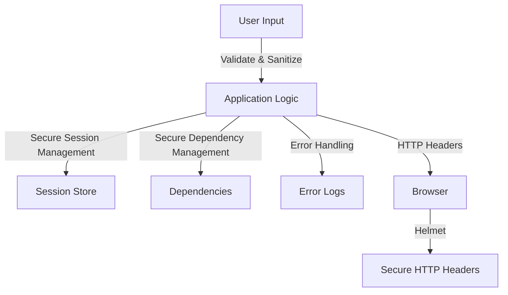

## 16.14 Security Best Practices in Node.js

In the world of web development, security is paramount. Node.js, being a popular choice for building scalable and efficient back-end applications, requires developers to be vigilant about security threats and adopt best practices to safeguard their applications. This section delves into the essential security practices for Node.js applications, covering common vulnerabilities, secure coding practices, and effective dependency management.

### Understanding Common Security Threats

Before diving into best practices, it's crucial to understand the common security threats that Node.js applications face. These threats include injection attacks, Cross-Site Scripting (XSS), and Cross-Site Request Forgery (CSRF).

#### Injection Attacks

Injection attacks occur when untrusted data is sent to an interpreter as part of a command or query. The attacker's hostile data can trick the interpreter into executing unintended commands or accessing unauthorized data.

**Example of SQL Injection:**

```javascript
const userInput = "'; DROP TABLE users; --";
const query = `SELECT * FROM users WHERE username = '${userInput}'`;
// This query will drop the users table if executed.
```

**Prevention:**

- **Use Parameterized Queries:** Always use parameterized queries or prepared statements to prevent SQL injection.
- **Validate and Sanitize Inputs:** Ensure that all inputs are validated and sanitized before processing.

#### Cross-Site Scripting (XSS)

XSS attacks occur when an attacker injects malicious scripts into content from otherwise trusted websites. This can lead to data theft, session hijacking, or defacement of the website.

**Example of XSS:**

```html
<input type="text" id="userInput" value="<script>alert('XSS');</script>">
```

**Prevention:**

- **Escape User Input:** Always escape user input before rendering it in the browser.
- **Use Content Security Policy (CSP):** Implement CSP to restrict the sources from which scripts can be loaded.

#### Cross-Site Request Forgery (CSRF)

CSRF attacks trick a user into performing actions they did not intend to, by exploiting the user's authenticated session with a web application.

**Prevention:**

- **Use Anti-CSRF Tokens:** Implement anti-CSRF tokens to ensure that requests are genuine.
- **SameSite Cookie Attribute:** Set the `SameSite` attribute on cookies to prevent them from being sent with cross-site requests.

### Input Validation and Sanitization

Input validation and sanitization are critical components of secure coding practices. They help ensure that the data your application processes is both expected and safe.

**Guidelines for Input Validation:**

- **Define Input Schemas:** Use libraries like `Joi` or `Validator.js` to define and enforce input schemas.
- **Whitelist Input:** Accept only known good data, rejecting everything else.
- **Sanitize Inputs:** Remove or encode any potentially harmful characters from user inputs.

**Example of Input Validation with Joi:**

```javascript
const Joi = require('joi');

const schema = Joi.object({
  username: Joi.string().alphanum().min(3).max(30).required(),
  password: Joi.string().pattern(new RegExp('^[a-zA-Z0-9]{3,30}$')).required(),
});

const { error, value } = schema.validate({ username: 'abc', password: '123' });

if (error) {
  console.error('Invalid input:', error.details);
} else {
  console.log('Valid input:', value);
}
```

### Secure Dependency Management

Node.js applications often rely on a multitude of third-party packages. Managing these dependencies securely is crucial to prevent vulnerabilities from creeping into your application.

**Best Practices for Dependency Management:**

- **Regularly Audit Dependencies:** Use tools like `npm audit` to identify and fix vulnerabilities in your dependencies.
- **Keep Dependencies Updated:** Regularly update your dependencies to incorporate security patches.
- **Use Trusted Sources:** Only use packages from reputable sources and maintainers.

**Using npm Audit:**

```bash
# Run npm audit to check for vulnerabilities
npm audit

# Fix vulnerabilities automatically
npm audit fix
```

### Secure Session Management and Protecting Sensitive Data

Managing user sessions securely is vital to protect sensitive data and maintain user trust.

**Guidelines for Secure Session Management:**

- **Use Secure Cookies:** Set the `Secure` and `HttpOnly` flags on cookies to prevent them from being accessed by JavaScript or sent over non-HTTPS connections.
- **Implement Session Expiry:** Ensure sessions expire after a reasonable period of inactivity.
- **Encrypt Sensitive Data:** Use encryption to protect sensitive data both in transit and at rest.

**Example of Secure Cookie Configuration:**

```javascript
const session = require('express-session');

app.use(session({
  secret: 'your-secret-key',
  resave: false,
  saveUninitialized: true,
  cookie: {
    secure: true, // Ensures the browser only sends the cookie over HTTPS
    httpOnly: true, // Ensures the cookie is sent only over HTTP(S), not client JavaScript
    maxAge: 60000 // Sets the cookie expiry time
  }
}));
```

### Error Handling and Avoiding Information Leakage

Proper error handling is essential to prevent attackers from gaining insights into your application's internals.

**Best Practices for Error Handling:**

- **Use Generic Error Messages:** Avoid exposing detailed error messages to users. Instead, log detailed errors on the server and show generic messages to users.
- **Implement Centralized Error Handling:** Use middleware to handle errors centrally in your application.

**Example of Centralized Error Handling in Express:**

```javascript
app.use((err, req, res, next) => {
  console.error(err.stack); // Log the error stack trace
  res.status(500).send('Something went wrong!'); // Send a generic error message
});
```

### Configuring HTTP Headers with Helmet

HTTP headers play a crucial role in securing web applications. The `Helmet` middleware for Express helps you set various HTTP headers to secure your application.

**Using Helmet to Secure HTTP Headers:**

```javascript
const helmet = require('helmet');

app.use(helmet()); // Automatically sets secure HTTP headers
```

**Key Headers Configured by Helmet:**

- **Content Security Policy (CSP):** Helps prevent XSS attacks by controlling the sources of content that can be loaded.
- **X-Content-Type-Options:** Prevents browsers from MIME-sniffing a response away from the declared content-type.
- **X-Frame-Options:** Protects against clickjacking by controlling whether the browser should allow the page to be displayed in a frame.

### Regular Security Audits and Staying Updated

Regular security audits and staying updated with the latest security patches are essential to maintaining a secure Node.js application.

**Recommendations for Regular Security Audits:**

- **Conduct Code Reviews:** Regularly review your codebase for security vulnerabilities.
- **Use Automated Security Tools:** Implement automated tools to scan your application for vulnerabilities.
- **Stay Informed:** Follow security advisories and updates from Node.js and your dependencies.

### Visualizing Security Concepts

To better understand the flow of security practices in a Node.js application, let's visualize the interaction between different security components using a flowchart.



**Diagram Description:** This flowchart illustrates the flow of security practices in a Node.js application, starting from user input validation and sanitization, through secure session management, dependency management, error handling, and HTTP header configuration using Helmet.

### Knowledge Check

Let's reinforce what we've learned with a few questions and exercises.

1. **What is the primary purpose of using parameterized queries?**
2. **How can you prevent XSS attacks in your Node.js application?**
3. **Why is it important to set the `HttpOnly` flag on cookies?**
4. **What role does Helmet play in securing a Node.js application?**
5. **How often should you audit your application's dependencies?**

### Exercises

1. **Implement a simple Node.js application that uses Helmet to secure HTTP headers.**
2. **Create a middleware function to validate and sanitize user inputs in an Express application.**
3. **Set up a session management system using secure cookies and session expiry.**

### Summary

In this section, we've explored the essential security practices for Node.js applications. By understanding common security threats, implementing input validation and sanitization, managing dependencies securely, and configuring HTTP headers with Helmet, you can significantly enhance the security of your Node.js applications. Remember, security is an ongoing process, and staying informed and vigilant is key to protecting your applications.

### Embrace the Journey

Security is a journey, not a destination. As you continue to develop and maintain your Node.js applications, keep experimenting with new security practices, stay curious about emerging threats, and enjoy the process of building secure and robust applications.

## Node.js Security Best Practices Quiz



### What is the primary purpose of using parameterized queries?

- [x] To prevent SQL injection attacks
- [ ] To improve query performance
- [ ] To simplify query syntax
- [ ] To enable dynamic query generation

> **Explanation:** Parameterized queries help prevent SQL injection attacks by separating SQL code from data inputs, ensuring that user inputs are treated as data rather than executable code.


### How can you prevent XSS attacks in your Node.js application?

- [x] Escape user input before rendering it in the browser
- [ ] Use parameterized queries
- [ ] Set the `Secure` flag on cookies
- [ ] Implement session expiry

> **Explanation:** Escaping user input before rendering it in the browser helps prevent XSS attacks by ensuring that any potentially harmful scripts are not executed.


### Why is it important to set the `HttpOnly` flag on cookies?

- [x] To prevent client-side scripts from accessing cookies
- [ ] To ensure cookies are only sent over HTTPS
- [ ] To improve cookie performance
- [ ] To enable cross-site cookie sharing

> **Explanation:** The `HttpOnly` flag prevents client-side scripts from accessing cookies, reducing the risk of XSS attacks.


### What role does Helmet play in securing a Node.js application?

- [x] It sets secure HTTP headers
- [ ] It manages user sessions
- [ ] It validates user input
- [ ] It encrypts sensitive data

> **Explanation:** Helmet helps secure a Node.js application by setting various HTTP headers that protect against common vulnerabilities.


### How often should you audit your application's dependencies?

- [x] Regularly, as part of your development process
- [ ] Only when a new vulnerability is reported
- [ ] Once a year
- [ ] Only before deploying to production

> **Explanation:** Regularly auditing your application's dependencies helps identify and fix vulnerabilities promptly, reducing the risk of security breaches.


### What is the purpose of using anti-CSRF tokens?

- [x] To ensure requests are genuine
- [ ] To encrypt sensitive data
- [ ] To validate user input
- [ ] To manage user sessions

> **Explanation:** Anti-CSRF tokens help ensure that requests are genuine by verifying that they originate from the intended user.


### Which of the following is a common security threat in Node.js applications?

- [x] Injection attacks
- [ ] Memory leaks
- [ ] Performance bottlenecks
- [ ] Code duplication

> **Explanation:** Injection attacks are a common security threat in Node.js applications, where untrusted data is sent to an interpreter as part of a command or query.


### What is the benefit of using secure cookies?

- [x] They prevent cookies from being accessed by JavaScript
- [ ] They improve cookie performance
- [ ] They enable cross-site cookie sharing
- [ ] They simplify cookie management

> **Explanation:** Secure cookies prevent cookies from being accessed by JavaScript, reducing the risk of XSS attacks.


### How can you prevent information leakage in error handling?

- [x] Use generic error messages for users
- [ ] Log detailed errors on the client side
- [ ] Display detailed error messages to users
- [ ] Ignore error handling

> **Explanation:** Using generic error messages for users helps prevent information leakage by not exposing detailed error information that could be exploited by attackers.


### True or False: Regular security audits are essential for maintaining a secure Node.js application.

- [x] True
- [ ] False

> **Explanation:** Regular security audits are essential for maintaining a secure Node.js application, as they help identify and address vulnerabilities promptly.


