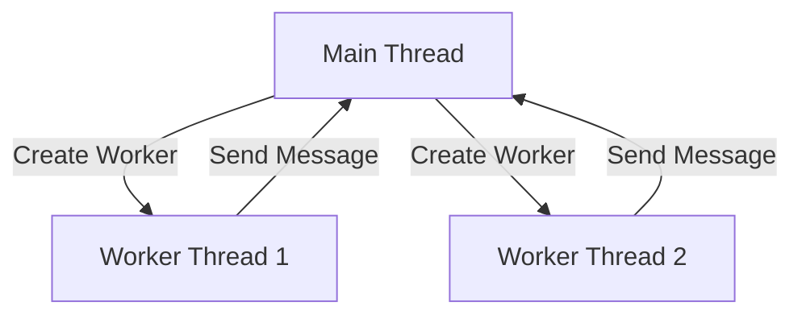

## 16.15 Worker Threads and Clustering

Node.js is renowned for its non-blocking, event-driven architecture, which makes it ideal for I/O-bound tasks. However, its single-threaded nature can become a bottleneck when dealing with CPU-intensive operations. In this section, we will explore how to overcome these limitations using worker threads and clustering, two powerful tools in Node.js for parallel execution.

### Understanding Node.js's Single-Threaded Event Loop

Node.js operates on a single-threaded event loop, which is highly efficient for handling asynchronous I/O operations. However, this architecture can struggle with CPU-bound tasks, such as image processing or complex calculations, as these tasks can block the event loop and degrade performance.

#### Limitations of the Single-Threaded Model

- **Blocking Operations**: CPU-intensive tasks can block the event loop, preventing other operations from executing.
- **Limited Scalability**: While Node.js can handle many concurrent connections, its single-threaded nature limits its ability to utilize multi-core processors effectively.

### Introducing Worker Threads

To address these limitations, Node.js introduced the `worker_threads` module in version 10.5.0. Worker threads allow you to run JavaScript code in parallel, leveraging multiple threads to perform CPU-intensive tasks without blocking the main event loop.

#### What Are Worker Threads?

Worker threads are a means to execute JavaScript code in parallel. Each worker runs in its own thread, isolated from the main thread, allowing for concurrent execution of tasks.

#### Key Features of Worker Threads

- **Parallel Execution**: Run multiple threads concurrently, each executing its own JavaScript code.
- **Isolation**: Each worker has its own V8 instance, meaning they do not share memory with the main thread.
- **Communication**: Use message passing to communicate between the main thread and worker threads.

### Creating and Managing Worker Threads

Let's dive into how to create and manage worker threads in Node.js.

#### Setting Up a Worker Thread

To create a worker thread, you need to import the `worker_threads` module and use the `Worker` class to spawn a new thread.

```javascript
// Import the worker_threads module
const { Worker, isMainThread, parentPort } = require('worker_threads');

if (isMainThread) {
  // This code is executed in the main thread
  const worker = new Worker(__filename);

  // Listen for messages from the worker
  worker.on('message', (message) => {
    console.log(`Received from worker: ${message}`);
  });

  // Send a message to the worker
  worker.postMessage('Hello, Worker!');
} else {
  // This code is executed in the worker thread
  parentPort.on('message', (message) => {
    console.log(`Received from main thread: ${message}`);
    parentPort.postMessage('Hello, Main Thread!');
  });
}
```

#### Explanation of the Code

- **Main Thread**: The main thread creates a new `Worker` instance, passing the current file (`__filename`) as the script to execute in the worker thread.
- **Worker Thread**: The worker listens for messages from the main thread and can send messages back using `parentPort`.

#### Handling Data Sharing

Since worker threads do not share memory, data is exchanged via message passing. This ensures thread safety but requires careful management of data serialization and deserialization.

### Worker Threads vs. Clustering

While worker threads provide parallel execution within a single Node.js process, clustering involves running multiple instances of a Node.js application, each on its own process.

#### Differences Between Worker Threads and Clustering

- **Memory Sharing**: Worker threads do not share memory, while clustered processes are completely isolated.
- **Use Cases**: Worker threads are ideal for CPU-bound tasks, whereas clustering is better suited for scaling I/O-bound applications across multiple CPU cores.

#### When to Use Worker Threads

- **CPU-Intensive Tasks**: Use worker threads for tasks that require significant CPU resources, such as image processing or data analysis.
- **Parallel Processing**: When you need to perform multiple tasks concurrently without blocking the main event loop.

### Best Practices for Worker Threads

- **Efficient Communication**: Minimize the amount of data passed between threads to reduce overhead.
- **Error Handling**: Implement robust error handling to manage exceptions in worker threads.
- **Resource Management**: Monitor and manage the resources used by worker threads to prevent excessive memory consumption.

### Try It Yourself

Experiment with the provided code example by modifying the messages sent between the main thread and worker thread. Observe how changes affect the communication flow and execution.

### Visualizing Worker Threads

Below is a diagram illustrating the interaction between the main thread and worker threads in Node.js.



**Diagram Description**: This diagram shows the main thread creating two worker threads. Each worker thread can send messages back to the main thread, demonstrating the communication flow.

### References and Further Reading

- [Node.js Worker Threads Documentation](https://nodejs.org/api/worker_threads.html)
- [MDN Web Docs: JavaScript Concurrency Model](https://developer.mozilla.org/en-US/docs/Web/JavaScript/EventLoop)

### Knowledge Check

- What are the limitations of Node.js's single-threaded event loop?
- How do worker threads differ from clustering in Node.js?
- What are some best practices for managing communication between worker threads?

### Embrace the Journey

Remember, mastering worker threads and clustering in Node.js is just the beginning. As you continue to explore these concepts, you'll unlock new possibilities for optimizing performance and scalability in your applications. Keep experimenting, stay curious, and enjoy the journey!

## Mastering Worker Threads and Clustering in Node.js



### What is the primary limitation of Node.js's single-threaded event loop?

- [x] It struggles with CPU-bound tasks.
- [ ] It cannot handle asynchronous I/O operations.
- [ ] It is not suitable for web development.
- [ ] It does not support JavaScript.

> **Explanation:** Node.js's single-threaded event loop is efficient for I/O-bound tasks but struggles with CPU-bound tasks, which can block the event loop.

### What module introduced worker threads in Node.js?

- [x] worker_threads
- [ ] cluster
- [ ] os
- [ ] fs

> **Explanation:** The `worker_threads` module was introduced in Node.js version 10.5.0 to enable parallel execution of JavaScript code.

### How do worker threads communicate with the main thread?

- [x] Through message passing
- [ ] By sharing memory
- [ ] Using global variables
- [ ] Through HTTP requests

> **Explanation:** Worker threads communicate with the main thread using message passing, as they do not share memory.

### What is a key difference between worker threads and clustering?

- [x] Worker threads do not share memory, while clustered processes are isolated.
- [ ] Worker threads are used for I/O-bound tasks, while clustering is for CPU-bound tasks.
- [ ] Worker threads are slower than clustering.
- [ ] Worker threads are only available in Node.js version 12 and above.

> **Explanation:** Worker threads do not share memory, whereas clustered processes are completely isolated from each other.

### When are worker threads most beneficial?

- [x] For CPU-intensive tasks
- [ ] For handling HTTP requests
- [ ] For managing databases
- [ ] For logging errors

> **Explanation:** Worker threads are most beneficial for CPU-intensive tasks that require significant processing power.

### What is a best practice for managing communication between worker threads?

- [x] Minimize data passed between threads
- [ ] Use global variables for data sharing
- [ ] Avoid error handling
- [ ] Use synchronous communication

> **Explanation:** Minimizing the amount of data passed between threads reduces overhead and improves performance.

### What is the purpose of the `isMainThread` property in the worker_threads module?

- [x] To determine if the code is running in the main thread
- [ ] To check if the worker thread is active
- [ ] To identify the number of worker threads
- [ ] To manage memory allocation

> **Explanation:** The `isMainThread` property is used to check if the code is running in the main thread or a worker thread.

### How can you handle errors in worker threads?

- [x] Implement robust error handling
- [ ] Ignore exceptions
- [ ] Use global error handlers
- [ ] Rely on automatic error recovery

> **Explanation:** Implementing robust error handling in worker threads is essential to manage exceptions and ensure stability.

### What is a potential drawback of using worker threads?

- [x] Increased complexity in managing communication
- [ ] Limited scalability
- [ ] Inability to handle I/O operations
- [ ] Reduced performance for CPU-bound tasks

> **Explanation:** Worker threads can increase complexity in managing communication and data sharing between threads.

### True or False: Worker threads share memory with the main thread.

- [ ] True
- [x] False

> **Explanation:** Worker threads do not share memory with the main thread; they communicate through message passing.



---
