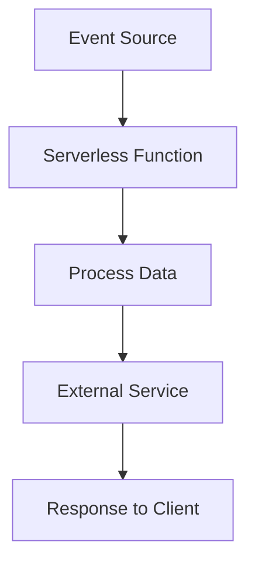

## 16.16 Serverless Architecture with AWS Lambda and Azure Functions

Serverless architecture has revolutionized the way we build and deploy applications by abstracting server management and allowing developers to focus solely on writing code. In this section, we will explore serverless computing using Node.js on platforms like AWS Lambda and Azure Functions. These platforms enable scalable execution without the need for server management, making them ideal for modern web development.

### Understanding Serverless Architecture

**Serverless architecture** refers to a cloud computing execution model where the cloud provider dynamically manages the allocation and provisioning of servers. Despite the name, servers are still involved, but developers do not need to manage them. Instead, they write code in the form of functions, which are executed in response to events.

#### Advantages of Serverless Architecture

1. **Cost Efficiency**: Pay only for the compute time you consume. There is no charge when your code is not running.
2. **Scalability**: Automatically scales with the number of requests, handling thousands of concurrent executions.
3. **Reduced Operational Complexity**: No need to manage infrastructure, allowing developers to focus on code and business logic.
4. **Faster Time to Market**: Simplified deployment processes enable rapid iteration and deployment of new features.

### AWS Lambda and Node.js

[AWS Lambda](https://aws.amazon.com/lambda/) is a serverless compute service that lets you run code without provisioning or managing servers. You can trigger Lambda functions using various AWS services such as S3, DynamoDB, and API Gateway.

#### How AWS Lambda Works with Node.js

AWS Lambda supports Node.js, allowing you to write functions in JavaScript. When a Lambda function is invoked, AWS Lambda runs the function in a secure and isolated environment. The function can be triggered by events such as HTTP requests, file uploads, or database changes.

**Example: Deploying a Simple AWS Lambda Function**

```javascript
// index.js
exports.handler = async (event) => {
    console.log("Event: ", event);
    return {
        statusCode: 200,
        body: JSON.stringify('Hello from AWS Lambda!'),
    };
};
```

To deploy this function, you can use the AWS Management Console, AWS CLI, or tools like the [Serverless Framework](https://www.serverless.com/) and [AWS SAM](https://aws.amazon.com/serverless/sam/).

### Azure Functions and Node.js

[Azure Functions](https://azure.microsoft.com/en-us/services/functions/) is a serverless compute service that enables you to run event-triggered code without having to explicitly provision or manage infrastructure. Azure Functions supports Node.js, allowing you to build applications using JavaScript.

#### How Azure Functions Work with Node.js

Azure Functions can be triggered by various events, such as HTTP requests, timers, or messages from Azure services like Blob Storage and Service Bus.

**Example: Deploying a Simple Azure Function**

```javascript
// index.js
module.exports = async function (context, req) {
    context.log('JavaScript HTTP trigger function processed a request.');
    const name = (req.query.name || (req.body && req.body.name));
    const responseMessage = name
        ? "Hello, " + name + ". This HTTP triggered function executed successfully."
        : "This HTTP triggered function executed successfully. Pass a name in the query string or in the request body for a personalized response.";
    context.res = {
        // status: 200, /* Defaults to 200 */
        body: responseMessage
    };
};
```

To deploy this function, you can use the Azure Portal, Azure CLI, or [Azure Functions Core Tools](https://docs.microsoft.com/en-us/azure/azure-functions/functions-run-local).

### Use Cases for Serverless Functions

1. **API Backends**: Serverless functions can be used to build scalable API backends that handle HTTP requests and interact with databases.
2. **Data Processing**: Functions can be triggered by data events, such as file uploads or database changes, to process and transform data.
3. **Scheduled Tasks**: Use serverless functions to run scheduled tasks, such as sending emails or generating reports, without maintaining a server.

### Considerations for Serverless Architecture

1. **Cold Starts**: The first invocation of a function after it has been idle can take longer due to the initialization of the execution environment. This is known as a cold start.
2. **Execution Time Limits**: Serverless functions have execution time limits. AWS Lambda functions can run for up to 15 minutes, while Azure Functions have a default timeout of 5 minutes, which can be extended.
3. **Statelessness**: Serverless functions are stateless, meaning they do not retain data between invocations. Use external storage solutions like databases or object storage to persist data.

### Tools for Local Development and Deployment

1. **Serverless Framework**: A popular open-source framework that simplifies the deployment of serverless applications across multiple cloud providers.
2. **AWS SAM (Serverless Application Model)**: A framework for building serverless applications on AWS, providing templates and tools for local development and testing.
3. **Azure Functions Core Tools**: A set of tools for developing and testing Azure Functions locally, with support for deployment to Azure.

### Visualizing Serverless Architecture



**Diagram Description**: This flowchart illustrates the serverless architecture workflow. An event source triggers a serverless function, which processes data and interacts with external services before sending a response to the client.

### Try It Yourself

Experiment with the provided code examples by modifying the response messages or adding additional logic. Deploy the functions using the tools mentioned and trigger them using different event sources to see how they behave.

### Knowledge Check

1. What are the main advantages of serverless architecture?
2. How does AWS Lambda handle Node.js functions?
3. What are some common use cases for serverless functions?
4. What is a cold start, and how can it affect serverless functions?
5. What tools can be used for local development and deployment of serverless functions?

### Summary

Serverless architecture offers a powerful and flexible way to build scalable applications without the need for server management. By leveraging platforms like AWS Lambda and Azure Functions, developers can focus on writing code and delivering value to users. Remember, this is just the beginning. As you progress, you'll build more complex and interactive applications. Keep experimenting, stay curious, and enjoy the journey!

## Quiz Time!



### What is a key advantage of serverless architecture?

- [x] Cost efficiency
- [ ] Complex server management
- [ ] High upfront cost
- [ ] Limited scalability

> **Explanation:** Serverless architecture is cost-efficient because you only pay for the compute time you consume.


### Which cloud service is used for serverless computing in AWS?

- [x] AWS Lambda
- [ ] AWS EC2
- [ ] AWS S3
- [ ] AWS RDS

> **Explanation:** AWS Lambda is the service used for serverless computing in AWS.


### What is a common use case for serverless functions?

- [x] API backends
- [ ] Desktop applications
- [ ] Static websites
- [ ] Operating systems

> **Explanation:** Serverless functions are commonly used for building scalable API backends.


### What is a cold start in serverless architecture?

- [x] The initial delay when a function is invoked after being idle
- [ ] A function that runs continuously
- [ ] A function that never executes
- [ ] A function that is always warm

> **Explanation:** A cold start refers to the initial delay when a function is invoked after being idle.


### Which tool is used for local development of Azure Functions?

- [x] Azure Functions Core Tools
- [ ] AWS SAM
- [ ] Serverless Framework
- [ ] Docker

> **Explanation:** Azure Functions Core Tools are used for local development of Azure Functions.


### How long can an AWS Lambda function run?

- [x] Up to 15 minutes
- [ ] Up to 5 minutes
- [ ] Up to 1 hour
- [ ] Up to 30 seconds

> **Explanation:** AWS Lambda functions can run for up to 15 minutes.


### What is a characteristic of serverless functions?

- [x] Statelessness
- [ ] Stateful
- [ ] Persistent storage
- [ ] Continuous execution

> **Explanation:** Serverless functions are stateless, meaning they do not retain data between invocations.


### Which framework simplifies the deployment of serverless applications?

- [x] Serverless Framework
- [ ] React
- [ ] Angular
- [ ] Vue.js

> **Explanation:** The Serverless Framework simplifies the deployment of serverless applications.


### What is the default timeout for Azure Functions?

- [x] 5 minutes
- [ ] 15 minutes
- [ ] 1 minute
- [ ] 10 minutes

> **Explanation:** The default timeout for Azure Functions is 5 minutes.


### True or False: Serverless architecture requires manual server management.

- [ ] True
- [x] False

> **Explanation:** Serverless architecture abstracts server management, allowing developers to focus on code.


