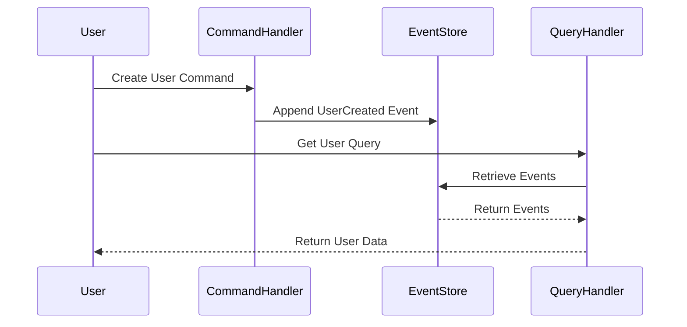

## 16.17 Event Sourcing and CQRS Patterns in Node.js

In the realm of modern web development, managing complex data flows efficiently is crucial. Two powerful patterns that have emerged to address these challenges are Event Sourcing and Command Query Responsibility Segregation (CQRS). In this section, we will delve into these patterns, explore their benefits, and demonstrate how to implement them in Node.js applications.

### Understanding Event Sourcing

**Event Sourcing** is a design pattern that captures all changes to an application's state as a sequence of events. Instead of storing the current state of an entity, Event Sourcing records every change as an event. This approach provides a complete audit trail and allows the system to rebuild the current state by replaying these events.

#### Benefits of Event Sourcing

- **Audit Trail**: Every change is recorded, providing a comprehensive history of the system's state.
- **Reproducibility**: The current state can be rebuilt by replaying events, which is useful for debugging and testing.
- **Scalability**: Event logs can be distributed across systems, allowing for scalable architectures.
- **Flexibility**: New features can be added by processing existing events differently.

#### Implementing Event Sourcing in Node.js

To implement Event Sourcing in Node.js, we need to focus on capturing events and storing them in an event store. Let's explore a basic implementation:

```javascript
// Event Store: A simple in-memory event store
class EventStore {
  constructor() {
    this.events = [];
  }

  // Append an event to the store
  append(event) {
    this.events.push(event);
  }

  // Retrieve all events
  getEvents() {
    return this.events;
  }
}

// Example usage
const eventStore = new EventStore();
eventStore.append({ type: 'UserCreated', data: { userId: 1, name: 'Alice' } });
eventStore.append({ type: 'UserUpdated', data: { userId: 1, name: 'Alice Smith' } });

console.log(eventStore.getEvents());
```

In this example, we create a simple in-memory event store that captures events. In a real-world application, you would use a persistent storage solution like a database or a message broker.

### Introducing CQRS

**Command Query Responsibility Segregation (CQRS)** is a pattern that separates the responsibility of handling commands (which change state) from queries (which read state). This separation allows for more scalable and maintainable systems.

#### Benefits of CQRS

- **Scalability**: Commands and queries can be scaled independently.
- **Optimized Read Models**: Queries can be optimized for specific use cases without affecting the command model.
- **Flexibility**: Different models can be used for reading and writing data.

#### Implementing CQRS in Node.js

To implement CQRS, we need to define separate models for handling commands and queries. Here's a basic example:

```javascript
// Command Handler
class UserCommandHandler {
  constructor(eventStore) {
    this.eventStore = eventStore;
  }

  // Handle user creation command
  handleCreateUser(userId, name) {
    const event = { type: 'UserCreated', data: { userId, name } };
    this.eventStore.append(event);
  }
}

// Query Handler
class UserQueryHandler {
  constructor(eventStore) {
    this.eventStore = eventStore;
  }

  // Retrieve user by ID
  getUserById(userId) {
    const events = this.eventStore.getEvents();
    let user = null;
    events.forEach(event => {
      if (event.type === 'UserCreated' && event.data.userId === userId) {
        user = event.data;
      }
    });
    return user;
  }
}

// Example usage
const eventStore = new EventStore();
const commandHandler = new UserCommandHandler(eventStore);
const queryHandler = new UserQueryHandler(eventStore);

commandHandler.handleCreateUser(1, 'Alice');
console.log(queryHandler.getUserById(1));
```

In this example, we define separate handlers for commands and queries. The `UserCommandHandler` is responsible for handling commands that change the state, while the `UserQueryHandler` handles queries that read the state.

### Libraries and Frameworks

Several libraries and frameworks support Event Sourcing and CQRS in Node.js, making it easier to implement these patterns in your applications:

- **Axon Framework**: A popular framework for implementing Event Sourcing and CQRS in JavaScript.
- **EventStoreDB**: A database specifically designed for Event Sourcing, providing robust support for event storage and retrieval.
- **NestJS CQRS Module**: A module for the NestJS framework that provides tools for implementing CQRS.

### Use Cases for Event Sourcing and CQRS

Event Sourcing and CQRS are particularly useful in scenarios that require complex domain logic, audit trails, and scalability. Some common use cases include:

- **Audit Trails**: Systems that require a complete history of changes, such as financial applications.
- **Rebuilding State**: Applications that need to rebuild state from events, such as in disaster recovery scenarios.
- **Complex Domain Logic**: Systems with complex business rules that benefit from separating command and query responsibilities.

### Challenges and Considerations

While Event Sourcing and CQRS offer many benefits, they also come with challenges:

- **Event Consistency**: Ensuring that events are consistent and correctly ordered can be challenging, especially in distributed systems.
- **Scalability**: While these patterns can improve scalability, they also require careful design to handle large volumes of events.
- **Complexity**: Implementing these patterns can add complexity to your application, requiring careful planning and design.

### Visualizing Event Sourcing and CQRS

To better understand how Event Sourcing and CQRS work together, let's visualize the process using a sequence diagram:



**Diagram Description**: This sequence diagram illustrates the flow of commands and queries in a system using Event Sourcing and CQRS. The user sends a command to the `CommandHandler`, which appends an event to the `EventStore`. When the user queries for data, the `QueryHandler` retrieves events from the `EventStore` to reconstruct the current state.

### Conclusion

Event Sourcing and CQRS are powerful patterns that can help manage complex data flows in Node.js applications. By capturing changes as events and separating command and query responsibilities, these patterns provide scalability, flexibility, and a complete audit trail. However, they also introduce challenges that require careful consideration and design.

Remember, this is just the beginning. As you progress, you'll build more complex and interactive applications. Keep experimenting, stay curious, and enjoy the journey!

### Knowledge Check

## Mastering Event Sourcing and CQRS in Node.js: Quiz



### What is the primary benefit of Event Sourcing?

- [x] Provides a complete audit trail of changes
- [ ] Simplifies database schema
- [ ] Reduces code complexity
- [ ] Increases application speed

> **Explanation:** Event Sourcing captures all changes as events, providing a complete history of the system's state.

### What does CQRS stand for?

- [x] Command Query Responsibility Segregation
- [ ] Command Query Resource Segmentation
- [ ] Command Queue Resource Segregation
- [ ] Command Queue Responsibility Segmentation

> **Explanation:** CQRS stands for Command Query Responsibility Segregation, a pattern that separates command and query responsibilities.

### Which Node.js library is specifically designed for Event Sourcing?

- [x] EventStoreDB
- [ ] Express
- [ ] Mongoose
- [ ] Socket.io

> **Explanation:** EventStoreDB is a database designed for Event Sourcing, providing robust support for event storage and retrieval.

### What is a common use case for Event Sourcing?

- [x] Audit trails in financial applications
- [ ] Simple CRUD operations
- [ ] Static website hosting
- [ ] Image processing

> **Explanation:** Event Sourcing is useful for systems that require a complete history of changes, such as financial applications.

### What challenge is associated with Event Sourcing?

- [x] Ensuring event consistency
- [ ] Reducing memory usage
- [ ] Simplifying code structure
- [ ] Increasing database speed

> **Explanation:** Ensuring that events are consistent and correctly ordered can be challenging, especially in distributed systems.

### How does CQRS improve scalability?

- [x] By allowing commands and queries to be scaled independently
- [ ] By reducing the number of database queries
- [ ] By simplifying the application architecture
- [ ] By using a single data model for all operations

> **Explanation:** CQRS separates command and query responsibilities, allowing them to be scaled independently.

### Which framework provides a CQRS module for Node.js?

- [x] NestJS
- [ ] Express
- [ ] Koa
- [ ] Hapi

> **Explanation:** NestJS provides a CQRS module that offers tools for implementing CQRS in Node.js applications.

### What is a key feature of Event Sourcing?

- [x] Rebuilding state by replaying events
- [ ] Using a single database table
- [ ] Reducing code duplication
- [ ] Increasing application speed

> **Explanation:** Event Sourcing allows the current state to be rebuilt by replaying events, which is useful for debugging and testing.

### What is the role of the Command Handler in CQRS?

- [x] To handle commands that change state
- [ ] To handle queries that read state
- [ ] To store events in the database
- [ ] To manage user authentication

> **Explanation:** The Command Handler is responsible for handling commands that change the state of the system.

### True or False: Event Sourcing and CQRS can be used together to manage complex data flows.

- [x] True
- [ ] False

> **Explanation:** Event Sourcing and CQRS are often used together to manage complex data flows, providing scalability and flexibility.




