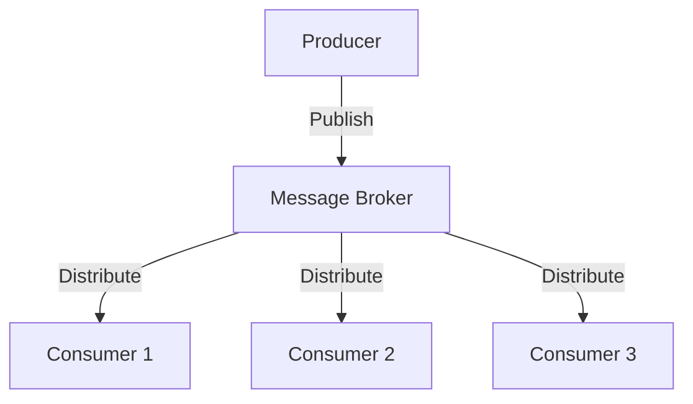

## 16.18 Applying Message Brokers for Event-Driven Architecture

In modern web development, building scalable and reliable applications is crucial. One effective approach to achieving this is through event-driven architecture (EDA), which decouples services and enables asynchronous communication. At the heart of EDA are message brokers, which facilitate the exchange of messages between services. In this section, we'll explore how to apply message brokers like RabbitMQ, Apache Kafka, and Redis Pub/Sub in Node.js applications to build robust event-driven systems.

### Understanding Event-Driven Architecture

Event-driven architecture is a software design pattern where components communicate by emitting and responding to events. This approach allows for loose coupling between services, as each service can operate independently and react to events as they occur. EDA is particularly beneficial for applications that require high scalability, real-time processing, and fault tolerance.

### The Role of Message Brokers

Message brokers are intermediaries that manage the transmission of messages between producers (services that emit events) and consumers (services that process events). They provide several key functions:

- **Decoupling Services**: By acting as a middle layer, message brokers decouple producers and consumers, allowing them to evolve independently.
- **Asynchronous Processing**: Producers can emit events without waiting for consumers to process them, enabling non-blocking operations.
- **Scalability**: Message brokers can handle large volumes of messages and distribute them across multiple consumers, facilitating horizontal scaling.
- **Reliability**: They ensure message delivery even in the face of network failures or service downtime.
- **Message Persistence**: Brokers can persist messages to disk, ensuring that no data is lost if a consumer is temporarily unavailable.

### Popular Message Brokers

1. **RabbitMQ**: A widely-used open-source message broker that supports various messaging protocols. It's known for its reliability and ease of use.

2. **Apache Kafka**: A distributed streaming platform designed for high-throughput and fault-tolerant messaging. It's ideal for real-time data processing.

3. **Redis Pub/Sub**: A lightweight, in-memory data structure store that supports publish/subscribe messaging. It's suitable for simple use cases with low latency requirements.

### Setting Up a Message Broker

Let's explore how to set up and integrate each of these message brokers with a Node.js application.

#### RabbitMQ

**Installation and Setup**

To get started with RabbitMQ, you'll need to install it on your system. Follow the [official installation guide](https://www.rabbitmq.com/download.html) for your operating system.

**Integrating with Node.js**

We'll use the `amqplib` library to interact with RabbitMQ from a Node.js application. First, install the library:

```bash
npm install amqplib
```

**Producer Example**

```javascript
const amqp = require('amqplib/callback_api');

// Connect to RabbitMQ server
amqp.connect('amqp://localhost', (error0, connection) => {
  if (error0) {
    throw error0;
  }
  // Create a channel
  connection.createChannel((error1, channel) => {
    if (error1) {
      throw error1;
    }
    const queue = 'task_queue';
    const msg = 'Hello World!';

    // Assert a queue into existence
    channel.assertQueue(queue, {
      durable: true
    });

    // Send a message to the queue
    channel.sendToQueue(queue, Buffer.from(msg), {
      persistent: true
    });
    console.log(" [x] Sent '%s'", msg);
  });

  // Close the connection after a short delay
  setTimeout(() => {
    connection.close();
    process.exit(0);
  }, 500);
});
```

**Consumer Example**

```javascript
const amqp = require('amqplib/callback_api');

// Connect to RabbitMQ server
amqp.connect('amqp://localhost', (error0, connection) => {
  if (error0) {
    throw error0;
  }
  // Create a channel
  connection.createChannel((error1, channel) => {
    if (error1) {
      throw error1;
    }
    const queue = 'task_queue';

    // Assert a queue into existence
    channel.assertQueue(queue, {
      durable: true
    });

    // Set prefetch count for fair dispatch
    channel.prefetch(1);

    console.log(" [*] Waiting for messages in %s. To exit press CTRL+C", queue);

    // Consume messages from the queue
    channel.consume(queue, (msg) => {
      const secs = msg.content.toString().split('.').length - 1;

      console.log(" [x] Received %s", msg.content.toString());
      setTimeout(() => {
        console.log(" [x] Done");
        channel.ack(msg);
      }, secs * 1000);
    }, {
      noAck: false
    });
  });
});
```

#### Apache Kafka

**Installation and Setup**

Apache Kafka requires a bit more setup. Follow the [official quickstart guide](https://kafka.apache.org/quickstart) to install and start Kafka on your machine.

**Integrating with Node.js**

We'll use the `kafkajs` library to interact with Kafka from a Node.js application. First, install the library:

```bash
npm install kafkajs
```

**Producer Example**

```javascript
const { Kafka } = require('kafkajs');

// Create a Kafka client
const kafka = new Kafka({
  clientId: 'my-app',
  brokers: ['localhost:9092']
});

// Create a producer
const producer = kafka.producer();

const run = async () => {
  // Connect the producer
  await producer.connect();
  // Send a message to the 'test-topic'
  await producer.send({
    topic: 'test-topic',
    messages: [
      { value: 'Hello KafkaJS user!' }
    ],
  });

  // Disconnect the producer
  await producer.disconnect();
};

run().catch(console.error);
```

**Consumer Example**

```javascript
const { Kafka } = require('kafkajs');

// Create a Kafka client
const kafka = new Kafka({
  clientId: 'my-app',
  brokers: ['localhost:9092']
});

// Create a consumer
const consumer = kafka.consumer({ groupId: 'test-group' });

const run = async () => {
  // Connect the consumer
  await consumer.connect();
  // Subscribe to the 'test-topic'
  await consumer.subscribe({ topic: 'test-topic', fromBeginning: true });

  // Run the consumer
  await consumer.run({
    eachMessage: async ({ topic, partition, message }) => {
      console.log({
        partition,
        offset: message.offset,
        value: message.value.toString(),
      });
    },
  });
};

run().catch(console.error);
```

#### Redis Pub/Sub

**Installation and Setup**

Redis is straightforward to install. Follow the [official installation guide](https://redis.io/download) for your operating system.

**Integrating with Node.js**

We'll use the `redis` library to interact with Redis from a Node.js application. First, install the library:

```bash
npm install redis
```

**Publisher Example**

```javascript
const redis = require('redis');

// Create a Redis client
const publisher = redis.createClient();

// Publish a message to the 'notifications' channel
publisher.publish('notifications', 'Hello, Redis!', (err, reply) => {
  if (err) {
    console.error(err);
  } else {
    console.log(`Message sent to ${reply} subscribers.`);
  }
  publisher.quit();
});
```

**Subscriber Example**

```javascript
const redis = require('redis');

// Create a Redis client
const subscriber = redis.createClient();

// Subscribe to the 'notifications' channel
subscriber.subscribe('notifications');

// Listen for messages
subscriber.on('message', (channel, message) => {
  console.log(`Received message from ${channel}: ${message}`);
});
```

### Patterns in Event-Driven Architecture

#### Publish/Subscribe Pattern

In the publish/subscribe pattern, producers publish messages to a topic, and consumers subscribe to that topic to receive messages. This pattern is ideal for broadcasting messages to multiple consumers.

#### Message Queue Pattern

In the message queue pattern, messages are sent to a queue, and consumers pull messages from the queue. This pattern is suitable for load balancing and ensuring that each message is processed by only one consumer.

### Benefits of Event-Driven Architecture

- **Scalability**: Easily scale services by adding more consumers to handle increased load.
- **Reliability**: Ensure message delivery even if some services are temporarily unavailable.
- **Asynchronous Processing**: Decouple services and allow them to operate independently, improving responsiveness.
- **Flexibility**: Add or modify services without impacting the entire system.

### Considerations for Message Brokers

- **Message Persistence**: Ensure that messages are persisted to prevent data loss.
- **Ordering**: Maintain message order if required by the application logic.
- **Fault Tolerance**: Implement mechanisms to handle failures gracefully.
- **Security**: Secure communication channels and authenticate clients.

### Best Practices for Designing Event-Driven Systems

1. **Define Clear Event Contracts**: Establish clear schemas for events to ensure consistency across services.
2. **Use Idempotent Consumers**: Design consumers to handle duplicate messages gracefully.
3. **Monitor and Log Events**: Implement monitoring and logging to track event flow and diagnose issues.
4. **Optimize for Performance**: Tune message broker configurations for optimal performance.
5. **Plan for Scalability**: Design the system to scale horizontally by adding more consumers.

### Visualizing Event-Driven Architecture



*Diagram: A producer publishes messages to a message broker, which distributes them to multiple consumers.*

### Try It Yourself

Experiment with the code examples provided by modifying the message content, adding more consumers, or changing the message broker configurations. Observe how these changes affect the system's behavior and performance.

### Conclusion

Applying message brokers in event-driven architecture enables the development of scalable, reliable, and flexible systems. By decoupling services and facilitating asynchronous communication, message brokers play a crucial role in modern web development. As you continue to explore and implement these concepts, remember to adhere to best practices and consider the specific needs of your application.

## Quiz: Mastering Message Brokers in Event-Driven Architecture



### What is the primary role of a message broker in event-driven architecture?

- [x] To decouple services and facilitate asynchronous communication
- [ ] To directly connect producers and consumers
- [ ] To store data permanently
- [ ] To replace databases

> **Explanation:** Message brokers act as intermediaries that decouple services and enable asynchronous communication by managing the transmission of messages between producers and consumers.

### Which of the following is a popular message broker?

- [x] RabbitMQ
- [ ] MySQL
- [x] Apache Kafka
- [ ] MongoDB

> **Explanation:** RabbitMQ and Apache Kafka are popular message brokers used in event-driven architectures, while MySQL and MongoDB are databases.

### What pattern involves producers publishing messages to a topic and consumers subscribing to that topic?

- [x] Publish/Subscribe
- [ ] Message Queue
- [ ] Singleton
- [ ] Observer

> **Explanation:** The publish/subscribe pattern involves producers publishing messages to a topic, and consumers subscribing to that topic to receive messages.

### Which library is used to interact with RabbitMQ in Node.js?

- [x] amqplib
- [ ] kafkajs
- [ ] redis
- [ ] express

> **Explanation:** The `amqplib` library is used to interact with RabbitMQ in Node.js applications.

### What is a key benefit of using event-driven architecture?

- [x] Scalability
- [x] Reliability
- [ ] Increased complexity
- [ ] Synchronous processing

> **Explanation:** Event-driven architecture offers benefits such as scalability and reliability by decoupling services and enabling asynchronous processing.

### Which message broker is known for high-throughput and fault-tolerant messaging?

- [x] Apache Kafka
- [ ] Redis Pub/Sub
- [ ] RabbitMQ
- [ ] PostgreSQL

> **Explanation:** Apache Kafka is designed for high-throughput and fault-tolerant messaging, making it ideal for real-time data processing.

### What should be considered to prevent data loss in message brokers?

- [x] Message Persistence
- [ ] Message Deletion
- [ ] Message Duplication
- [ ] Message Compression

> **Explanation:** Message persistence ensures that messages are stored and not lost, even if a consumer is temporarily unavailable.

### Which pattern is suitable for load balancing and ensuring each message is processed by only one consumer?

- [x] Message Queue
- [ ] Publish/Subscribe
- [ ] Singleton
- [ ] Observer

> **Explanation:** The message queue pattern is suitable for load balancing and ensures that each message is processed by only one consumer.

### What is a best practice for designing event-driven systems?

- [x] Define Clear Event Contracts
- [ ] Use Synchronous Processing
- [ ] Avoid Logging
- [ ] Ignore Scalability

> **Explanation:** Defining clear event contracts ensures consistency across services and is a best practice for designing event-driven systems.

### True or False: Message brokers can handle large volumes of messages and distribute them across multiple consumers.

- [x] True
- [ ] False

> **Explanation:** Message brokers are designed to handle large volumes of messages and distribute them across multiple consumers, facilitating scalability.


