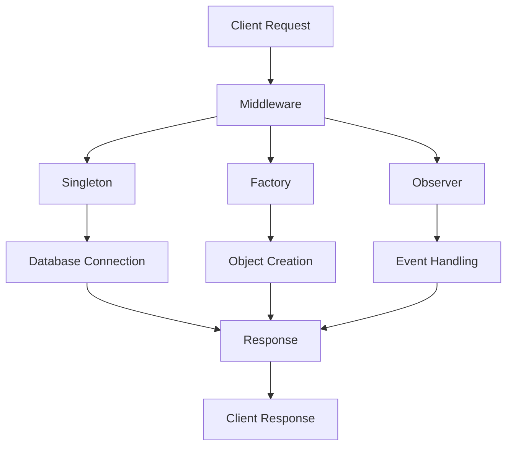

## 16.19 Utilizing Node.js Design Patterns for Back-End Development

Node.js has become a cornerstone for modern back-end development, offering a robust platform for building scalable and efficient applications. In this section, we will explore how various design patterns can be applied in Node.js to solve common back-end challenges. By understanding and implementing these patterns, you can enhance your code's readability, maintainability, and scalability. Let's delve into some key design patterns relevant to Node.js, including Singleton, Factory, Observer, and Middleware.

### Introduction to Node.js Design Patterns

Design patterns are proven solutions to common problems in software design. They provide a template for how to solve a problem that can be used in many different situations. In Node.js, design patterns help developers create more organized and efficient code. Let's recap some of the key design patterns that are particularly relevant to Node.js back-end development.

### Singleton Pattern

**Intent**: Ensure a class has only one instance and provide a global point of access to it.

**Applicability**: Use the Singleton pattern when you need exactly one instance of a class to control the action throughout the execution of your application.

**JavaScript Unique Features**: In JavaScript, modules are singletons by default. When a module is required multiple times, Node.js caches the module, ensuring that the same instance is used.

**Sample Code Snippet**:

```javascript
// logger.js
class Logger {
  constructor() {
    if (Logger.instance) {
      return Logger.instance;
    }
    this.logs = [];
    Logger.instance = this;
  }

  log(message) {
    this.logs.push(message);
    console.log(`Log: ${message}`);
  }

  printLogCount() {
    console.log(`${this.logs.length} Logs`);
  }
}

module.exports = Logger;

// app.js
const Logger = require('./logger');

const logger1 = new Logger();
const logger2 = new Logger();

logger1.log('First log');
logger2.log('Second log');

logger1.printLogCount(); // Output: 2 Logs
```

**Design Considerations**: The Singleton pattern is useful for managing shared resources, such as database connections or configuration settings. However, it can lead to issues with testing and concurrency if not used carefully.

### Factory Pattern

**Intent**: Define an interface for creating an object, but let subclasses alter the type of objects that will be created.

**Applicability**: Use the Factory pattern when you need to create objects that share a common interface but have different implementations.

**Sample Code Snippet**:

```javascript
// carFactory.js
class Car {
  constructor(model, price) {
    this.model = model;
    this.price = price;
  }
}

class CarFactory {
  createCar(type) {
    switch (type) {
      case 'sedan':
        return new Car('Sedan', 20000);
      case 'suv':
        return new Car('SUV', 30000);
      default:
        throw new Error('Unknown car type');
    }
  }
}

module.exports = CarFactory;

// app.js
const CarFactory = require('./carFactory');
const factory = new CarFactory();

const sedan = factory.createCar('sedan');
const suv = factory.createCar('suv');

console.log(sedan); // Output: Car { model: 'Sedan', price: 20000 }
console.log(suv);   // Output: Car { model: 'SUV', price: 30000 }
```

**Design Considerations**: The Factory pattern is beneficial for creating objects that require complex setup or configuration. It promotes loose coupling and enhances code maintainability.

### Observer Pattern

**Intent**: Define a one-to-many dependency between objects so that when one object changes state, all its dependents are notified and updated automatically.

**Applicability**: Use the Observer pattern when changes to one object require changes to others, and you don't want to tightly couple them.

**Sample Code Snippet**:

```javascript
// eventEmitter.js
const EventEmitter = require('events');

class MyEmitter extends EventEmitter {}

const myEmitter = new MyEmitter();

myEmitter.on('event', () => {
  console.log('An event occurred!');
});

myEmitter.emit('event'); // Output: An event occurred!
```

**Design Considerations**: The Observer pattern is ideal for implementing event-driven architectures. It decouples the sender and receiver, allowing for more flexible and maintainable code.

### Middleware Pattern

**Intent**: Allow for the composition of functions that can be executed in sequence, each having the ability to modify the request and response objects.

**Applicability**: Use the Middleware pattern when you need to handle requests and responses in a modular and reusable way.

**Sample Code Snippet**:

```javascript
// app.js
const express = require('express');
const app = express();

const requestLogger = (req, res, next) => {
  console.log(`${req.method} ${req.url}`);
  next();
};

app.use(requestLogger);

app.get('/', (req, res) => {
  res.send('Hello World!');
});

app.listen(3000, () => {
  console.log('Server is running on port 3000');
});
```

**Design Considerations**: Middleware is a powerful pattern for handling cross-cutting concerns such as logging, authentication, and error handling. It promotes code reuse and separation of concerns.

### Applying Design Patterns in Node.js Projects

When developing a Node.js application, it's important to choose the right design patterns based on the specific requirements and constraints of your project. Here are some tips for applying design patterns effectively:

1. **Identify Common Challenges**: Consider the common challenges you face in your project, such as managing state, handling events, or creating complex objects.

2. **Choose the Right Pattern**: Select a design pattern that addresses the specific challenge you're facing. For example, use the Singleton pattern for shared resources, the Factory pattern for object creation, and the Observer pattern for event handling.

3. **Focus on Readability and Maintainability**: Design patterns should enhance the readability and maintainability of your code. Avoid overusing patterns or applying them inappropriately, as this can lead to unnecessary complexity.

4. **Encourage Scalability**: Design patterns can help you build scalable applications by promoting loose coupling and modularity. Consider how your application will grow and evolve over time, and choose patterns that support scalability.

5. **Experiment and Iterate**: Don't be afraid to experiment with different patterns and iterate on your design. As you gain experience, you'll develop a better understanding of when and how to apply each pattern.

### Conclusion

Design patterns are a powerful tool for Node.js developers, providing proven solutions to common challenges in back-end development. By understanding and applying patterns like Singleton, Factory, Observer, and Middleware, you can create more organized, efficient, and scalable applications. Remember to focus on code readability, maintainability, and scalability, and don't hesitate to experiment with different patterns to find the best fit for your project.

### Try It Yourself

To reinforce your understanding of Node.js design patterns, try modifying the code examples provided in this section. Experiment with different patterns and see how they affect the behavior and structure of your application. Consider creating a small project that incorporates multiple design patterns to solve a real-world problem.

### Visualizing Node.js Design Patterns

Below is a visual representation of how these design patterns interact within a Node.js application:



**Diagram Description**: This diagram illustrates the flow of a client request through various design patterns in a Node.js application. The Middleware pattern processes the request, which may involve accessing a Singleton for shared resources, using a Factory for object creation, or triggering events through the Observer pattern. The final response is sent back to the client.

### References and Links

For further reading on Node.js design patterns, consider the following resources:

- [MDN Web Docs: Design Patterns](https://developer.mozilla.org/en-US/docs/Web/JavaScript/Guide/Design_Patterns)
- [Node.js Design Patterns Book](https://www.nodejsdesignpatterns.com/)
- [Express.js Middleware](https://expressjs.com/en/guide/using-middleware.html)

### Knowledge Check

To test your understanding of Node.js design patterns, try answering the following questions:

## Test Your Knowledge on Node.js Design Patterns for Back-End Development



### Which design pattern ensures a class has only one instance?

- [x] Singleton
- [ ] Factory
- [ ] Observer
- [ ] Middleware

> **Explanation:** The Singleton pattern ensures that a class has only one instance and provides a global point of access to it.


### What is the primary benefit of the Factory pattern?

- [x] It allows for the creation of objects with a common interface but different implementations.
- [ ] It ensures a class has only one instance.
- [ ] It defines a one-to-many dependency between objects.
- [ ] It allows for the composition of functions executed in sequence.

> **Explanation:** The Factory pattern is used to create objects that share a common interface but have different implementations.


### Which pattern is ideal for implementing event-driven architectures?

- [ ] Singleton
- [ ] Factory
- [x] Observer
- [ ] Middleware

> **Explanation:** The Observer pattern is ideal for implementing event-driven architectures, as it decouples the sender and receiver.


### What is the primary purpose of the Middleware pattern?

- [ ] To ensure a class has only one instance.
- [ ] To create objects with a common interface.
- [ ] To define a one-to-many dependency between objects.
- [x] To allow for the composition of functions executed in sequence.

> **Explanation:** The Middleware pattern allows for the composition of functions that can be executed in sequence, each modifying the request and response objects.


### Which pattern is useful for managing shared resources like database connections?

- [x] Singleton
- [ ] Factory
- [ ] Observer
- [ ] Middleware

> **Explanation:** The Singleton pattern is useful for managing shared resources, such as database connections, by ensuring only one instance is used.


### What is a key consideration when using the Singleton pattern?

- [x] It can lead to issues with testing and concurrency if not used carefully.
- [ ] It promotes loose coupling and enhances code maintainability.
- [ ] It decouples the sender and receiver.
- [ ] It allows for the composition of functions executed in sequence.

> **Explanation:** The Singleton pattern can lead to issues with testing and concurrency if not used carefully, as it ensures only one instance of a class.


### Which pattern promotes loose coupling and enhances code maintainability?

- [ ] Singleton
- [x] Factory
- [ ] Observer
- [ ] Middleware

> **Explanation:** The Factory pattern promotes loose coupling and enhances code maintainability by allowing for the creation of objects with a common interface but different implementations.


### What is the primary challenge addressed by the Observer pattern?

- [ ] Managing shared resources
- [ ] Creating objects with a common interface
- [x] Handling changes to one object that require changes to others
- [ ] Composing functions executed in sequence

> **Explanation:** The Observer pattern addresses the challenge of handling changes to one object that require changes to others, without tightly coupling them.


### Which pattern is commonly used for handling cross-cutting concerns like logging and authentication?

- [ ] Singleton
- [ ] Factory
- [ ] Observer
- [x] Middleware

> **Explanation:** The Middleware pattern is commonly used for handling cross-cutting concerns such as logging, authentication, and error handling.


### True or False: In Node.js, modules are singletons by default.

- [x] True
- [ ] False

> **Explanation:** In Node.js, modules are singletons by default. When a module is required multiple times, Node.js caches the module, ensuring that the same instance is used.



Remember, this is just the beginning. As you progress, you'll build more complex and interactive back-end applications. Keep experimenting, stay curious, and enjoy the journey!

---
