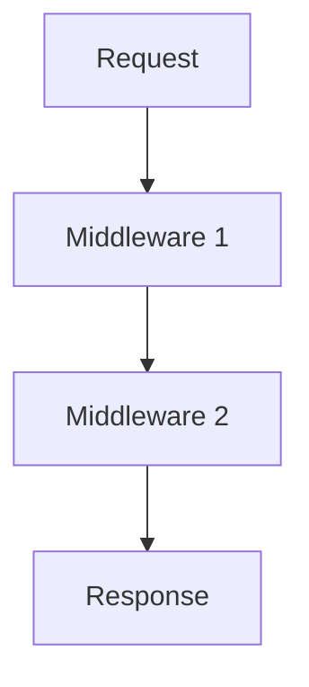
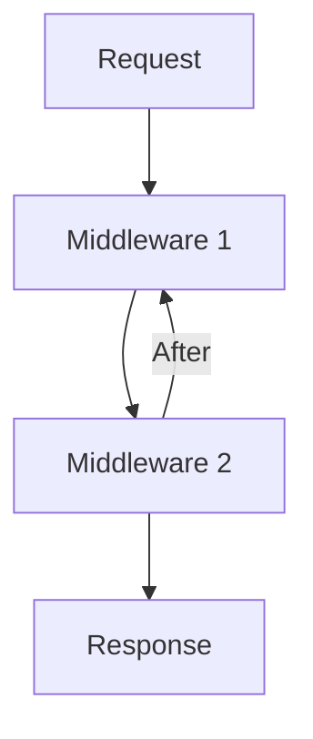

## 16.3 Middleware Patterns in Express and Koa

Middleware is a fundamental concept in web development frameworks like Express and Koa. It allows developers to write modular, reusable code that can handle requests, perform operations, and manage responses. In this section, we'll delve into middleware patterns in these popular Node.js frameworks, providing insights into their execution flow, custom middleware creation, and best practices.

### What is Middleware?

In the context of web frameworks, middleware refers to functions that have access to the request object (`req`), the response object (`res`), and the next middleware function in the application's request-response cycle. Middleware functions can perform a variety of tasks, such as:

- Executing code
- Modifying the request and response objects
- Ending the request-response cycle
- Calling the next middleware function

Middleware is essential for building scalable and maintainable web applications, as it allows developers to separate concerns and reuse code across different parts of the application.

### Middleware Execution Flow

#### Express Middleware Flow

In Express, middleware functions are executed sequentially in the order they are defined. Each middleware function can either end the request-response cycle or pass control to the next middleware function using the `next()` function.

```javascript
const express = require('express');
const app = express();

// Middleware function
app.use((req, res, next) => {
  console.log('Middleware 1');
  next();
});

app.use((req, res, next) => {
  console.log('Middleware 2');
  res.send('Hello from Middleware 2');
});

app.listen(3000, () => {
  console.log('Server is running on port 3000');
});
```

In the example above, "Middleware 1" will log to the console, and then control will pass to "Middleware 2", which sends a response to the client.

#### Koa Middleware Flow

Koa, on the other hand, uses a more modern approach with async functions and `async/await` syntax. Middleware in Koa is executed in a stack-like manner, where each middleware can perform operations before and after calling `await next()`.

```javascript
const Koa = require('koa');
const app = new Koa();

// Middleware function
app.use(async (ctx, next) => {
  console.log('Middleware 1');
  await next();
  console.log('After Middleware 1');
});

app.use(async (ctx, next) => {
  console.log('Middleware 2');
  ctx.body = 'Hello from Middleware 2';
});

app.listen(3000, () => {
  console.log('Server is running on port 3000');
});
```

In Koa, "Middleware 1" logs before and after "Middleware 2" executes, demonstrating the stack-like execution flow.

### Writing Custom Middleware

#### Express Custom Middleware

Creating custom middleware in Express involves defining a function that takes `req`, `res`, and `next` as arguments. Here's an example of a simple logging middleware:

```javascript
function logger(req, res, next) {
  console.log(`${req.method} ${req.url}`);
  next();
}

app.use(logger);
```

This middleware logs the HTTP method and URL of each request.

#### Koa Custom Middleware

In Koa, custom middleware is typically written as async functions. Here's an example of a simple logging middleware in Koa:

```javascript
async function logger(ctx, next) {
  console.log(`${ctx.method} ${ctx.url}`);
  await next();
}

app.use(logger);
```

This middleware logs the HTTP method and URL of each request, similar to the Express example.

### Built-in and Third-Party Middleware

Both Express and Koa offer built-in middleware functions, as well as support for third-party middleware packages.

#### Express Built-in Middleware

Express provides several built-in middleware functions, such as:

- `express.json()`: Parses incoming requests with JSON payloads.
- `express.urlencoded()`: Parses incoming requests with URL-encoded payloads.
- `express.static()`: Serves static files.

#### Koa Built-in Middleware

Koa is more minimalistic and does not include built-in middleware by default. However, it has a rich ecosystem of third-party middleware packages, such as:

- `koa-bodyparser`: Parses incoming request bodies.
- `koa-static`: Serves static files.
- `koa-router`: Adds routing capabilities.

### Comparing Express and Koa Middleware Patterns

One of the key differences between Express and Koa middleware patterns is the use of callbacks versus async/await. Express middleware relies on callbacks, which can lead to callback hell in complex applications. Koa, on the other hand, uses async functions, making it easier to write and maintain asynchronous code.

#### Error Handling

Error handling in middleware is crucial for building robust applications. In Express, errors are passed to the next middleware function using `next(err)`. In Koa, errors can be caught using try-catch blocks within async functions.

#### Middleware Order

The order in which middleware functions are defined is critical, as it determines the flow of the request-response cycle. Middleware should be organized logically, with error-handling middleware typically defined last.

### Best Practices for Composing Middleware

- **Keep Middleware Focused**: Each middleware function should have a single responsibility.
- **Use Third-Party Middleware**: Leverage existing middleware packages to avoid reinventing the wheel.
- **Handle Errors Gracefully**: Implement comprehensive error handling to ensure application stability.
- **Optimize Middleware Order**: Arrange middleware in a logical order to ensure efficient request processing.

### Conclusion

Middleware is a powerful tool for building modular and reusable code in web applications. By understanding the differences between Express and Koa middleware patterns, developers can choose the right framework for their needs and implement best practices for composing middleware.

### Try It Yourself

Experiment with creating custom middleware functions in both Express and Koa. Try modifying the examples provided to log additional information or perform different operations.

### Visualizing Middleware Flow



This diagram illustrates the sequential flow of middleware in Express.



This diagram illustrates the stack-like flow of middleware in Koa.

### Further Reading

- [Express Middleware](https://expressjs.com/en/guide/using-middleware.html)
- [Koa Middleware](https://koajs.com/#middleware)

## Middleware Patterns in Express and Koa: Quiz



### What is the primary purpose of middleware in web frameworks?

- [x] To handle requests and responses in a modular way
- [ ] To serve static files
- [ ] To manage database connections
- [ ] To compile JavaScript code

> **Explanation:** Middleware functions are used to handle requests and responses in a modular and reusable manner.

### How does middleware execution flow differ between Express and Koa?

- [x] Express uses callbacks, while Koa uses async/await
- [ ] Express uses async/await, while Koa uses callbacks
- [ ] Both use callbacks
- [ ] Both use async/await

> **Explanation:** Express middleware relies on callbacks, whereas Koa uses async functions with async/await.

### What is the role of the `next()` function in Express middleware?

- [x] To pass control to the next middleware function
- [ ] To send a response to the client
- [ ] To terminate the request-response cycle
- [ ] To log request details

> **Explanation:** The `next()` function is used to pass control to the next middleware function in the stack.

### In Koa, how do you pass control to the next middleware function?

- [x] By using `await next()`
- [ ] By calling `next()`
- [ ] By returning `next()`
- [ ] By using `nextMiddleware()`

> **Explanation:** In Koa, `await next()` is used to pass control to the next middleware function.

### Which of the following is a built-in middleware in Express?

- [x] `express.json()`
- [ ] `koa-bodyparser`
- [ ] `koa-static`
- [ ] `koa-router`

> **Explanation:** `express.json()` is a built-in middleware function in Express for parsing JSON payloads.

### What is a key benefit of using async/await in Koa middleware?

- [x] Simplifies asynchronous code
- [ ] Increases execution speed
- [ ] Reduces memory usage
- [ ] Enhances security

> **Explanation:** Using async/await simplifies writing and maintaining asynchronous code in Koa middleware.

### Why is middleware order important in Express and Koa?

- [x] It determines the flow of the request-response cycle
- [ ] It affects the application's memory usage
- [ ] It impacts the application's security
- [ ] It changes the application's routing logic

> **Explanation:** The order of middleware functions determines the flow of the request-response cycle.

### How can you handle errors in Express middleware?

- [x] By passing an error to `next(err)`
- [ ] By using `try-catch` blocks
- [ ] By logging the error
- [ ] By sending a response immediately

> **Explanation:** Errors in Express middleware are handled by passing them to the next middleware function using `next(err)`.

### How can you handle errors in Koa middleware?

- [x] By using `try-catch` blocks
- [ ] By passing an error to `next(err)`
- [ ] By logging the error
- [ ] By sending a response immediately

> **Explanation:** Errors in Koa middleware are typically handled using `try-catch` blocks within async functions.

### True or False: Koa includes built-in middleware functions by default.

- [ ] True
- [x] False

> **Explanation:** Koa is minimalistic and does not include built-in middleware functions by default.



Remember, this is just the beginning. As you progress, you'll build more complex and interactive web applications. Keep experimenting, stay curious, and enjoy the journey!
