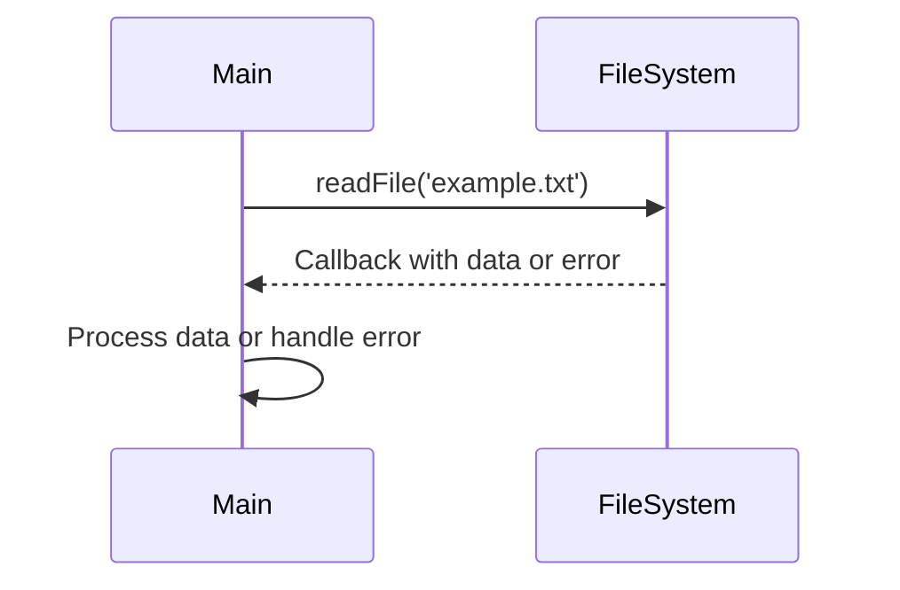

## 16.4 Asynchronous Patterns in Node.js

Asynchronous programming is a cornerstone of Node.js, enabling it to handle multiple operations concurrently without blocking the execution of other code. This capability is crucial for building scalable and efficient applications, especially in environments where I/O operations, such as reading files, making HTTP requests, or interacting with databases, are frequent. In this section, we will delve into the asynchronous patterns in Node.js, exploring the evolution from callbacks to Promises and async/await, and how these patterns can be effectively used to manage asynchronous operations.

### The Importance of Non-Blocking I/O in Node.js

Node.js is designed to be a non-blocking, event-driven runtime, which means it can handle many operations simultaneously without waiting for any single operation to complete. This non-blocking I/O model is particularly beneficial for applications that require high concurrency and low latency, such as web servers and real-time applications.

#### Key Benefits of Non-Blocking I/O

- **Scalability**: Non-blocking I/O allows Node.js to handle thousands of connections concurrently, making it highly scalable.
- **Efficiency**: By not waiting for I/O operations to complete, Node.js can utilize CPU resources more efficiently.
- **Responsiveness**: Applications remain responsive even under heavy load, as operations are processed asynchronously.

### Evolution of Asynchronous Patterns in Node.js

Node.js has evolved significantly in terms of handling asynchronous operations. Let's explore the journey from callbacks to Promises and async/await.

#### Callbacks: The Foundation of Asynchronous Programming

Callbacks were the original mechanism for handling asynchronous operations in Node.js. A callback is a function passed as an argument to another function, which is executed after the completion of an asynchronous operation.

**Example: Reading a File with Callbacks**

```javascript
const fs = require('fs');

fs.readFile('example.txt', 'utf8', (err, data) => {
  if (err) {
    console.error('Error reading file:', err);
    return;
  }
  console.log('File content:', data);
});
```

**Challenges with Callbacks**

- **Callback Hell**: Nested callbacks can lead to complex and hard-to-read code, known as "callback hell."
- **Error Handling**: Managing errors across multiple callbacks can be cumbersome.

#### Promises: A Step Towards Cleaner Asynchronous Code

Promises were introduced to address the limitations of callbacks by providing a more structured way to handle asynchronous operations. A Promise represents a value that may be available now, or in the future, or never.

**Example: Reading a File with Promises**

```javascript
const fs = require('fs').promises;

fs.readFile('example.txt', 'utf8')
  .then(data => {
    console.log('File content:', data);
  })
  .catch(err => {
    console.error('Error reading file:', err);
  });
```

**Advantages of Promises**

- **Chaining**: Promises can be chained, allowing for sequential execution of asynchronous operations.
- **Error Propagation**: Errors are propagated through the chain, simplifying error handling.

#### Async/Await: Syntactic Sugar for Promises

Async/await, introduced in ECMAScript 2017, provides a more readable and concise way to work with Promises. It allows developers to write asynchronous code that looks synchronous, improving readability and maintainability.

**Example: Reading a File with Async/Await**

```javascript
const fs = require('fs').promises;

async function readFileAsync() {
  try {
    const data = await fs.readFile('example.txt', 'utf8');
    console.log('File content:', data);
  } catch (err) {
    console.error('Error reading file:', err);
  }
}

readFileAsync();
```

**Benefits of Async/Await**

- **Readability**: Code is easier to read and understand, resembling synchronous code.
- **Error Handling**: Try/catch blocks can be used for error handling, similar to synchronous code.

### Asynchronous Operations in Node.js

Let's explore how to perform common asynchronous operations in Node.js using callbacks, Promises, and async/await.

#### Making HTTP Requests Asynchronously

Node.js provides the `http` and `https` modules for making HTTP requests. These modules can be used with callbacks, Promises, or async/await.

**Example: Making an HTTP Request with Promises**

```javascript
const https = require('https');

function fetchData(url) {
  return new Promise((resolve, reject) => {
    https.get(url, (response) => {
      let data = '';

      response.on('data', (chunk) => {
        data += chunk;
      });

      response.on('end', () => {
        resolve(data);
      });

    }).on('error', (err) => {
      reject(err);
    });
  });
}

fetchData('https://api.example.com/data')
  .then(data => {
    console.log('Data received:', data);
  })
  .catch(err => {
    console.error('Error fetching data:', err);
  });
```

**Example: Making an HTTP Request with Async/Await**

```javascript
const https = require('https');

async function fetchDataAsync(url) {
  try {
    const data = await fetchData(url);
    console.log('Data received:', data);
  } catch (err) {
    console.error('Error fetching data:', err);
  }
}

fetchDataAsync('https://api.example.com/data');
```

#### Database Operations Asynchronously

Interacting with databases is a common use case for asynchronous operations. Libraries like `mongoose` for MongoDB and `pg` for PostgreSQL provide Promise-based APIs.

**Example: Querying a MongoDB Database with Async/Await**

```javascript
const mongoose = require('mongoose');

async function findDocuments() {
  try {
    await mongoose.connect('mongodb://localhost:27017/mydatabase');
    const documents = await MyModel.find();
    console.log('Documents:', documents);
  } catch (err) {
    console.error('Error querying database:', err);
  } finally {
    await mongoose.disconnect();
  }
}

findDocuments();
```

### Error Handling in Asynchronous Code

Handling errors in asynchronous code is crucial for building robust applications. Let's explore best practices for error handling with callbacks, Promises, and async/await.

#### Error Handling with Callbacks

In callback-based code, errors are typically passed as the first argument to the callback function.

```javascript
fs.readFile('example.txt', 'utf8', (err, data) => {
  if (err) {
    console.error('Error reading file:', err);
    return;
  }
  console.log('File content:', data);
});
```

#### Error Handling with Promises

Promises provide a `.catch()` method for handling errors.

```javascript
fs.readFile('example.txt', 'utf8')
  .then(data => {
    console.log('File content:', data);
  })
  .catch(err => {
    console.error('Error reading file:', err);
  });
```

#### Error Handling with Async/Await

Async/await uses try/catch blocks for error handling, similar to synchronous code.

```javascript
async function readFileAsync() {
  try {
    const data = await fs.readFile('example.txt', 'utf8');
    console.log('File content:', data);
  } catch (err) {
    console.error('Error reading file:', err);
  }
}
```

### The EventEmitter Pattern in Node.js

The EventEmitter pattern is a powerful mechanism for handling asynchronous events in Node.js. It allows objects to emit events and other objects to listen for those events.

**Example: Using EventEmitter**

```javascript
const EventEmitter = require('events');

class MyEmitter extends EventEmitter {}

const myEmitter = new MyEmitter();

myEmitter.on('event', () => {
  console.log('An event occurred!');
});

myEmitter.emit('event');
```

**Use Cases for EventEmitter**

- **Custom Events**: Create custom events for application-specific logic.
- **Decoupling**: Decouple event producers from event consumers, promoting modularity.

### Best Practices for Writing Asynchronous Code

Writing clean and maintainable asynchronous code is essential for building scalable Node.js applications. Here are some best practices to consider:

- **Use Promises and Async/Await**: Prefer Promises and async/await over callbacks for better readability and error handling.
- **Handle Errors Gracefully**: Always handle errors in asynchronous code to prevent application crashes.
- **Avoid Blocking Operations**: Ensure that no blocking operations are performed in the main event loop.
- **Use EventEmitter for Events**: Leverage the EventEmitter pattern for handling events and decoupling components.
- **Limit Concurrency**: Use libraries like `async` or `p-limit` to control concurrency and prevent resource exhaustion.

### Visualizing Asynchronous Patterns

To better understand how asynchronous patterns work in Node.js, let's visualize the flow of an asynchronous operation using a sequence diagram.



**Diagram Description**: This sequence diagram illustrates the flow of an asynchronous file read operation. The `Main` participant initiates the `readFile` operation, and the `FileSystem` participant responds with a callback containing the data or an error.

### Try It Yourself

Experiment with the code examples provided in this section. Try modifying the code to handle different file types, make HTTP requests to different endpoints, or query different databases. This hands-on practice will reinforce your understanding of asynchronous patterns in Node.js.

### Knowledge Check

- What are the benefits of non-blocking I/O in Node.js?
- How do Promises improve upon callbacks for handling asynchronous operations?
- What are the advantages of using async/await over Promises?
- How can you handle errors in asynchronous code using async/await?
- What is the EventEmitter pattern, and how is it used in Node.js?

### Summary

In this section, we've explored the asynchronous patterns in Node.js, from callbacks to Promises and async/await. We've seen how these patterns can be used to handle common asynchronous operations, such as reading files, making HTTP requests, and querying databases. We've also discussed best practices for writing clean and maintainable asynchronous code, as well as the EventEmitter pattern for handling events. Remember, mastering asynchronous programming in Node.js is key to building efficient and scalable applications. Keep experimenting, stay curious, and enjoy the journey!

## Quiz: Mastering Asynchronous Patterns in Node.js



### What is the primary benefit of non-blocking I/O in Node.js?

- [x] Scalability and efficiency
- [ ] Simplicity in code structure
- [ ] Increased memory usage
- [ ] Synchronous execution

> **Explanation:** Non-blocking I/O allows Node.js to handle many operations concurrently, making it scalable and efficient.

### Which of the following is a disadvantage of using callbacks?

- [x] Callback Hell
- [ ] Improved readability
- [ ] Simplified error handling
- [ ] Synchronous execution

> **Explanation:** Callbacks can lead to complex and hard-to-read code, known as "callback hell."

### How do Promises improve error handling compared to callbacks?

- [x] Errors are propagated through the chain
- [ ] Errors are ignored
- [ ] Errors are handled synchronously
- [ ] Errors are logged automatically

> **Explanation:** Promises allow errors to be propagated through the chain, simplifying error handling.

### What is the main advantage of using async/await over Promises?

- [x] Improved readability and maintainability
- [ ] Increased execution speed
- [ ] Reduced memory usage
- [ ] Synchronous execution

> **Explanation:** Async/await provides a more readable and concise way to work with Promises, improving code maintainability.

### Which pattern is used in Node.js to handle asynchronous events?

- [x] EventEmitter
- [ ] Singleton
- [ ] Factory
- [ ] Observer

> **Explanation:** The EventEmitter pattern is used in Node.js to handle asynchronous events.

### What is a common use case for the EventEmitter pattern?

- [x] Creating custom events
- [ ] Synchronous data processing
- [ ] Blocking I/O operations
- [ ] Memory management

> **Explanation:** The EventEmitter pattern is commonly used for creating custom events and decoupling components.

### How can you limit concurrency in asynchronous operations?

- [x] Use libraries like `async` or `p-limit`
- [ ] Use synchronous code
- [ ] Increase server resources
- [ ] Use callbacks

> **Explanation:** Libraries like `async` or `p-limit` can be used to control concurrency and prevent resource exhaustion.

### What is the purpose of the `finally` block in async/await?

- [x] Execute code after try/catch, regardless of outcome
- [ ] Handle errors
- [ ] Return a value
- [ ] Initialize variables

> **Explanation:** The `finally` block is used to execute code after try/catch, regardless of the outcome.

### Which module is used for making HTTP requests in Node.js?

- [x] `https`
- [ ] `fs`
- [ ] `events`
- [ ] `path`

> **Explanation:** The `https` module is used for making HTTP requests in Node.js.

### True or False: Async/await can only be used with Promises.

- [x] True
- [ ] False

> **Explanation:** Async/await is syntactic sugar for working with Promises, so it can only be used with Promises.


