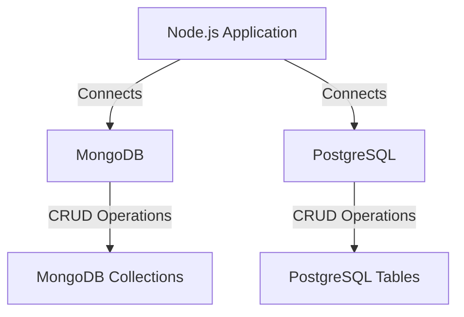

## 16.5 Working with Databases (MongoDB, PostgreSQL)

In modern web development, databases play a crucial role in storing and managing data efficiently. As a back-end developer, understanding how to interact with databases is essential for building robust applications. In this section, we will explore how to work with two popular databases, MongoDB and PostgreSQL, using Node.js. We will cover connecting to these databases, defining schemas, performing CRUD (Create, Read, Update, Delete) operations, and best practices for database security and connection pooling.

### Introduction to Databases in Back-End Development

Databases are the backbone of any application, providing a structured way to store, retrieve, and manage data. They come in two main types: SQL (Structured Query Language) databases like PostgreSQL, which use a tabular schema, and NoSQL (Not Only SQL) databases like MongoDB, which offer a more flexible, document-oriented approach.

#### Key Differences Between SQL and NoSQL Databases

- **Data Model**: SQL databases use a structured schema with tables, rows, and columns, while NoSQL databases use a flexible, document-based model.
- **Scalability**: NoSQL databases are generally more scalable horizontally, making them suitable for large-scale applications.
- **Transactions**: SQL databases support ACID (Atomicity, Consistency, Isolation, Durability) transactions, ensuring data integrity, whereas NoSQL databases may offer eventual consistency.
- **Use Cases**: SQL databases are ideal for complex queries and transactions, while NoSQL databases are better for handling large volumes of unstructured data.

### Connecting to MongoDB

MongoDB is a popular NoSQL database known for its flexibility and scalability. In Node.js, you can connect to MongoDB using the native MongoDB driver or an ODM (Object Data Modeling) library like Mongoose.

#### Using Mongoose

Mongoose is a powerful ODM that provides a straightforward way to define schemas and interact with MongoDB.

**Installation:**

```bash
npm install mongoose
```

**Connecting to MongoDB:**

```javascript
const mongoose = require('mongoose');

mongoose.connect('mongodb://localhost:27017/mydatabase', {
  useNewUrlParser: true,
  useUnifiedTopology: true
}).then(() => {
  console.log('Connected to MongoDB');
}).catch(err => {
  console.error('Connection error', err);
});
```

**Defining Schemas and Models:**

With Mongoose, you define schemas to structure your data.

```javascript
const { Schema, model } = mongoose;

const userSchema = new Schema({
  name: String,
  email: String,
  password: String
});

const User = model('User', userSchema);
```

**Performing CRUD Operations:**

- **Create:**

  ```javascript
  const createUser = async () => {
    const user = new User({ name: 'John Doe', email: 'john@example.com', password: 'securepassword' });
    await user.save();
    console.log('User created:', user);
  };
  ```

- **Read:**

  ```javascript
  const findUser = async () => {
    const user = await User.findOne({ email: 'john@example.com' });
    console.log('User found:', user);
  };
  ```

- **Update:**

  ```javascript
  const updateUser = async () => {
    const user = await User.findOneAndUpdate({ email: 'john@example.com' }, { name: 'John Smith' }, { new: true });
    console.log('User updated:', user);
  };
  ```

- **Delete:**

  ```javascript
  const deleteUser = async () => {
    await User.deleteOne({ email: 'john@example.com' });
    console.log('User deleted');
  };
  ```

#### Using the Native MongoDB Driver

For more control, you can use the native MongoDB driver.

**Installation:**

```bash
npm install mongodb
```

**Connecting to MongoDB:**

```javascript
const { MongoClient } = require('mongodb');

const uri = 'mongodb://localhost:27017';
const client = new MongoClient(uri, { useNewUrlParser: true, useUnifiedTopology: true });

async function connect() {
  try {
    await client.connect();
    console.log('Connected to MongoDB');
  } catch (err) {
    console.error('Connection error', err);
  }
}

connect();
```

**Performing CRUD Operations:**

- **Create:**

  ```javascript
  const createUser = async () => {
    const db = client.db('mydatabase');
    const users = db.collection('users');
    const result = await users.insertOne({ name: 'Jane Doe', email: 'jane@example.com', password: 'securepassword' });
    console.log('User created:', result.insertedId);
  };
  ```

- **Read:**

  ```javascript
  const findUser = async () => {
    const db = client.db('mydatabase');
    const users = db.collection('users');
    const user = await users.findOne({ email: 'jane@example.com' });
    console.log('User found:', user);
  };
  ```

- **Update:**

  ```javascript
  const updateUser = async () => {
    const db = client.db('mydatabase');
    const users = db.collection('users');
    const result = await users.updateOne({ email: 'jane@example.com' }, { $set: { name: 'Jane Smith' } });
    console.log('User updated:', result.modifiedCount);
  };
  ```

- **Delete:**

  ```javascript
  const deleteUser = async () => {
    const db = client.db('mydatabase');
    const users = db.collection('users');
    const result = await users.deleteOne({ email: 'jane@example.com' });
    console.log('User deleted:', result.deletedCount);
  };
  ```

### Connecting to PostgreSQL

PostgreSQL is a powerful, open-source SQL database known for its advanced features and reliability. In Node.js, you can connect to PostgreSQL using the `pg` library or an ORM like Sequelize.

#### Using the `pg` Library

The `pg` library is a native PostgreSQL client for Node.js.

**Installation:**

```bash
npm install pg
```

**Connecting to PostgreSQL:**

```javascript
const { Client } = require('pg');

const client = new Client({
  user: 'yourusername',
  host: 'localhost',
  database: 'mydatabase',
  password: 'yourpassword',
  port: 5432,
});

client.connect()
  .then(() => console.log('Connected to PostgreSQL'))
  .catch(err => console.error('Connection error', err));
```

**Performing CRUD Operations:**

- **Create:**

  ```javascript
  const createUser = async () => {
    const text = 'INSERT INTO users(name, email, password) VALUES($1, $2, $3) RETURNING *';
    const values = ['Alice Doe', 'alice@example.com', 'securepassword'];
    try {
      const res = await client.query(text, values);
      console.log('User created:', res.rows[0]);
    } catch (err) {
      console.error(err.stack);
    }
  };
  ```

- **Read:**

  ```javascript
  const findUser = async () => {
    const text = 'SELECT * FROM users WHERE email = $1';
    const values = ['alice@example.com'];
    try {
      const res = await client.query(text, values);
      console.log('User found:', res.rows[0]);
    } catch (err) {
      console.error(err.stack);
    }
  };
  ```

- **Update:**

  ```javascript
  const updateUser = async () => {
    const text = 'UPDATE users SET name = $1 WHERE email = $2 RETURNING *';
    const values = ['Alice Smith', 'alice@example.com'];
    try {
      const res = await client.query(text, values);
      console.log('User updated:', res.rows[0]);
    } catch (err) {
      console.error(err.stack);
    }
  };
  ```

- **Delete:**

  ```javascript
  const deleteUser = async () => {
    const text = 'DELETE FROM users WHERE email = $1 RETURNING *';
    const values = ['alice@example.com'];
    try {
      const res = await client.query(text, values);
      console.log('User deleted:', res.rows[0]);
    } catch (err) {
      console.error(err.stack);
    }
  };
  ```

#### Using Sequelize

Sequelize is a promise-based ORM for Node.js that supports PostgreSQL, MySQL, MariaDB, SQLite, and Microsoft SQL Server.

**Installation:**

```bash
npm install sequelize pg pg-hstore
```

**Connecting to PostgreSQL:**

```javascript
const { Sequelize, DataTypes } = require('sequelize');

const sequelize = new Sequelize('mydatabase', 'yourusername', 'yourpassword', {
  host: 'localhost',
  dialect: 'postgres'
});

sequelize.authenticate()
  .then(() => console.log('Connected to PostgreSQL'))
  .catch(err => console.error('Connection error', err));
```

**Defining Models:**

```javascript
const User = sequelize.define('User', {
  name: {
    type: DataTypes.STRING,
    allowNull: false
  },
  email: {
    type: DataTypes.STRING,
    allowNull: false,
    unique: true
  },
  password: {
    type: DataTypes.STRING,
    allowNull: false
  }
});
```

**Performing CRUD Operations:**

- **Create:**

  ```javascript
  const createUser = async () => {
    try {
      const user = await User.create({ name: 'Bob Doe', email: 'bob@example.com', password: 'securepassword' });
      console.log('User created:', user.toJSON());
    } catch (err) {
      console.error(err);
    }
  };
  ```

- **Read:**

  ```javascript
  const findUser = async () => {
    try {
      const user = await User.findOne({ where: { email: 'bob@example.com' } });
      console.log('User found:', user.toJSON());
    } catch (err) {
      console.error(err);
    }
  };
  ```

- **Update:**

  ```javascript
  const updateUser = async () => {
    try {
      const user = await User.update({ name: 'Bob Smith' }, { where: { email: 'bob@example.com' } });
      console.log('User updated:', user);
    } catch (err) {
      console.error(err);
    }
  };
  ```

- **Delete:**

  ```javascript
  const deleteUser = async () => {
    try {
      const result = await User.destroy({ where: { email: 'bob@example.com' } });
      console.log('User deleted:', result);
    } catch (err) {
      console.error(err);
    }
  };
  ```

### Best Practices for Database Security and Connection Pooling

- **Use Environment Variables**: Store sensitive information like database credentials in environment variables to keep them secure.
- **Implement Connection Pooling**: Use connection pooling to manage database connections efficiently and improve performance.
- **Regular Backups**: Schedule regular backups of your database to prevent data loss.
- **Use SSL/TLS**: Encrypt data in transit using SSL/TLS to protect it from interception.
- **Limit User Privileges**: Grant the minimum necessary privileges to database users to reduce security risks.
- **Monitor and Audit**: Regularly monitor and audit database activity to detect and respond to suspicious behavior.

### Visualizing Database Connections

Below is a diagram illustrating the interaction between a Node.js application and MongoDB/PostgreSQL databases.



### Try It Yourself

Experiment with the code examples provided by modifying the database connection strings, schema definitions, and CRUD operations. Try adding new fields to the schemas, creating additional models, or implementing more complex queries.

### Knowledge Check

## Mastering Database Integration with Node.js: MongoDB and PostgreSQL



### What is the primary difference between SQL and NoSQL databases?

- [x] SQL databases use structured schemas, while NoSQL databases use flexible, document-based models.
- [ ] SQL databases are always faster than NoSQL databases.
- [ ] NoSQL databases cannot handle transactions.
- [ ] SQL databases do not support horizontal scaling.

> **Explanation:** SQL databases use structured schemas with tables, rows, and columns, whereas NoSQL databases use a flexible, document-based model.

### Which library is commonly used for connecting to MongoDB in Node.js?

- [x] Mongoose
- [ ] Sequelize
- [ ] pg
- [ ] Express

> **Explanation:** Mongoose is a popular ODM library used for connecting to MongoDB in Node.js applications.

### How do you define a schema in Mongoose?

- [x] Using the `Schema` constructor
- [ ] Using the `Model` constructor
- [ ] Using the `Client` constructor
- [ ] Using the `Sequelize` constructor

> **Explanation:** In Mongoose, schemas are defined using the `Schema` constructor.

### What is the purpose of connection pooling?

- [x] To manage database connections efficiently and improve performance
- [ ] To increase the number of database connections
- [ ] To decrease the number of database connections
- [ ] To encrypt database connections

> **Explanation:** Connection pooling helps manage database connections efficiently, improving performance by reusing existing connections.

### Which library is used for connecting to PostgreSQL in Node.js?

- [x] pg
- [ ] Mongoose
- [ ] Express
- [ ] Lodash

> **Explanation:** The `pg` library is a native PostgreSQL client for Node.js.

### What is an ORM?

- [x] Object-Relational Mapping tool
- [ ] Object-Resource Management tool
- [ ] Online Resource Manager
- [ ] Open Resource Model

> **Explanation:** ORM stands for Object-Relational Mapping, a tool that helps map database tables to objects in code.

### Which of the following is a best practice for database security?

- [x] Use SSL/TLS for encrypting data in transit
- [ ] Store credentials in the codebase
- [ ] Grant all privileges to all users
- [ ] Disable logging

> **Explanation:** Using SSL/TLS encrypts data in transit, protecting it from interception.

### What is the purpose of the `pg` library in Node.js?

- [x] To connect to PostgreSQL databases
- [ ] To connect to MongoDB databases
- [ ] To create HTTP servers
- [ ] To manage file uploads

> **Explanation:** The `pg` library is used to connect to PostgreSQL databases in Node.js.

### Which method is used to insert a document in MongoDB using the native driver?

- [x] `insertOne`
- [ ] `create`
- [ ] `add`
- [ ] `save`

> **Explanation:** The `insertOne` method is used to insert a document in MongoDB using the native driver.

### True or False: Sequelize is an ORM that supports multiple SQL databases, including PostgreSQL.

- [x] True
- [ ] False

> **Explanation:** Sequelize is a promise-based ORM that supports multiple SQL databases, including PostgreSQL, MySQL, and SQLite.



Remember, this is just the beginning. As you progress, you'll build more complex and interactive applications. Keep experimenting, stay curious, and enjoy the journey!
