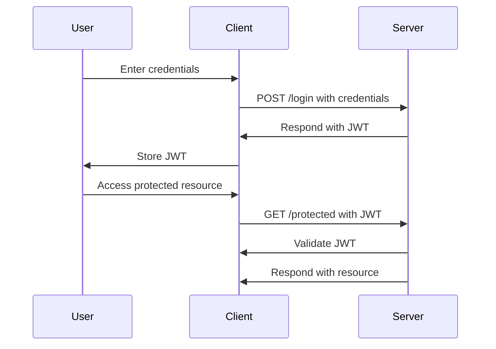

## 16.6 Authentication and Session Management

In the realm of web development, authentication and session management are critical components that ensure secure access to applications. In this section, we will explore various strategies for implementing authentication and managing user sessions in Node.js applications. We will cover session-based authentication, JSON Web Tokens (JWT), and OAuth, along with best practices for securely storing passwords and managing user roles.

### Understanding Authentication

Authentication is the process of verifying the identity of a user or system. It is a fundamental aspect of web security, ensuring that only authorized users can access certain resources or perform specific actions. In web applications, authentication typically involves verifying a user's credentials, such as a username and password, to grant access to protected areas of the application.

### Session-Based Authentication

Session-based authentication is a traditional approach where a server maintains a session for each logged-in user. This session is stored on the server and identified by a unique session ID, which is sent to the client as a cookie. Let's explore how to implement session-based authentication using cookies and the `express-session` middleware in a Node.js application.

#### Implementing Session-Based Authentication

1. **Set Up Express and Express-Session**: First, create a basic Express application and install the `express-session` package.

```bash
npm install express express-session
```

2. **Configure Express-Session**: Use the `express-session` middleware to manage sessions.

```javascript
const express = require('express');
const session = require('express-session');

const app = express();

app.use(session({
  secret: 'your-secret-key',
  resave: false,
  saveUninitialized: true,
  cookie: { secure: true } // Use secure cookies in production
}));

app.get('/', (req, res) => {
  if (req.session.views) {
    req.session.views++;
    res.send(`Number of views: ${req.session.views}`);
  } else {
    req.session.views = 1;
    res.send('Welcome to the session demo. Refresh!');
  }
});

app.listen(3000, () => {
  console.log('Server is running on port 3000');
});
```

3. **Handle User Login and Logout**: Create routes to handle user login and logout, updating the session accordingly.

```javascript
app.post('/login', (req, res) => {
  // Authenticate user
  req.session.userId = user.id; // Save user ID in session
  res.send('Logged in');
});

app.post('/logout', (req, res) => {
  req.session.destroy(err => {
    if (err) {
      return res.status(500).send('Error logging out');
    }
    res.send('Logged out');
  });
});
```

### Authentication with Passport.js

[Passport.js](http://www.passportjs.org/) is a popular middleware for Node.js that simplifies authentication. It supports a wide range of authentication strategies, including local authentication and OAuth.

#### Implementing Local Authentication with Passport.js

1. **Install Passport and Passport-Local**: Start by installing Passport and the local strategy.

```bash
npm install passport passport-local
```

2. **Configure Passport**: Set up Passport to use the local strategy.

```javascript
const passport = require('passport');
const LocalStrategy = require('passport-local').Strategy;

passport.use(new LocalStrategy(
  function(username, password, done) {
    // Replace with your user authentication logic
    User.findOne({ username: username }, function(err, user) {
      if (err) { return done(err); }
      if (!user) { return done(null, false, { message: 'Incorrect username.' }); }
      if (!user.verifyPassword(password)) { return done(null, false, { message: 'Incorrect password.' }); }
      return done(null, user);
    });
  }
));

passport.serializeUser(function(user, done) {
  done(null, user.id);
});

passport.deserializeUser(function(id, done) {
  User.findById(id, function(err, user) {
    done(err, user);
  });
});
```

3. **Integrate Passport with Express**: Use Passport middleware in your Express application.

```javascript
app.use(passport.initialize());
app.use(passport.session());

app.post('/login', passport.authenticate('local', {
  successRedirect: '/',
  failureRedirect: '/login'
}));
```

### Stateless Authentication with JSON Web Tokens (JWT)

JSON Web Tokens (JWT) provide a stateless authentication mechanism, where the server does not need to store session data. Instead, a token is issued to the client upon successful authentication, and the client includes this token in subsequent requests.

#### Implementing JWT Authentication

1. **Install JWT Libraries**: Use `jsonwebtoken` to create and verify tokens.

```bash
npm install jsonwebtoken
```

2. **Generate and Verify Tokens**: Create a token upon successful login and verify it for protected routes.

```javascript
const jwt = require('jsonwebtoken');

app.post('/login', (req, res) => {
  // Authenticate user
  const token = jwt.sign({ userId: user.id }, 'your-secret-key', { expiresIn: '1h' });
  res.json({ token });
});

function authenticateToken(req, res, next) {
  const token = req.headers['authorization'];
  if (!token) return res.sendStatus(401);

  jwt.verify(token, 'your-secret-key', (err, user) => {
    if (err) return res.sendStatus(403);
    req.user = user;
    next();
  });
}

app.get('/protected', authenticateToken, (req, res) => {
  res.send('This is a protected route');
});
```

### OAuth and Third-Party Authentication

OAuth is a protocol that allows users to authenticate using third-party providers like Google, Facebook, or GitHub. This can simplify the login process for users and reduce the need to manage passwords.

#### Implementing OAuth with Passport.js

1. **Install Passport OAuth Strategy**: Install the strategy for the provider you want to use, such as Google.

```bash
npm install passport-google-oauth20
```

2. **Configure the OAuth Strategy**: Set up Passport to use the OAuth strategy.

```javascript
const GoogleStrategy = require('passport-google-oauth20').Strategy;

passport.use(new GoogleStrategy({
  clientID: 'GOOGLE_CLIENT_ID',
  clientSecret: 'GOOGLE_CLIENT_SECRET',
  callbackURL: '/auth/google/callback'
},
function(accessToken, refreshToken, profile, done) {
  User.findOrCreate({ googleId: profile.id }, function(err, user) {
    return done(err, user);
  });
}
));

app.get('/auth/google',
  passport.authenticate('google', { scope: ['profile', 'email'] }));

app.get('/auth/google/callback', 
  passport.authenticate('google', { failureRedirect: '/login' }),
  function(req, res) {
    // Successful authentication, redirect home.
    res.redirect('/');
  });
```

### Best Practices for Secure Authentication

1. **Password Hashing**: Always hash passwords before storing them in the database. Use a library like `bcrypt` for hashing.

```bash
npm install bcrypt
```

```javascript
const bcrypt = require('bcrypt');

bcrypt.hash(password, 10, function(err, hash) {
  // Store hash in your password DB.
});

bcrypt.compare(password, hash, function(err, result) {
  // result == true if password matches
});
```

2. **Protecting Routes**: Use middleware to protect routes and ensure only authenticated users can access them.

3. **Managing User Roles**: Implement role-based access control to manage permissions for different user roles.

4. **Secure Cookies**: Use secure cookies for session management and ensure they are only sent over HTTPS.

5. **Environment Variables**: Store sensitive information like secret keys in environment variables.

6. **Regular Security Audits**: Regularly audit your application for security vulnerabilities and keep dependencies up to date.

### Visualizing Authentication Flow

Below is a sequence diagram illustrating the flow of authentication using JWT:



### Knowledge Check

- What are the differences between session-based and stateless authentication?
- How does Passport.js simplify authentication in Node.js applications?
- Why is it important to hash passwords before storing them?
- What are the benefits of using OAuth for authentication?
- How can you protect routes in a Node.js application?

### Try It Yourself

Experiment with the code examples provided in this section. Try modifying the session configuration, implementing a different Passport.js strategy, or using JWT for a different use case. Remember, this is just the beginning. As you progress, you'll build more secure and robust authentication systems. Keep experimenting, stay curious, and enjoy the journey!

## Quiz: Mastering Authentication and Session Management in Node.js



### What is the primary purpose of authentication in web applications?

- [x] To verify the identity of users
- [ ] To improve application performance
- [ ] To enhance the user interface
- [ ] To manage database connections

> **Explanation:** Authentication is used to verify the identity of users to ensure secure access to applications.

### Which middleware is commonly used for session management in Express applications?

- [x] express-session
- [ ] body-parser
- [ ] morgan
- [ ] cors

> **Explanation:** The `express-session` middleware is commonly used for managing sessions in Express applications.

### What is the main advantage of using JWT for authentication?

- [x] Stateless authentication
- [ ] Requires server-side session storage
- [ ] Simplifies password management
- [ ] Enhances database performance

> **Explanation:** JWT provides stateless authentication, meaning the server does not need to store session data.

### Which library is used for hashing passwords in Node.js?

- [x] bcrypt
- [ ] jsonwebtoken
- [ ] passport
- [ ] express-session

> **Explanation:** `bcrypt` is a library used for hashing passwords securely in Node.js.

### What is the role of Passport.js in Node.js applications?

- [x] Simplifies authentication
- [ ] Manages database connections
- [ ] Enhances application performance
- [ ] Provides a user interface framework

> **Explanation:** Passport.js simplifies authentication by providing middleware for various authentication strategies.

### How can you protect routes in a Node.js application?

- [x] Use middleware to check authentication
- [ ] Store passwords in plain text
- [ ] Use HTTP instead of HTTPS
- [ ] Disable cookies

> **Explanation:** Protect routes by using middleware to check if a user is authenticated before granting access.

### What is the benefit of using OAuth for authentication?

- [x] Allows third-party authentication
- [ ] Requires password storage
- [ ] Improves server performance
- [ ] Simplifies database queries

> **Explanation:** OAuth allows users to authenticate using third-party providers, reducing the need to manage passwords.

### Why should secure cookies be used in session management?

- [x] To ensure cookies are only sent over HTTPS
- [ ] To improve application performance
- [ ] To enhance the user interface
- [ ] To manage database connections

> **Explanation:** Secure cookies ensure that cookies are only sent over HTTPS, enhancing security.

### What is a common practice for storing sensitive information like secret keys?

- [x] Use environment variables
- [ ] Store in plain text files
- [ ] Embed in source code
- [ ] Use cookies

> **Explanation:** Sensitive information like secret keys should be stored in environment variables for security.

### True or False: OAuth is a protocol that allows users to authenticate using third-party providers.

- [x] True
- [ ] False

> **Explanation:** OAuth is indeed a protocol that allows users to authenticate using third-party providers like Google or Facebook.



Remember, mastering authentication and session management is crucial for building secure web applications. Keep exploring and refining your skills to create robust and secure systems.
