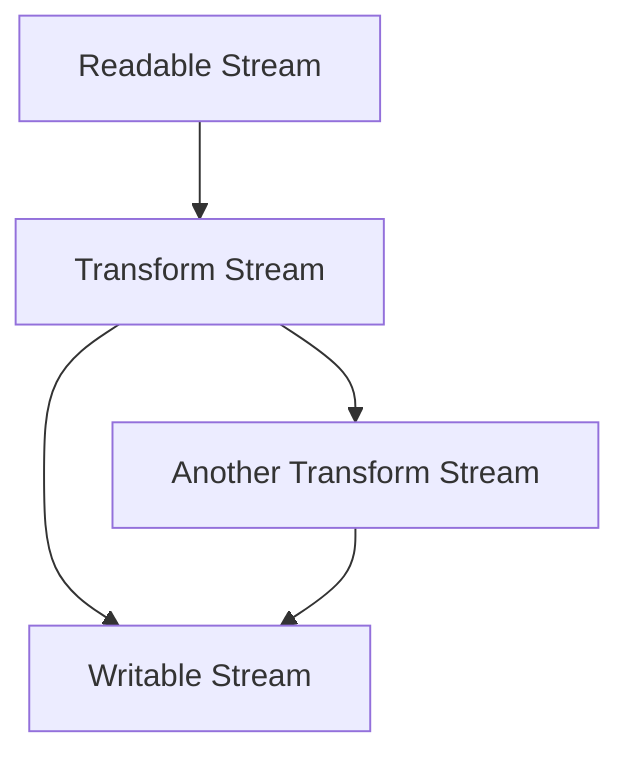

## 16.7 Using Streams for Data Processing

In the world of Node.js, streams are a powerful and efficient way to handle data. They allow us to process data piece by piece, without having to load everything into memory at once. This is especially useful for dealing with large files or real-time data streams. In this section, we will explore what streams are, the different types of streams available in Node.js, and how to use them effectively.

### What Are Streams?

Streams are objects that let you read data from a source or write data to a destination in a continuous fashion. They are an abstraction that enables handling of data that might not be available all at once, and they provide a way to work with data as it is being received or sent.

#### Types of Streams in Node.js

Node.js provides several types of streams:

1. **Readable Streams**: These streams are used for reading data. Examples include `fs.createReadStream()` for reading files and `http.IncomingMessage` for HTTP requests.

2. **Writable Streams**: These streams are used for writing data. Examples include `fs.createWriteStream()` for writing to files and `http.ServerResponse` for sending HTTP responses.

3. **Duplex Streams**: These streams are both readable and writable. An example is a TCP socket.

4. **Transform Streams**: These are duplex streams that can modify or transform the data as it is read or written. An example is the `zlib` stream for compressing or decompressing data.

### Reading from and Writing to Streams

Let's dive into some examples to understand how to work with streams in Node.js.

#### Example: Reading from a File Stream

```javascript
const fs = require('fs');

// Create a readable stream
const readableStream = fs.createReadStream('largefile.txt', { encoding: 'utf8' });

// Listen for data events to read chunks of data
readableStream.on('data', (chunk) => {
  console.log('Received chunk:', chunk);
});

// Handle end of stream
readableStream.on('end', () => {
  console.log('No more data to read.');
});
```

In this example, we create a readable stream from a file and listen for `data` events to process chunks of data as they are read.

#### Example: Writing to a File Stream

```javascript
const fs = require('fs');

// Create a writable stream
const writableStream = fs.createWriteStream('output.txt');

// Write data to the stream
writableStream.write('Hello, ');
writableStream.write('world!\n');

// End the stream
writableStream.end('This is the end of the stream.');
```

Here, we create a writable stream and use the `write` method to send data to the file. The `end` method is used to signal that no more data will be written.

### Piping Streams and Stream Chaining

One of the most powerful features of streams is the ability to pipe them together. This allows data to flow from one stream to another, enabling complex data processing pipelines.

#### Example: Piping Streams

```javascript
const fs = require('fs');
const zlib = require('zlib');

// Create a readable stream
const readableStream = fs.createReadStream('input.txt');

// Create a writable stream
const writableStream = fs.createWriteStream('output.txt.gz');

// Create a transform stream for compression
const gzip = zlib.createGzip();

// Pipe the streams together
readableStream.pipe(gzip).pipe(writableStream);

console.log('File compressed successfully.');
```

In this example, we read data from a file, compress it using a transform stream, and write the compressed data to another file. The `pipe` method connects these streams, allowing data to flow through them seamlessly.

### Use Cases for Streams

Streams are ideal for scenarios where you need to process large amounts of data efficiently. Some common use cases include:

- **Processing Large Files**: Streams allow you to read and process large files without loading the entire file into memory, which is crucial for performance and scalability.

- **Streaming Data Over Networks**: Streams are perfect for handling real-time data, such as video or audio streaming, where data is processed as it is received.

- **Data Transformation**: Transform streams enable you to modify data on the fly, such as compressing or encrypting data as it is being transferred.

### Handling Backpressure

Backpressure is a mechanism to prevent overwhelming a writable stream when the data is being produced faster than it can be consumed. Node.js handles backpressure by pausing the readable stream when the writable stream's buffer is full and resuming it when the buffer is drained.

#### Example: Handling Backpressure

```javascript
const fs = require('fs');

// Create a readable stream
const readableStream = fs.createReadStream('largefile.txt');

// Create a writable stream
const writableStream = fs.createWriteStream('output.txt');

// Pipe the streams together with backpressure handling
readableStream.pipe(writableStream);

// Listen for the 'drain' event to resume reading
writableStream.on('drain', () => {
  console.log('Writable stream drained, resuming readable stream.');
});
```

In this example, the `pipe` method automatically handles backpressure by pausing and resuming the readable stream as needed.

### Creating Custom Streams with Through2

The [Through2](https://github.com/rvagg/through2) module is a popular library for creating custom transform streams. It provides a simple API for implementing custom stream logic.

#### Example: Creating a Custom Transform Stream

```javascript
const through2 = require('through2');

// Create a custom transform stream
const transformStream = through2(function (chunk, enc, callback) {
  // Modify the chunk
  const modifiedChunk = chunk.toString().toUpperCase();
  
  // Push the modified chunk to the readable side
  this.push(modifiedChunk);
  
  // Call the callback to indicate the transformation is complete
  callback();
});

// Use the custom transform stream
process.stdin.pipe(transformStream).pipe(process.stdout);
```

In this example, we create a custom transform stream that converts input data to uppercase. The `through2` module simplifies the process of creating transform streams by handling the boilerplate code for you.

### Visualizing Stream Flow

To better understand how streams work, let's visualize the flow of data through a series of streams.



In this diagram, data flows from a readable stream through one or more transform streams before reaching a writable stream. This illustrates how streams can be chained together to create complex data processing pipelines.

### Knowledge Check

- What are the four types of streams in Node.js?
- How does Node.js handle backpressure in streams?
- What is the purpose of the `pipe` method in streams?
- How can you create a custom transform stream in Node.js?

### Try It Yourself

Experiment with the code examples provided in this section. Try modifying the data transformation logic in the custom transform stream example. What happens if you change the transformation to lowercase instead of uppercase? How does the output change?

### Conclusion

Streams are a fundamental part of Node.js, providing a powerful way to handle data efficiently. By understanding how to use streams effectively, you can build applications that process large amounts of data with ease. Remember, this is just the beginning. As you progress, you'll discover more advanced techniques and patterns for working with streams. Keep experimenting, stay curious, and enjoy the journey!

## Quiz: Mastering Node.js Streams



### What is a stream in Node.js?

- [x] An object that allows reading or writing data continuously
- [ ] A function that processes data in batches
- [ ] A method for storing data in memory
- [ ] A tool for debugging Node.js applications

> **Explanation:** Streams in Node.js are objects that enable continuous reading or writing of data.

### Which of the following is NOT a type of stream in Node.js?

- [ ] Readable
- [ ] Writable
- [ ] Duplex
- [x] Static

> **Explanation:** Static is not a type of stream in Node.js. The types are Readable, Writable, Duplex, and Transform.

### What method is used to connect streams together?

- [ ] connect()
- [x] pipe()
- [ ] link()
- [ ] join()

> **Explanation:** The `pipe()` method is used to connect streams together, allowing data to flow from one stream to another.

### How does Node.js handle backpressure in streams?

- [x] By pausing the readable stream when the writable stream's buffer is full
- [ ] By increasing the buffer size of the writable stream
- [ ] By discarding excess data
- [ ] By creating a new stream

> **Explanation:** Node.js handles backpressure by pausing the readable stream when the writable stream's buffer is full and resuming it when the buffer is drained.

### What is the purpose of a transform stream?

- [x] To modify or transform data as it is read or written
- [ ] To store data temporarily
- [ ] To compress data
- [ ] To encrypt data

> **Explanation:** Transform streams are used to modify or transform data as it is read or written.

### Which module can be used to create custom transform streams in Node.js?

- [ ] fs
- [ ] http
- [x] through2
- [ ] zlib

> **Explanation:** The `through2` module is commonly used to create custom transform streams in Node.js.

### What event should you listen for to handle backpressure in writable streams?

- [ ] data
- [x] drain
- [ ] end
- [ ] error

> **Explanation:** The `drain` event is emitted when a writable stream's buffer is drained, allowing you to resume reading from the readable stream.

### What happens if you don't handle backpressure in streams?

- [ ] The application will crash
- [x] The writable stream's buffer may overflow
- [ ] The readable stream will stop emitting data
- [ ] The data will be lost

> **Explanation:** If backpressure is not handled, the writable stream's buffer may overflow, leading to performance issues.

### What is the benefit of using streams for processing large files?

- [x] They allow processing data without loading the entire file into memory
- [ ] They increase the speed of data processing
- [ ] They simplify the code
- [ ] They provide better error handling

> **Explanation:** Streams allow processing data without loading the entire file into memory, which is crucial for handling large files efficiently.

### True or False: Streams can only be used for file processing in Node.js.

- [ ] True
- [x] False

> **Explanation:** False. Streams can be used for various types of data processing, including network data, real-time data streams, and more.


