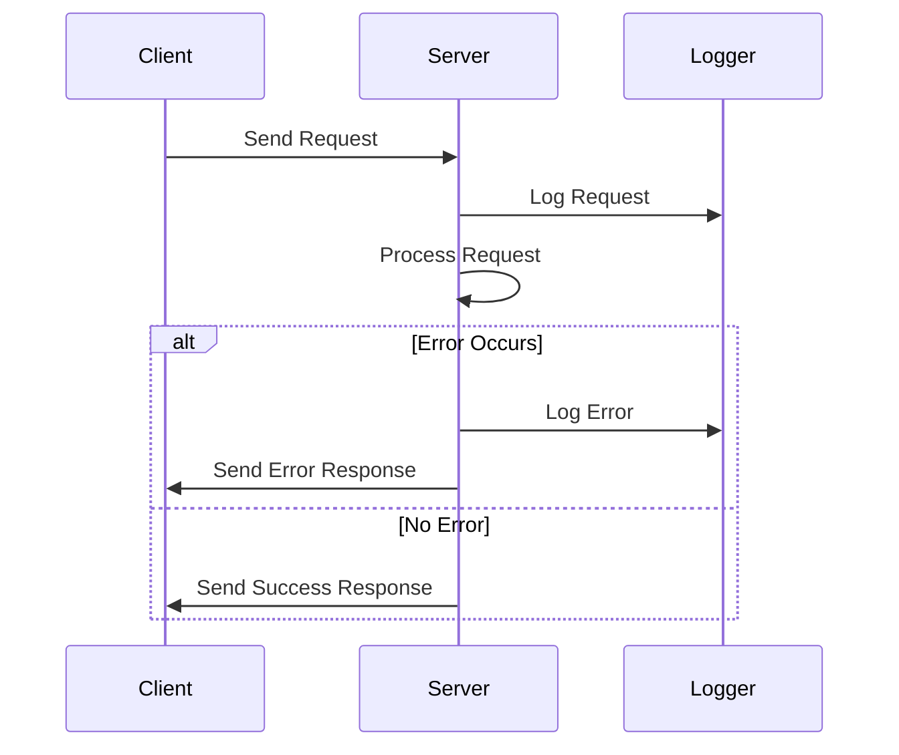

## 16.8 Error Handling and Logging Strategies

In the realm of back-end development with Node.js, mastering error handling and logging is crucial for building robust, maintainable, and scalable applications. Proper error handling ensures that your application can gracefully recover from unexpected situations, while effective logging provides insights into application behavior, aiding in debugging and monitoring.

### Importance of Proper Error Handling

Error handling is a critical aspect of software development. In back-end applications, unhandled errors can lead to application crashes, data corruption, and poor user experiences. By implementing robust error handling strategies, we can:

- **Prevent Application Crashes**: Ensure that errors do not cause the entire application to crash, maintaining uptime and reliability.
- **Improve User Experience**: Provide meaningful error messages to users, helping them understand what went wrong and how to proceed.
- **Facilitate Debugging**: Capture detailed error information to aid in diagnosing and fixing issues.
- **Enhance Security**: Avoid exposing sensitive information through error messages.

### Synchronous and Asynchronous Error Handling

Node.js applications often deal with both synchronous and asynchronous operations. Understanding how to handle errors in both contexts is essential.

#### Synchronous Error Handling

In synchronous code, errors can be caught using `try/catch` blocks. This is straightforward and works well for operations that execute sequentially.

```javascript
function divide(a, b) {
  try {
    if (b === 0) {
      throw new Error('Division by zero');
    }
    return a / b;
  } catch (error) {
    console.error('Error:', error.message);
    return null;
  }
}

console.log(divide(10, 0)); // Output: Error: Division by zero
```

#### Asynchronous Error Handling

Asynchronous operations in Node.js can be handled using callbacks, promises, or async/await. Each approach has its own error handling mechanism.

##### Callback-Based Error Handling

In callback-based APIs, errors are typically passed as the first argument to the callback function.

```javascript
const fs = require('fs');

fs.readFile('nonexistent-file.txt', 'utf8', (err, data) => {
  if (err) {
    console.error('Error reading file:', err.message);
    return;
  }
  console.log(data);
});
```

##### Promise-Based Error Handling

Promises provide a cleaner way to handle asynchronous operations and errors. Use `.catch()` to handle errors in promise chains.

```javascript
const fs = require('fs').promises;

fs.readFile('nonexistent-file.txt', 'utf8')
  .then(data => console.log(data))
  .catch(err => console.error('Error reading file:', err.message));
```

##### Async/Await Error Handling

Async/await simplifies promise-based code and allows the use of `try/catch` blocks for error handling.

```javascript
const fs = require('fs').promises;

async function readFileAsync() {
  try {
    const data = await fs.readFile('nonexistent-file.txt', 'utf8');
    console.log(data);
  } catch (err) {
    console.error('Error reading file:', err.message);
  }
}

readFileAsync();
```

### Using Try/Catch Blocks with Async/Await

The async/await syntax in JavaScript allows us to write asynchronous code that looks synchronous, making it easier to read and maintain. However, it's important to handle errors properly using `try/catch` blocks.

```javascript
async function fetchData(url) {
  try {
    const response = await fetch(url);
    if (!response.ok) {
      throw new Error(`HTTP error! status: ${response.status}`);
    }
    const data = await response.json();
    return data;
  } catch (error) {
    console.error('Fetch error:', error.message);
    return null;
  }
}

fetchData('https://api.example.com/data');
```

### Error-Handling Middleware in Express

Express, a popular web framework for Node.js, provides a mechanism for handling errors through middleware. Error-handling middleware functions have four arguments: `err`, `req`, `res`, and `next`.

```javascript
const express = require('express');
const app = express();

// Regular middleware
app.use((req, res, next) => {
  // Simulate an error
  const error = new Error('Something went wrong');
  error.status = 500;
  next(error);
});

// Error-handling middleware
app.use((err, req, res, next) => {
  console.error(err.stack);
  res.status(err.status || 500).send({
    error: {
      message: err.message,
    },
  });
});

app.listen(3000, () => {
  console.log('Server running on port 3000');
});
```

### Logging Libraries: Winston and Morgan

Logging is an essential part of error handling and monitoring. It helps track application behavior and diagnose issues. Two popular logging libraries in the Node.js ecosystem are Winston and Morgan.

#### Winston

Winston is a versatile logging library that supports multiple transports (e.g., console, file, HTTP) and log levels.

```javascript
const winston = require('winston');

const logger = winston.createLogger({
  level: 'info',
  format: winston.format.json(),
  transports: [
    new winston.transports.Console(),
    new winston.transports.File({ filename: 'error.log', level: 'error' }),
  ],
});

logger.info('This is an info message');
logger.error('This is an error message');
```

#### Morgan

Morgan is a middleware for logging HTTP requests in Express applications. It provides a simple way to log incoming requests and responses.

```javascript
const express = require('express');
const morgan = require('morgan');
const app = express();

app.use(morgan('combined'));

app.get('/', (req, res) => {
  res.send('Hello, world!');
});

app.listen(3000, () => {
  console.log('Server running on port 3000');
});
```

### Structuring Logs and Managing Log Levels

Effective logging involves structuring logs and managing log levels to capture relevant information without overwhelming the system.

- **Log Levels**: Define log levels (e.g., error, warn, info, debug) to categorize log messages based on severity.
- **Structured Logs**: Use JSON format for logs to enable easy parsing and analysis.
- **Contextual Information**: Include contextual information (e.g., request ID, user ID) in logs to facilitate debugging.

### Monitoring Applications and Integrating with Logging Services

Monitoring applications involves tracking performance, errors, and user interactions. Integrating with logging services can enhance monitoring capabilities.

- **Logging Services**: Use services like [Loggly](https://www.loggly.com/), [Papertrail](https://www.papertrail.com/), or [Datadog](https://www.datadoghq.com/) for centralized log management and analysis.
- **Application Performance Monitoring (APM)**: Implement APM tools like [New Relic](https://newrelic.com/) or [AppDynamics](https://www.appdynamics.com/) to monitor application performance and detect anomalies.
- **Alerting**: Set up alerts for critical errors or performance issues to enable proactive response.

### Visualizing Error Handling and Logging Flow

To better understand the flow of error handling and logging in a Node.js application, let's visualize the process using a sequence diagram.



### Best Practices for Error Handling and Logging

- **Centralize Error Handling**: Use middleware to centralize error handling logic in Express applications.
- **Avoid Silent Failures**: Ensure that all errors are logged and handled appropriately.
- **Use Descriptive Error Messages**: Provide clear and descriptive error messages to aid in debugging.
- **Implement Log Rotation**: Use log rotation to manage log file sizes and prevent disk space issues.
- **Secure Logs**: Protect log files from unauthorized access to prevent information leakage.

### Try It Yourself

Experiment with the provided code examples by modifying them to handle different types of errors or log additional information. Consider integrating a logging service to see how it enhances monitoring capabilities.

### Knowledge Check

To reinforce your understanding of error handling and logging strategies in Node.js, try answering the following questions.

## Mastering Error Handling and Logging in Node.js: Quiz



### What is the primary purpose of error handling in Node.js applications?

- [x] To prevent application crashes and improve user experience
- [ ] To increase application performance
- [ ] To reduce code complexity
- [ ] To enhance application security

> **Explanation:** Error handling prevents application crashes and improves user experience by providing meaningful error messages and ensuring graceful recovery from unexpected situations.

### Which of the following is a popular logging library in Node.js?

- [x] Winston
- [ ] Lodash
- [ ] Axios
- [ ] Express

> **Explanation:** Winston is a popular logging library in Node.js that supports multiple transports and log levels.

### How can errors be handled in asynchronous code using async/await?

- [x] Using try/catch blocks
- [ ] Using callback functions
- [ ] Using event emitters
- [ ] Using synchronous code

> **Explanation:** In async/await, errors can be handled using try/catch blocks, which allow for a synchronous-looking error handling approach in asynchronous code.

### What is the role of error-handling middleware in Express?

- [x] To centralize error handling logic
- [ ] To improve application performance
- [ ] To manage database connections
- [ ] To handle user authentication

> **Explanation:** Error-handling middleware in Express centralizes error handling logic, allowing for consistent and efficient error management across the application.

### Which of the following is a benefit of using structured logs?

- [x] Easier parsing and analysis
- [ ] Reduced log file size
- [ ] Improved application performance
- [ ] Enhanced user experience

> **Explanation:** Structured logs, often in JSON format, enable easier parsing and analysis, facilitating better insights into application behavior.

### What is a common practice for managing log file sizes?

- [x] Implementing log rotation
- [ ] Deleting old logs manually
- [ ] Compressing log files
- [ ] Storing logs in a database

> **Explanation:** Implementing log rotation is a common practice to manage log file sizes, preventing disk space issues by archiving and deleting old logs automatically.

### Which tool can be used for Application Performance Monitoring (APM) in Node.js?

- [x] New Relic
- [ ] Winston
- [ ] Morgan
- [ ] Lodash

> **Explanation:** New Relic is a tool used for Application Performance Monitoring (APM) in Node.js, providing insights into application performance and detecting anomalies.

### What is the benefit of including contextual information in logs?

- [x] Facilitates debugging
- [ ] Reduces log file size
- [ ] Increases application performance
- [ ] Enhances user experience

> **Explanation:** Including contextual information in logs, such as request IDs or user IDs, facilitates debugging by providing additional context for understanding application behavior.

### Which of the following is a logging service for centralized log management?

- [x] Loggly
- [ ] Express
- [ ] Axios
- [ ] Lodash

> **Explanation:** Loggly is a logging service used for centralized log management and analysis, enhancing monitoring capabilities.

### True or False: Silent failures should be avoided in error handling.

- [x] True
- [ ] False

> **Explanation:** Silent failures should be avoided in error handling to ensure that all errors are logged and handled appropriately, preventing unnoticed issues.



Remember, mastering error handling and logging is a continuous journey. As you progress, you'll build more resilient and maintainable applications. Keep experimenting, stay curious, and enjoy the journey!
