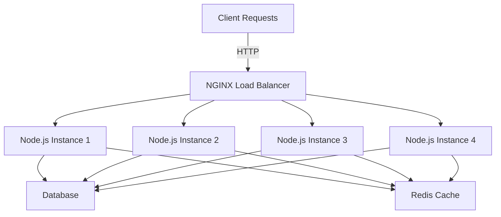

## 16.9 Scaling and Managing Performance

In the world of back-end development, ensuring that your application can handle increased loads efficiently is crucial. Node.js, with its non-blocking I/O and event-driven architecture, is well-suited for building scalable applications. However, its single-threaded nature poses challenges when it comes to leveraging multi-core systems. In this section, we will explore various techniques to scale Node.js applications, optimize performance, and manage resources effectively.

### Understanding Node.js's Single-Threaded Nature

Node.js operates on a single-threaded event loop, which means it can handle many connections simultaneously without creating new threads for each connection. This is efficient for I/O-bound tasks but can become a bottleneck for CPU-intensive operations. To overcome this limitation, we can leverage multiple cores using clustering.

### Leveraging Multiple Cores with Clustering

Clustering allows us to create multiple instances of a Node.js application, each running on a separate core. This can be achieved using the built-in `cluster` module. By distributing incoming requests across multiple instances, we can improve the application's ability to handle concurrent requests.

#### Example: Using the Cluster Module

```javascript
const cluster = require('cluster');
const http = require('http');
const numCPUs = require('os').cpus().length;

if (cluster.isMaster) {
  console.log(`Master ${process.pid} is running`);

  // Fork workers for each CPU core
  for (let i = 0; i < numCPUs; i++) {
    cluster.fork();
  }

  cluster.on('exit', (worker, code, signal) => {
    console.log(`Worker ${worker.process.pid} died`);
    // Optionally, fork a new worker
    cluster.fork();
  });
} else {
  // Workers can share any TCP connection
  http.createServer((req, res) => {
    res.writeHead(200);
    res.end('Hello World\n');
  }).listen(8000);

  console.log(`Worker ${process.pid} started`);
}
```

In this example, the master process forks a worker for each CPU core. Each worker listens on the same port, allowing the operating system to distribute incoming connections among them.

### Load Balancing Strategies

To further enhance scalability, we can use load balancers to distribute traffic across multiple server instances. Tools like NGINX are commonly used for this purpose.

#### Load Balancing with NGINX

NGINX can be configured as a reverse proxy to distribute incoming requests to a pool of Node.js instances. Here's a basic configuration:

```nginx
http {
  upstream nodejs_backend {
    server 127.0.0.1:8000;
    server 127.0.0.1:8001;
    server 127.0.0.1:8002;
    server 127.0.0.1:8003;
  }

  server {
    listen 80;

    location / {
      proxy_pass http://nodejs_backend;
      proxy_set_header Host $host;
      proxy_set_header X-Real-IP $remote_addr;
      proxy_set_header X-Forwarded-For $proxy_add_x_forwarded_for;
      proxy_set_header X-Forwarded-Proto $scheme;
    }
  }
}
```

This configuration sets up NGINX to forward requests to a group of Node.js instances running on different ports. NGINX handles the load balancing, ensuring that requests are distributed evenly.

### Horizontal Scaling and Stateless Services

Horizontal scaling involves adding more instances of your application to handle increased load. This is most effective when your application is stateless, meaning that each request can be handled independently without relying on shared state.

#### Considerations for Stateless Services

- **Session Management**: Use external storage for session data, such as Redis or a database, to ensure consistency across instances.
- **Data Consistency**: Implement mechanisms to synchronize data across instances if necessary.
- **Service Discovery**: Use tools like Consul or Kubernetes for managing service instances and routing requests.

### Performance Optimization Techniques

To ensure optimal performance, it's essential to monitor and profile your application, use resources efficiently, and implement caching strategies.

#### Profiling and Monitoring

Tools like Node.js's built-in profiler, `clinic`, and `pm2` can help identify performance bottlenecks and monitor application health.

- **Node.js Profiler**: Use the `--prof` flag to generate a V8 profiler output.
- **Clinic.js**: Provides a suite of tools for profiling and diagnosing performance issues.
- **PM2**: A process manager that includes monitoring and clustering capabilities.

#### Efficient Use of Resources

- **Asynchronous Operations**: Ensure that all I/O operations are non-blocking.
- **Event Loop Monitoring**: Use tools like `clinic doctor` to monitor event loop delays.
- **Memory Management**: Optimize memory usage by avoiding memory leaks and using efficient data structures.

#### Caching Strategies

Caching can significantly reduce load times and server strain by storing frequently accessed data in memory.

- **In-Memory Caching**: Use libraries like `node-cache` or `lru-cache` for simple caching solutions.
- **Distributed Caching**: Implement caching layers with Redis or Memcached for larger applications.

### Cloud-Based Scaling Solutions and Containerization

Cloud platforms offer scalable infrastructure and services that can simplify the scaling process. Containerization with Docker provides a consistent environment for deploying applications.

#### Cloud-Based Scaling

- **Auto-Scaling**: Use cloud provider features to automatically adjust the number of instances based on demand.
- **Managed Services**: Leverage managed databases, caching, and other services to offload infrastructure management.

#### Containerization with Docker

Docker allows you to package your application and its dependencies into a container, ensuring consistency across environments.

- **Docker Compose**: Define multi-container applications with a simple YAML file.
- **Kubernetes**: Orchestrate and manage containerized applications at scale.

### Visualizing Node.js Scaling Architecture

Below is a diagram illustrating a typical architecture for scaling Node.js applications using clustering, load balancing, and containerization.



**Diagram Description**: This diagram shows client requests being routed through an NGINX load balancer to multiple Node.js instances. Each instance can access a shared database and Redis cache.

### Conclusion

Scaling and managing performance in Node.js applications involves a combination of techniques, from leveraging multiple cores with clustering to implementing load balancing and optimizing resource usage. By understanding the unique characteristics of Node.js and employing the right strategies, you can build applications that handle increased loads efficiently and reliably.

### Key Takeaways

- Node.js's single-threaded nature can be mitigated by using clustering to leverage multiple cores.
- Load balancing with tools like NGINX distributes traffic across multiple instances.
- Horizontal scaling is most effective with stateless services.
- Profiling, monitoring, and caching are essential for optimizing performance.
- Cloud-based solutions and containerization offer scalable and consistent deployment environments.

### Try It Yourself

Experiment with the clustering example by modifying the number of worker processes or changing the server response. Try setting up an NGINX load balancer and observe how it distributes requests among Node.js instances.

### Further Reading

- [Node.js Cluster Documentation](https://nodejs.org/api/cluster.html)
- [NGINX Load Balancing](https://www.nginx.com/resources/glossary/load-balancing/)
- [Docker Documentation](https://docs.docker.com/)

## Test Your Knowledge on Scaling and Managing Performance in Node.js



### What is the primary advantage of using clustering in Node.js?

- [x] It allows Node.js to utilize multiple CPU cores.
- [ ] It simplifies the code structure.
- [ ] It reduces memory usage.
- [ ] It eliminates the need for load balancing.

> **Explanation:** Clustering allows Node.js to utilize multiple CPU cores by creating multiple instances of the application.

### Which module is used for clustering in Node.js?

- [x] cluster
- [ ] os
- [ ] http
- [ ] fs

> **Explanation:** The `cluster` module is used to create multiple instances of a Node.js application to leverage multiple CPU cores.

### What is the role of NGINX in scaling Node.js applications?

- [x] Load balancing
- [ ] Database management
- [ ] Memory optimization
- [ ] Code compilation

> **Explanation:** NGINX is used for load balancing, distributing incoming requests across multiple server instances.

### What is a key consideration when implementing horizontal scaling?

- [x] Ensuring services are stateless
- [ ] Increasing memory usage
- [ ] Reducing the number of instances
- [ ] Using synchronous operations

> **Explanation:** Horizontal scaling is most effective when services are stateless, allowing requests to be handled independently.

### Which tool can be used for profiling Node.js applications?

- [x] Clinic.js
- [ ] Redis
- [ ] NGINX
- [ ] Docker

> **Explanation:** Clinic.js is a suite of tools for profiling and diagnosing performance issues in Node.js applications.

### What is the benefit of using Docker for Node.js applications?

- [x] Consistent deployment environments
- [ ] Increased memory usage
- [ ] Reduced code complexity
- [ ] Elimination of load balancing

> **Explanation:** Docker provides consistent deployment environments by packaging applications and their dependencies into containers.

### Which of the following is a caching strategy?

- [x] In-memory caching
- [ ] Load balancing
- [x] Distributed caching
- [ ] Clustering

> **Explanation:** In-memory caching and distributed caching are strategies to store frequently accessed data for faster retrieval.

### What is the purpose of using Redis in a Node.js application?

- [x] Caching
- [ ] Load balancing
- [ ] Profiling
- [ ] Clustering

> **Explanation:** Redis is commonly used for caching to store frequently accessed data in memory.

### Which cloud feature automatically adjusts the number of instances based on demand?

- [x] Auto-scaling
- [ ] Load balancing
- [ ] Clustering
- [ ] Profiling

> **Explanation:** Auto-scaling automatically adjusts the number of instances based on demand, ensuring efficient resource usage.

### True or False: Node.js is inherently multi-threaded.

- [ ] True
- [x] False

> **Explanation:** Node.js is inherently single-threaded, but it can leverage multiple cores through clustering.


