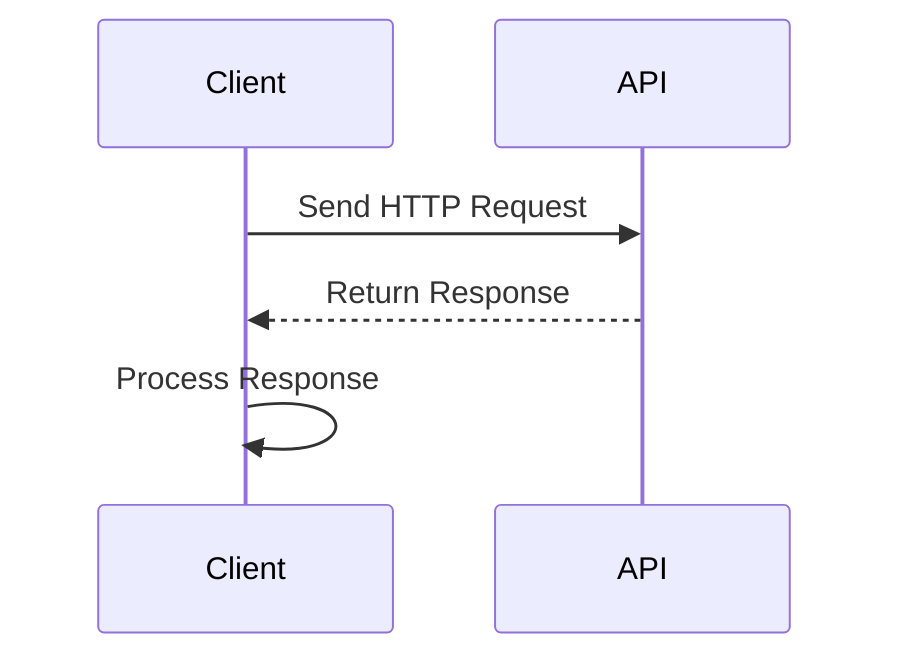

## 17.1 Interoperability with Web APIs

In today's interconnected digital landscape, the ability to interact with external Web APIs is a crucial skill for any JavaScript developer. Web APIs allow applications to communicate with each other over the internet, enabling the integration of diverse services and data sources. This section will guide you through the essential techniques for making HTTP requests, handling responses, and ensuring robust and secure API interactions in JavaScript applications.

### Importance of Integrating with External APIs

Integrating with external APIs allows developers to leverage existing services and data, reducing the need to build everything from scratch. Whether it's retrieving weather data, processing payments, or accessing social media platforms, APIs provide a standardized way to interact with external systems. This interoperability enhances the functionality of applications, enabling them to offer richer user experiences and more comprehensive features.

### Methods for Making HTTP Requests

JavaScript offers several methods for making HTTP requests to interact with Web APIs. We'll explore three popular options: the Fetch API, Axios, and SuperAgent.

#### Fetch API

The [Fetch API](https://developer.mozilla.org/en-US/docs/Web/API/Fetch_API) is a modern, promise-based API for making HTTP requests. It provides a simple and clean interface for fetching resources across the network.

**Example: GET Request with Fetch API**

```javascript
// Fetching data from a public API
fetch('https://api.example.com/data')
  .then(response => {
    if (!response.ok) {
      throw new Error('Network response was not ok');
    }
    return response.json();
  })
  .then(data => {
    console.log(data);
  })
  .catch(error => {
    console.error('There was a problem with the fetch operation:', error);
  });
```

**Example: POST Request with Fetch API**

```javascript
// Sending data to a server
fetch('https://api.example.com/data', {
  method: 'POST',
  headers: {
    'Content-Type': 'application/json'
  },
  body: JSON.stringify({ key: 'value' })
})
  .then(response => response.json())
  .then(data => {
    console.log('Success:', data);
  })
  .catch(error => {
    console.error('Error:', error);
  });
```

#### Axios

[Axios](https://axios-http.com/) is a popular promise-based HTTP client for JavaScript. It provides a more robust and feature-rich alternative to the Fetch API, with support for request and response interceptors, automatic JSON transformation, and more.

**Example: GET Request with Axios**

```javascript
// Importing Axios
const axios = require('axios');

// Fetching data using Axios
axios.get('https://api.example.com/data')
  .then(response => {
    console.log(response.data);
  })
  .catch(error => {
    console.error('Error fetching data:', error);
  });
```

**Example: POST Request with Axios**

```javascript
// Sending data using Axios
axios.post('https://api.example.com/data', {
  key: 'value'
})
  .then(response => {
    console.log('Data posted successfully:', response.data);
  })
  .catch(error => {
    console.error('Error posting data:', error);
  });
```

#### SuperAgent

[SuperAgent](http://visionmedia.github.io/superagent/) is a flexible and lightweight HTTP request library for Node.js and browsers. It provides a simple API for making HTTP requests and handling responses.

**Example: GET Request with SuperAgent**

```javascript
// Importing SuperAgent
const superagent = require('superagent');

// Fetching data using SuperAgent
superagent.get('https://api.example.com/data')
  .end((err, res) => {
    if (err) {
      console.error('Error fetching data:', err);
    } else {
      console.log(res.body);
    }
  });
```

**Example: POST Request with SuperAgent**

```javascript
// Sending data using SuperAgent
superagent.post('https://api.example.com/data')
  .send({ key: 'value' })
  .end((err, res) => {
    if (err) {
      console.error('Error posting data:', err);
    } else {
      console.log('Data posted successfully:', res.body);
    }
  });
```

### Handling JSON and Other Data Formats

Most Web APIs return data in JSON format, which is easy to parse and manipulate in JavaScript. However, APIs may also return data in other formats, such as XML or plain text. It's important to handle these formats appropriately.

**Example: Handling JSON Data**

```javascript
fetch('https://api.example.com/data')
  .then(response => response.json())
  .then(data => {
    console.log('JSON data:', data);
  });
```

**Example: Handling Text Data**

```javascript
fetch('https://api.example.com/text')
  .then(response => response.text())
  .then(data => {
    console.log('Text data:', data);
  });
```

### Best Practices for Error Handling and Retries

When interacting with Web APIs, robust error handling is essential to ensure a smooth user experience. Consider implementing retries for transient errors and providing meaningful error messages.

**Example: Error Handling with Retries**

```javascript
function fetchDataWithRetry(url, retries = 3) {
  return fetch(url)
    .then(response => {
      if (!response.ok) {
        throw new Error('Network response was not ok');
      }
      return response.json();
    })
    .catch(error => {
      if (retries > 0) {
        console.log(`Retrying... (${retries} attempts left)`);
        return fetchDataWithRetry(url, retries - 1);
      } else {
        console.error('Failed to fetch data:', error);
        throw error;
      }
    });
}

fetchDataWithRetry('https://api.example.com/data')
  .then(data => {
    console.log('Data fetched successfully:', data);
  });
```

### Considerations for Authentication

Many APIs require authentication to access their resources. Common methods include API keys and OAuth.

**API Keys**

API keys are simple tokens that identify the client making the request. They are often included in the request headers.

**Example: Using API Keys**

```javascript
fetch('https://api.example.com/data', {
  headers: {
    'Authorization': 'Bearer YOUR_API_KEY'
  }
})
  .then(response => response.json())
  .then(data => {
    console.log('Data with API key:', data);
  });
```

**OAuth**

OAuth is a more secure and complex authentication method that involves obtaining an access token through a series of redirects and user consent.

**Example: OAuth Flow**

1. Redirect the user to the authorization server.
2. The user logs in and grants permission.
3. The server redirects back with an authorization code.
4. Exchange the authorization code for an access token.
5. Use the access token to access the API.

### Visualizing API Interaction

To better understand how JavaScript interacts with Web APIs, let's visualize the process using a sequence diagram.



**Diagram Explanation:** This sequence diagram illustrates the basic interaction between a client (JavaScript application) and an API. The client sends an HTTP request to the API, receives a response, and processes the response data.

### Try It Yourself

Experiment with the provided code examples by modifying the URLs, request methods, and data payloads. Try implementing error handling and retries in different scenarios. Explore using different authentication methods with public APIs that require keys or OAuth.

### Knowledge Check

1. What are the benefits of integrating with external Web APIs?
2. How does the Fetch API differ from Axios and SuperAgent?
3. What are some best practices for handling errors when making HTTP requests?
4. How can you handle different data formats returned by APIs?
5. What are the common methods for authenticating API requests?

### Summary

In this section, we've explored the importance of interoperability with Web APIs and the various methods for making HTTP requests in JavaScript. We've covered handling different data formats, implementing error handling and retries, and authenticating API requests. By mastering these techniques, you'll be well-equipped to build robust and feature-rich JavaScript applications that leverage external services.

Remember, this is just the beginning. As you progress, you'll build more complex and interactive applications. Keep experimenting, stay curious, and enjoy the journey!

## Quiz: Mastering Interoperability with Web APIs



### What is the primary benefit of integrating with external Web APIs?

- [x] Access to external services and data
- [ ] Reduced application size
- [ ] Faster application performance
- [ ] Improved security

> **Explanation:** Integrating with external Web APIs allows applications to access external services and data, enhancing functionality and user experience.

### Which method is used to make HTTP requests in JavaScript?

- [x] Fetch API
- [x] Axios
- [x] SuperAgent
- [ ] jQuery

> **Explanation:** Fetch API, Axios, and SuperAgent are popular methods for making HTTP requests in JavaScript. jQuery is a library that can also make requests but is not as commonly used for this purpose in modern applications.

### How does the Fetch API handle responses?

- [x] Using Promises
- [ ] Using Callbacks
- [ ] Using Async/Await
- [ ] Using Events

> **Explanation:** The Fetch API uses Promises to handle responses, providing a modern and clean way to work with asynchronous operations.

### What is a common format for data returned by Web APIs?

- [x] JSON
- [ ] XML
- [ ] CSV
- [ ] HTML

> **Explanation:** JSON is the most common format for data returned by Web APIs due to its simplicity and ease of use in JavaScript.

### What is a best practice for handling errors in HTTP requests?

- [x] Implementing retries for transient errors
- [ ] Ignoring errors
- [ ] Logging errors without handling
- [ ] Using synchronous requests

> **Explanation:** Implementing retries for transient errors is a best practice to ensure robust error handling in HTTP requests.

### What is an API key used for?

- [x] Authentication
- [ ] Data formatting
- [ ] Error handling
- [ ] Request logging

> **Explanation:** An API key is used for authentication, identifying the client making the request to the API.

### What is OAuth primarily used for?

- [x] Secure authentication
- [ ] Data encryption
- [ ] Error handling
- [ ] Data serialization

> **Explanation:** OAuth is primarily used for secure authentication, allowing users to grant access to their resources without sharing credentials.

### What is the purpose of the `Authorization` header in an HTTP request?

- [x] To include authentication credentials
- [ ] To specify the content type
- [ ] To define the request method
- [ ] To indicate the response format

> **Explanation:** The `Authorization` header is used to include authentication credentials, such as API keys or tokens, in an HTTP request.

### Which library provides a feature-rich alternative to the Fetch API?

- [x] Axios
- [ ] jQuery
- [ ] Lodash
- [ ] Moment.js

> **Explanation:** Axios provides a feature-rich alternative to the Fetch API, offering additional capabilities such as request and response interceptors.

### True or False: SuperAgent is a lightweight HTTP request library for Node.js and browsers.

- [x] True
- [ ] False

> **Explanation:** True. SuperAgent is a lightweight HTTP request library that can be used in both Node.js and browser environments.


