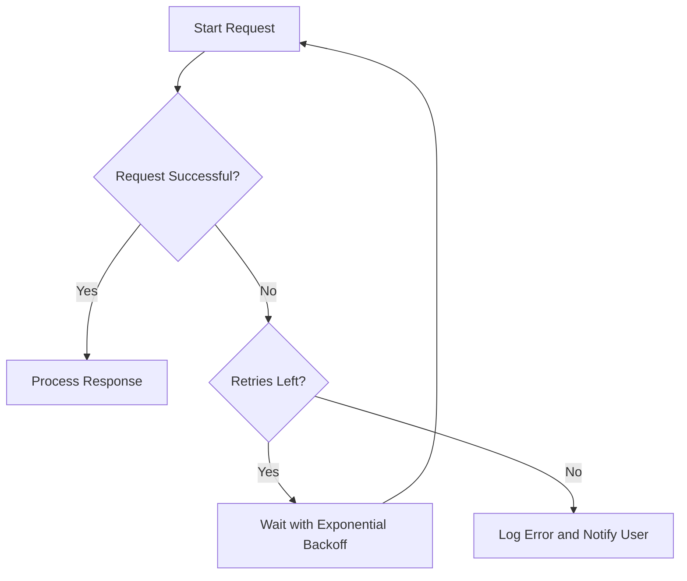

## 17.10 Handling Network Errors and Retries

In the world of web development, network errors are an inevitable challenge. Whether you're building a simple web application or a complex system, handling network errors gracefully is crucial for maintaining a robust and user-friendly application. In this section, we'll explore common network error scenarios, strategies for detecting and handling these errors, and techniques for implementing retry mechanisms to improve the resilience of your JavaScript applications.

### Understanding Common Network Error Scenarios

Network errors can occur due to a variety of reasons, and understanding these scenarios is the first step in handling them effectively. Here are some common network error scenarios you might encounter:

1. **Timeouts**: When a request takes too long to complete, it may time out. This can happen due to slow server response times or network congestion.

2. **Connection Errors**: These occur when the client is unable to establish a connection with the server. This could be due to server downtime, DNS issues, or network connectivity problems.

3. **Server Errors**: These are errors returned by the server, typically indicated by HTTP status codes in the 5xx range. They can occur due to server overload, misconfigurations, or unexpected failures.

4. **Client Errors**: These errors, indicated by HTTP status codes in the 4xx range, occur due to issues with the request, such as invalid parameters or authentication failures.

### Strategies for Detecting and Handling Network Errors

To handle network errors effectively, you need to detect them accurately and respond appropriately. Here are some strategies to consider:

#### 1. Detecting Timeouts

To detect timeouts, you can set a timeout duration for your network requests. If the request exceeds this duration, you can assume a timeout has occurred. Here's an example using the Fetch API:

```javascript
function fetchWithTimeout(url, options, timeout = 5000) {
    return Promise.race([
        fetch(url, options),
        new Promise((_, reject) =>
            setTimeout(() => reject(new Error('Request timed out')), timeout)
        )
    ]);
}

fetchWithTimeout('https://api.example.com/data')
    .then(response => response.json())
    .then(data => console.log(data))
    .catch(error => console.error('Error:', error));
```

#### 2. Handling Connection Errors

Connection errors can be detected by checking the error message or status code returned by the network request. For example, in the Fetch API, a failed request will throw an error that you can catch and handle:

```javascript
fetch('https://api.example.com/data')
    .then(response => {
        if (!response.ok) {
            throw new Error(`HTTP error! Status: ${response.status}`);
        }
        return response.json();
    })
    .then(data => console.log(data))
    .catch(error => console.error('Connection error:', error));
```

#### 3. Handling Server Errors

Server errors can be detected by examining the HTTP status code of the response. If the status code is in the 5xx range, you can assume a server error has occurred:

```javascript
fetch('https://api.example.com/data')
    .then(response => {
        if (response.status >= 500) {
            throw new Error('Server error');
        }
        return response.json();
    })
    .then(data => console.log(data))
    .catch(error => console.error('Error:', error));
```

### Implementing Retries with Exponential Backoff

Retrying failed requests is a common strategy for handling transient network errors. However, it's important to implement retries in a way that doesn't overwhelm the server or the network. Exponential backoff is a technique that increases the delay between retries exponentially, reducing the load on the server and increasing the chances of a successful retry.

Here's a simple implementation of retries with exponential backoff:

```javascript
async function fetchWithRetry(url, options, retries = 3, backoff = 1000) {
    for (let i = 0; i < retries; i++) {
        try {
            const response = await fetch(url, options);
            if (response.ok) {
                return await response.json();
            }
            throw new Error(`HTTP error! Status: ${response.status}`);
        } catch (error) {
            if (i < retries - 1) {
                console.log(`Retrying... (${i + 1})`);
                await new Promise(resolve => setTimeout(resolve, backoff * Math.pow(2, i)));
            } else {
                throw error;
            }
        }
    }
}

fetchWithRetry('https://api.example.com/data')
    .then(data => console.log(data))
    .catch(error => console.error('Failed to fetch data:', error));
```

### Libraries for Handling Retries

Several libraries can help simplify the implementation of retries in your JavaScript applications. One popular library is [axios-retry](https://github.com/softonic/axios-retry), which provides a simple way to add retry functionality to Axios requests.

Here's an example of using axios-retry:

```javascript
const axios = require('axios');
const axiosRetry = require('axios-retry');

axiosRetry(axios, { retries: 3, retryDelay: axiosRetry.exponentialDelay });

axios.get('https://api.example.com/data')
    .then(response => console.log(response.data))
    .catch(error => console.error('Failed to fetch data:', error));
```

### The Importance of Idempotency in Retries

When implementing retries, it's crucial to ensure that the operations you're retrying are idempotent. An idempotent operation is one that can be performed multiple times without changing the result beyond the initial application. This is important because retries can lead to duplicate requests, and idempotency ensures that these duplicates don't cause unintended side effects.

For example, GET requests are typically idempotent, as they don't modify server state. However, POST requests may not be idempotent, as they can create new resources or modify existing ones. When designing APIs, consider using PUT or PATCH for operations that need to be idempotent.

### Best Practices for User Feedback and Logging

Providing clear user feedback and logging network errors are essential components of a robust error-handling strategy. Here are some best practices to consider:

1. **User Feedback**: Inform users when a network error occurs and provide options for retrying or canceling the operation. Use clear and concise messages to explain the issue and any actions the user can take.

2. **Logging**: Log network errors and retries to help diagnose issues and improve your application's reliability. Include details such as the error message, request URL, and timestamp.

3. **Monitoring**: Use monitoring tools to track network errors and performance metrics. This can help you identify patterns and areas for improvement.

### Visualizing the Retry Process

To better understand the retry process with exponential backoff, let's visualize it using a flowchart:



**Figure 1**: A flowchart illustrating the retry process with exponential backoff.

### Knowledge Check

Before we wrap up, let's reinforce what we've learned with a few questions:

- What are some common network error scenarios you might encounter in web development?
- How can you implement retries with exponential backoff in JavaScript?
- Why is idempotency important when implementing retries?
- What are some best practices for providing user feedback and logging network errors?

### Summary

In this section, we've explored strategies for handling network errors and implementing retries in JavaScript applications. By understanding common network error scenarios, detecting and handling these errors, and implementing retries with exponential backoff, you can improve the robustness and user experience of your applications. Remember to consider idempotency when implementing retries and follow best practices for user feedback and logging.

### Embrace the Journey

Handling network errors and implementing retries is just one aspect of building robust web applications. As you continue your journey in web development, keep experimenting, stay curious, and enjoy the process of learning and improving your skills.

## Quiz: Mastering Network Error Handling and Retries in JavaScript



### What is a common cause of network timeouts?

- [x] Slow server response times
- [ ] Incorrect URL
- [ ] Syntax errors in JavaScript
- [ ] User input errors

> **Explanation:** Network timeouts often occur due to slow server response times or network congestion.

### How can you detect a connection error using the Fetch API?

- [x] By catching the error thrown by the Fetch API
- [ ] By checking the HTTP status code
- [ ] By using a try-catch block around the JSON parsing
- [ ] By setting a timeout on the request

> **Explanation:** The Fetch API throws an error for connection issues, which can be caught and handled.

### What is the purpose of exponential backoff in retry mechanisms?

- [x] To increase the delay between retries exponentially
- [ ] To decrease the delay between retries
- [ ] To retry requests immediately
- [ ] To limit retries to a fixed number

> **Explanation:** Exponential backoff increases the delay between retries exponentially, reducing server load and increasing success chances.

### Which library can assist with implementing retries in Axios requests?

- [x] axios-retry
- [ ] lodash
- [ ] moment.js
- [ ] express

> **Explanation:** axios-retry is a library that provides retry functionality for Axios requests.

### Why is idempotency important in retry mechanisms?

- [x] To ensure operations can be performed multiple times without unintended side effects
- [ ] To increase the speed of retries
- [ ] To decrease the number of retries
- [ ] To improve user interface design

> **Explanation:** Idempotency ensures that repeated operations do not cause unintended changes, which is crucial for retries.

### What HTTP status code range indicates server errors?

- [x] 5xx
- [ ] 4xx
- [ ] 3xx
- [ ] 2xx

> **Explanation:** HTTP status codes in the 5xx range indicate server errors.

### What should you do if a network request fails after all retries?

- [x] Log the error and notify the user
- [ ] Retry indefinitely
- [ ] Ignore the error
- [ ] Restart the application

> **Explanation:** Logging the error and notifying the user is a best practice for handling failed requests.

### What is a best practice for user feedback during network errors?

- [x] Provide clear and concise error messages
- [ ] Use technical jargon
- [ ] Display a generic error message
- [ ] Ignore the error

> **Explanation:** Providing clear and concise error messages helps users understand the issue and take appropriate action.

### How can you implement a retry mechanism with exponential backoff in JavaScript?

- [x] By using a loop with increasing delay intervals
- [ ] By retrying immediately
- [ ] By using a fixed delay between retries
- [ ] By using a random delay between retries

> **Explanation:** Implementing a loop with increasing delay intervals achieves exponential backoff.

### True or False: GET requests are typically idempotent.

- [x] True
- [ ] False

> **Explanation:** GET requests are typically idempotent as they do not modify server state.


