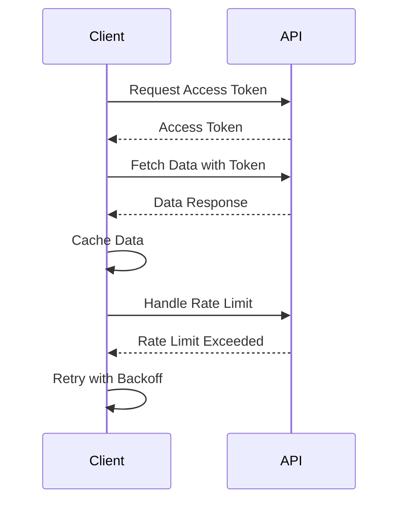

## 17.11 Third-Party API Integration

Integrating with third-party APIs is a common task in modern web development, allowing applications to leverage external services and data. This section explores best practices for integrating with third-party APIs using JavaScript, covering authentication, rate limiting, data consistency, and more.

### Considerations When Selecting Third-Party APIs

When choosing a third-party API, consider the following factors:

- **Reputation and Reliability**: Ensure the API provider is reputable and has a track record of reliability.
- **Documentation and Support**: Good documentation and support are crucial for successful integration.
- **Security**: Evaluate the security measures in place, such as data encryption and secure authentication methods.
- **Cost and Licensing**: Understand the pricing model and any licensing restrictions.
- **Scalability**: Ensure the API can handle your application's growth and increased traffic.

### Handling Authentication Methods

Authentication is a critical aspect of API integration. Common methods include API keys and OAuth.

#### API Keys

API keys are simple tokens that identify the client making the request. They are easy to implement but offer limited security.

```javascript
// Example of using an API key in a fetch request
const apiKey = 'YOUR_API_KEY';
fetch(`https://api.example.com/data?api_key=${apiKey}`)
  .then(response => response.json())
  .then(data => console.log(data))
  .catch(error => console.error('Error:', error));
```

#### OAuth

OAuth is a more secure method that allows users to authorize applications to access their data without sharing credentials. It involves multiple steps, including obtaining an access token.

```javascript
// Example of using OAuth 2.0 with fetch
const accessToken = 'YOUR_ACCESS_TOKEN';
fetch('https://api.example.com/user', {
  headers: {
    'Authorization': `Bearer ${accessToken}`
  }
})
  .then(response => response.json())
  .then(data => console.log(data))
  .catch(error => console.error('Error:', error));
```

### Managing API Quotas and Rate Limiting

APIs often impose rate limits to prevent abuse. It's essential to handle these limits gracefully.

- **Monitor Usage**: Keep track of API usage to avoid exceeding limits.
- **Implement Backoff Strategies**: Use exponential backoff to retry requests after rate limits are hit.
- **Use Caching**: Cache responses to reduce the number of API calls.

```javascript
// Example of handling rate limiting with exponential backoff
function fetchDataWithBackoff(url, retries = 5, delay = 1000) {
  return fetch(url)
    .then(response => {
      if (!response.ok && retries > 0) {
        return new Promise(resolve => setTimeout(resolve, delay))
          .then(() => fetchDataWithBackoff(url, retries - 1, delay * 2));
      }
      return response.json();
    })
    .catch(error => console.error('Error:', error));
}
```

### Caching Strategies to Reduce API Calls

Caching can significantly reduce the number of API calls, improving performance and reducing costs.

- **Client-Side Caching**: Use browser storage (e.g., localStorage, sessionStorage) to cache data.
- **Server-Side Caching**: Implement caching on the server to store frequently accessed data.
- **Cache Invalidation**: Ensure cached data is updated when the source data changes.

```javascript
// Example of client-side caching using localStorage
function getCachedData(key) {
  const cached = localStorage.getItem(key);
  if (cached) {
    return Promise.resolve(JSON.parse(cached));
  }
  return fetch(`https://api.example.com/data?key=${key}`)
    .then(response => response.json())
    .then(data => {
      localStorage.setItem(key, JSON.stringify(data));
      return data;
    });
}
```

### Monitoring API Changes and Versioning

APIs evolve over time, and it's crucial to monitor changes to avoid breaking your application.

- **Subscribe to Updates**: Follow the API provider's communication channels for updates.
- **Versioning**: Use versioned endpoints to ensure compatibility with future changes.
- **Testing**: Regularly test your integration to catch issues early.

### Error Handling and Fallbacks for External Dependencies

Robust error handling is essential when dealing with external APIs.

- **Graceful Degradation**: Design your application to function with limited features if the API is unavailable.
- **Retry Logic**: Implement retry logic for transient errors.
- **Logging and Alerts**: Log errors and set up alerts to monitor API issues.

```javascript
// Example of error handling with fallback
function fetchDataWithFallback(url, fallbackData) {
  return fetch(url)
    .then(response => response.json())
    .catch(error => {
      console.error('Error:', error);
      return fallbackData;
    });
}
```

### Visualizing API Integration Workflow

Below is a sequence diagram illustrating a typical API integration workflow, including authentication, data fetching, and error handling.



### References and Links

- [MDN Web Docs: Fetch API](https://developer.mozilla.org/en-US/docs/Web/API/Fetch_API)
- [OAuth 2.0 Simplified](https://oauth.net/2/)
- [API Rate Limiting Best Practices](https://www.cloudflare.com/learning/bots/what-is-rate-limiting/)

### Knowledge Check

- What are the key considerations when selecting a third-party API?
- How can you handle authentication using OAuth in JavaScript?
- What strategies can you use to manage API rate limits?
- Why is caching important in API integration?
- How should you handle errors when integrating with external APIs?

### Embrace the Journey

Remember, integrating with third-party APIs is a powerful way to enhance your applications. As you progress, you'll gain experience in handling various challenges, from authentication to error handling. Keep experimenting, stay curious, and enjoy the journey!

## Mastering Third-Party API Integration in JavaScript



### What is a key consideration when selecting a third-party API?

- [x] Reputation and reliability
- [ ] The number of endpoints
- [ ] The programming language used
- [ ] The color scheme of the documentation

> **Explanation:** Reputation and reliability are crucial to ensure the API is dependable and trustworthy.

### Which authentication method is more secure for third-party API integration?

- [ ] API keys
- [x] OAuth
- [ ] Basic authentication
- [ ] Cookies

> **Explanation:** OAuth provides a more secure way to authorize applications without sharing credentials.

### What is a common strategy to handle API rate limits?

- [ ] Increase the number of requests
- [x] Implement exponential backoff
- [ ] Use a different API
- [ ] Ignore the rate limits

> **Explanation:** Exponential backoff is a strategy to retry requests after rate limits are hit, gradually increasing the wait time between retries.

### Why is caching important in API integration?

- [x] To reduce the number of API calls
- [ ] To increase the number of API calls
- [ ] To slow down the application
- [ ] To make the application more complex

> **Explanation:** Caching reduces the number of API calls, improving performance and reducing costs.

### How can you monitor changes in a third-party API?

- [x] Subscribe to updates from the API provider
- [ ] Ignore the changes
- [ ] Use outdated documentation
- [ ] Change the API version without testing

> **Explanation:** Subscribing to updates ensures you are aware of any changes that might affect your integration.

### What is a fallback strategy for handling API errors?

- [x] Use cached or default data
- [ ] Crash the application
- [ ] Ignore the error
- [ ] Display a generic error message

> **Explanation:** Using cached or default data allows the application to continue functioning even if the API is unavailable.

### What should you do if an API rate limit is exceeded?

- [x] Retry the request with exponential backoff
- [ ] Send more requests immediately
- [ ] Switch to another API
- [ ] Ignore the limit and continue

> **Explanation:** Retrying with exponential backoff helps manage rate limits without overwhelming the API.

### What is the purpose of using versioned endpoints in API integration?

- [x] To ensure compatibility with future changes
- [ ] To make the API more complex
- [ ] To reduce the number of endpoints
- [ ] To increase the number of requests

> **Explanation:** Versioned endpoints help maintain compatibility as the API evolves.

### What is a benefit of using OAuth over API keys?

- [x] Enhanced security
- [ ] Simplicity
- [ ] Faster implementation
- [ ] Less documentation

> **Explanation:** OAuth provides enhanced security by allowing users to authorize applications without sharing credentials.

### True or False: Caching can help reduce API costs.

- [x] True
- [ ] False

> **Explanation:** Caching reduces the number of API calls, which can lower costs associated with API usage.


