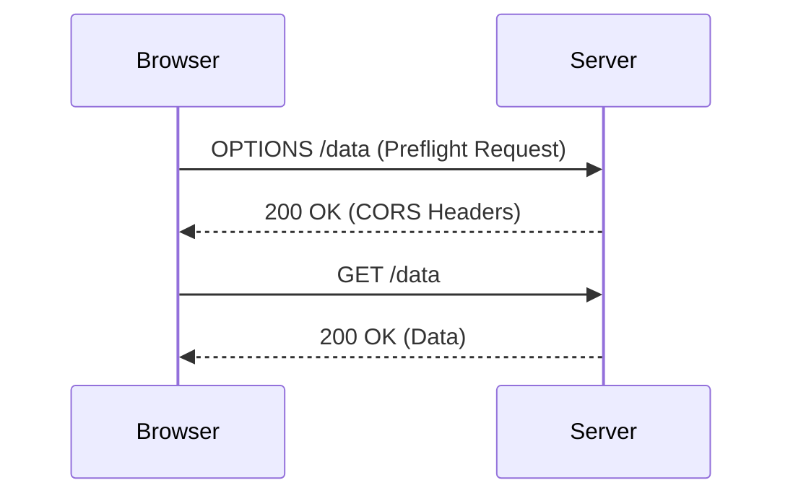

## 17.12 CORS and Cross-Domain Requests

### Introduction

In the world of web development, security is paramount. One of the key security measures implemented by web browsers is the Same-Origin Policy (SOP). This policy restricts how documents or scripts loaded from one origin can interact with resources from another origin. While this is crucial for security, it can also be a hindrance when legitimate cross-origin requests are needed. This is where Cross-Origin Resource Sharing (CORS) comes into play.

### Understanding the Same-Origin Policy

The Same-Origin Policy is a critical security concept that prevents malicious scripts on one page from obtaining access to sensitive data on another web page through the browser. Two URLs have the same origin if the protocol, port (if specified), and host are the same for both.

#### Implications of the Same-Origin Policy

- **Security**: It prevents potentially harmful scripts from accessing data on another domain.
- **Limitations**: It restricts legitimate interactions between different domains, such as accessing APIs hosted on different servers.

### What is CORS?

Cross-Origin Resource Sharing (CORS) is a mechanism that allows restricted resources on a web page to be requested from another domain outside the domain from which the first resource was served. CORS defines a way in which the browser and the server can interact to determine whether or not to allow the cross-origin request.

#### How CORS Works

CORS works by using HTTP headers to allow the server to specify any origins other than its own from which a browser should permit loading of resources. The server can also specify which HTTP methods and headers are permitted.

### Setting Up CORS in Express

Express.js, a popular web application framework for Node.js, provides a middleware called `cors` that simplifies the process of enabling CORS in your applications.

#### Installing the CORS Middleware

To use the CORS middleware in an Express application, you first need to install it:

```bash
npm install cors
```

#### Basic CORS Configuration

Here's a simple example of how to set up CORS in an Express application:

```javascript
const express = require('express');
const cors = require('cors');
const app = express();

// Use the CORS middleware
app.use(cors());

app.get('/data', (req, res) => {
  res.json({ message: 'This is a CORS-enabled response.' });
});

app.listen(3000, () => {
  console.log('Server is running on port 3000');
});
```

In this example, the `cors()` middleware is applied to all routes, allowing cross-origin requests from any domain.

#### Configuring CORS Headers

CORS headers are crucial for controlling which resources can be accessed by which domains. The key headers include:

- **Access-Control-Allow-Origin**: Specifies the origin(s) that are allowed to access the resource.
- **Access-Control-Allow-Methods**: Lists the HTTP methods that are allowed when accessing the resource.
- **Access-Control-Allow-Headers**: Lists the headers that can be used when making the actual request.

##### Example: Restricting Access to Specific Origins

```javascript
const corsOptions = {
  origin: 'https://example.com', // Allow only this origin
  methods: 'GET,POST', // Allow only GET and POST requests
  allowedHeaders: 'Content-Type,Authorization' // Allow only these headers
};

app.use(cors(corsOptions));
```

### Security Considerations

While CORS is a powerful tool for enabling cross-origin requests, it must be configured carefully to avoid security vulnerabilities.

#### Best Practices

- **Limit Origins**: Only allow trusted domains to access your resources.
- **Restrict Methods and Headers**: Only permit the necessary HTTP methods and headers.
- **Use HTTPS**: Ensure that your server and client communicate over HTTPS to prevent man-in-the-middle attacks.

### Preflight Requests and the OPTIONS Method

For certain types of requests, the browser sends a preflight request using the OPTIONS method to determine if the actual request is safe to send. This is typically done for requests that:

- Use methods other than GET, POST, or HEAD.
- Include custom headers.

#### Handling Preflight Requests

To handle preflight requests, you need to ensure your server responds appropriately to OPTIONS requests:

```javascript
app.options('/data', cors(corsOptions)); // Enable preflight requests for /data
```

### Visualizing CORS Workflow

Let's visualize how CORS works using a sequence diagram:



**Caption**: This diagram illustrates the CORS preflight request and the subsequent actual request.

### Try It Yourself

To better understand CORS, try modifying the code examples above:

- Change the `origin` in the `corsOptions` to a different domain and observe the behavior.
- Add additional HTTP methods to the `Access-Control-Allow-Methods` header and test different types of requests.

### Knowledge Check

- What is the Same-Origin Policy, and why is it important?
- How does CORS help in making cross-origin requests?
- What are some security considerations when configuring CORS?

### Conclusion

CORS is an essential mechanism for enabling secure cross-origin requests in web applications. By understanding and properly configuring CORS, you can ensure that your applications are both functional and secure. Remember, this is just the beginning. As you progress, you'll build more complex and interactive web pages. Keep experimenting, stay curious, and enjoy the journey!

### Further Reading

- [MDN Web Docs: CORS](https://developer.mozilla.org/en-US/docs/Web/HTTP/CORS)
- [Express.js CORS Middleware](https://github.com/expressjs/cors)

## CORS and Cross-Domain Requests Quiz



### What is the primary purpose of the Same-Origin Policy?

- [x] To prevent malicious scripts from accessing data on another domain
- [ ] To allow unrestricted access to all domains
- [ ] To enhance the speed of web applications
- [ ] To simplify cross-domain requests

> **Explanation:** The Same-Origin Policy is a security measure to prevent scripts from accessing data on another domain, ensuring data privacy and security.

### How does CORS enable cross-origin requests?

- [x] By using HTTP headers to specify allowed origins
- [ ] By disabling the Same-Origin Policy
- [ ] By encrypting all requests
- [ ] By using a different protocol

> **Explanation:** CORS uses HTTP headers to allow servers to specify which origins are permitted to access resources, thus enabling cross-origin requests.

### Which HTTP header is used to specify allowed origins in CORS?

- [x] Access-Control-Allow-Origin
- [ ] Content-Type
- [ ] Authorization
- [ ] Accept

> **Explanation:** The `Access-Control-Allow-Origin` header is used to specify which origins are allowed to access the resource.

### What is a preflight request in CORS?

- [x] An OPTIONS request sent to check if the actual request is safe
- [ ] A GET request sent before the actual request
- [ ] A POST request sent to verify credentials
- [ ] A DELETE request to clear previous data

> **Explanation:** A preflight request is an OPTIONS request sent by the browser to determine if the actual request is safe to send.

### Which HTTP methods typically trigger a preflight request?

- [x] Methods other than GET, POST, or HEAD
- [ ] Only GET requests
- [ ] Only POST requests
- [ ] Only DELETE requests

> **Explanation:** Methods other than GET, POST, or HEAD typically trigger a preflight request to ensure the request is safe.

### What is the role of the `Access-Control-Allow-Methods` header?

- [x] To specify which HTTP methods are allowed
- [ ] To specify which headers are allowed
- [ ] To specify the allowed origins
- [ ] To specify the response format

> **Explanation:** The `Access-Control-Allow-Methods` header specifies which HTTP methods are allowed when accessing the resource.

### Why is it important to restrict allowed origins in CORS?

- [x] To prevent unauthorized access to resources
- [ ] To increase the speed of requests
- [ ] To allow all domains to access resources
- [ ] To simplify server configuration

> **Explanation:** Restricting allowed origins prevents unauthorized access to resources, enhancing security.

### What is the purpose of the `Access-Control-Allow-Headers` header?

- [x] To specify which headers can be used in the request
- [ ] To specify the allowed origins
- [ ] To specify the response format
- [ ] To specify the request method

> **Explanation:** The `Access-Control-Allow-Headers` header specifies which headers can be used in the request, ensuring only necessary headers are allowed.

### Can CORS be configured to allow all origins?

- [x] Yes, by setting `Access-Control-Allow-Origin` to `*`
- [ ] No, it must specify a particular origin
- [ ] Yes, by setting `Access-Control-Allow-Origin` to `null`
- [ ] No, CORS cannot allow all origins

> **Explanation:** CORS can be configured to allow all origins by setting `Access-Control-Allow-Origin` to `*`, though this is generally not recommended for security reasons.

### True or False: CORS is a server-side configuration.

- [x] True
- [ ] False

> **Explanation:** CORS is configured on the server-side to specify which origins are allowed to access resources.


